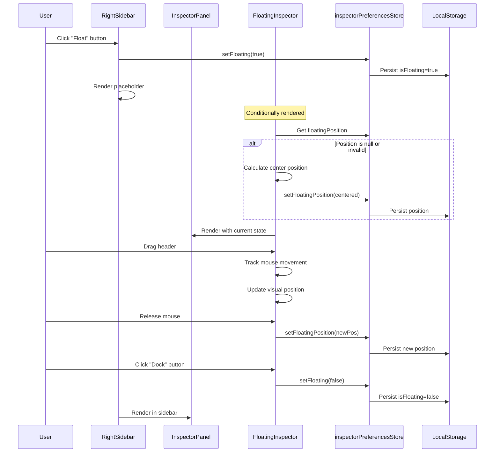

# Spec and build

## Configuration
- **Artifacts Path**: {@artifacts_path} → `.zenflow/tasks/{task_id}`

---

## Agent Instructions

Ask the user questions when anything is unclear or needs their input. This includes:
- Ambiguous or incomplete requirements
- Technical decisions that affect architecture or user experience
- Trade-offs that require business context

Do not make assumptions on important decisions — get clarification first.

---

## Workflow Steps

### [x] Step: Technical Specification
<!-- chat-id: f0cdd183-eb12-4a05-b256-9eb6f567b5ac -->

Assess the task's difficulty, as underestimating it leads to poor outcomes.
- easy: Straightforward implementation, trivial bug fix or feature
- medium: Moderate complexity, some edge cases or caveats to consider
- hard: Complex logic, many caveats, architectural considerations, or high-risk changes

Create a technical specification for the task that is appropriate for the complexity level:
- Review the existing codebase architecture and identify reusable components.
- Define the implementation approach based on established patterns in the project.
- Identify all source code files that will be created or modified.
- Define any necessary data model, API, or interface changes.
- Describe verification steps using the project's test and lint commands.

Save the output to `{@artifacts_path}/spec.md` with:
- Technical context (language, dependencies)
- Implementation approach
- Source code structure changes
- Data model / API / interface changes
- Verification approach

If the task is complex enough, create a detailed implementation plan based on `{@artifacts_path}/spec.md`:
- Break down the work into concrete tasks (incrementable, testable milestones)
- Each task should reference relevant contracts and include verification steps
- Replace the Implementation step below with the planned tasks

Rule of thumb for step size: each step should represent a coherent unit of work (e.g., implement a component, add an API endpoint, write tests for a module). Avoid steps that are too granular (single function).

Important: unit tests must be part of each implementation task, not separate tasks. Each task should implement the code and its tests together, if relevant.

Save to `{@artifacts_path}/plan.md`. If the feature is trivial and doesn't warrant this breakdown, keep the Implementation step below as is.

---

### [x] Step: Extend Inspector Preferences Store
<!-- chat-id: d3b92e34-e363-473e-acae-fcdd023983c3 -->

**File**: `hvac-design-app/src/features/canvas/store/inspectorPreferencesStore.ts`

Add floating mode state to the existing Zustand store:
- Add `isFloating: boolean` (default: `false`)
- Add `floatingPosition: { x: number; y: number } | null` (default: `null`)
- Add `setFloating(isFloating: boolean)` action
- Add `setFloatingPosition(position: { x: number; y: number })` action
- Add `resetFloatingPosition()` action to center the panel

The persist middleware will automatically save these values to local storage under the existing `'sws.inspector-preferences'` key.

---

### [x] Step: Create Position Validation Utility
<!-- chat-id: d5ff6f22-8557-4d0b-88e0-7bda761bf923 -->

**File**: `hvac-design-app/src/features/canvas/utils/validateFloatingPosition.ts` (new file)

Create a utility function to validate and correct floating panel positions:
- Accept position `{ x, y }`, panel dimensions `{ width, height }`, and viewport dimensions
- Check if position is within viewport bounds (with 50px margin)
- If off-screen or invalid (negative coordinates, beyond bounds), return centered position
- Return validated position object

This handles the edge cases mentioned in the spec: off-screen positioning and invalid coordinates.

---

### [x] Step: Create Floating Inspector Component
<!-- chat-id: 81980453-c7a4-418f-af09-a7a8ddccf8c2 -->

**File**: `hvac-design-app/src/features/canvas/components/Inspector/FloatingInspector.tsx` (new file)

Create a new component that renders the inspector as a floating window:
- Use React Portal to render outside the normal DOM hierarchy (similar to `hvac-design-app/src/components/ui/dialog.tsx`)
- Accept `onDock` callback prop to handle re-docking
- Render with fixed positioning using `floatingPosition` from store
- Apply shadow styling: `shadow-2xl` for elevation
- Include draggable header with "Dock" button
- Use `inspectorWidth` from store for width
- Render `InspectorPanel` component with `embedded={false}` prop
- Apply z-index to ensure it floats above canvas but below modals (z-50)

Structure:
- Outer container: fixed positioning, shadow, rounded corners
- Header: draggable area with title "Properties" and "Dock" button
- Content area: renders `InspectorPanel`

---

### [x] Step: Implement Drag Functionality
<!-- chat-id: 7b31d1cc-bfdd-4a1b-8e0f-71fbccd3cbb1 -->

**In**: `hvac-design-app/src/features/canvas/components/Inspector/FloatingInspector.tsx`

Add native mouse event handlers for dragging (pattern similar to `hvac-design-app/src/features/canvas/components/RightSidebar.tsx` resize logic):
- Track `isDragging` state
- Store initial mouse position and panel position on `mousedown`
- On `mousemove`, calculate new position based on mouse delta
- On `mouseup`, persist final position to store using `setFloatingPosition`
- Add global event listeners to `window` during drag
- Set cursor to `move` on header hover and `grabbing` during drag
- Prevent text selection during drag with `user-select: none`

Use `useEffect` to attach/detach window event listeners based on `isDragging` state.

---

### [x] Step: Add Float/Dock Toggle Button
<!-- chat-id: df1dd9f7-f2ff-4fc4-82a8-ec038ac40bc6 -->

**File**: `hvac-design-app/src/features/canvas/components/Inspector/InspectorPanel.tsx`

Modify the component to accept optional header controls:
- Add `showHeader?: boolean` prop (default: `false`)
- Add `onFloat?: () => void` callback prop
- When `showHeader` is true, render header section with:
  - Title: "Properties"
  - Float button with icon (use Lucide React `Maximize2` icon)
  - Styling: border-b, padding, flex layout

The header should only appear when inspector is docked (controlled by parent).

---

### [x] Step: Update RightSidebar to Handle Floating Mode
<!-- chat-id: 24cbfb02-0f2d-4fac-82a8-1738f72bbeb5 -->

**File**: `hvac-design-app/src/features/canvas/components/RightSidebar.tsx`

Integrate floating mode toggle:
- Import `useInspectorPreferencesStore` selectors for `isFloating` and `setFloating`
- When rendering Properties tab content, check `isFloating` state
- If docked (`!isFloating`), render `InspectorPanel` with `showHeader={true}` and `onFloat` callback
- The `onFloat` callback should call `setFloating(true)` and initialize position if null
- If floating, render placeholder message: "Inspector is floating. Click Dock to return."

---

### [x] Step: Render Floating Inspector Conditionally
<!-- chat-id: 28f15f39-bb82-4070-bdfb-ccb5216353cc -->

**File**: `hvac-design-app/src/features/canvas/components/CanvasContainer.tsx` or create new wrapper

Add conditional rendering for `FloatingInspector`:
- Import `useInspectorPreferencesStore` to check `isFloating`
- When `isFloating` is true, render `FloatingInspector` component
- Pass `onDock` callback that calls `setFloating(false)`
- Validate position on mount using the validation utility
- If position is invalid or null, center the panel and save to store

Position initialization logic:
- On first float, calculate center position: `{ x: (window.innerWidth - width) / 2, y: (window.innerHeight - height) / 2 }`
- Save to store immediately

---

### [x] Step: Add Position Validation on Window Resize
<!-- chat-id: 0c659b54-53e4-495d-8e17-5d20c6615d0c -->

**In**: `hvac-design-app/src/features/canvas/components/Inspector/FloatingInspector.tsx`

Add window resize listener:
- Use `useEffect` to listen for `resize` events
- On resize, validate current position against new viewport dimensions
- If position becomes invalid, reposition to center
- Update store with corrected position

This handles the edge case where user disconnects external monitor or changes screen resolution.

---

### [x] Step: Maintain Width and Section States
<!-- chat-id: 1fc41fcf-af3b-4254-a781-161a0e727590 -->

**Verification**: No changes needed

The existing architecture already supports this:
- `inspectorWidth` is stored in `inspectorPreferencesStore` and used by both docked and floating modes
- Section collapse states are stored per entity type in the same store
- Both `RightSidebar` and `FloatingInspector` will use the same `InspectorPanel` component, ensuring consistent state

---

### [x] Step: Add Unit Tests
<!-- chat-id: 6f3fde79-8571-4475-a63e-bd413786c092 -->

**File**: `hvac-design-app/src/features/canvas/components/Inspector/__tests__/FloatingInspector.test.tsx` (new file)

Create comprehensive unit tests:
- Test rendering with valid position
- Test drag start/move/end sequence
- Test position persistence to store
- Test "Dock" button calls `onDock` callback
- Test position validation on mount
- Test window resize triggers revalidation
- Mock `useInspectorPreferencesStore` and verify store interactions
- Mock `window.innerWidth/innerHeight` for viewport tests

**File**: `hvac-design-app/src/features/canvas/store/__tests__/inspectorPreferencesStore.test.ts` (new file)

Test store actions:
- Test `setFloating` toggles state
- Test `setFloatingPosition` updates position
- Test `resetFloatingPosition` centers panel
- Test persistence to local storage (verify Zustand persist middleware)

**File**: `hvac-design-app/src/features/canvas/utils/__tests__/validateFloatingPosition.test.ts` (new file)

Test validation logic:
- Test valid position returns unchanged
- Test off-screen position returns centered
- Test negative coordinates return centered
- Test position beyond viewport bounds returns centered
- Test edge cases (exactly at boundary, partially visible)

---

### [x] Step: Update Existing Tests
<!-- chat-id: d324e080-078b-454c-99a1-9a608ef66f57 -->

**File**: `hvac-design-app/src/features/canvas/components/__tests__/RightSidebar.test.tsx`

Add tests for floating mode integration:
- Test "Float" button appears when docked
- Test clicking "Float" button updates store
- Test placeholder message appears when floating
- Mock `useInspectorPreferencesStore` to simulate floating state

**File**: `hvac-design-app/src/features/canvas/components/Inspector/__tests__/InspectorPanel.test.tsx`

Add tests for header rendering:
- Test header renders when `showHeader={true}`
- Test header hidden when `showHeader={false}`
- Test "Float" button calls `onFloat` callback

---

### [x] Step: Add Visual Regression Tests
<!-- chat-id: 3f2caafb-a072-4b4a-b155-96bf117efc7d -->

**File**: `hvac-design-app/e2e/03-visual-regression/components/inspector-panel.spec.ts`

Add new test cases:
- Test floating inspector appearance with shadow
- Test floating inspector at different positions
- Test "Float" button in docked mode
- Test "Dock" button in floating mode
- Test dragging floating inspector (capture before/after)
- Test floating inspector with different entity types selected
- Test floating inspector at minimum and maximum widths

Use Playwright's `page.mouse.down()`, `page.mouse.move()`, `page.mouse.up()` for drag simulation.

---

### [x] Step: Add Accessibility Attributes
<!-- chat-id: 347324f1-ef6e-478a-bfc0-0866ddc7351d -->

**In**: `hvac-design-app/src/features/canvas/components/Inspector/FloatingInspector.tsx`

Add ARIA attributes for accessibility:
- `role="dialog"` on floating container
- `aria-label="Floating Properties Panel"` on container
- `aria-grabbed="true/false"` on header during drag
- `tabIndex={0}` on header for keyboard focus
- Add keyboard support: Escape key to dock, Arrow keys to move (optional enhancement)

**In**: `hvac-design-app/src/features/canvas/components/Inspector/InspectorPanel.tsx`

Add ARIA attributes to Float button:
- `aria-label="Float inspector panel"`
- `title="Detach panel to float over canvas"`

---

### [x] Step: Style Refinements
<!-- chat-id: 161b93c2-6b42-4a5a-9988-6d41f009cea8 -->

**In**: `hvac-design-app/src/features/canvas/components/Inspector/FloatingInspector.tsx`

Apply design system styles:
- Background: `bg-slate-50` (matching docked inspector)
- Border: `border border-slate-200`
- Shadow: `shadow-2xl` for elevation
- Rounded corners: `rounded-xl`
- Header background: `bg-white`
- Header border: `border-b border-slate-200`
- Dock button: Technical Blue on hover (`hover:bg-blue-50 hover:text-blue-600`)
- Cursor: `cursor-move` on header, `cursor-grabbing` during drag

Ensure consistent styling with docked inspector from `hvac-design-app/src/features/canvas/components/RightSidebar.tsx`.

---

### [x] Step: Handle Edge Case: Multiple Monitors
<!-- chat-id: 1d918525-9c0f-4384-9769-8d394af560ec -->

**In**: Position validation utility

Add logic to detect if stored position is beyond current viewport:
- Compare stored position against `window.screen.availWidth/availHeight`
- If position suggests external monitor that's no longer connected, reset to center
- Log warning to console for debugging

---

### [x] Step: Add Transition Animations
<!-- chat-id: 17a27773-8858-492b-9142-3109e412c96c -->

**In**: `hvac-design-app/src/features/canvas/components/Inspector/FloatingInspector.tsx`

Add smooth transitions when floating/docking:
- Use Tailwind `transition-all duration-200` for position changes
- Add fade-in animation on mount using Tailwind `animate-in fade-in`
- Add slide-in animation from right: `slide-in-from-right-4`

**In**: `hvac-design-app/src/features/canvas/components/RightSidebar.tsx`

Add transition when switching to placeholder:
- Use `transition-opacity duration-200` for smooth fade

---

### [x] Step: Update Documentation
<!-- chat-id: 32043be5-3d5c-40f6-8a6e-758b63cea705 -->

**File**: `hvac-design-app/src/features/canvas/components/Inspector/README.md` (new file)

Create component documentation:
- Overview of inspector architecture
- Explanation of docked vs floating modes
- State management with `inspectorPreferencesStore`
- Position validation logic
- Drag implementation details
- Testing approach

---

### [x] Step: Performance Optimization
<!-- chat-id: 505eed5c-b56b-48fe-a99a-eadc55820968 -->

**In**: `hvac-design-app/src/features/canvas/components/Inspector/FloatingInspector.tsx`

Optimize drag performance:
- Use `requestAnimationFrame` for position updates during drag
- Debounce store updates (only save on drag end, not during)
- Use `React.memo` to prevent unnecessary re-renders
- Use `useCallback` for event handlers

---

### [x] Step: Integration Verification
<!-- chat-id: 82905286-f685-4e20-8b5c-003c5f4e28fd -->

**Manual testing checklist**:
- Float inspector from docked position
- Drag floating inspector to different positions
- Dock inspector back to sidebar
- Verify width persists between modes
- Verify section collapse states persist
- Test with different entity types selected
- Test with multi-selection
- Test window resize while floating
- Test browser refresh with floating position
- Test invalid position recovery (manually edit local storage)

## Visual Diagram

