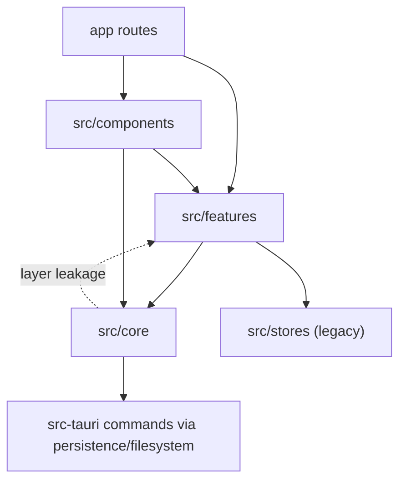

# System Architecture

Updated: 2026-03-25 (Asia/Manila)

This document maps the current architecture of `HVAC_Canvas_App`, based on source code under `hvac-design-app/` and `hvac-design-app/src-tauri/src`.

## High-Level System Overview

`HVAC_Canvas_App` is a hybrid HVAC design platform with a Next.js frontend and a Tauri backend bridge:

- Next.js App Router route shell in `hvac-design-app/app/`.
- Feature-oriented React/TypeScript runtime in `hvac-design-app/src/features/`.
- Shared core layer in `hvac-design-app/src/core/` for schema, persistence, commands, stores, and services.
- Legacy persisted Zustand stores in `hvac-design-app/src/stores/` still present in active canvas/save paths.
- Native filesystem and disk telemetry commands in `hvac-design-app/src-tauri/src/commands/`.

Current repository shape signals (app + src + src-tauri/src + e2e):

- Source files scanned: `672`
- `src/features` is the largest app surface (`231` files), with `src/features/canvas` at `186` files
- `src/core` remains large (`146` files), with `core/services` at `59` files

## Module Map

| Module | Responsibility | Key Entry Points | Primary Dependencies |
|---|---|---|---|
| `hvac-design-app/app` | Route entrypoints and shell composition | `app/page.tsx`, `app/dashboard/page.tsx`, `app/(main)/canvas/page.tsx`, `app/(main)/canvas/[projectId]/page.tsx` | `src/components`, `src/features`, selective `src/core` |
| `src/components` | Shared UI shell and top-level orchestration surfaces | `components/onboarding/AppInitializer.tsx`, `components/layout/FileMenu.tsx` | `src/features/*`, `src/core/*`, `src/stores` |
| `src/features/canvas` | Main design runtime (entity editing, tools, renderers, view state, autosave) | `CanvasPageWrapper.tsx`, `CanvasPage.tsx`, `hooks/useAutoSave.ts` | `src/core/store`, `src/core/commands`, `src/core/persistence`, `src/core/services`, `src/stores` |
| `src/features/dashboard` | Project listing and lifecycle actions (open, archive, duplicate, delete, refresh) | `components/DashboardPage.tsx`, `store/projectListStore.ts` | `src/core/persistence`, `src/core/store`, `src/features/project` |
| `src/features/export` | Export UI and format generation (JSON/CSV/PDF) | `ExportMenu.tsx`, `ExportDialog.tsx`, `hooks/useExport.ts` | `src/core/store`, `src/core/schema`, canvas entity state |
| `src/features/onboarding` + onboarding components | First-run and project setup UX | `ProjectSetupWizard.tsx`, `components/onboarding/*` | `src/core/store`, `src/core/persistence`, `src/features/project` |
| `src/core/schema` | Canonical data contracts and versioned Zod schemas | `schema/project-file.schema.ts` | Consumed by persistence, autosave, migration, export |
| `src/core/store` | Modern shared Zustand stores | `store/project.store.ts`, `store/entityStore.ts`, `store/preferencesStore.ts` | `src/core/schema`, `src/core/services` |
| `src/core/commands` | Command and undo/redo primitives | `commands/entityCommands.ts`, `commands/historyStore.ts`, `commands/types.ts` | `src/core/store`, canvas selection/view stores |
| `src/core/persistence` | Persistence abstraction, adapters, repository policy, orchestration | `persistence/StorageAdapter.ts`, `persistence/ProjectRepository.ts`, `persistence/ProjectStateOrchestrator.ts` | `src/core/schema`, `src/core/services`, Tauri/web fs adapters |
| `src/core/services` | Cross-cutting services (storage root, migration, automation, bulk ops, fitting generation) | `services/StorageRootService.ts`, `services/automation/*`, `services/operations/*` | `src/core/*` plus some feature-level imports |
| `src/stores` | Legacy persisted Zustand state still bridged by runtime hooks | `stores/useProjectStore.ts`, `stores/useAppStateStore.ts` | Local storage and mixed feature/component consumers |
| `src-tauri/src` | Native command registration and storage-root command handlers | `src-tauri/src/lib.rs`, `src-tauri/src/commands/storage_root.rs` | Tauri plugins, Rust std/fs2 |
| `hvac-design-app/e2e` | Playwright scenario coverage | `e2e/00-*` to `e2e/03-*` | App routes and runtime flows |

## Dependency Relationships

### Simplified dependency structure

### Observed import edges (non-test `.ts/.tsx`)

- `features -> core`: `215`
- `features -> components`: `82`
- `components -> core`: `37`
- `features -> storesLegacy`: `19`
- `core -> core`: `48`
- `core -> features`: `10` (layer leakage)

Known `core -> features` leakage examples:

- `src/core/commands/entityCommands.ts` imports canvas selection store.
- `src/core/persistence/ProjectStateOrchestrator.ts` imports canvas view/selection stores and export BOM generator.
- `src/core/services/fittingGeneration.ts` imports canvas fitting defaults.
- `src/core/services/automation/fittingInsertionService.ts` imports canvas fitting defaults.
- `src/core/services/StorageRootService.ts` imports dashboard project list store.

## Data Flow

### 1. Startup and environment bootstrap

1. `app/page.tsx` renders `AppInitializer` inside `Suspense`.
2. `AppInitializer` performs environment detection (`isTauri`), applies preference-derived UI mode, initializes storage root (`StorageRootService.initialize`), and validates disk/writability.
3. Initializer routes to onboarding/tutorial/dashboard and can create/seed projects through repository-backed persistence.

### 2. Dashboard project lifecycle

1. `app/dashboard/page.tsx` renders `DashboardPage`.
2. `projectListStore.refreshProjects` uses `createStorageAdapter()` and `adapter.listProjects()` to hydrate dashboard metadata.
3. Dashboard actions call adapter/repository operations for duplicate/archive/restore/delete.
4. `projectListStore` subscribes to `ProjectRepository` events (`project:changed`, `projects:changed`) to trigger automatic refresh.

### 3. Canvas route load and hydration

1. `app/(main)/canvas/[projectId]/page.tsx` resolves route params and renders `CanvasPageWrapper`.
2. `CanvasPageWrapper` resolves project from Tauri file path, repository, or browser payload (including backup path).
3. Version checks (`VersionDetector`) determine migration/warning branch.
4. `hydrateToStores` (ProjectStateOrchestrator) hydrates core and feature state stores.

### 4. Edit/command/render pipeline

1. `CanvasPage` composes editor surfaces and active tools.
2. Tools operate through canvas tool contracts and mutate entities via command/store paths.
3. `entityCommands` + `useEntityStore` apply mutations; `useHistoryStore` tracks undo/redo timeline.
4. Renderers and calculation hooks consume normalized entity state and project settings for visual + computed output.

### 5. Save/autosave pipeline

1. `useAutoSave` snapshots from multiple stores (`core/store`, feature stores, and legacy stores).
2. Snapshot is converted into `ProjectFile` and local payload via `ProjectStateOrchestrator` and helper builders.
3. Validation is enforced through `ProjectFileSchema`.
4. Persistence writes through adapter strategy (Tauri filesystem, File System Access, IndexedDB/local fallback), with backup/recovery paths.

### 6. Export pipeline

1. `ExportMenu` and export dialogs read current entities/project details.
2. Export services generate JSON/CSV/PDF artifacts using snapshot data.
3. In desktop mode, writes route through Tauri-backed filesystem dialogs/commands.

### 7. Native storage-root pipeline (Tauri)

1. TypeScript persistence/filesystem wrappers call Tauri invokes registered in `src-tauri/src/lib.rs`.
2. `commands/storage_root.rs` handles: `resolve_storage_root`, `validate_storage_root`, `get_disk_space`, `create_directory`, `list_directory_files`, `get_app_data_dir`.
3. Returned disk/path/writability telemetry feeds `StorageRootService` validation/relocation decisions.

## Core Abstractions

| Abstraction | Location | Purpose | Interaction Pattern |
|---|---|---|---|
| `StorageAdapter` | `src/core/persistence/StorageAdapter.ts` | Platform-agnostic persistence contract | Implemented by adapter classes; selected by persistence factory |
| `ProjectRepository` | `src/core/persistence/ProjectRepository.ts` | Repository policy, locking, canonical path resolution, change events | Uses `OperationQueue`, `StorageRootService`, adapter calls; emits project events |
| `ProjectStateOrchestrator` (`snapshotFromStores`, `hydrateToStores`) | `src/core/persistence/ProjectStateOrchestrator.ts` | Bidirectional state projection between runtime stores and persisted `ProjectFile` | Called by canvas load/autosave paths |
| `ProjectFileSchema` | `src/core/schema/project-file.schema.ts` | Canonical persisted schema + version boundary | Used by save/load/migration/export workflows |
| `StorageRootService` | `src/core/services/StorageRootService.ts` | Storage root initialization, validation, relocation, disk checks | Uses filesystem bridge + storage store, dispatches validation events |
| `Command` / `ReversibleCommand` | `src/core/commands/types.ts` | Standard mutation envelope for undo/redo | Executed by command helpers, recorded by history store |
| `useProjectStore` (modern core) | `src/core/store/project.store.ts` | Session project metadata/settings authority | Read/written by canvas, onboarding, persistence orchestration |
| `useProjectStore` (legacy) | `src/stores/useProjectStore.ts` | Legacy persisted project store still used in bridge paths | Still read by `CanvasPageWrapper` and `useAutoSave` |

## Dependency Graph Hotspots and High Coupling Areas

### Highest import fan-in/fan-out runtime files

- `src/features/canvas/CanvasPage.tsx` (`26` imports)
- `src/features/canvas/hooks/useAutoSave.ts` (`24` imports)
- `src/components/layout/FileMenu.tsx` (`23` imports)
- `src/components/onboarding/AppInitializer.tsx` (`18` imports)
- `src/features/canvas/CanvasPageWrapper.tsx` (`16` imports)

### Largest modules (LOC) likely to expand regression radius

- `src/core/store/componentLibraryInitializer.ts` (`1301` LOC)
- `src/core/services/automation/fittingInsertionService.ts` (`938` LOC)
- `src/features/canvas/components/catalogIcons.tsx` (`879` LOC)
- `src/core/persistence/adapters/TauriStorageAdapter.ts` (`762` LOC)
- `src/features/canvas/hooks/useAutoSave.ts` (`738` LOC)
- `src/components/layout/FileMenu.tsx` (`736` LOC)
- `src/features/canvas/components/Inspector/DuctInspector.tsx` (`727` LOC)
- `src/core/store/componentLibraryStoreV2.ts` (`678` LOC)
- `src/core/persistence/ProjectRepository.ts` (`641` LOC)

## Potential Technical Debt / Maintenance Risks

1. Dual project-state model in active runtime paths.
- Modern: `src/core/store/project.store.ts`
- Legacy: `src/stores/useProjectStore.ts`
- Bridging is still present in `CanvasPageWrapper` and `useAutoSave`.

2. Layer boundary erosion (`core -> features`).
- Core persistence/services import feature-level canvas/export modules.
- This increases coupling and makes core reuse/extraction harder.

3. Orchestration concentration in a small set of controllers.
- `AppInitializer`, `CanvasPageWrapper`, and `useAutoSave` each own multiple responsibilities (environment checks, hydration, migration decisions, save policy, fallback paths).

4. Persistence strategy complexity.
- Multiple write/read modes (Tauri FS, File System Access, IndexedDB/local) plus backup recovery and schema migration raise branch complexity.

5. Monolithic modules in foundational paths.
- Very large files in core/persistence/component-library and canvas UI increase review cost and defect blast radius.

## Priority Refactor Opportunities

1. Converge on a single project store authority and remove legacy bridge reads from save/load paths.
2. Introduce boundary adapters/interfaces so core modules do not import feature-layer stores/utilities directly.
3. Split orchestration-heavy files (`useAutoSave`, `AppInitializer`, `CanvasPageWrapper`, `FileMenu`) into focused services/hooks.
4. Isolate component-library initialization logic into smaller capability modules with explicit contracts and tests.
5. Consolidate persistence fallback policy into a strategy layer with deterministic error handling and telemetry.
