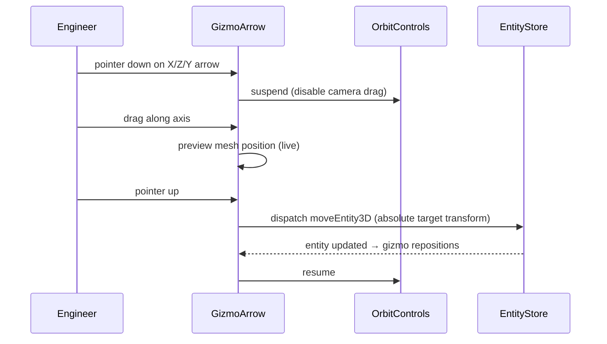
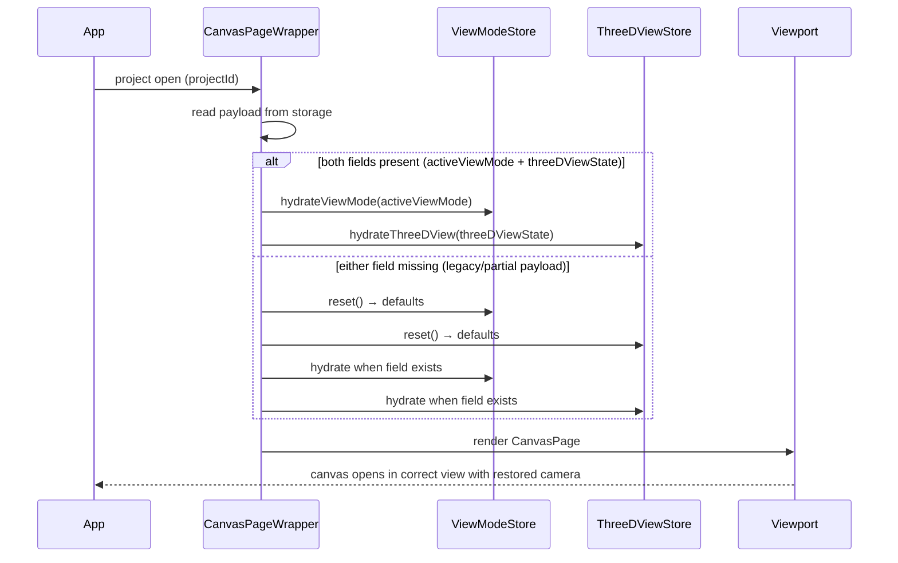

# Core Flows — Plan View + 3D View

## Overview

This document defines the seven canonical user flows for the Plan View + 3D View feature. All flows operate within the existing canvas workspace — no modal screens, no detached panels, no navigation away from the canvas. The right sidebar inspector, status bar, and top toolbar remain stable across all modes.

---

## Flow 1: Switch from Plan View to 3D View

**Trigger:** Engineer wants to inspect their design spatially while working in Plan View.

**Entry point:** Top toolbar — segmented control showing `Plan View` (active) and `3D View`.

**Steps:**

1. Engineer clicks `3D View` in the segmented control, or presses `Shift+3`.
2. The canvas viewport replaces the 2D drafting surface with the 3D scene — same project, same entities, no navigation away.
3. The status bar center section updates instantly: `View: 3D View` appears, and the camera hint line — `Orbit: drag · Pan: Shift+drag · Zoom: wheel` — becomes visible.
4. The 3D scene renders all entities at their correct positions. Camera opens to an oblique engineering view, aimed at the scene center.
5. If the project was previously in 3D View, the camera restores to the last saved orbit position and target.
6. If no entities exist, an empty-state message appears centered in the viewport: "No entities to render in 3D yet."
7. The right sidebar inspector remains unchanged — it shows the currently selected entity (or canvas properties if nothing is selected).
8. The top toolbar remains visible and stable, with the mode switch continuously accessible while working in 3D.

**Exit:** Engineer stays in 3D View until they switch back, or presses `Shift+2` for Plan View.

```wireframe
<!DOCTYPE html>
<html>
<head>
<style>
* { box-sizing: border-box; margin: 0; padding: 0; font-family: system-ui, sans-serif; font-size: 13px; }
body { background: #f1f5f9; display: flex; flex-direction: column; height: 100vh; }
.toolbar { height: 48px; background: white; border-bottom: 1px solid #e2e8f0; display: flex; align-items: center; padding: 0 12px; gap: 8px; }
.toolbar-logo { font-weight: 700; font-size: 14px; color: #0f172a; margin-right: 8px; }
.tool-btn { padding: 6px 10px; border: 1px solid #e2e8f0; border-radius: 8px; background: #f8fafc; color: #475569; font-size: 12px; cursor: pointer; }
.view-toggle { display: flex; align-items: center; border: 1px solid #e2e8f0; border-radius: 12px; background: #f8fafc; padding: 4px; margin-left: auto; }
.view-btn { padding: 6px 14px; border-radius: 8px; font-size: 12px; font-weight: 600; cursor: pointer; border: none; color: #64748b; background: transparent; }
.view-btn.active { background: #0f172a; color: white; box-shadow: 0 1px 2px rgba(0,0,0,.12); }
.workspace { display: flex; flex: 1; overflow: hidden; }
.sidebar-left { width: 48px; background: white; border-right: 1px solid #e2e8f0; }
.viewport { flex: 1; background: #1e293b; position: relative; display: flex; align-items: center; justify-content: center; }
.three-hint { position: absolute; top: 16px; left: 16px; background: rgba(255,255,255,.92); border: 1px solid #e2e8f0; border-radius: 10px; padding: 8px 12px; font-size: 11px; color: #475569; }
.three-hint strong { display: block; color: #0f172a; font-size: 12px; margin-bottom: 2px; }
.scene-placeholder { color: #94a3b8; font-size: 14px; text-align: center; }
.scene-placeholder .label { font-size: 11px; color: #64748b; margin-top: 4px; }
.sidebar-right { width: 280px; background: white; border-left: 1px solid #e2e8f0; padding: 12px; }
.inspector-title { font-weight: 600; color: #0f172a; margin-bottom: 8px; }
.inspector-field { background: #f8fafc; border: 1px solid #e2e8f0; border-radius: 6px; padding: 8px 10px; margin-bottom: 6px; color: #475569; font-size: 12px; }
.status-bar { height: 32px; background: #f8fafc; border-top: 1px solid #e2e8f0; display: flex; align-items: center; justify-content: space-between; padding: 0 12px; font-size: 11px; color: #64748b; }
.status-center { display: flex; gap: 12px; align-items: center; }
.status-mode { font-weight: 600; color: #0f172a; }
.status-hint { color: #94a3b8; font-style: italic; }
.divider { width: 1px; height: 14px; background: #e2e8f0; }
</style>
</head>
<body>
<div class="toolbar">
  <div class="toolbar-logo">HVAC</div>
  <button class="tool-btn">Select</button>
  <button class="tool-btn">Duct</button>
  <button class="tool-btn">Room</button>
  <button class="tool-btn">Equip</button>
  <div class="view-toggle">
    <button class="view-btn">▣ Plan View</button>
    <button class="view-btn active">⬛ 3D View</button>
  </div>
</div>
<div class="workspace">
  <div class="sidebar-left"></div>
  <div class="viewport">
    <div class="three-hint">
      <strong>3D View</strong>
      Drag to orbit · Shift/right-drag to pan · Wheel to zoom
    </div>
    <div class="scene-placeholder">
      [ 3D Scene — entities rendered at correct positions ]<br>
      <span class="label">Oblique engineering view · Scene center framed</span>
    </div>
  </div>
  <div class="sidebar-right">
    <div class="inspector-title">Properties</div>
    <div class="inspector-field">Canvas — no selection</div>
  </div>
</div>
<div class="status-bar">
  <span>X: — Y: —</span>
  <div class="status-center">
    <span>View: <span class="status-mode">3D View</span></span>
    <div class="divider"></div>
    <span class="status-hint">Orbit: drag · Pan: Shift+drag · Zoom: wheel</span>
    <div class="divider"></div>
    <span>Zoom: 100%</span>
  </div>
  <span>No selection</span>
</div>
</body>
</html>
```

---

## Flow 2: Switch from 3D View back to Plan View

**Trigger:** Engineer wants to make a precise 2D edit after reviewing the design in 3D.

**Entry point:** Top toolbar segmented control (showing `3D View` as active), or keyboard `Shift+2`.

**Steps:**

1. Engineer clicks `Plan View` in the segmented control, or presses `Shift+2`.
2. The canvas viewport replaces the 3D scene with the 2D drafting surface — the same project and entity state, no reload.
3. The status bar updates: `View: Plan View`, the camera hint line disappears, `Zoom: X%` reappears from the last 2D pan/zoom state.
4. The inspector strip "Editing in 3D View" (if present) disappears. The inspector returns to its normal state for the current selection.
5. Current selection is preserved — if an entity was selected in 3D, it remains selected and highlighted in Plan View.
6. All 2D tools are re-activated and interactive.

**Exit:** Engineer continues working in Plan View.

---

## Flow 3: Select an entity in 3D View

**Trigger:** Engineer clicks on a rendered entity mesh in the 3D viewport.

**Entry point:** 3D View is active, entities are visible in the scene.

**Steps:**

1. Engineer moves the cursor over an entity mesh. The mesh highlights on hover (distinct highlight color, not selection color).
2. Engineer clicks the mesh.
3. The entity becomes selected: its mesh switches to the selection highlight material (distinct from hover).
4. The right sidebar inspector immediately updates to show that entity's properties — the same inspector content as if it were selected in Plan View (room dimensions, duct specs, equipment type, etc.).
5. An "Editing in 3D View" strip appears at the top of the inspector, above the properties fields. It reads: `Editing in 3D View` — non-blocking, informational.
6. Transform gizmos appear anchored to the entity's world position — axis arrows (X/Z for horizontal, Y for vertical) and a Y-axis rotation ring.
7. The status bar right section updates: `1 entity selected`.
8. If the engineer clicks empty space, the selection clears, gizmos disappear, the inspector returns to canvas properties, and the strip disappears.

**Exit:** Entity is selected and gizmos are visible. Engineer proceeds to move, rotate, or inspect the entity.

```wireframe
<!DOCTYPE html>
<html>
<head>
<style>
* { box-sizing: border-box; margin: 0; padding: 0; font-family: system-ui, sans-serif; font-size: 13px; }
body { background: #f1f5f9; display: flex; flex-direction: column; height: 100vh; }
.toolbar { height: 48px; background: white; border-bottom: 1px solid #e2e8f0; display: flex; align-items: center; padding: 0 12px; gap: 8px; }
.toolbar-logo { font-weight: 700; font-size: 14px; color: #0f172a; margin-right: 8px; }
.tool-btn { padding: 6px 10px; border: 1px solid #e2e8f0; border-radius: 8px; background: #f8fafc; color: #475569; font-size: 12px; }
.view-toggle { display: flex; align-items: center; border: 1px solid #e2e8f0; border-radius: 12px; background: #f8fafc; padding: 4px; margin-left: auto; }
.view-btn { padding: 6px 14px; border-radius: 8px; font-size: 12px; font-weight: 600; border: none; color: #64748b; background: transparent; }
.view-btn.active { background: #0f172a; color: white; }
.workspace { display: flex; flex: 1; overflow: hidden; }
.sidebar-left { width: 48px; background: white; border-right: 1px solid #e2e8f0; }
.viewport { flex: 1; background: #1e293b; position: relative; display: flex; align-items: center; justify-content: center; }
.scene-inner { position: relative; display: flex; align-items: center; justify-content: center; width: 100%; height: 100%; }
.entity-box { width: 120px; height: 60px; background: #3b82f6; border: 2.5px solid #93c5fd; border-radius: 4px; display: flex; align-items: center; justify-content: center; color: white; font-size: 11px; font-weight: 600; position: relative; }
.gizmo { position: absolute; top: 50%; left: 50%; transform: translate(-50%, -50%); pointer-events: none; }
.gizmo-x { position: absolute; left: 70px; top: -4px; width: 48px; height: 6px; background: #ef4444; border-radius: 3px; display: flex; align-items: center; }
.gizmo-z { position: absolute; left: -4px; top: 60px; width: 6px; height: 48px; background: #3b82f6; border-radius: 3px; }
.gizmo-y { position: absolute; left: -4px; top: -52px; width: 6px; height: 48px; background: #22c55e; border-radius: 3px; }
.gizmo-ring { position: absolute; left: -32px; top: -32px; width: 64px; height: 64px; border: 3px solid #facc15; border-radius: 50%; opacity: 0.7; }
.sidebar-right { width: 280px; background: white; border-left: 1px solid #e2e8f0; display: flex; flex-direction: column; }
.mode-strip { background: #eff6ff; border-bottom: 1px solid #bfdbfe; padding: 6px 12px; font-size: 11px; color: #1d4ed8; font-weight: 600; display: flex; align-items: center; gap: 6px; }
.inspector-body { padding: 12px; flex: 1; }
.inspector-title { font-weight: 600; color: #0f172a; margin-bottom: 8px; }
.inspector-field { margin-bottom: 8px; }
.inspector-field label { display: block; font-size: 11px; color: #64748b; margin-bottom: 2px; }
.inspector-field .value { background: #f8fafc; border: 1px solid #e2e8f0; border-radius: 6px; padding: 5px 8px; color: #0f172a; font-size: 12px; }
.status-bar { height: 32px; background: #f8fafc; border-top: 1px solid #e2e8f0; display: flex; align-items: center; justify-content: space-between; padding: 0 12px; font-size: 11px; color: #64748b; }
.status-selected { font-weight: 600; color: #0f172a; }
</style>
</head>
<body>
<div class="toolbar">
  <div class="toolbar-logo">HVAC</div>
  <button class="tool-btn">Select</button>
  <button class="tool-btn">Duct</button>
  <button class="tool-btn">Room</button>
  <div class="view-toggle">
    <button class="view-btn">▣ Plan View</button>
    <button class="view-btn active">⬛ 3D View</button>
  </div>
</div>
<div class="workspace">
  <div class="sidebar-left"></div>
  <div class="viewport">
    <div class="scene-inner">
      <div style="position:relative;">
        <div class="entity-box">
          Supply Duct
          <div class="gizmo-x"></div>
          <div class="gizmo-z"></div>
          <div class="gizmo-y"></div>
          <div class="gizmo-ring"></div>
        </div>
        <div style="position:absolute;bottom:-18px;left:50%;transform:translateX(-50%);color:#94a3b8;font-size:10px;white-space:nowrap;">X (red) · Z (blue) · Y (green) · Rotate (yellow ring)</div>
      </div>
    </div>
  </div>
  <div class="sidebar-right">
    <div class="mode-strip">⬛ Editing in 3D View</div>
    <div class="inspector-body">
      <div class="inspector-title">Supply Duct</div>
      <div class="inspector-field"><label>Length</label><div class="value">12 ft</div></div>
      <div class="inspector-field"><label>Width × Height</label><div class="value">18 × 12 in</div></div>
      <div class="inspector-field"><label>Type</label><div class="value">Rectangular</div></div>
      <div class="inspector-field"><label>Elevation</label><div class="value">9 ft</div></div>
    </div>
  </div>
</div>
<div class="status-bar">
  <span>X: — Y: —</span>
  <span>View: <strong>3D View</strong> · Orbit: drag · Pan: Shift+drag · Zoom: wheel</span>
  <span class="status-selected">1 entity selected</span>
</div>
</body>
</html>
```

---

## Flow 4: Move an entity in 3D with the move gizmo

**Trigger:** Engineer wants to reposition an entity in 3D space by dragging directly in the viewport.

**Entry point:** An entity is selected in 3D View (gizmos are visible from Flow 3).

**Steps:**

1. Engineer positions the cursor over one of the axis arrows (X — red, Z — blue, Y — green). The arrow highlights to signal it is interactive.
2. Engineer presses and holds the pointer on the axis arrow. Orbit controls are immediately suspended — camera no longer responds to drag while the gizmo is held.
3. Engineer drags along the axis. The entity mesh moves in real time along the constrained axis as a live preview. The gizmo travels with the entity.
4. The inspector fields update live during drag to show the new position value as the entity moves.
5. Engineer releases the pointer. The drag ends.
6. The entity's canonical transform is updated via the 3D command layer. The change is applied to the entity store and is immediately undoable (`Ctrl+Z`).
7. Orbit controls resume.
8. The gizmo repositions to the entity's new location.
9. If the engineer switches to Plan View, the entity appears at its new position in the 2D surface.

**Failure case:** If the user releases outside the viewport or presses `Escape` mid-drag, the move cancels and the entity returns to its pre-drag position. No entity update is dispatched.



---

## Flow 5: Rotate an entity in 3D with the rotation gizmo

**Trigger:** Engineer wants to rotate an entity around its vertical axis in the 3D viewport.

**Entry point:** An entity is selected in 3D View (gizmos are visible from Flow 3).

**Steps:**

1. Engineer positions the cursor over the yellow rotation ring (Y-axis). The ring highlights.
2. Engineer presses and holds the pointer on the ring. Orbit controls suspend.
3. Engineer drags in an arc. The entity mesh rotates live around its Y-axis (vertical). The gizmo rotates with it.
4. The inspector rotation field updates live to show the current angle in degrees.
5. Engineer releases. The rotation is committed: the entity's absolute rotation (in degrees, normalized 0–360) is written to the entity store via the 3D command layer. The change is undoable.
6. Orbit controls resume.
7. Switching to Plan View shows the entity at its new rotation in the 2D surface.

**Constraint:** Rotation is constrained to the Y-axis only in v1 — no free-rotation in arbitrary 3D space.

---

## Flow 6: Edit entity dimensions in the inspector while in 3D View

**Trigger:** Engineer wants to change a duct's length or width without leaving 3D View.

**Entry point:** An entity is selected in 3D View. The inspector shows the entity's properties with the "Editing in 3D View" strip visible.

**Steps:**

1. Engineer clicks a dimension field in the inspector (e.g., Length, Width, Height, Elevation).
2. The field becomes editable — same interaction as in Plan View.
3. Engineer types the new value and presses `Enter` (or tabs to the next field).
4. The 3D mesh updates in real time to reflect the new dimensions — the scene graph rebuilds from the updated entity.
5. The gizmo repositions to the new entity bounds.
6. The change is applied via the existing entity update path and is undoable.
7. If the engineer switches to Plan View, the entity in the 2D surface reflects the updated dimensions.

**Note:** The inspector is the canonical editing surface for dimension changes in v1. In-scene resize handles are explicitly out of scope.

---

## Flow 7: Project save and reload with 3D state

**Trigger:** Engineer closes and reopens a project, or reloads the browser tab.

**Entry:** Project was last saved while in 3D View with a specific camera orbit state.

**Steps:**

1. View mode and camera state are persisted automatically on change — not only on explicit save. View/camera changes trigger an immediate debounced write, independent of the entity-change dirty flag.
2. Engineer reopens the project.
3. The project loads. View mode store and 3D camera store are hydrated from the saved payload before the canvas renders.
4. If both `activeViewMode` and `threeDViewState` are present, the canvas restores exactly to the saved mode and camera (including opening directly in 3D when last saved in `3d`).
5. The restored camera target and orbit values are applied before the first interactive frame, so users do not see a camera jump after load.
6. If either `activeViewMode` or `threeDViewState` is missing (legacy or partial payload), both stores reset to defaults first, then any present fields are hydrated. This prevents previous-project residue from leaking into the current project.
7. No error is shown for missing 3D state fields — old files open silently and correctly with safe defaults.

**Failure case:** If the saved camera state is invalid (e.g., NaN values), the camera defaults to the standard oblique view and the scene bounds are used to frame content. No blocking error is shown.



---

## Interaction rules that hold across all flows


| Rule                               | Behavior                                                                                                    |
| ---------------------------------- | ----------------------------------------------------------------------------------------------------------- |
| Selection is always canonical      | Selecting in either view updates the same selection store; inspector always reflects it                     |
| Gizmo-first input arbitration      | When pointer hits a gizmo, orbit controls are suspended until pointer-up                                    |
| No entity mutation in the viewport | All edits dispatch through the command layer; Three.js meshes are always derived, never the source of truth |
| Undo covers all 3D edits           | Move, rotate, and inspector edits from 3D View are reversible with `Ctrl+Z` / `Cmd+Z`                       |
| Mode switch never forks state      | Switching views does not copy, duplicate, or reset entity state                                             |
| Inspector strip is non-blocking    | "Editing in 3D View" appears above inspector fields and never hides them                                    |
| Camera hint persists in 3D         | Status bar camera hint is always visible while in 3D View, regardless of selection state                    |


&nbsp;