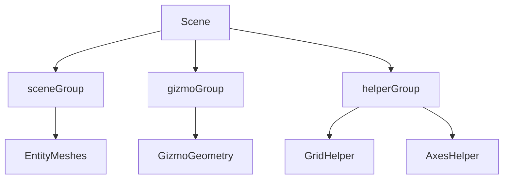
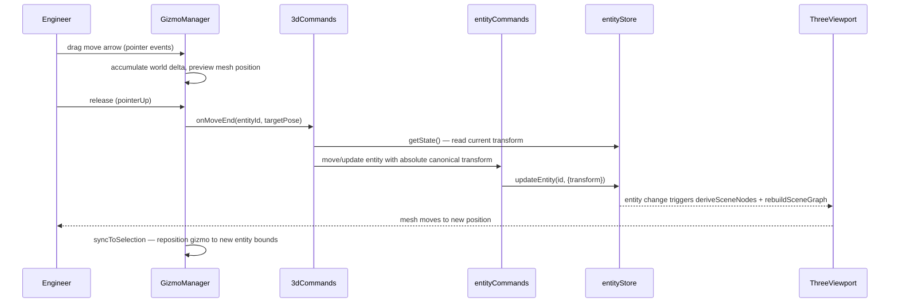

# Tech Plan — Plan View + 3D View

## Architectural Approach

### Decision 1: Dedicated `3d/commands/` module as a translation layer

The existing `entityCommands.ts` (file:`hvac-design-app/src/core/commands/entityCommands.ts`) is already ~560 lines and handles entity creation, deletion, update, move, undo/redo, and constraint validation. It is not 3D-aware and should stay that way.

The 3D command module (`src/features/canvas/3d/commands/`) acts as a **translation layer**: it receives 3D interaction events (gizmo drag end, raycaster intersection, viewport click), computes an absolute canonical target transform, then calls existing `entityCommands` functions. No new `CommandType` entries are needed — 3D moves dispatch to existing move/update commands, 3D rotates dispatch to `updateEntity()` with normalized rotation, and 3D duct creation dispatches to `createEntity()`.

This keeps the entity command layer clean, undo/redo automatically works for all 3D edits, and validation still fires via the existing entity store subscriber.

### Decision 2: Gizmo group as a structurally separate Three.js layer

`rebuildSceneGraph` (file:`hvac-design-app/src/features/canvas/3d/runtime/rebuildSceneGraph.ts`) performs a full clear-and-rebuild of the entity mesh group on every entity or selection change. If gizmos lived inside that group, they would be destroyed and recreated on every rebuild — causing flicker and losing drag state mid-interaction.

The gizmo layer is a **separate `THREE.Group`** added to the scene independently of the entity mesh group. The rebuild cycle never touches the gizmo group. The gizmo manager owns its own lifecycle: it shows/hides/repositions based on the selected entity, and it is the only thing that directly listens to pointer events for drag handling. Input arbitration is gizmo-first: when a gizmo hit starts a drag, orbit controls are disabled until pointer-up or cancel. After a drag ends, the gizmo calls into `3d/commands/` — it never writes to the entity store directly.

```
scene
  ├── sceneGroup (entity meshes — rebuilt on entity change)
  ├── gizmoGroup (gizmo geometry — managed by GizmoManager)
  └── helperGroup (grid, axes — persistent)
```

### Decision 3: Full scene rebuild retained for Phase B; incremental rebuild is future work

The full-clear-rebuild strategy in `rebuildSceneGraph` is acceptable for the entity count typical in HVAC designs (tens to low hundreds of entities). For Phase B, the rebuild is still triggered on entity/selection changes but the gizmo group is now protected from it. Incremental rebuild (diff-based scene graph update) is explicitly deferred — it would require entity identity tracking across rebuild cycles and introduces significant complexity for marginal gain at current entity counts.

### Decision 4: Hydration wiring is present — enforce hybrid reset policy and integration coverage

Both load paths in `CanvasPageWrapper.tsx` (file:`hvac-design-app/src/features/canvas/CanvasPageWrapper.tsx`) already call `hydrateViewMode()` and `hydrateThreeDView()` in web localStorage and Tauri file modes. The architectural gap is deterministic behavior when only one field is present.

Policy: if either `activeViewMode` or `threeDViewState` is missing, reset both stores to defaults first, then hydrate whichever fields are present. If both fields are present, hydrate directly without reset. This prevents previous-project residue and keeps backward compatibility explicit.

### Decision 5: Inspector mode strip as a pure reactive display component

The `RightSidebar` inspector renders selected entity fields. Adding an "Editing in 3D View" strip requires only subscribing to `useActiveViewMode()` from `viewModeStore` inside the inspector and conditionally rendering a banner. No new store state, no new actions — pure display logic on top of existing state.

### Decision 6: View/camera persistence uses immediate debounced writes

View mode and 3D camera changes must persist through a dedicated debounced save path, independent of the entity dirty-flag lifecycle. This guarantees mode/camera continuity on quick close/reopen flows where no entity mutation occurred.

### Constraint: Canonical transform contract with persistent elevation

The base entity transform is extended to include persistent vertical position (`transform.elevation`). Canonical transform now represents `{x, y, elevation, rotation}` where:
- `x` and `y` remain plan-space coordinates,
- `elevation` is vertical world position,
- `rotation` remains degrees in canonical storage.

The `3d/commands/` module computes **absolute target transforms** from gizmo world pose at drag end (not accumulated deltas), normalizes rotation to `[0, 360)`, and writes canonical values through command APIs only.

---

## Data Model

A targeted schema extension is required for persistent vertical editing.

### Required persistent schema coverage

| Field | Schema location | Status |
|---|---|---|
| `settings.activeViewMode` | `ProjectSettingsSchema` in `project-file.schema.ts` | ✅ Present, optional, backward-safe |
| `threeDViewState` | `ThreeDViewStateSchema` in `project-file.schema.ts` | ✅ Present, optional, backward-safe |
| Camera position, target, orbit | `ThreeDViewStateSchema` | ✅ All fields present |
| Display options (grid, axes, overlay) | `ThreeDViewStateSchema` | ✅ All fields present |
| `transform.elevation` | Base transform schema (`base.schema.ts`) | 🆕 Add as optional numeric field with default `0` |

### Runtime-only state (not persisted — correct)

| State | Store | Rationale |
|---|---|---|
| `is3DInitialized` | `viewModeStore` | Transient renderer lifecycle flag |
| Gizmo active state / drag delta preview | GizmoManager (in-component) | Interaction in progress — not a save target |
| Raycaster results | Ephemeral in `ThreeViewport` | Per-frame computation |

### Backward compatibility rule

Backward compatibility remains schema-safe by keeping new fields optional and defaulted. Hydration policy is deterministic:
- if both `activeViewMode` and `threeDViewState` are present, hydrate directly;
- if either field is missing, reset view-mode and 3D-view stores first, then hydrate available fields;
- entities missing `transform.elevation` default to `0`.

This avoids state leakage across project loads and preserves old project compatibility without destructive migration.

---

## Component Architecture

### 1. `3d/commands/` — new module

**Location:** `src/features/canvas/3d/commands/`

**Responsibility:** Translate 3D spatial interaction events into canonical entity updates. All functions in this module are pure functions (no React hooks, no store subscriptions) — they read entity state from `entityStore.getState()` and dispatch to `entityCommands`.

**Functions:**

| Function | 3D input | Calls |
|---|---|---|
| `moveEntity3D(entityId, targetPose)` | Absolute world pose from gizmo drag end | `moveEntities()` / `updateEntity()` with canonical absolute transform |
| `rotateEntity3D(entityId, targetRotationDeg)` | Absolute Y-axis rotation at drag end | `updateEntity()` with normalized `transform.rotation` |
| `resizeDuct3D(entityId, dimensions)` | New `{length?, width?, height?, diameter?}` | `updateEntity()` with updated `props` fields |
| `focusEntityIn3D(entityId)` | Target entity ID | Computes bounds from `SceneNode`, calls `threeDViewStore.setCameraTarget()` — no entity mutation |
| `createDuctFrom3DAnchor(anchorEntityId, direction)` | Anchor entity + direction vector | Derives start position, calls `createEntity()` with a new duct entity |

**Coordinate translation rule:** `moveEntity3D` receives an absolute gizmo target pose and maps it into canonical transform `{x, y, elevation, rotation}`. Ground-plane movement maps world X/Z into plan `x/y`; vertical movement maps world Y into `transform.elevation`. Rotation is normalized to `[0, 360)`. No drift-prone accumulation from previous deltas.

### 2. `GizmoManager` — new runtime module

**Location:** `src/features/canvas/3d/runtime/gizmoManager.ts`

**Responsibility:** Own the lifecycle of all custom gizmo geometry in the scene. Consumed by `ThreeViewport` alongside the existing runtime modules.

**Interface:**
- `createGizmoManager(gizmoGroup, camera, renderer, callbacks)` → `GizmoManager`
- `GizmoManager.syncToSelection(selectedIds, sceneNodes)` — show/hide/reposition gizmo when selection changes
- `GizmoManager.handlePointerDown/Move/Up(event)` — own drag lifecycle; emits `onMoveEnd(entityId, targetPose)` and `onRotateEnd(entityId, targetRotationDeg)` via callbacks
- `GizmoManager.handleCancel()` — cancels active drag (e.g., `Escape`) and restores pre-drag pose without dispatching entity updates
- `GizmoManager.dispose()` — cleanup geometry and event listeners

**Gizmo geometry (custom Three.js, v1):**

| Gizmo piece | Geometry | Axis |
|---|---|---|
| Move X arrow | `CylinderGeometry` + cone tip | World X (red) |
| Move Z arrow | `CylinderGeometry` + cone tip | World Z (blue) |
| Move Y arrow | `CylinderGeometry` + cone tip | World Y (green), persistently supported via canonical elevation |
| Rotate ring | `TorusGeometry` | Y-axis |

All gizmo meshes carry `userData.gizmoRole` and `userData.gizmoAxis` so the raycaster can distinguish them from entity meshes. The existing `raycastSelection` function is used for gizmo hit detection, but gizmo hits are intercepted before entity selection is evaluated.

### 3. `ThreeViewport` — modified

**Location:** `src/features/canvas/components/ThreeViewport.tsx` (file:`hvac-design-app/src/features/canvas/components/ThreeViewport.tsx`)

**Changes required:**
- Add a `gizmoGroup` to the scene (sibling of `sceneGroup`, never touched by `rebuildSceneGraph`)
- Instantiate `GizmoManager` with the gizmo group, camera, renderer, and callbacks
- Pointer event handlers route to `GizmoManager` first; if no gizmo hit, proceed to entity raycasting
- While gizmo drag is active, orbit controls are suspended; they resume on pointer-up or cancel
- `GizmoManager` callbacks dispatch to `3d/commands/` functions

**Scene group structure after change:**



### 4. Inspector mode strip — `RightSidebar` / inspector panel

**Location:** Inspector panel component(s) inside `src/features/canvas/components/Inspector/`

**Change:** Subscribe to `useActiveViewMode()`. When `activeViewMode === '3d'` and an entity is selected, render a small non-blocking strip at the top of the inspector reading "Editing in 3D View". The strip uses existing design tokens (slate/blue palette) and is purely additive — no existing inspector fields move or change.

### 5. Integration tests — new test files

| Test file | What it covers |
|---|---|
| `store/__tests__/viewModeStore.test.ts` | Default `plan` mode, `setViewMode`, `toggleViewMode`, `hydrateViewMode` |
| `store/__tests__/threeDViewStore.test.ts` | Camera defaults, `setOrbitState`, `hydrateThreeDView`, `reset` |
| `3d/__tests__/deriveDuctNode.test.ts` | Rectangular → box; round → cylinder; zero length → null |
| `3d/__tests__/deriveRoomNode.test.ts` | Correct geometry from schema fields |
| `3d/__tests__/deriveEquipmentNode.test.ts` | Bounding volume, mount height offset, equipment-type color |
| `3d/__tests__/deriveFittingNode.test.ts` | Type-to-primitive mapping; graceful fallback |
| `features/canvas/__tests__/CanvasPageWrapper.hydration.web.test.ts` | Web/localStorage load path hydrates `viewModeStore`, `threeDViewStore`, and selection state correctly |
| `features/canvas/__tests__/CanvasPageWrapper.hydration.tauri.test.ts` | Tauri/file load path hydrates the same contract from parsed `ProjectFile` payload |
| `features/canvas/__tests__/CanvasPageWrapper.hydration.backward-compat.test.ts` | Missing `activeViewMode` or `threeDViewState` triggers reset-before-hydrate defaults and prevents prior-project residue |
| `hooks/__tests__/useAutoSave.test.ts` (extend existing) | Debounced immediate persistence for view/camera-only changes, including close-before-interval reliability |

### End-to-end data flow: 3D gizmo move


