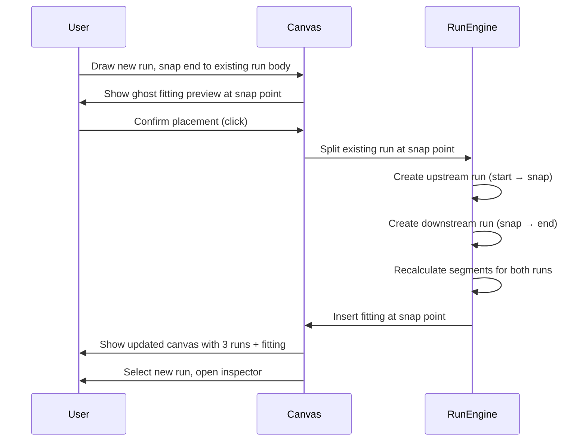
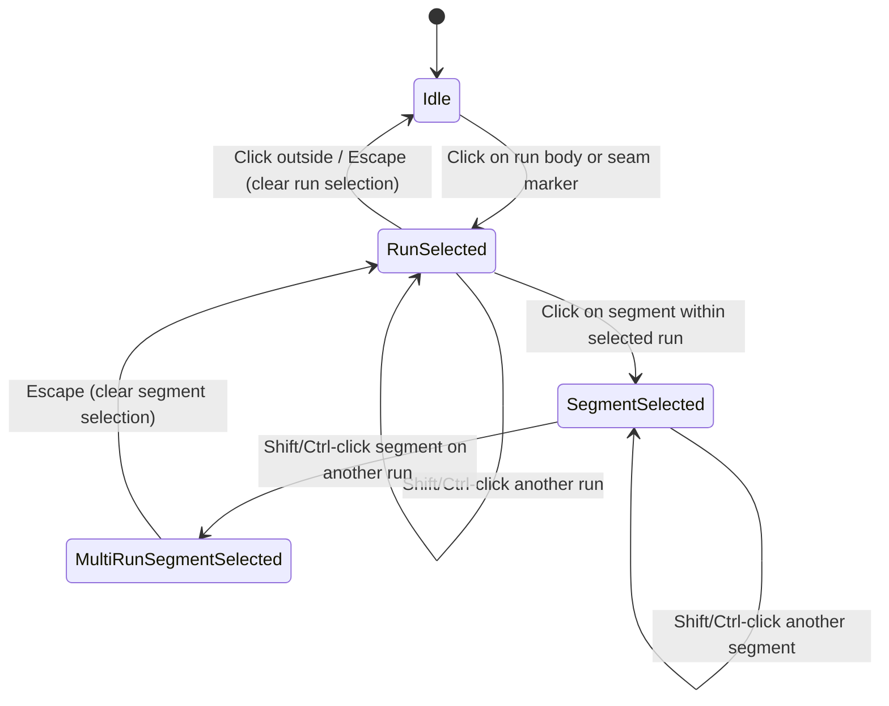

# Core Flows — Duct Rendering & Run/Segment Overhaul

## Flow 1 — Drawing a Duct Run

**Trigger:** User selects the Duct tool from the left toolbar and clicks on the canvas.

**Steps:**

1. User activates the Duct tool. The cursor changes to a crosshair.
2. User moves the cursor over the canvas. If multiple snap targets overlap, snap priority is: **run endpoint → fitting connection port → run body**. The highest-priority valid target shows a blue snap halo.
3. User clicks to set the start point. If a snap halo was visible, the start point locks to that connection plane.
4. User moves the cursor to define the run direction and length. A live preview shows:
  - Two parallel wall lines at the true model-scale width of the selected duct family
  - A dashed style to indicate the run is not yet committed
  - A live length readout (in feet) at the midpoint of the preview
  - A snap indicator and `[SNAP]` label if the cursor is near a valid target
  - An inline canvas warning if the proposed run is too short to place
5. User clicks to set the end point. If the proposed geometry is valid, the run is committed:
  - A `DuctRun` entity is created with `installLength` = center-path distance between the two connection planes
  - Segments are generated automatically from the fabrication profile (e.g., 5 ft sections for rectangular)
  - The remainder segment, if any, is placed at the terminal end and flagged `isPartial = true`
  - Section seam markers appear between segments; connection flange markers appear at both ends
  - The run label appears at the path midpoint showing duct size and total length
6. If the proposed geometry is invalid, the run is not created and the inline canvas warning remains visible until the user adjusts the preview back into a valid state.
7. The tool chains: the end point becomes the new start point for the next run. The user can continue drawing or press **Escape** to exit.
8. If the end point snaps to an existing duct endpoint, a ghost fitting preview appears. On commit, the fitting is auto-inserted and the two runs are linked through it.

**Exit:** Escape key or switching to another tool.

## Flow 2 — Run and Segment Selection

**Trigger:** User is in the Select tool and clicks on a duct run on the canvas.

**Steps:**

1. **First click on a run body or seam marker** → selects the whole run.
  - The run shows a selection glow/outline around its full extent.
  - The right inspector panel opens showing: duct size, total install length, section count, section length rule, and section count summary.
  - No individual segment is selected yet.
2. **Shift-click or Ctrl-click on another run** → adds that whole run to the selection.
  - Multiple whole runs can remain selected at once.
3. **While a run is selected, user clicks on a specific segment** → selects that segment as a child state.
  - The segment shows a distinct segment-level highlight (stronger fill or overlay) on top of the run glow.
  - The inspector updates to show segment-level detail when a single segment is selected.
  - The parent run remains visually selected (glow persists).
4. **Shift-click or Ctrl-click on another segment** → adds it to the segment selection, including segments from different runs.
  - Each selected segment keeps its own parent run visually active, so segment multi-select can span multiple runs at once.
  - When segment selection spans multiple runs, the inspector switches to a multi-selection summary / bulk edit state rather than a single-segment detail view.
5. **Clicking outside the selection** → clears both run and segment selection. Inspector panel returns to empty/default state.
6. **Pressing Escape** → if one or more segments are selected, deselects all selected segments but keeps their parent runs selected. Pressing Escape again clears the run selection.

```wireframe

<html>
<head>
<style>
  body { font-family: sans-serif; background: #f1f5f9; margin: 0; display: flex; height: 100vh; }
  .canvas-area { flex: 1; position: relative; background: #e2e8f0; display: flex; align-items: center; justify-content: center; }
  .duct-run { position: relative; width: 420px; height: 60px; display: flex; align-items: center; }
  .duct-glow { position: absolute; inset: -6px; border: 2px solid #3b82f6; border-radius: 4px; background: rgba(59,130,246,0.06); }
  .duct-walls { position: absolute; top: 14px; left: 0; right: 0; height: 32px; border-top: 2px solid #424242; border-bottom: 2px solid #424242; }
  .seam { position: absolute; top: 8px; bottom: 8px; width: 1px; background: #94a3b8; }
  .seam.s1 { left: 105px; }
  .seam.s2 { left: 210px; }
  .seam.s3 { left: 315px; }
  .flange { position: absolute; top: 4px; bottom: 4px; width: 2px; background: #424242; }
  .flange.start { left: 0; }
  .flange.end { right: 0; }
  .seg-highlight { position: absolute; top: 14px; left: 105px; width: 105px; height: 32px; background: rgba(59,130,246,0.18); border: 1.5px solid #2563eb; }
  .run-label { position: absolute; top: -22px; left: 50%; transform: translateX(-50%); font-size: 11px; color: #1e40af; white-space: nowrap; background: white; padding: 1px 6px; border-radius: 3px; border: 1px solid #bfdbfe; }
  .seg-label { position: absolute; bottom: -20px; left: 105px; font-size: 10px; color: #2563eb; white-space: nowrap; }
  .sidebar { width: 260px; background: white; border-left: 1px solid #e2e8f0; padding: 16px; display: flex; flex-direction: column; gap: 12px; }
  .sidebar h3 { margin: 0; font-size: 13px; color: #0f172a; }
  .badge { display: inline-block; background: #eff6ff; color: #1d4ed8; border: 1px solid #bfdbfe; border-radius: 12px; font-size: 10px; padding: 1px 8px; }
  .field { display: flex; flex-direction: column; gap: 2px; }
  .field label { font-size: 10px; color: #64748b; }
  .field .val { font-size: 12px; color: #0f172a; background: #f8fafc; border: 1px solid #e2e8f0; border-radius: 4px; padding: 4px 8px; }
  .divider { border: none; border-top: 1px solid #e2e8f0; margin: 4px 0; }
  .seg-section { background: #eff6ff; border-radius: 6px; padding: 8px; }
  .seg-section label { font-size: 10px; color: #1d4ed8; font-weight: 600; }
</style>
</head>
<body>
<div class="canvas-area">
  <div class="duct-run">
    <div class="duct-glow"></div>
    <div class="duct-walls"></div>
    <div class="seam s1"></div>
    <div class="seam s2"></div>
    <div class="seam s3"></div>
    <div class="flange start"></div>
    <div class="flange end"></div>
    <div class="seg-highlight"></div>
    <div class="run-label">18"×12" · 21'-0" · 4 sections + 1 partial</div>
    <div class="seg-label">Seg 2 · 5'-0"</div>
  </div>
</div>
<div class="sidebar">
  <div style="display:flex;align-items:center;gap:8px;">
    <h3>Run Properties</h3>
    <span class="badge">Rectangular</span>
  </div>
  <div class="field"><label>Duct Size</label><div class="val">18" × 12"</div></div>
  <div class="field"><label>Install Length</label><div class="val">21'-0"</div></div>
  <div class="field"><label>Section Rule</label><div class="val">5 ft (Rectangular default)</div></div>
  <div class="field"><label>Section Count</label><div class="val">4 full + 1 partial (1'-0")</div></div>
  <hr class="divider"/>
  <div class="seg-section">
    <label>Selected Segment — #2 of 5</label>
    <div class="field" style="margin-top:6px;"><label>Start Station</label><div class="val">5'-0"</div></div>
    <div class="field"><label>End Station</label><div class="val">10'-0"</div></div>
    <div class="field"><label>Length</label><div class="val">5'-0" (full)</div></div>
  </div>
</div>
</body>
</html>
```

## Flow 3 — Fabrication Profile Editing

**Trigger:** User opens the global settings panel (via the toolbar or a settings icon) and navigates to the **Fabrication Profiles** section. Alternatively, the user can access the per-run section length override from the run inspector.

**Global profile editing:**

1. User opens Settings → Fabrication Profiles.
2. Two profile cards are shown: **Rectangular / Square** and **Round Rigid**.
3. Each card shows: default section length, allowed section lengths list, family min/max limits, and a name field.
4. User edits the default section length, allowed lengths, or profile name.
5. As the user types, all existing runs of that family immediately preview recalculated segment counts and remainder pieces. The canvas updates live.
6. Changes are not persisted yet. A **Save** action remains available while the preview is active.
7. User clicks **Save** to persist the new profile. If the user closes the panel without saving, the profile and canvas revert to the last saved values.

**Per-run override (from inspector):**

1. User selects a run. The inspector shows the **Section Rule** field with the current profile value.
2. User clicks the field and either selects a value from the allowed list or types a custom numeric value within that family's min/max limits.
3. If the custom value is outside the allowed min/max range, the field shows validation and the run does not recalculate until the value is valid.
4. Once the value is valid, only that run recalculates. The global profile is not changed.
5. The inspector shows a small "custom" badge next to the section rule field to indicate it differs from the global profile.

```wireframe

<html>
<head>
<style>
  body { font-family: sans-serif; background: #f8fafc; margin: 0; padding: 24px; }
  h2 { font-size: 15px; color: #0f172a; margin: 0 0 16px; }
  .profiles { display: flex; gap: 16px; }
  .card { background: white; border: 1px solid #e2e8f0; border-radius: 8px; padding: 16px; width: 220px; display: flex; flex-direction: column; gap: 10px; }
  .card-title { font-size: 12px; font-weight: 600; color: #0f172a; }
  .field { display: flex; flex-direction: column; gap: 3px; }
  .field label { font-size: 10px; color: #64748b; }
  .field input, .field select { font-size: 12px; border: 1px solid #cbd5e1; border-radius: 4px; padding: 5px 8px; color: #0f172a; background: white; }
  .field input:focus { outline: 2px solid #3b82f6; border-color: #3b82f6; }
  .tag { display: inline-block; background: #f1f5f9; border: 1px solid #e2e8f0; border-radius: 4px; font-size: 10px; padding: 2px 6px; color: #475569; margin: 2px 2px 0 0; }
  .note { font-size: 10px; color: #94a3b8; margin-top: 4px; }
  .save-btn { margin-top: 16px; background: #2563eb; color: white; border: none; border-radius: 6px; padding: 8px 20px; font-size: 13px; cursor: pointer; }
</style>
</head>
<body>
<h2>Fabrication Profiles</h2>
<div class="profiles">
  <div class="card">
    <div class="card-title">Rectangular / Square</div>
    <div class="field">
      <label>Default Section Length (ft)</label>
      <input type="number" value="5" data-element-id="rect-section-length"/>
    </div>
    <div class="field">
      <label>Allowed Lengths</label>
      <div>
        <span class="tag">4 ft</span>
        <span class="tag">5 ft</span>
        <span class="tag">6 ft</span>
      </div>
    </div>
    <div class="field">
      <label>Profile Name</label>
      <input type="text" value="Standard Rectangular" data-element-id="rect-profile-name"/>
    </div>
    <div class="note">Applies to all rectangular runs unless overridden per-run.</div>
  </div>
  <div class="card">
    <div class="card-title">Round Rigid</div>
    <div class="field">
      <label>Default Section Length (ft)</label>
      <input type="number" value="10" data-element-id="round-section-length"/>
    </div>
    <div class="field">
      <label>Allowed Lengths</label>
      <div>
        <span class="tag">5 ft</span>
        <span class="tag">10 ft</span>
        <span class="tag">12 ft</span>
      </div>
    </div>
    <div class="field">
      <label>Profile Name</label>
      <input type="text" value="Standard Round Spiral" data-element-id="round-profile-name"/>
    </div>
    <div class="note">Applies to all round runs unless overridden per-run.</div>
  </div>
</div>
<button class="save-btn" data-element-id="save-profiles">Save Profiles</button>
</body>
</html>
```

## Flow 4 — Fitting Insertion Splits a Run

**Trigger:** User draws a new duct run whose start or end point snaps to the body of an existing run outside the endpoint tolerance, or user manually inserts a fitting object onto an existing run.

**Steps:**

1. User draws a new duct run toward an existing run.
2. If the snap point falls within the endpoint tolerance of the existing run start or end, the system treats it as a normal endpoint connection and no split occurs.
3. If the snap point lands on the run body outside endpoint tolerance, a ghost fitting preview appears at the split location, showing the fitting type (e.g., tee).
4. User confirms placement with the second click. If the proposed split geometry is valid, the system:
  - Splits the existing run at the snap point into two runs: **upstream run** (from original start to snap point) and **downstream run** (from snap point to original end).
  - Each resulting run gets its own identity, install length, and segment set recalculated from the fabrication profile.
  - The fitting object is inserted at the snap point, connecting all three runs.
  - Labels update: the original run label is removed; each new run gets its own label at its own midpoint.
5. If the proposed split geometry is invalid, no split occurs, the existing run remains unchanged, and an inline canvas warning explains that the connection cannot be created at that location.
6. The newly drawn run is selected. The inspector shows its properties.
7. If the user undoes (Ctrl+Z), the split is reversed: the two runs merge back into the original run, the fitting is removed, and the new duct run is removed.



## State Machine Summary — Selection

