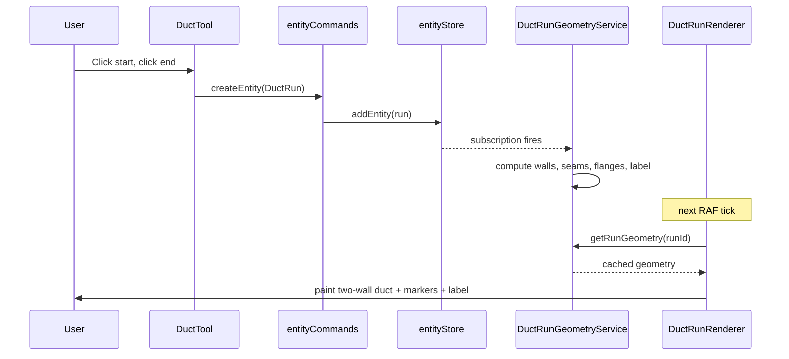
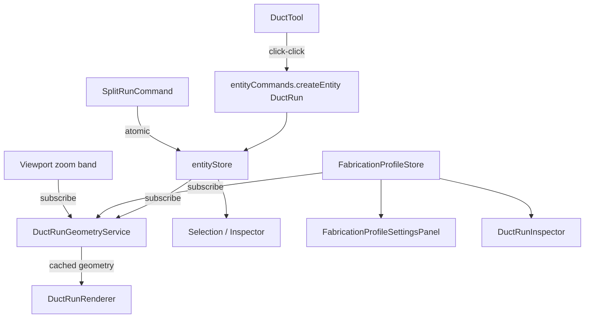

# Tech Plan — Duct Rendering & Run/Segment Overhaul

## Architectural Approach

### Key decisions

1. **Preserve the Canvas 2D + Zustand + command pattern.** No framework changes. The new work plugs into the existing `entityStore` (file:hvac-design-app/src/core/store/entityStore.ts), `historyStore` (file:hvac-design-app/src/core/commands/historyStore.ts), and `requestAnimationFrame` render loop in file:hvac-design-app/src/features/canvas/components/CanvasContainer.tsx.
2. **Introduce ****`DuctRun`**** as a new top-level entity type alongside the existing ****`Duct`****.** Segments are embedded inside `DuctRun.props.segments` — they are not separate `byId` entries. Segment selection is tracked in the selection store as `{ runId, segmentIndex }` references, not as entity IDs. This keeps the entity store flat and avoids 1,250 extra `byId` entries at the performance target.
3. **Introduce a formal coordinate contract.** A new `core/constants/coordinates.ts` module exports `PIXELS_PER_INCH = 1` and `PIXELS_PER_FOOT = 12`, and a small `modelToPixels()` / `pixelsToModel()` helper. All renderers and tools migrate to these helpers; the implicit `length * 12` math in `DuctRenderer` and `DuctTool` is removed.
4. **Add a dedicated ****`DuctRunGeometryService`** that owns the rendering cache (wall offsets, normal vectors, seam planes, flange planes, label anchors, hit-test bounds). It subscribes to the entity store, invalidates per-run on `modifiedAt` change or relevant fabrication-profile change, and exposes synchronous reads for the renderer and the hit-tester. This is the critical performance lever for the 250 runs / 1,250 segments target.
5. **Add a new command type ****`SPLIT_RUN`**** with inverse ****`MERGE_RUNS`****.** Run splitting is one atomic, reversible operation. The executor switch in `entityCommands.ts` gets two new cases. This preserves clean undo semantics and avoids fragile multi-command batches.
6. **Fabrication profiles are app-global, not per-project.** A new `fabricationProfileStore` lives alongside `calculationSettingsStore` (file:hvac-design-app/src/core/store/calculationSettingsStore.ts), persists via the same mechanism, and is keyed by duct family. Per-run overrides live inside `DuctRun.props.sectionLengthOverride` so they travel with the project.
7. **Selection store is extended, not replaced.** A new `selectedSegments: Array<{ runId, segmentIndex }>` field is added to `selectionStore` alongside the existing `selectedIds`. Cross-run segment multi-select is a natural fit for this shape.

### Constraints and trade-offs

- **Segments-in-props means segment lookup is ****`runs[id].props.segments[i]`****, not ****`byId[segmentId]`****.** Slightly less uniform than treating segments as entities, but the entity count stays bounded and the existing command system still applies (a segment edit becomes an `UPDATE_ENTITY` on the parent run).
- **`DuctRun`**** and the legacy ****`Duct`**** entity coexist during migration.** The renderer and selection layer dispatch on `entity.type`, so no flag-day cutover is required. A migration step on project load converts existing `Duct` entities to `DuctRun` with a single segment, preserving undo semantics from that point forward.
- **Geometry cache must be invalidated on three triggers:** run `modifiedAt` change, fabrication profile change for that run's family, and viewport zoom band crossing (for screen-stable marker geometry). The service subscribes to all three stores.
- **No framework migration, no 3D changes, no BOM rewrite.** The data model carries enough information for downstream BOM work, but BOM consumers stay out of scope.

### End-to-end request trace (drawing a run)



## Data Model

### New entity: `DuctRun`

Lives in file:hvac-design-app/src/core/schema/duct-run.schema.ts. Extends `BaseEntitySchema` and uses Zod discriminated union for shape-specific props.

| Field | Type | Notes |
| --- | --- | --- |
| `type` | `'duct_run'` literal | Discriminator added to `EntityTypeSchema` |
| `transform` | `Transform` | Run origin (start point) and rotation |
| `props.shape` | `'round' \| 'rectangular'` | Reuses `DuctShapeSchema`; future-extensible to `'flat_oval' \| 'flex'` |
| `props.diameter` / `props.width` / `props.height` | `number` | Same conditional rules as legacy Duct |
| `props.material`, `props.engineeringSystem`, etc. | unchanged | Carried over from existing Duct schema |
| `props.endPoint` | `{ x, y }` | World-space end coordinate (start = `transform`) |
| `props.installLength` | `number` (feet) | Center-path length between connection planes |
| `props.startConnectionId` | `string \| undefined` | Fitting/equipment ID at start, if connected |
| `props.endConnectionId` | `string \| undefined` | Fitting/equipment ID at end, if connected |
| `props.sectionLengthOverride` | `number \| undefined` | Per-run override; `undefined` ⇒ use global profile |
| `props.segments` | `DuctSegment[]` | Embedded child records |
| `props.labelAnchorOffset` | `number` | Optional fine-tuning of label position along path |

### Embedded record: `DuctSegment`

| Field | Type | Notes |
| --- | --- | --- |
| `index` | `number` | Position in run, starting at 0 |
| `startStation` | `number` (feet) | Distance from run start |
| `endStation` | `number` (feet) | Distance from run start |
| `length` | `number` (feet) | `endStation - startStation` |
| `isPartial` | `boolean` | True for the remainder piece |

Segments have **no ****`id`**. They are addressed as `{ runId, segmentIndex }`. Stations are recomputed deterministically from `installLength` and the active section length rule on every run mutation.

### New global record: `DuctFabricationProfile`

Lives in file:hvac-design-app/src/core/schema/fabrication-profile.schema.ts. Held by a new `fabricationProfileStore`.

| Field | Type | Notes |
| --- | --- | --- |
| `family` | `'rectangular' \| 'round_rigid'` | Discriminator |
| `name` | `string` | User-editable label |
| `defaultSectionLength` | `number` (feet) | Default for runs of this family |
| `allowedSectionLengths` | `number[]` | Quick-pick values shown in inspector |
| `minSectionLength` | `number` (feet) | Validation floor for per-run overrides |
| `maxSectionLength` | `number` (feet) | Validation ceiling for per-run overrides |

### Selection store extension

file:hvac-design-app/src/features/canvas/store/selectionStore.ts gains:

```ts
selectedSegments: Array<{ runId: string; segmentIndex: number }>
```

`selectedIds` continues to hold whole-entity selections (rooms, ducts, runs, fittings, equipment). The two arrays together describe the full selection state. New actions: `selectSegment`, `addSegmentToSelection`, `clearSegmentSelection`.

### Entity type and schema updates

- `EntityTypeSchema` in file:hvac-design-app/src/core/schema/base.schema.ts gains `'duct_run'`.
- `Entity` discriminated union in file:hvac-design-app/src/core/schema/index.ts gains `DuctRun`.
- `ProjectFile` schema picks up `DuctRun` automatically through the `Entity` union — no separate field added. **Fabrication profiles do not enter ****`ProjectFile`** (they are app-global).

### Migration of existing data

On project load, the deserializer converts each `Duct` entity into a `DuctRun` with a single segment spanning the full length. The original `Duct` type is kept readable for backward compatibility but is no longer created. Existing tests against `entity.type === 'duct'` are systematically updated to handle either type via a small `isDuctLike()` helper.

### Command system additions

| Command | Payload | Inverse |
| --- | --- | --- |
| `SPLIT_RUN` | `{ originalRunId, splitPointStation, fitting }` | `MERGE_RUNS` |
| `MERGE_RUNS` | `{ upstreamRunId, downstreamRunId, fittingId }` | `SPLIT_RUN` |

Both go through `entityCommands.ts` and `historyStore` like every other command.

## Component Architecture

### New components and services



| Component | Responsibility |
| --- | --- |
| `DuctRunRenderer` | Renders one run: walls, seams, flanges, run boundary markers, label, selection overlays. Reads geometry from `DuctRunGeometryService`. Replaces today's `DuctRenderer` (legacy `DuctRenderer` is kept only for migration-period read-back of old `duct` entities, then removed). |
| `DuctRunGeometryService` | Owns the rendering cache. Computes walls, normals, seam planes, flange planes, label anchors, screen-stable marker dimensions, and hit-test bounds. Subscribes to `entityStore`, `fabricationProfileStore`, and viewport zoom band. Invalidates per-run on relevant changes. Exposes `getRunGeometry(runId)`, `getSegmentBounds(runId, index)`, `hitTestRun(point)`, `hitTestSegment(point)`. |
| `DuctTool` (revised) | Click-click placement; honors snap priority `endpoint → fitting port → run body`; treats body snap within endpoint tolerance as endpoint connection (no split); detects mid-body snaps and dispatches `SPLIT_RUN`. Live preview uses model-true two-wall geometry. |
| `SelectTool` (revised) | Hit-tests against `DuctRunGeometryService` for both whole-run and per-segment regions. Implements the run → segment selection state machine with whole-run multi-select and cross-run segment multi-select. |
| `FabricationProfileStore` | Zustand store holding the two profile records. Same persistence pattern as `calculationSettingsStore`. Live-preview vs. saved state handled via a draft layer (`draftProfiles` + `commitProfiles()` / `revertProfiles()`). |
| `FabricationProfileSettingsPanel` | New section in the existing settings dialog. Renders the two profile cards from the Core Flows wireframe, drives `FabricationProfileStore` draft state. |
| `DuctRunInspector` | Replaces `DuctInspector` for runs. Shows run-level fields (size, install length, section rule with custom badge, section count summary) and segment-level fields when a single segment is selected. Multi-segment selection switches to a bulk-edit summary. |
| `splitRunCommand` / `mergeRunsCommand` | New atomic commands in `entityCommands.ts`. Encapsulate the entity mutations (delete original, create upstream + downstream, create or attach fitting, recalculate segments) with a single inverse. |
| `coordinates.ts` constants module | Single source of truth for `PIXELS_PER_INCH`, `PIXELS_PER_FOOT`, conversion helpers, and zoom-band thresholds. |

### Boundaries and integration points

- **Renderer ↔ Geometry service:** Renderer is purely declarative — it asks for geometry by `runId` and paints. No geometry math inside the renderer.
- **Tool ↔ Commands:** Tools never mutate the entity store directly. They go through `entityCommands.ts` so undo/redo and validation always run.
- **Geometry service ↔ Stores:** One-way subscription — the service reads from `entityStore`, `fabricationProfileStore`, and `viewportStore`; it never writes back.
- **Fabrication profile ↔ Run:** Runs hold a soft reference (`shape` + optional `sectionLengthOverride`). At segment-recompute time, the geometry service resolves the active profile via `fabricationProfileStore.getProfileForFamily(shape)` and the override (if any).
- **Selection store ↔ Inspector:** Inspector picks an inspector component based on `selectedIds + selectedSegments`. Single run → run inspector; single segment → segment detail; multi-segment across runs → bulk summary.
- **Validation:** `validateAndRecord` in `entityCommands.ts` is extended to handle `duct_run` entities with the same constraint validation pipeline used today for `duct`.

### Data flow on the four core flows

| Flow | Path |
| --- | --- |
| Draw run | `DuctTool` → `createEntity(DuctRun)` → `entityStore` → `DuctRunGeometryService` (subscription) → `DuctRunRenderer` (next RAF) |
| Select run/segment | `SelectTool` → `DuctRunGeometryService.hitTest*` → `selectionStore` → `Inspector` (re-renders) |
| Edit profile | `FabricationProfileSettingsPanel` → `fabricationProfileStore` (draft) → `DuctRunGeometryService` (subscription, live preview) → `DuctRunRenderer` → on Save: `commitProfiles()` |
| Split run | `DuctTool` (mid-body snap) → `splitRunCommand` → `entityStore` (atomic batch) → `DuctRunGeometryService` (invalidate original + new runs) → `DuctRunRenderer` |