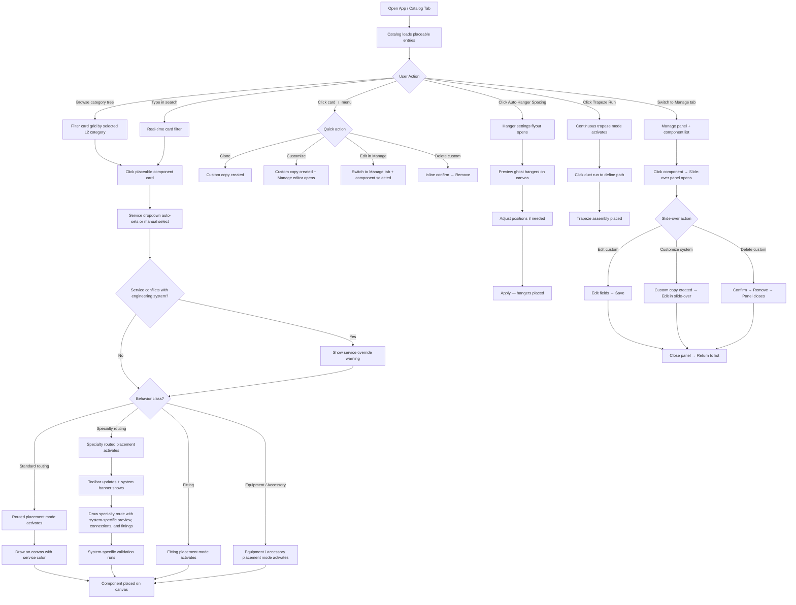

# Core Flows — HVAC Component Library & Specialty Tools

## Overview

This document defines the five core user flows for the HVAC Component Library Completeness & Categorization initiative. All flows operate within the existing canvas application layout: left sidebar (unified Catalog/Manage panel), top-center floating toolbar, canvas, and right sidebar (Properties/BOM/Calculations/Validation).

The previous separate "Library" and "Services" tabs have been **merged into a single unified panel** with two tabs: **Catalog** (browse & select placeable entries) and **Manage** (edit, customize, organize). Each catalog entry is understood through four identity concepts: behavior class, catalog category, subtype / archetype, and engineering system. Service context (Supply / Return / Exhaust / Outside Air) is selected independently via the active component indicator bar at the bottom of the sidebar; it sets the `systemType` (airflow role) and is separate from the `engineeringSystem` that governs validation, calculations, and system-specific behavior. Clicking a placeable card immediately activates the appropriate placement mode.

---

## Layout Context

```
┌──────────────────────────────────────────────────────────────────┐
│                    [Top Floating Toolbar]                         │
├──────────────┬───────────────────────────────────┬───────────────┤
│  LEFT SIDEBAR│                                   │ RIGHT SIDEBAR │
│  [Catalog]   │         CANVAS                    │ [Properties]  │
│  [Manage]    │                                   │ [BOM]         │
│              │                                   │ [Calculations]│
│  Category    │                                   │ [Validation]  │
│  Tree + Cards│                                   │               │
│  ──────────  │                                   │               │
│  Active Bar  │                                   │               │
│  [Service ▾] │                                   │               │
└──────────────┴───────────────────────────────────┴───────────────┘
```

---

## Flow 1 — Catalog Browsing & Component Selection

**Description:** The primary way a user discovers and selects a component to place on the canvas. Replaces the current flat accordion and separate Services panel with a unified professional catalog experience inside the "Catalog" tab. For this Epic, the Catalog shows **placeable entries only** so the interaction contract stays simple: click card = activate placement.

**Entry point:** User opens the app or clicks the "Catalog" tab in the left sidebar.

**Steps:**

1. The Catalog tab displays the unified panel with three zones stacked vertically:
  - **Top zone — Category Tree:** Three collapsible L1 sections (Air Distribution, Specialty Exhaust, Universal Components), each color-coded. Expanding an L1 reveals its L2 groups. Clicking an L2 filters the card grid below.
  - **Middle zone — Card Grid:** Shows **placeable** component cards for the selected category. Each card displays a Lucide icon, component name, type badge (Routing / Fitting / Equipment / Accessory), one key spec (e.g., "Max 2,500 FPM" or "NFPA 96"), and a **"⋮" overflow menu** with actions: Clone, Customize, Edit in Manage, and Delete (custom components only).
  - **Bottom zone — Active Component Indicator:** Shows the selected component name with its L1 color stripe, plus a **service context dropdown** (Supply / Return / Exhaust / Outside Air) that is **always visible and always active** for every component type. For routing and fittings it sets service color and service tagging; for equipment, accessories, and universal components it tags the item for BOM grouping by system.
2. A **search bar** sits between the tree and the card grid. Typing filters cards across all categories in real time; the tree collapses to show only matching L2 groups.
3. User clicks a card. The card highlights with a blue border. The active component indicator updates to show the selected component name.
4. User selects the **service context** from the dropdown in the active indicator bar (e.g., "Supply" → blue, "Return" → green, "Exhaust" → orange). This sets the `systemType` — the airflow role — which determines the canvas color and BOM/report grouping. The `engineeringSystem` remains attached to the selected entry and continues to govern routing behavior, validation, and calculations. The service context persists across component changes until explicitly changed. When a **specialty component** is selected (e.g., Boiler Flue, Grease Duct), the dropdown **auto-sets** to the contextually correct service (e.g., "Exhaust") but **remains editable** for power users who need to override for unusual configurations. If the chosen service context does not match the component’s normal engineering-system pairing, the app shows a warning in the active indicator and Validation tab explaining that engineering behavior still follows the `engineeringSystem` while the service override changes tagging and visual context.
5. The canvas automatically switches based on the selected entry’s behavior class: routed placement for routing components, fitting placement for fittings, and equipment/accessory placement for equipment and accessory entries. Specialty routing entries use the same routed placement pattern as standard ductwork, but with system-specific previews, connection behavior, fitting suggestions, and validation. The cursor changes to crosshair.
6. User moves to the canvas and begins drawing. The preview on the canvas reflects both the component type and the active service context color.
7. User can hover over a card and click the **"⋮" menu** to access:
  - **Clone** — creates a custom copy immediately, preserving current values, without opening the editor.
  - **Customize** — creates a custom copy and opens it for editing in the Manage tab.
  - **Edit in Manage** — switches to the Manage tab with that component pre-selected and its edit panel open.
  - **Delete** — only visible for custom components; shows inline confirmation before removing.  
   Clone stays in the Catalog tab. Customize and Edit in Manage switch to the Manage tab when editing is needed.

**Exit:** User places the component on canvas, or presses Escape to return to Select mode.

```wireframe
<!DOCTYPE html>
<html>
<head>
<style>
* { box-sizing: border-box; margin: 0; padding: 0; font-family: system-ui, sans-serif; font-size: 13px; }
body { background: #f8fafc; display: flex; height: 100vh; }
.sidebar { width: 300px; background: white; border-right: 1px solid #e2e8f0; display: flex; flex-direction: column; }
.sidebar-tabs { display: flex; gap: 4px; padding: 8px 12px; border-bottom: 1px solid #e2e8f0; }
.tab { padding: 5px 14px; border-radius: 6px; cursor: pointer; color: #64748b; font-size: 12px; font-weight: 500; }
.tab.active { background: #e2e8f0; color: #0f172a; font-weight: 600; }
.search-bar { padding: 8px 12px; border-bottom: 1px solid #e2e8f0; }
.search-bar input { width: 100%; padding: 6px 10px; border: 1px solid #cbd5e1; border-radius: 6px; font-size: 12px; color: #334155; }
.catalog-body { display: flex; flex-direction: column; flex: 1; overflow: hidden; }
.category-tree { padding: 8px 0; border-bottom: 1px solid #e2e8f0; }
.l1-header { display: flex; align-items: center; gap: 8px; padding: 6px 12px; cursor: pointer; font-weight: 600; font-size: 11px; letter-spacing: 0.05em; text-transform: uppercase; }
.l1-header .dot { width: 8px; height: 8px; border-radius: 50%; flex-shrink: 0; }
.l1-header .chevron { margin-left: auto; color: #94a3b8; font-size: 10px; }
.l2-item { display: flex; align-items: center; gap: 6px; padding: 4px 12px 4px 28px; cursor: pointer; color: #475569; border-radius: 4px; margin: 1px 6px; }
.l2-item.active { background: #eff6ff; color: #1d4ed8; font-weight: 500; }
.l2-item .count { margin-left: auto; background: #f1f5f9; color: #64748b; border-radius: 10px; padding: 1px 6px; font-size: 10px; }
.l2-item.active .count { background: #dbeafe; color: #1d4ed8; }
.card-grid { flex: 1; overflow-y: auto; padding: 10px; display: grid; grid-template-columns: 1fr 1fr; gap: 8px; }
.component-card { border: 1px solid #e2e8f0; border-radius: 8px; padding: 10px 8px 8px; cursor: pointer; background: white; display: flex; flex-direction: column; align-items: center; gap: 5px; transition: border-color 0.15s; position: relative; }
.component-card:hover { border-color: #93c5fd; }
.component-card.selected { border-color: #2563eb; background: #eff6ff; }
.card-overflow { position: absolute; top: 4px; right: 4px; width: 20px; height: 20px; border-radius: 4px; display: flex; align-items: center; justify-content: center; font-size: 12px; color: #94a3b8; cursor: pointer; opacity: 0; transition: opacity 0.15s; }
.component-card:hover .card-overflow { opacity: 1; }
.card-overflow:hover { background: #e2e8f0; color: #475569; }
.card-icon { width: 36px; height: 36px; border-radius: 8px; display: flex; align-items: center; justify-content: center; font-size: 18px; }
.card-name { font-size: 11px; font-weight: 500; color: #1e293b; text-align: center; line-height: 1.3; }
.card-badge { font-size: 9px; padding: 2px 6px; border-radius: 10px; background: #f1f5f9; color: #64748b; text-transform: uppercase; letter-spacing: 0.04em; }
.card-spec { font-size: 10px; color: #94a3b8; }
.active-indicator { padding: 10px 12px; border-top: 1px solid #e2e8f0; background: #f8fafc; }
.active-top { display: flex; align-items: center; gap: 8px; }
.active-stripe { width: 4px; height: 32px; border-radius: 2px; }
.active-label { font-size: 10px; color: #64748b; }
.active-name { font-size: 12px; font-weight: 600; color: #1e293b; }
.service-selector { display: flex; align-items: center; gap: 6px; margin-top: 8px; padding-top: 8px; border-top: 1px solid #e2e8f0; }
.service-label { font-size: 10px; color: #64748b; font-weight: 500; text-transform: uppercase; letter-spacing: 0.04em; }
.service-dropdown { display: flex; align-items: center; gap: 6px; padding: 4px 10px; border: 1px solid #cbd5e1; border-radius: 6px; font-size: 11px; color: #334155; font-weight: 500; background: white; cursor: pointer; }
.service-dot { width: 8px; height: 8px; border-radius: 50%; }
.service-chevron { font-size: 9px; color: #94a3b8; margin-left: auto; }
.canvas-area { flex: 1; background: #f1f5f9; display: flex; align-items: center; justify-content: center; color: #94a3b8; font-size: 14px; }
</style>
</head>
<body>
<div class="sidebar">
  <div class="sidebar-tabs">
    <div class="tab active" data-element-id="tab-catalog">Catalog</div>
    <div class="tab" data-element-id="tab-manage">Manage</div>
  </div>
  <div class="search-bar">
    <input type="text" placeholder="🔍  Search components..." />
  </div>
  <div class="catalog-body">
    <div class="category-tree">
      <div class="l1-header">
        <div class="dot" style="background:#3b82f6"></div>
        <span style="color:#1d4ed8">Air Distribution</span>
        <span class="chevron">▾</span>
      </div>
      <div class="l2-item active" data-element-id="l2-standard-ductwork">
        <span>Standard Ductwork</span>
        <span class="count">22</span>
      </div>
      <div class="l1-header" style="margin-top:4px">
        <div class="dot" style="background:#f97316"></div>
        <span style="color:#c2410c">Specialty Exhaust</span>
        <span class="chevron">▸</span>
      </div>
      <div class="l1-header" style="margin-top:4px">
        <div class="dot" style="background:#64748b"></div>
        <span style="color:#334155">Universal Components</span>
        <span class="chevron">▸</span>
      </div>
    </div>
    <div class="card-grid">
      <div class="component-card selected" data-element-id="card-rect-duct">
        <div class="card-overflow" data-element-id="card-menu-rect">⋮</div>
        <div class="card-icon" style="background:#eff6ff">▭</div>
        <div class="card-name">Rectangular Duct</div>
        <div class="card-badge">Routing</div>
        <div class="card-spec">Galvanized Steel</div>
      </div>
      <div class="component-card" data-element-id="card-round-duct">
        <div class="card-overflow">⋮</div>
        <div class="card-icon" style="background:#eff6ff">○</div>
        <div class="card-name">Round Duct</div>
        <div class="card-badge">Routing</div>
        <div class="card-spec">Galvanized Steel</div>
      </div>
      <div class="component-card" data-element-id="card-radius-elbow">
        <div class="card-overflow">⋮</div>
        <div class="card-icon" style="background:#f0fdf4">↩</div>
        <div class="card-name">Radius Elbow</div>
        <div class="card-badge">Fitting</div>
        <div class="card-spec">Round / Rect / Oval</div>
      </div>
      <div class="component-card" data-element-id="card-vav">
        <div class="card-overflow">⋮</div>
        <div class="card-icon" style="background:#fefce8">⊡</div>
        <div class="card-name">VAV Terminal Box</div>
        <div class="card-badge">Equipment</div>
        <div class="card-spec">Variable Volume</div>
      </div>
      <div class="component-card" data-element-id="card-mvd">
        <div class="card-overflow">⋮</div>
        <div class="card-icon" style="background:#fdf4ff">⊟</div>
        <div class="card-name">Manual Volume Damper</div>
        <div class="card-badge">Accessory</div>
        <div class="card-spec">MVD</div>
      </div>
      <div class="component-card" data-element-id="card-diffuser">
        <div class="card-overflow">⋮</div>
        <div class="card-icon" style="background:#fdf4ff">✦</div>
        <div class="card-name">Square Diffuser</div>
        <div class="card-badge">Accessory</div>
        <div class="card-spec">24×24 in</div>
      </div>
    </div>
    <div class="active-indicator">
      <div class="active-top">
        <div class="active-stripe" style="background:#3b82f6"></div>
        <div>
          <div class="active-label">Active Component</div>
          <div class="active-name">Rectangular Duct</div>
        </div>
      </div>
      <div class="service-selector">
        <div class="service-label">Service</div>
        <div class="service-dropdown" data-element-id="service-dropdown">
          <div class="service-dot" style="background:#3b82f6"></div>
          <span>Supply</span>
          <span class="service-chevron">▾</span>
        </div>
      </div>
    </div>
  </div>
</div>
<div class="canvas-area">Canvas — click to place Supply Rectangular Duct (blue)</div>
</body>
</html>
```

---

## Flow 2 — Specialty Tool Drawing

**Description:** How a user draws specialty exhaust or pipe systems using the shared routed placement experience with system-specific behavior. The interaction stays consistent with standard routing — click to start, click to continue, chain segments — while previews, connection behavior, fitting suggestions, toolbar labeling, and validation adapt to the active engineering system.

**Entry point:** User selects a specialty routing component from the Catalog (e.g., "Draw Single Wall Pipe" under Boiler & Water Heater Flue).

**Steps:**

1. User clicks the specialty routing card in the Catalog. The active component indicator updates. The **service dropdown auto-sets** to the contextually correct service (e.g., "Exhaust" for all Specialty Exhaust items) but remains editable. The app immediately enters specialty routed placement mode for that entry and updates the toolbar to reflect the active specialty selection. The cursor becomes a crosshair.
2. The **top floating toolbar dynamically updates**: the standard routed-placement button morphs to show the active specialty mode’s icon and label (e.g., icon changes, tooltip reads "Single Wall Pipe"). Clicking it reactivates that specialty mode if the user temporarily switches away. The button reverts to the standard routed-placement label when the user selects a standard routing component.
3. A **system context banner** appears just below the top toolbar on the canvas, showing the active system name and color (e.g., 🟠 Boiler & Water Heater Flue — Single Wall Pipe). This persists while the specialty tool is active.
4. User clicks on the canvas to set the start point. A preview line appears, color-coded to the specialty system (orange for Specialty Exhaust). The preview label shows pipe length and — for specialty systems — a system-specific indicator (e.g., "Condensate slope: ¼"/ft" for boiler flue, "Clearance: 0 in" for zero-clearance grease duct).
5. User clicks to set the end point. The pipe segment is placed. The tool chains: the end point becomes the new start point for continuous routing (same as standard duct chaining).
6. When the user connects to an existing pipe endpoint (magnetic snap), the snap indicator appears. Connection behavior and suggested ghost fittings adapt to the active engineering system (e.g., a boiler flue connection may suggest a Boot Tee instead of a generic 90° elbow).
7. User presses **Escape** to end the chain and return to Select mode.

**Feedback:**

- System-specific validation runs on placement according to the active `engineeringSystem`: e.g., boiler flue warns if slope is insufficient; grease duct warns if velocity exceeds NFPA 96 limits; generator exhaust warns if backpressure exceeds engine spec.
- Warnings appear as inline canvas annotations (yellow triangle icon) on the placed segment, and are also surfaced in the right sidebar Validation tab.

**Exit:** Escape key or clicking Select tool. System context banner disappears. The top toolbar’s "Duct" button reverts to standard.

---

## Flow 3 — Auto-Hanger Placement (Universal Components)

**Description:** How a user automatically places code-compliant hangers along existing duct runs using the auto-rules engine.

**Entry point:** User selects "Auto-Calculate Hanger Spacing" from the Universal Components → Hangers, Supports & Seismic section in the Catalog.

**Steps:**

1. User clicks the "Auto-Calculate Hanger Spacing" card. A **settings flyout** opens inline within the sidebar (not a modal), showing:
  - Code standard selector: SMACNA / IBC-ASCE 7 / ASHRAE (pre-selected based on project settings)
  - Hanger type selector: Clevis / Trapeze / Band / Gripple / Spring Isolation
  - Max spacing override field (default populated from code table, e.g., "10 ft" per SMACNA for rectangular duct)
  - Seismic zone selector (auto-populated from project location if set)
  - Toggle: "Apply to selected ducts only" vs. "Apply to all duct runs"
2. User clicks **"Preview Placement"**. The canvas overlays ghost hanger markers at calculated intervals along all applicable duct runs (or selected runs). Each ghost marker shows the hanger type icon and spacing distance label.
3. User reviews the preview. They can drag individual ghost markers to adjust position before confirming. Dragging a marker updates the spacing label to show the actual distance from neighbors.
4. User clicks **"Apply"**. Hangers are placed as entities on the canvas at the confirmed positions. Each hanger is linked to its parent duct run.
5. If seismic bracing is required (based on seismic zone and duct size), the system automatically adds seismic brace markers alongside hanger markers in the preview, labeled "Seismic Brace Required."

**Feedback:**

- After Apply, the Validation tab in the right sidebar shows a compliance summary: "✓ 14 hangers placed — SMACNA compliant" or "⚠ 2 spans exceed max spacing."
- Undo/Redo works for the entire auto-placement batch as a single action.

**Exit:** User clicks away from the settings flyout or presses Escape. Returns to Select mode.

---

## Flow 4 — Draw Continuous Trapeze Run

**Description:** How a user draws a complete trapeze hanger assembly along a duct path using the dedicated Trapeze Run tool.

**Entry point:** User selects "Draw Continuous Trapeze Run" from the Universal Components → Hangers, Supports & Seismic section.

**Steps:**

1. User clicks the "Draw Continuous Trapeze Run" card. The canvas switches to continuous trapeze placement mode. The cursor becomes a crosshair. A tooltip appears: "Click along a duct run to define the trapeze path."
2. User clicks on or near a duct run. The tool snaps to the duct's centerline. A preview of the trapeze assembly appears: a horizontal strut spanning the duct width, with vertical rods extending upward to the structure, and a label showing rod length (calculated from the duct's mount height property).
3. User clicks a second point along the same duct run to define the run length. The preview extends the trapeze continuously along the duct, showing intermediate support points at code-compliant intervals (per SMACNA).
4. User clicks to confirm. The full trapeze assembly is placed as a grouped entity: strut, rods, and intermediate supports. The group is linked to the parent duct.
5. The right sidebar Properties tab shows the trapeze assembly properties: strut size, rod diameter, rod length, number of supports, and total load rating.

**Feedback:**

- If the duct's mount height is not set, a prompt appears in the sidebar: "Set mount height to calculate rod length."
- The placed trapeze assembly is highlighted in the BOM tab as a line item with quantity and material.

**Exit:** Escape or clicking Select tool ends the trapeze drawing session.

---

## Flow 5 — Catalog Management (Add / Edit / Organize Custom Components)

**Description:** How a user adds custom catalog entries, edits existing ones, or reorganizes the catalog hierarchy. This view lives within the **"Manage" tab** in the left sidebar — always accessible alongside the Catalog tab without leaving the canvas context. The current flow focuses on component entries; supporting administrative definitions may also live in Manage, but they do not appear in the Catalog placement grid.

**Entry point:** User clicks the "Manage" tab in the left sidebar header.

**Steps:**

1. The Manage tab displays two stacked sections within the sidebar:
  - **Top section — Category Tree Browser:** The full L1/L2 hierarchy as a compact expandable tree. Clicking an L2 group filters the component list below. The tree is read-only in this section; category reordering is accessible via a "⋮" menu on each L2 item (Rename / Reorder / Delete).
  - **Bottom section — Component List:** A scrollable list of all components in the selected category. Each item shows its icon, name, type badge, and a "Custom" badge if user-created.
2. **Opening the edit panel:** Clicking any component in the list opens a **slide-over panel** that extends from the right edge of the sidebar, overlaying part of the canvas. This panel is approximately 320px wide and provides ample room for all component fields without cramping the sidebar list. A semi-transparent scrim covers the canvas behind the panel. Clicking outside the panel (on the scrim) or pressing Escape closes it.
3. **Adding a custom component:** User clicks "+ Add" button at the top of the component list. The slide-over panel opens with a blank form: Name, Category (L2 picker), Component Class (Routing / Fitting / Equipment / Accessory), **Archetype / Subtype** selector from a controlled list (e.g., Straight, Elbow, Tee, Trap, Adapter, Hood, Hanger), Engineering System, key spec fields (capacity, material, pressure rating, temperature rating, fire rating), manufacturer, model, and description. The subtype / archetype is not free text in the standard workflow. User fills in the form and clicks "Save."
4. **Editing an existing component:** User clicks any component in the list. The slide-over panel opens with current values. User edits and clicks "Save." System components (non-custom) show a read-only form with a **Customize** button.
5. **Customizing a system component:** User clicks **Customize** in the slide-over panel (or via the "⋮" menu on a card in the Catalog tab). A copy is created with "(Custom)" appended to the name, marked as custom, and the slide-over reopens for the copy in edit mode.
6. **Deleting a custom component:** User clicks the "Delete" button in the slide-over panel (only visible for custom components). A confirmation prompt appears inline in the panel ("Delete this component? This cannot be undone."). Confirming removes it, closes the panel, and clears selection if it was the active component.
7. User closes the slide-over panel and clicks the **"Catalog" tab** to return to browsing and drawing.

**Feedback:**

- Unsaved changes show a dot indicator on the "Save" button.
- Deleting a component that is currently placed on the canvas shows a warning: "This component is used in X places on the canvas. Placed instances will remain but lose their library link."
- Import/Export: A secondary action "Import / Export" button at the top of the Manage tab allows CSV or JSON import of bulk components, and export of the full custom library.

**Exit:** User clicks the "Catalog" tab to return to browsing mode. No explicit "Done" action needed — switching tabs is the natural exit.

```wireframe
<!DOCTYPE html>
<html>
<head>
<style>
* { box-sizing: border-box; margin: 0; padding: 0; font-family: system-ui, sans-serif; font-size: 13px; }
body { background: #f8fafc; display: flex; height: 100vh; position: relative; }
.sidebar { width: 300px; background: white; border-right: 1px solid #e2e8f0; display: flex; flex-direction: column; z-index: 10; }
.sidebar-tabs { display: flex; gap: 4px; padding: 8px 12px; border-bottom: 1px solid #e2e8f0; }
.tab { padding: 5px 14px; border-radius: 6px; cursor: pointer; color: #64748b; font-size: 12px; font-weight: 500; }
.tab.active { background: #e2e8f0; color: #0f172a; font-weight: 600; }
.manage-body { display: flex; flex-direction: column; flex: 1; overflow: hidden; }
.manage-header { display: flex; align-items: center; justify-content: space-between; padding: 10px 12px; border-bottom: 1px solid #e2e8f0; }
.manage-header-title { font-size: 12px; font-weight: 600; color: #334155; }
.manage-header-actions { display: flex; gap: 6px; }
.btn { padding: 4px 10px; border-radius: 6px; font-size: 11px; cursor: pointer; border: 1px solid #e2e8f0; background: white; color: #334155; }
.btn-sm { padding: 3px 8px; font-size: 10px; }
.btn-primary { background: #2563eb; color: white; border-color: #2563eb; }
.btn-danger { background: white; color: #dc2626; border-color: #fca5a5; }
.btn-ghost { border-color: transparent; color: #64748b; }
.category-tree-manage { padding: 8px 0; border-bottom: 1px solid #e2e8f0; }
.l1-header { display: flex; align-items: center; gap: 8px; padding: 6px 12px; font-weight: 600; font-size: 11px; letter-spacing: 0.05em; text-transform: uppercase; }
.l1-header .dot { width: 7px; height: 7px; border-radius: 50%; flex-shrink: 0; }
.l1-header .chevron { margin-left: auto; color: #94a3b8; font-size: 10px; cursor: pointer; }
.l2-manage { display: flex; align-items: center; gap: 6px; padding: 4px 12px 4px 26px; color: #475569; border-radius: 4px; margin: 1px 6px; cursor: pointer; }
.l2-manage.active { background: #eff6ff; color: #1d4ed8; font-weight: 500; }
.l2-manage .count { margin-left: auto; font-size: 10px; color: #94a3b8; }
.l2-manage .menu-dots { color: #cbd5e1; font-size: 11px; cursor: pointer; margin-left: 4px; }
.l2-manage:hover .menu-dots { color: #64748b; }
.component-list { flex: 1; overflow-y: auto; }
.list-section-header { display: flex; align-items: center; justify-content: space-between; padding: 8px 12px; border-bottom: 1px solid #f1f5f9; }
.list-section-title { font-size: 11px; font-weight: 600; color: #64748b; text-transform: uppercase; letter-spacing: 0.04em; }
.list-item { display: flex; align-items: center; gap: 8px; padding: 8px 12px; cursor: pointer; border-bottom: 1px solid #f8fafc; }
.list-item:hover { background: #f8fafc; }
.list-item.selected { background: #eff6ff; border-left: 3px solid #2563eb; }
.list-item-icon { width: 26px; height: 26px; border-radius: 6px; background: #eff6ff; display: flex; align-items: center; justify-content: center; font-size: 13px; flex-shrink: 0; }
.list-item-info { flex: 1; min-width: 0; }
.list-item-name { font-size: 12px; font-weight: 500; color: #1e293b; display: flex; align-items: center; gap: 4px; }
.list-item-type { font-size: 10px; color: #94a3b8; }
.custom-badge { font-size: 9px; background: #fef3c7; color: #92400e; border-radius: 4px; padding: 1px 4px; }
.canvas-area { flex: 1; background: #f1f5f9; display: flex; align-items: center; justify-content: center; color: #94a3b8; font-size: 14px; position: relative; }
.scrim { position: absolute; inset: 0; background: rgba(0,0,0,0.15); z-index: 20; }
.slide-over { position: absolute; top: 0; left: 300px; width: 320px; height: 100%; background: white; border-right: 1px solid #e2e8f0; box-shadow: 4px 0 24px rgba(0,0,0,0.1); z-index: 30; display: flex; flex-direction: column; overflow: hidden; }
.slide-header { display: flex; align-items: center; justify-content: space-between; padding: 14px 16px; border-bottom: 1px solid #e2e8f0; }
.slide-title { font-size: 13px; font-weight: 700; color: #0f172a; }
.slide-close { width: 28px; height: 28px; border-radius: 6px; display: flex; align-items: center; justify-content: center; cursor: pointer; color: #94a3b8; font-size: 16px; border: none; background: none; }
.slide-close:hover { background: #f1f5f9; color: #475569; }
.slide-body { flex: 1; overflow-y: auto; padding: 16px; }
.readonly-notice { background: #fffbeb; border: 1px solid #fde68a; border-radius: 6px; padding: 8px 10px; font-size: 11px; color: #92400e; margin-bottom: 14px; }
.form-row { margin-bottom: 12px; }
.form-label { font-size: 10px; font-weight: 600; color: #64748b; margin-bottom: 4px; display: block; text-transform: uppercase; letter-spacing: 0.04em; }
.form-input { width: 100%; padding: 7px 10px; border: 1px solid #cbd5e1; border-radius: 6px; font-size: 12px; color: #334155; }
.form-input[readonly] { background: #f8fafc; color: #94a3b8; }
.form-row-2 { display: grid; grid-template-columns: 1fr 1fr; gap: 10px; margin-bottom: 12px; }
.slide-footer { padding: 12px 16px; border-top: 1px solid #e2e8f0; display: flex; gap: 8px; }
</style>
</head>
<body>
<div class="sidebar">
  <div class="sidebar-tabs">
    <div class="tab" data-element-id="tab-catalog">Catalog</div>
    <div class="tab active" data-element-id="tab-manage">Manage</div>
  </div>
  <div class="manage-body">
    <div class="manage-header">
      <div class="manage-header-title">Component Library</div>
      <div class="manage-header-actions">
        <div class="btn btn-sm btn-ghost">Import/Export</div>
        <div class="btn btn-sm btn-primary" data-element-id="add-btn">+ Add</div>
      </div>
    </div>
    <div class="category-tree-manage">
      <div class="l1-header">
        <div class="dot" style="background:#3b82f6"></div>
        <span style="color:#1d4ed8">Air Distribution</span>
        <span class="chevron">▾</span>
      </div>
      <div class="l2-manage active" data-element-id="manage-standard">
        <span>Standard Ductwork</span>
        <span class="count">22</span>
        <span class="menu-dots">⋮</span>
      </div>
      <div class="l1-header" style="margin-top:4px">
        <div class="dot" style="background:#f97316"></div>
        <span style="color:#c2410c">Specialty Exhaust</span>
        <span class="chevron">▸</span>
      </div>
      <div class="l1-header" style="margin-top:4px">
        <div class="dot" style="background:#64748b"></div>
        <span style="color:#334155">Universal</span>
        <span class="chevron">▸</span>
      </div>
    </div>
    <div class="component-list">
      <div class="list-section-header">
        <div class="list-section-title">Standard Ductwork</div>
      </div>
      <div class="list-item" data-element-id="manage-rect-duct">
        <div class="list-item-icon">▭</div>
        <div class="list-item-info">
          <div class="list-item-name">Rectangular Duct</div>
          <div class="list-item-type">Routing</div>
        </div>
      </div>
      <div class="list-item" data-element-id="manage-round-duct">
        <div class="list-item-icon">○</div>
        <div class="list-item-info">
          <div class="list-item-name">Round Duct</div>
          <div class="list-item-type">Routing</div>
        </div>
      </div>
      <div class="list-item selected" data-element-id="manage-elbow">
        <div class="list-item-icon">↩</div>
        <div class="list-item-info">
          <div class="list-item-name">Radius Elbow</div>
          <div class="list-item-type">Fitting</div>
        </div>
      </div>
      <div class="list-item" data-element-id="manage-custom-mvd">
        <div class="list-item-icon">⊟</div>
        <div class="list-item-info">
          <div class="list-item-name">Custom MVD <span class="custom-badge">Custom</span></div>
          <div class="list-item-type">Accessory</div>
        </div>
      </div>
    </div>
  </div>
</div>
<div class="scrim" data-element-id="scrim"></div>
<div class="slide-over" data-element-id="slide-over-panel">
  <div class="slide-header">
    <div class="slide-title">Radius Elbow</div>
    <div class="slide-close" data-element-id="slide-close">✕</div>
  </div>
  <div class="slide-body">
    <div class="readonly-notice">⚠ System component — read only. Click <strong>Customize</strong> to create an editable custom copy.</div>
    <div class="form-row">
      <label class="form-label">Name</label>
      <input class="form-input" value="Radius Elbow" readonly />
    </div>
    <div class="form-row-2">
      <div>
        <label class="form-label">Category</label>
        <input class="form-input" value="Standard Ductwork" readonly />
      </div>
      <div>
        <label class="form-label">Component Class</label>
        <input class="form-input" value="Fitting" readonly />
      </div>
    </div>
    <div class="form-row-2">
      <div>
        <label class="form-label">Archetype / Subtype</label>
        <input class="form-input" value="Elbow" readonly />
      </div>
      <div>
        <label class="form-label">Engineering System</label>
        <input class="form-input" value="Standard Duct" readonly />
      </div>
    </div>
    <div class="form-row">
      <label class="form-label">Description</label>
      <input class="form-input" value="Round / Rect / Oval radius elbow" readonly />
    </div>
    <div class="form-row-2">
      <div>
        <label class="form-label">Material</label>
        <input class="form-input" value="Galvanized Steel" readonly />
      </div>
      <div>
        <label class="form-label">Pressure Class</label>
        <input class="form-input" value="Low" readonly />
      </div>
    </div>
    <div class="form-row">
      <label class="form-label">Manufacturer</label>
      <input class="form-input" value="Generic" readonly />
    </div>
  </div>
  <div class="slide-footer">
    <div class="btn btn-primary" data-element-id="customize-btn">Customize</div>
  </div>
</div>
<div class="canvas-area">Canvas — visible behind the slide-over panel</div>
</body>
</html>
```

---

## Flow Interaction Map



---

## Key UX Decisions


| Decision                       | Choice                                                                                                | Rationale                                                                                                                                                              |
| ------------------------------ | ----------------------------------------------------------------------------------------------------- | ---------------------------------------------------------------------------------------------------------------------------------------------------------------------- |
| Library + Services merge       | Unified panel with "Catalog" and "Manage" tabs                                                        | Eliminates redundant tab; services become a property of the active selection, not a separate concept                                                                   |
| Catalog contents               | Catalog shows placeable entries only                                                                  | Preserves a clear contract: clicking a card activates placement. Non-placeable definitions stay out of the placement grid                                              |
| Service context selection      | Dropdown in the active component indicator bar, always visible and active                             | Sets `systemType` (airflow role) for canvas color and BOM grouping. Separate from `engineeringSystem`, which governs validation, calculations, and system behavior     |
| Service auto-set for specialty | Auto-sets to correct service (e.g., Exhaust) but remains editable                                     | Prevents nonsensical defaults while allowing power-user overrides for unusual configurations                                                                           |
| Service override conflicts     | Allowed, but warned                                                                                   | Supports flexibility while clearly telling users that engineering behavior still follows the `engineeringSystem`                                                       |
| Sidebar tabs                   | "Catalog" (browse/select) + "Manage" (edit/organize)                                                  | Replaces old Library/Services split with a more meaningful division: browsing vs. administration                                                                       |
| Card "⋮" menu actions          | Clone, Customize, Edit in Manage, Delete (custom only)                                                | Clone = copy without editor; Customize = copy + open editor. Full management remains accessible from Catalog without exposing system components to accidental deletion |
| Specialty toolbar behavior     | Routed-placement button dynamically reflects the active specialty mode                                | Keeps active context visible and helps users return to the same specialty routing mode after temporary switches                                                        |
| Category tree behavior         | Clicking L2 filters cards; L1 is expand/collapse only                                                 | Prevents accidental full-system selection; L2 is the meaningful browsing unit                                                                                          |
| Search scope                   | Searches across all categories, not just selected L2                                                  | Users often don't know which system a component belongs to                                                                                                             |
| Tool auto-switch               | Selecting a card immediately activates the matching placement mode                                    | Reduces clicks; the catalog selection itself is the placement intent                                                                                                   |
| Specialty routing model        | Shared routed drawing experience with system-specific previews, connections, fittings, and validation | Keeps routing interaction consistent while preserving the engineering meaning of each system                                                                           |
| Specialty system banner        | Inline canvas banner, not a modal                                                                     | Keeps context visible without interrupting drawing flow                                                                                                                |
| Hanger settings                | Inline sidebar flyout, not a modal                                                                    | Allows simultaneous canvas preview while adjusting settings                                                                                                            |
| Manage tab edit form           | Slide-over panel (~320px) extending from sidebar right edge                                           | Provides ample space for complex forms without cramping; scrim + click-outside/Escape to close; canvas remains partially visible behind                                |
| Custom component identity      | Controlled archetype / subtype selection, not free text                                               | Keeps forms, BOMs, validation, and exports consistent and testable                                                                                                     |
| Manage scope                   | Manage can hold placeable and supporting administrative definitions                                   | Keeps the Catalog placement-first while leaving room for broader configuration workflows                                                                               |
| System component editing       | Read-only + Customize                                                                                 | Protects system integrity; customization always starts from a copied base                                                                                              |
| Undo for auto-placement        | Single undo action for entire batch                                                                   | Prevents tedious per-hanger undo; batch is the logical unit of work                                                                                                    |


&nbsp;
