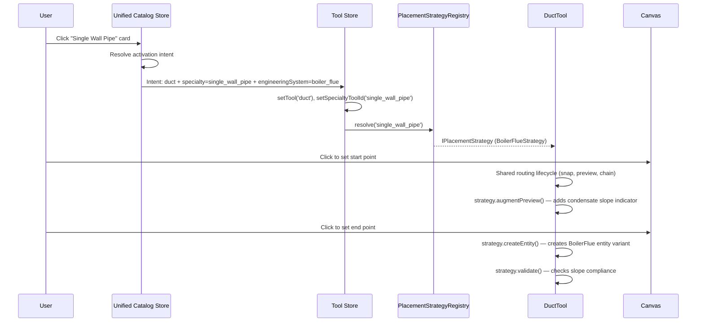
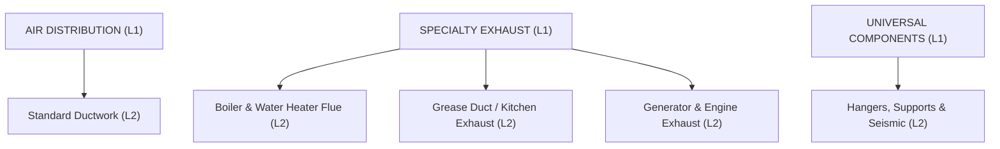
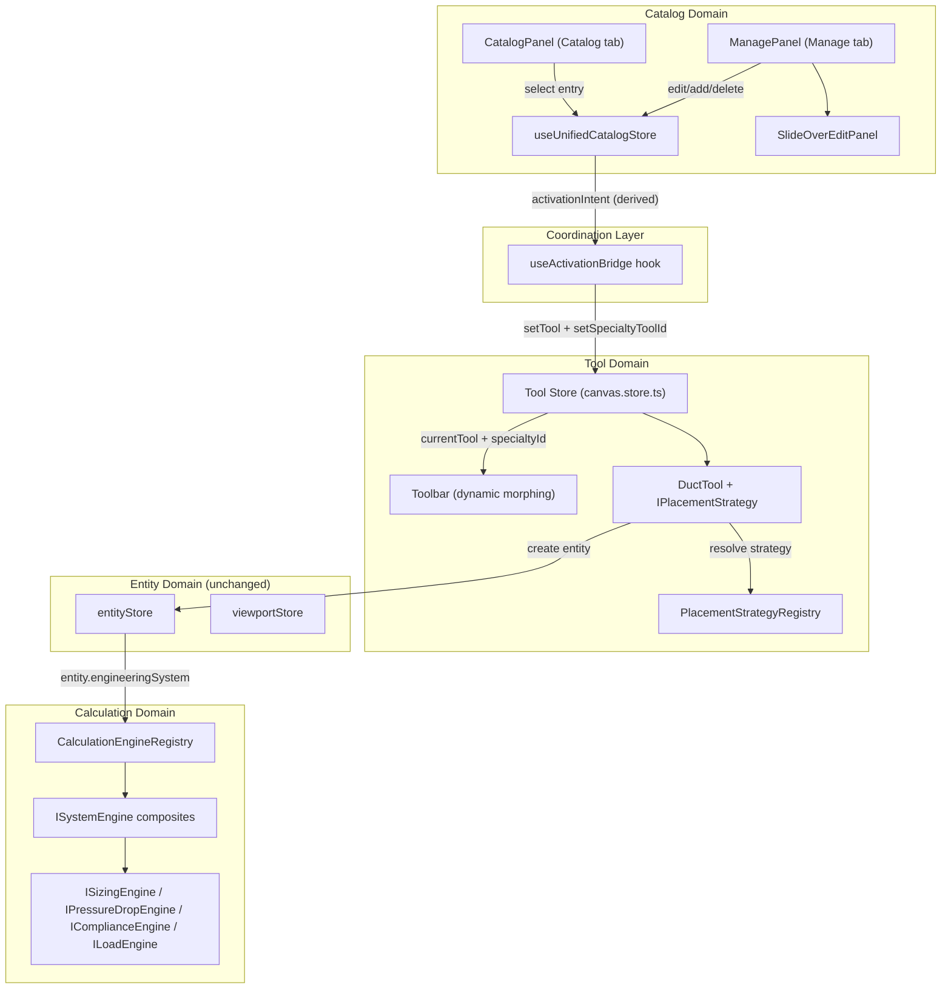
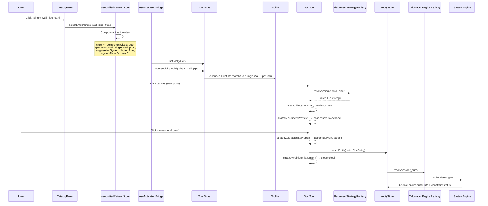

# Tech Plan — HVAC Component Library Infrastructure

## Architectural Approach

### Decision 1 — Four-Concept Identity Model

Every catalog entry carries four orthogonal identity fields:


| Field               | Purpose                                  | Example Values                                                        | Consumers                                                                                         |
| ------------------- | ---------------------------------------- | --------------------------------------------------------------------- | ------------------------------------------------------------------------------------------------- |
| `componentClass`    | Broad canvas behavior family             | `duct`, `fitting`, `equipment`, `accessory`                           | Tool activation, property editor switching, snap rules, placement UX                              |
| `categoryId`        | Library browsing location (L2 reference) | `standard_ductwork`, `boiler_flue`, `grease_duct`, `hangers_supports` | Catalog tree filter, card grid population, Manage tab grouping                                    |
| `typeId`            | Fine-grained engineering identity        | `straight`, `elbow`, `tee`, `trap`, `fan`, `adapter`, `clevis_hanger` | BOM identity, property forms, export rules, validation logic, calculation applicability           |
| `engineeringSystem` | Governing engineering system             | `standard_duct`, `boiler_flue`, `grease_duct`, `generator_exhaust`    | Engine dispatch, schema variant selection, validation rule binding, placement strategy resolution |


The existing `systemType` field (`supply` / `return` / `exhaust` / `outside_air`) is **preserved unchanged** for service context — the airflow role selected via the service dropdown.

**Rationale:** These four fields answer four different questions about a component. `componentClass` answers "how does the canvas interact with it?" `categoryId` answers "where does the user find it?" `typeId` answers "what exactly is it?" `engineeringSystem` answers "which rules govern it?" Collapsing any two creates ambiguity that compounds as the catalog grows.

**Migration path:** The existing `category: z.enum([...])` on `UnifiedComponentDefinition` is renamed to `componentClass`. A new `categoryId: z.string()` is added. The existing `type: z.string()` is renamed to `typeId`. A new `engineeringSystem: z.string()` is added. Existing persisted data receives defaults: `categoryId = 'standard_ductwork'`, `engineeringSystem = 'standard_duct'`.

---

### Decision 2 — Two-Tier Tool System with Strategy Injection

The canvas tool system remains a **stable base layer** of 7 tool types (`select`, `pan`, `duct`, `fitting`, `equipment`, `room`, `note`). Specialty routing behavior is delivered through an `activeSpecialtyToolId` overlay that resolves to a **placement strategy** injected into `DuctTool`.

**Base layer** — `CanvasTool` union type stays fixed. The `TOOLS` array in file:hvac-design-app/src/features/canvas/components/Toolbar.tsx stays at 7 entries. This protects every `switch`/`if` that matches on tool type throughout the codebase.

**Specialty overlay** — The tool store gains `activeSpecialtyToolId: string | null`. When non-null, the toolbar's "Duct" button dynamically morphs its icon and label to reflect the active specialty. Setting `activeSpecialtyToolId = null` reverts to standard behavior.

**Strategy injection** — A `PlacementStrategyRegistry` maps `specialtyToolId → IPlacementStrategy`. `DuctTool` receives the resolved strategy and delegates system-specific behavior to it: preview augmentation, snap interpretation, entity hydration, post-placement validation, connection constraints. The shared click-click routing lifecycle, snapping infrastructure, and chaining logic stay inside `DuctTool`.

**Rationale:** The catalog can grow (new specialty systems, new routing types) without expanding the canvas core. The `DuctTool` class already contains the shared routing interaction grammar (460+ lines). Subclassing would duplicate it; metadata-driven config would obscure it. Strategy injection preserves the shared lifecycle while making the variation explicit and testable.



---

### Decision 3 — Unified Catalog Store (Coordinates) + Tool Store (Executes)

A new `useUnifiedCatalogStore` replaces `useComponentLibraryStoreV2` and absorbs the service/system profile responsibilities from `useServiceStore`. It becomes the **single source of truth** for catalog entries, category hierarchy, engineering system profiles, browse state, and activation intent.

The existing `canvas.store.ts` (tool store) **remains separate** and continues to own canvas interaction mode, toolbar state, keyboard shortcuts, and placement lifecycle state.

**Activation flow:**

1. User clicks a catalog card → unified store resolves the selected entry
2. Unified store determines placeability, resolves `componentClass`, `activeSpecialtyToolId`, `engineeringSystem`, `systemType`, and default placement context
3. Unified store exposes activation intent as derived state
4. The UI layer (or a thin coordination hook) reads the intent and calls `toolStore.setTool()` + `toolStore.setSpecialtyToolId()`
5. Tool store activates the correct canvas mode
6. `DuctTool` resolves placement strategy from registry

**Rationale:** The unified catalog store owns "what should happen" — it is the domain authority for catalog semantics, engineering system resolution, and service context. The tool store owns "how the canvas enters that mode" — it is the interaction execution authority. These are adjacent but distinct concerns. Collapsing them creates a super-store that mixes domain knowledge with interaction lifecycle state, making both harder to reason about.

**Migration:** `componentLibraryStoreV2` state is absorbed into the new store. `serviceStore` is deprecated; its baseline templates become catalog entries tagged with `engineeringSystem = 'standard_duct'`. The `adaptComponentToService()` interop becomes a lightweight selector on the unified store rather than a cross-store bridge.

---

### Decision 4 — Composite Calculation Engines

Calculation logic is organized as **per-system composite engines** that delegate to **per-calculation-type sub-engines**.

**Top level** — A `CalculationEngineRegistry` maps `engineeringSystem → ISystemEngine`. Each system has one composite engine: `StandardDuctEngine`, `BoilerFlueEngine`, `GreaseDuctEngine`, `GeneratorExhaustEngine`, `HangerEngine`.

**Internal** — Each composite delegates to modular sub-engines implementing specific calculation interfaces: `ISizingEngine`, `IPressureDropEngine`, `IComplianceEngine`, `ILoadEngine`. Not every system implements every interface.

**Rationale:** Components are calculation-aware but not calculation-owning. A component knows its `engineeringSystem` and carries the data needed for calculation. The engine performs the calculation at run/system level once components are connected. This matches the product direction: isolated components are not fully meaningful until connected into valid contexts.

---

### Decision 5 — Discriminated Union Entity Schemas

Placed canvas entities use **discriminated union schemas** keyed by `engineeringSystem`. This means `DuctPropsSchema` becomes a union of system-specific variants (`StandardDuctProps | BoilerFlueProps | GreaseDuctProps | GeneratorExhaustProps`), each with only the fields relevant to that system.

**Rationale:** Engineering-heavy systems need data structures that are trustworthy. Optional-field sprawl creates ambiguity — entities that are "technically valid but semantically muddy." Metadata bags lose type safety on the exact fields that need to be strongest (engineering data, calculation inputs, validation parameters). Discriminated unions let each variant have correct required fields, safer calculations, cleaner property forms, and clearer engine dispatch.

---

### Decision 6 — Placeable-Only Catalog

The Catalog card grid shows **only entries where `placeable === true**`. Non-placeable definitions (system profiles, future templates, assembly rules) remain in the unified store and may appear in the Manage tab or internal configuration flows, but never in the placement grid.

Placeability is a **UI/interaction concern**, not an identity field. It does not replace or overload `componentClass`, `categoryId`, `typeId`, or `engineeringSystem`. Adding it as an explicit boolean keeps the four-concept identity model orthogonal while giving the Catalog a simple, enforceable filtering rule.

---

### Decision 7 — Service-Override Conflict Warning

When `activeSystemType` does not match the active entry’s `SystemProfile.defaultSystemType`, the app surfaces a **warning** in the active indicator bar and the Validation tab. The warning explains that engineering behavior (validation, calculations, placement strategy) still follows the `engineeringSystem`, while the service override affects tagging, color, and BOM grouping only.

Mismatches are **allowed but warned**, never silently accepted or blocked. This supports power-user override workflows while preventing ambiguity about which rules govern the placed entity.

---

### Decision 8 — Controlled Archetype Selection via SystemProfile

Users select `typeId` from a **controlled archetype/subtype list** embedded in the active `SystemProfile`, not from free text. Each `SystemProfile` declares `supportedArchetypes` keyed by `componentClass`, so valid archetype choices are resolved from the same governing context that owns fitting rules, constraints, and calculation capabilities.

This keeps `typeId` schema-flexible (`z.string()`) while making the user-facing selection controlled and context-sensitive. The Manage form populates the subtype selector after the user selects `componentClass` and `engineeringSystem`.

---

### Decision 9 — Clone vs Customize Semantics

The unified store exposes two distinct copy actions:

- `**cloneEntry(entryId)**` — Creates a custom copy immediately. Returns the new entry ID. No UI side-effect (no editor opens, no tab switch). The Catalog’s “⋮” menu’s “Clone” action calls this.
- `**customizeEntry(entryId)**` — Creates a custom copy and sets a `pendingEditEntryId` flag in the store. The Manage tab reads this flag and auto-opens the slide-over panel for the new entry. The Catalog’s “⋮” menu’s “Customize” action and the Manage slide-over’s “Customize” button both call this.

Both actions create the same kind of custom entry. The difference is UX intent: Clone is a fast duplicate; Customize is duplicate-and-edit.

---

### Decision 10 — Constraints & Boundaries


| Constraint                       | Impact                                                                                                  |
| -------------------------------- | ------------------------------------------------------------------------------------------------------- |
| **Sidebar width (300–500px)**    | Catalog UI must fit within existing sidebar constraints; no layout paradigm changes                     |
| **Zustand + Immer**              | All stores use the existing state management pattern — no new libraries                                 |
| **Zod schemas**                  | All data models use existing Zod validation pattern — discriminated unions via `z.discriminatedUnion()` |
| **Tauri persistence**            | Persisted store data must be backward-compatible; migration logic runs on hydration                     |
| **Lucide icons**                 | Component thumbnails use existing Lucide icon library — no custom SVG asset pipeline                    |
| **Infrastructure-first phasing** | Phase 1 builds hierarchy + UI shell + interfaces; actual specialty implementations come later           |


---

## Data Model

### Core Schema — Catalog Entry

The `CatalogEntry` schema replaces `UnifiedComponentDefinition`. It is the central definition for every item in the component library.

```typescript
CatalogEntrySchema = z.object({
  id: z.string(),
  name: z.string(),
  componentClass: z.enum(['duct', 'fitting', 'equipment', 'accessory']),
  categoryId: z.string(),             // References CategoryNode.id (L2 level)
  typeId: z.string(),                  // Selected from SystemProfile.supportedArchetypes, not free text
  engineeringSystem: EngineeringSystemSchema,  // Controlled enum
  placeable: z.boolean(),              // true = appears in Catalog grid; false = internal/config only
  systemType: z.enum(['supply', 'return', 'exhaust', 'outside_air']).optional(),
  source: z.enum(['system', 'custom']),  // Distinguishes built-in vs user-created entries
  // ... metadata, materials, pricing, engineering properties (carried forward from existing schema)
})
```

**Key field contracts:**


| Field               | Schema Type         | Extensibility                           | Why                                                                                                                      |
| ------------------- | ------------------- | --------------------------------------- | ------------------------------------------------------------------------------------------------------------------------ |
| `engineeringSystem` | Controlled Zod enum | Code changes only                       | Drives engine dispatch, schema variant selection, strategy resolution — must resolve to real runtime infrastructure      |
| `typeId`            | `z.string()`        | Controlled via SystemProfile archetypes | Selected from `supportedArchetypes[componentClass]` in the active SystemProfile — not free text in the standard workflow |
| `componentClass`    | Controlled Zod enum | Code changes only                       | Drives tool activation and canvas behavior family — finite set of interaction paradigms                                  |
| `categoryId`        | `z.string()`        | User-extensible via Manage tab          | References the browsing hierarchy — new categories can be added without code changes                                     |
| `placeable`         | `z.boolean()`       | Set per entry                           | UI/interaction concern — controls Catalog grid visibility without overloading identity fields                            |
| `source`            | Controlled Zod enum | Derived from creation path              | Protects system entries from edit/delete; custom entries are fully editable                                              |


---

### Engineering System Enum

```typescript
EngineeringSystemSchema = z.enum([
  'standard_duct',
  'boiler_flue',
  'grease_duct',
  'generator_exhaust',
  'universal',           // For hangers, supports, seismic
])
```

This enum is the **architectural registry key**. Every value must have a corresponding `ISystemEngine` in the `CalculationEngineRegistry`, a `SystemProfile` in the unified store, and (for routing systems) an `IPlacementStrategy` in the `PlacementStrategyRegistry`. Adding a new engineering system is a code-level event, not a user-level event.

---

### Category Hierarchy

The existing `ComponentCategorySchema` is retained but populated with the agreed L1/L2 hierarchy:



L1 nodes are expand/collapse only (not selectable for filtering). L2 nodes are the active filtering unit. Each `CatalogEntry.categoryId` references an L2 node ID. The `CategoryNode` schema keeps the existing shape: `id`, `name`, `parentId`, `icon`, `subcategories`.

---

### Engineering System Profile

A new schema for the governing rule/profile objects that live as a **separate collection** in the unified store:

```typescript
SystemProfileSchema = z.object({
  id: z.string(),                      // Matches EngineeringSystem enum value
  name: z.string(),
  engineeringSystem: EngineeringSystemSchema,
  // Service pairing
  defaultSystemType: z.enum(['supply', 'return', 'exhaust', 'outside_air']),  // Expected pairing for conflict detection
  // Governing rules
  fittingRules: z.array(FittingRuleSchema),
  dimensionalConstraints: DimensionalConstraintsSchema,
  materialRequirements: z.array(MaterialRequirementSchema).optional(),
  industrialConstraints: IndustrialConstraintsSchema.optional(),
  // Engineering limits
  velocityLimits: z.object({ min: z.number(), max: z.number() }),
  complianceRefs: z.array(z.string()).optional(),   // e.g., ['NFPA 96', 'IMC 506']
  // Controlled archetype lists
  supportedArchetypes: z.record(
    z.enum(['duct', 'fitting', 'equipment', 'accessory']),
    z.array(z.object({ id: z.string(), label: z.string() }))
  ),  // e.g., { fitting: [{ id: 'elbow', label: 'Elbow' }, { id: 'tee', label: 'Tee' }] }
  // Engine binding
  calculationCapabilities: z.array(z.string()),     // e.g., ['sizing', 'pressure_drop', 'compliance']
  // Metadata
  source: z.enum(['baseline', 'custom']),
  color: z.string().optional(),                      // System color for canvas rendering
})
```

**New fields:**

- `defaultSystemType` — The expected service context for this engineering system (e.g., `'exhaust'` for boiler_flue). Used by the `serviceConflictWarning` selector to detect mismatches when the user overrides the service dropdown.
- `supportedArchetypes` — Maps each `componentClass` to its valid archetype/subtype options under this engineering system. The Manage form populates the subtype selector from `activeSystemProfile.supportedArchetypes[selectedComponentClass]`. The chosen archetype’s `id` becomes the entry’s `typeId`.

Baseline profiles ship with the app (one per `EngineeringSystem` value). Custom profiles can extend or override baselines. Components reference profiles via `engineeringSystem` — the enum value is the join key.

---

### Entity Schema — Two-Level Discrimination

Placed canvas entities use two-level discrimination:

**Level 1 — Entity kind** (unchanged): `entity.type === 'duct' | 'fitting' | 'equipment'`

**Level 2 — Engineering system** (new): `entity.props.engineeringSystem === 'standard_duct' | 'boiler_flue' | ...`

The `DuctPropsSchema` becomes a `z.discriminatedUnion('engineeringSystem', [...])` containing system-specific variants:


| Variant                 | Discriminator Value | System-Specific Fields                                                                          |
| ----------------------- | ------------------- | ----------------------------------------------------------------------------------------------- |
| `StandardDuctProps`     | `standard_duct`     | Current fields: shape, diameter, width, height, airflow, staticPressure                         |
| `BoilerFlueProps`       | `boiler_flue`       | wallType (single/double), condensateSlope, btuRating, flueGasDewpoint, venting (natural/forced) |
| `GreaseDuctProps`       | `grease_duct`       | constructionType (factory_built/welded/zero_clearance), fireRating, liquidTight, weldSpec       |
| `GeneratorExhaustProps` | `generator_exhaust` | connectionType (flanged/slip_fit), backpressureLimit, exhaustTempF, engineModel                 |


All variants share common base fields: `name`, `length`, `material`, `connectedFrom`, `connectedTo`, `serviceId`, `catalogItemId`, `engineeringData`, `constraintStatus`. The variant adds only system-specific fields.

The same pattern applies to `FittingPropsSchema` and `EquipmentPropsSchema` where engineering system distinctions matter.

---

### Unified Store Shape

The `useUnifiedCatalogStore` owns:


| Collection           | Type                            | Purpose                                                    |
| -------------------- | ------------------------------- | ---------------------------------------------------------- |
| `catalogEntries`     | `CatalogEntry[]`                | All component definitions (placeable and non-placeable)    |
| `categories`         | `CategoryNode[]`                | L1/L2 hierarchy for browsing                               |
| `systemProfiles`     | `Record<string, SystemProfile>` | Engineering system governing profiles (baseline + custom)  |
| `templates`          | `ComponentTemplate[]`           | Reusable preset configurations                             |
| `activeEntryId`      | `string                         | null`                                                      |
| `activeSystemType`   | `SystemType`                    | Active service context (Supply/Return/Exhaust/Outside Air) |
| `selectedCategoryId` | `string                         | null`                                                      |
| `searchQuery`        | `string`                        | Active search text                                         |
| `filterTags`         | `string[]`                      | Active tag filters                                         |


Derived state (selectors, not stored):

- `activationIntent` — resolved from `activeEntryId`: includes `componentClass`, `specialtyToolId`, `engineeringSystem`, `systemType`, default placement context
- `filteredEntries` — computed from `entry.placeable === true` + `selectedCategoryId` + `searchQuery` + `filterTags`
- `activeSystemProfile` — resolved from the active entry’s `engineeringSystem`
- `serviceConflictWarning` — compares `activeSystemType` against `activeSystemProfile.defaultSystemType`; returns warning text when they differ, `null` when they match
- `availableArchetypes` — resolved from `activeSystemProfile.supportedArchetypes[activeEntry.componentClass]`; used by the Manage form’s subtype selector

---

### Migration Strategy


| Existing Schema/Store                        | Migration                                                                                          |
| -------------------------------------------- | -------------------------------------------------------------------------------------------------- |
| `UnifiedComponentDefinition.category` (enum) | Renamed to `componentClass`                                                                        |
| `UnifiedComponentDefinition.type` (string)   | Renamed to `typeId`                                                                                |
| New field `categoryId`                       | Defaults to `'standard_ductwork'` for existing entries                                             |
| New field `engineeringSystem`                | Defaults to `'standard_duct'` for existing entries                                                 |
| New field `placeable`                        | Defaults to `true` for all existing entries                                                        |
| New field `source`                           | Defaults to `'system'` for built-in entries; user-created entries get `'custom'`                   |
| `componentLibraryStoreV2`                    | State absorbed into `useUnifiedCatalogStore`; persistence key migrated                             |
| `serviceStore`                               | Baseline templates converted to `CatalogEntry` + `SystemProfile`; store deprecated                 |
| `DuctPropsSchema`                            | Existing fields wrapped as `StandardDuctProps` variant; `engineeringSystem: 'standard_duct'` added |
| `FittingPropsSchema`                         | Existing fields become the `standard_duct` variant                                                 |
| Persisted project files                      | Hydration migration adds defaults for new fields; reads old format, writes new format              |


---

## Component Architecture

### Overview — Component Boundaries

The architecture introduces five new component boundaries and refactors three existing ones. Each boundary owns a specific concern and communicates with neighbors through well-defined interfaces.



---

### 1. Unified Catalog Store (`useUnifiedCatalogStore`)

**Replaces:** `useComponentLibraryStoreV2` + `useServiceStore`

**Owns:**

- `catalogEntries`, `categories`, `systemProfiles`, `templates` (persistent collections)
- `activeEntryId`, `activeSystemType`, `selectedCategoryId`, `searchQuery`, `filterTags` (ephemeral UI state)
- Derived selectors: `activationIntent`, `filteredEntries`, `activeSystemProfile`, `serviceConflictWarning`, `availableArchetypes`

**Does not own:**

- Canvas interaction mode (`currentTool`) — that stays in the tool store
- Placed entities — that stays in `entityStore`
- Viewport state — that stays in `viewportStore`

**Key actions:**

- `selectEntry(entryId)` — sets `activeEntryId`, computes `activationIntent`
- `setSystemType(systemType)` — sets service context; auto-sets when specialty entry is selected but remains editable
- `addEntry() / updateEntry() / deleteEntry()` — CRUD for catalog entries
- `cloneEntry(entryId)` — creates a custom copy immediately (no UI side-effect); returns new entry ID
- `customizeEntry(entryId)` — creates a custom copy and sets `pendingEditEntryId` so the Manage tab auto-opens the slide-over
- `addSystemProfile() / updateSystemProfile()` — manage engineering system profiles

**Persistence:** Uses Zustand `persist` middleware with migration logic. Reads old `sws.componentLibrary.v2` key and migrates to new schema on hydration.

---

### 2. Activation Bridge (`useActivationBridge`)

**New React hook** — mounted at `CanvasPage` level.

**Responsibility:** Subscribes to the unified catalog store's `activationIntent` selector. When the intent changes, it imperatively calls the tool store:

- `toolStore.setTool(intent.componentClass)` — maps `componentClass` to the base `CanvasTool` type
- `toolStore.setSpecialtyToolId(intent.specialtyToolId)` — sets overlay ID or `null` for standard

**Why a hook, not a store subscription:**

- Stores remain fully decoupled — no import dependency from catalog store to tool store
- The bridge is visible in the React component tree — debuggable, testable, removable
- Follows existing codebase patterns (hooks for cross-store coordination, e.g., `useCalculations`)
- The coordination is inherently UI-lifecycle-bound — it should only run when the canvas page is mounted

**Interface with tool store:** The tool store gains two new fields:

- `activeSpecialtyToolId: string | null` — the specialty overlay
- `setSpecialtyToolId(id: string | null)` — action to set the overlay

All existing tool store consumers (`Toolbar.tsx`, keyboard shortcuts, cursor store sync) continue to read `currentTool` and are unaffected.

---

### 3. Catalog Panel (`CatalogPanel`)

**Replaces:** `ProductCatalogPanel` + `AccordionLibrary` + `ServicesPanel`

**Structure:** Three vertical zones within the sidebar’s “Catalog” tab:

1. **Category Tree** — reads `categories` from unified store; clicking an L2 calls `setSelectedCategory()`
2. **Card Grid** — reads `filteredEntries` selector (which includes `entry.placeable === true`); renders only placeable component cards with Lucide icons, type badges, spec previews, and “⋮” overflow menus
3. **Active Indicator Bar** — reads `activeEntryId`, `activeSystemType`, and `serviceConflictWarning`; contains the service context dropdown and conditionally renders a warning badge when service context conflicts with the active entry’s engineering system

**“⋮” Menu actions:**

- **Clone** — calls `cloneEntry()` (custom copy created, no editor opens, stays in Catalog)
- **Customize** — calls `customizeEntry()` (custom copy created, switches to Manage tab, slide-over auto-opens)
- **Edit in Manage** — switches to Manage tab with existing entry pre-selected
- **Delete** — only visible for `source === 'custom'` entries; inline confirmation

---

### 4. Manage Panel (`ManagePanel`) + Slide-Over Edit Panel

**Replaces:** `LibraryManagementView`

**Structure:** Two zones within the sidebar's "Manage" tab:

1. **Category Tree Browser** — compact tree with "⋮" menus for L2 reordering
2. **Component List** — scrollable list filtered by selected L2 category

**Slide-Over Panel** — opens from the sidebar's right edge (~320px), overlaying part of the canvas with a scrim. Contains the full component edit form. System components show read-only + "Customize." Custom components show editable form + Delete.

**Interaction with unified store:** All CRUD operations (`addEntry`, `updateEntry`, `deleteEntry`, `cloneEntry`, `customizeEntry`) go through the unified store.

---

### 5. Dynamic Toolbar Morphing

**Modifies:** `Toolbar.tsx` / `ToolButtons` component

**Behavior:** The `TOOLS` array stays at 7 entries. The "Duct" entry gains **conditional rendering** that reads `toolStore.activeSpecialtyToolId`:

- When `null` — renders standard Duct icon and label
- When non-null — resolves the specialty tool's metadata (icon, label, tooltip) from `PlacementStrategyRegistry` and renders the morphed button

Clicking the morphed button reactivates the specialty tool (same as clicking it again in the catalog). Pressing Escape or selecting a standard component resets `activeSpecialtyToolId` to `null`.

**No changes** to Select, Pan, Fitting, Equipment, Room, or Note buttons.

---

### 6. Placement Strategy System

**New interface — `IPlacementStrategy`:**

```typescript
interface IPlacementStrategy {
  // Required — every strategy must implement
  readonly id: string;
  createEntityProps(start, end, context): EntityProps;  // Hydrates system-specific props variant
  getToolbarMetadata(): { icon: string; label: string; tooltip: string };

  // Optional variation hooks — default no-op if not provided
  augmentPreview?(ctx: ToolRenderContext, state: DuctToolState): void;
  validatePlacement?(entity: Entity): ValidationResult;
  resolveSnapBehavior?(candidates: SnapTarget[]): SnapTarget | null;
  getGhostFittingType?(angle: number): string;  // e.g., 'boot_tee' instead of 'elbow_90'
  getSystemBannerInfo?(): { label: string; color: string };
}
```

**Required methods** — `createEntityProps` and `getToolbarMetadata` — define the minimum contract. Every specialty system must declare how it creates placed entities and how the toolbar represents it.

**Optional hooks** — allow system-specific behavior without requiring every strategy to address every variation point. `DuctTool` calls each hook at the appropriate lifecycle point with a no-op fallback.

`**PlacementStrategyRegistry`:**

- Static `Map<string, IPlacementStrategy>`
- Populated at app initialization
- Queried by `DuctTool` when `activeSpecialtyToolId` is non-null
- Returns `DefaultDuctStrategy` (standard duct behavior) when no specialty is active

`**DuctTool` modifications:**

- Reads `activeSpecialtyToolId` from tool store on activation
- Resolves `IPlacementStrategy` from registry
- Delegates to strategy at each variation point in existing lifecycle
- Shared lifecycle (click-click, snap detection, chaining, grid snap) remains unchanged

---

### 7. Calculation Engine System

**New interfaces — four core sub-engine contracts:**

```typescript
interface ISizingEngine {
  calculateSize(params: SizingInput): SizingResult;
}

interface IPressureDropEngine {
  calculatePressureDrop(params: PressureDropInput): PressureDropResult;
  calculateFrictionLoss(params: FrictionInput): FrictionResult;
}

interface IComplianceEngine {
  validate(entity: Entity, profile: SystemProfile): ComplianceResult;
}

interface ILoadEngine {
  calculateLoad(params: LoadInput): LoadResult;
  calculateSpacing(params: SpacingInput): SpacingResult;
}
```

**Composite engine interface:**

```typescript
interface ISystemEngine {
  readonly engineeringSystem: EngineeringSystem;
  readonly capabilities: string[];  // ['sizing', 'pressure_drop', 'compliance', 'load']
  getSizingEngine?(): ISizingEngine;
  getPressureDropEngine?(): IPressureDropEngine;
  getComplianceEngine?(): IComplianceEngine;
  getLoadEngine?(): ILoadEngine;
}
```

`**CalculationEngineRegistry`:**

- Static `Map<EngineeringSystem, ISystemEngine>`
- Populated at app initialization
- Infrastructure phase: register `StandardDuctEngine` by refactoring existing `ductSizing.ts` + `pressureDrop.ts` into the `ISizingEngine` + `IPressureDropEngine` interfaces
- Later phases: register `BoilerFlueEngine`, `GreaseDuctEngine`, `GeneratorExhaustEngine`, `HangerEngine`

**Integration with entities:** When an entity is placed or modified, the calculation pipeline:

1. Reads `entity.props.engineeringSystem`
2. Resolves `ISystemEngine` from registry
3. Invokes applicable sub-engines based on `capabilities`
4. Writes results to `entity.props.engineeringData` and `entity.props.constraintStatus`

---

### 8. Left Sidebar Refactor

**Modifies:** `LeftSidebar.tsx`

**Tab change:** "Library" / "Services" tabs → "Catalog" / "Manage" tabs. The `LeftTabId` type changes from `'library' | 'services'` to `'catalog' | 'manage'`. The `normalizeLeftTab()` function handles backward compatibility.

**Content mapping:**

- `activeLeftTab === 'catalog'` → renders `CatalogPanel`
- `activeLeftTab === 'manage'` → renders `ManagePanel`

**Slide-over panel** is rendered as a sibling to the sidebar, positioned absolutely from the sidebar's right edge. The scrim overlays the canvas area.

---

### Integration Summary



&nbsp;