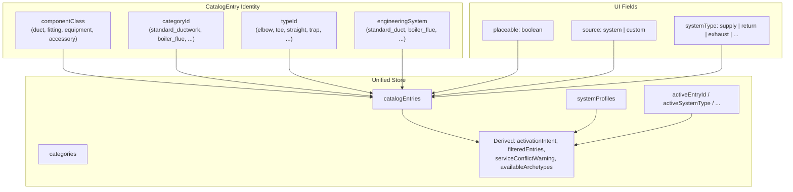

# T1: Schema Foundation + Unified Catalog Store

## Summary

Build the data model foundation and unified state management layer for the entire HVAC Component Library. This is the foundational ticket — every other ticket depends on it.

## Spec References

- `spec:53796a94-d8d9-413d-971d-997461b5bb4f/50508448-82bd-4cd3-9406-fdb8de4b2e1e` — Decisions 1, 3, 5, 6, 7, 8, 9; Data Model (all sections); Component Architecture §1
- `spec:53796a94-d8d9-413d-971d-997461b5bb4f/228992df-e5c9-4c89-99cf-9b945d3f4ca9` — Identity model, phase framing

## Dependencies

None — this is the foundation.

## Scope

### Schemas

- **`CatalogEntrySchema`** — Four identity fields (`componentClass`, `categoryId`, `typeId`, `engineeringSystem`), plus `placeable: z.boolean()`, `source: z.enum(['system', 'custom'])`, `systemType` (optional), and carried-forward metadata/materials/pricing/engineering fields from the existing `UnifiedComponentDefinition`.
- **`EngineeringSystemSchema`** — Controlled Zod enum: `'standard_duct' | 'boiler_flue' | 'grease_duct' | 'generator_exhaust' | 'universal'`.
- **`SystemProfileSchema`** — Governing rule/profile objects with `defaultSystemType`, `supportedArchetypes` (keyed by `componentClass`), fitting rules, dimensional constraints, velocity limits, compliance refs, calculation capabilities, source (`baseline` | `custom`), color.
- **`CategoryNode`** seed data — L1/L2 hierarchy: Air Distribution → Standard Ductwork; Specialty Exhaust → Boiler Flue, Grease Duct, Generator Exhaust; Universal Components → Hangers, Supports & Seismic.

### Entity Schema Two-Level Discrimination

- **Level 1**: existing `entity.type` discriminator (`duct` | `fitting` | `equipment`) — unchanged.
- **Level 2**: `entity.props.engineeringSystem` discriminator — new.
- `DuctPropsSchema` becomes `z.discriminatedUnion('engineeringSystem', [StandardDuctProps, ...])`. Infrastructure phase creates `StandardDuctProps` variant wrapping current fields; placeholder variants for specialty systems.
- Same pattern for `FittingPropsSchema` and `EquipmentPropsSchema` where applicable.

### Unified Catalog Store (`useUnifiedCatalogStore`)

- **Collections**: `catalogEntries`, `categories`, `systemProfiles`, `templates`, plus ephemeral UI state (`activeEntryId`, `activeSystemType`, `selectedCategoryId`, `searchQuery`, `filterTags`).
- **Actions**: `selectEntry()`, `setSystemType()`, `addEntry()`, `updateEntry()`, `deleteEntry()`, `cloneEntry()` (copy, no UI side-effect), `customizeEntry()` (copy + set `pendingEditEntryId`), `addSystemProfile()`, `updateSystemProfile()`.
- **Derived selectors**: `activationIntent`, `filteredEntries` (includes `entry.placeable === true`), `activeSystemProfile`, `serviceConflictWarning` (compares `activeSystemType` vs `activeSystemProfile.defaultSystemType`), `availableArchetypes`.

### Migration

- Rename `category` → `componentClass`, `type` → `typeId` on existing `UnifiedComponentDefinition`.
- Add `categoryId` (default `'standard_ductwork'`), `engineeringSystem` (default `'standard_duct'`), `placeable` (default `true`), `source` (default `'system'`).
- Absorb `componentLibraryStoreV2` state into new store with persistence key migration.
- Deprecate `serviceStore`; convert baseline templates to `CatalogEntry` + `SystemProfile`.
- Hydration migration: reads old format, writes new format.

## Out of Scope

- UI components (CatalogPanel, ManagePanel, Toolbar) — those are T2, T3, T4.
- Placement strategy interface and registry — that is T4.
- Calculation engine interfaces — that is T5.
- Specialty entity variants beyond placeholder schemas — those are T7-T9.

## Acceptance Criteria

1. `CatalogEntrySchema` validates with all four identity fields, `placeable`, `source`, and `systemType`.
2. `EngineeringSystemSchema` is a controlled Zod enum with 5 values.
3. `SystemProfileSchema` validates with `defaultSystemType` and `supportedArchetypes`.
4. Category hierarchy seed data creates the correct 3 L1 → 5 L2 tree.
5. `DuctPropsSchema` is a `z.discriminatedUnion('engineeringSystem', [...])` with `StandardDuctProps` as the first variant.
6. `useUnifiedCatalogStore` exposes all listed collections, actions, and derived selectors.
7. `filteredEntries` returns only entries where `placeable === true` matching the active category/search/filter.
8. `serviceConflictWarning` returns warning text when `activeSystemType` differs from `activeSystemProfile.defaultSystemType`, `null` otherwise.
9. `cloneEntry()` creates a copy with `source: 'custom'` and no `pendingEditEntryId`.
10. `customizeEntry()` creates a copy with `source: 'custom'` and sets `pendingEditEntryId`.
11. Persisted data from old `componentLibraryStoreV2` format migrates correctly on hydration.
12. `serviceStore` is deprecated; its baseline templates are represented as catalog entries + system profiles.