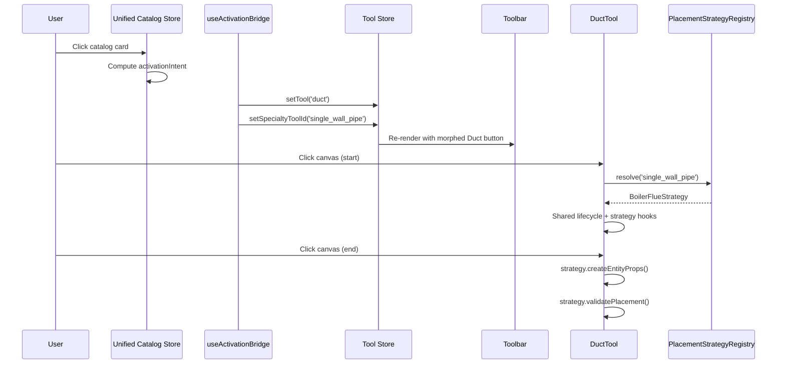

# T4: Tool System — Activation Bridge, Toolbar Morphing & Placement Strategy

## Summary

Build the coordination layer between the unified catalog store and the canvas tool system — the activation bridge hook, the dynamic toolbar morphing, and the placement strategy injection infrastructure.

## Spec References

- `spec:53796a94-d8d9-413d-971d-997461b5bb4f/50508448-82bd-4cd3-9406-fdb8de4b2e1e` — Decision 2 (Two-tier tool system), Component Architecture §2 (Activation Bridge), §5 (Toolbar Morphing), §6 (Placement Strategy System)
- `spec:53796a94-d8d9-413d-971d-997461b5bb4f/d948bff0-d701-4808-86e5-a2cac5bce758` — Flow 1 step 5 (tool auto-switch), Flow 2 steps 1-2 (specialty tool activation + toolbar morphing)

## Dependencies

- **T1** — Reads `activationIntent` from `useUnifiedCatalogStore`.

## Scope

### Tool Store Extension

- Add `activeSpecialtyToolId: string | null` to `canvas.store.ts`.
- Add `setSpecialtyToolId(id: string | null)` action.
- All existing consumers (`Toolbar.tsx`, keyboard shortcuts, cursor sync) continue reading `currentTool` unaffected.

### Activation Bridge (`useActivationBridge`)

- React hook mounted at `CanvasPage` level.
- Subscribes to unified catalog store's `activationIntent` selector.
- When intent changes, calls `toolStore.setTool(intent.componentClass)` and `toolStore.setSpecialtyToolId(intent.specialtyToolId)`.
- Stores remain fully decoupled — no import dependency between them.

### Dynamic Toolbar Morphing

- The `TOOLS` array stays at 7 entries.
- The "Duct" button gains conditional rendering based on `activeSpecialtyToolId`:
  - `null` → standard Duct icon and label.
  - Non-null → resolves metadata (icon, label, tooltip) from `PlacementStrategyRegistry` and renders the morphed button.
- Clicking the morphed button reactivates the specialty tool.
- Escape or selecting a standard component resets `activeSpecialtyToolId` to `null`.

### Placement Strategy System

- **`IPlacementStrategy` interface**:
  - Required: `readonly id`, `createEntityProps(start, end, context): EntityProps`, `getToolbarMetadata(): { icon, label, tooltip }`.
  - Optional hooks: `augmentPreview?()`, `validatePlacement?()`, `resolveSnapBehavior?()`, `getGhostFittingType?()`, `getSystemBannerInfo?()`.
- **`PlacementStrategyRegistry`**: static `Map<string, IPlacementStrategy>`, populated at app init, queried by `DuctTool`.
- **`DefaultDuctStrategy`**: wraps current standard duct behavior as the first registered strategy. Returned when no specialty is active.
- **`DuctTool` modifications**: reads `activeSpecialtyToolId` from tool store, resolves strategy from registry, delegates to strategy at each variation point. Shared lifecycle (click-click, snap, chaining, grid snap) unchanged.

## Out of Scope

- Specialty-specific strategies (BoilerFlueStrategy, GreaseDuctStrategy, etc.) — those are T7-T9.
- Calculation engines — that is T5.
- ContinuousTrapezeRunTool — that is T10 (separate BaseTool subclass, not a DuctTool strategy).

## Acceptance Criteria

1. `activeSpecialtyToolId` is available on the tool store with getter and setter.
2. `useActivationBridge` is mounted at CanvasPage and bridges `activationIntent` → tool store.
3. Clicking a catalog card sets the correct `currentTool` and `activeSpecialtyToolId`.
4. The Duct toolbar button morphs to show specialty metadata when `activeSpecialtyToolId` is non-null.
5. Escape resets `activeSpecialtyToolId` to `null` and reverts the toolbar.
6. `IPlacementStrategy` interface has 2 required methods and 5 optional hooks.
7. `PlacementStrategyRegistry` is queryable by specialty ID and returns `DefaultDuctStrategy` as fallback.
8. `DefaultDuctStrategy` wraps existing standard duct behavior with no regressions.
9. `DuctTool` delegates to the resolved strategy at preview, entity creation, validation, snap, and ghost fitting points.
10. Shared routing lifecycle (click-click, chaining, grid snap) remains unchanged.