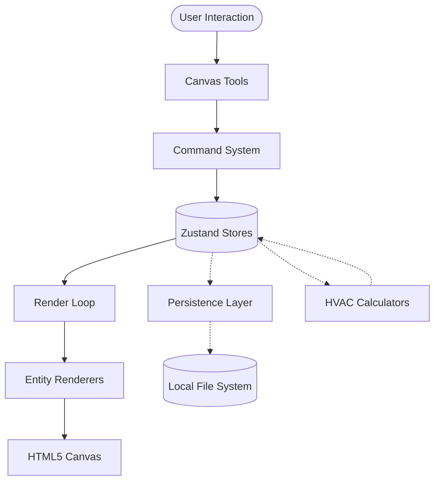

# System Architecture Diagram

This document explains how the different parts of the HVAC Canvas App interact. It serves as the "connective tissue" between the detailed files in `docs/elements/`.

## High-Level Data Flow

The app follows a unidirectional data flow pattern, using **Zustand** for state management and **Pure Canvas 2D** for rendering.

## Core Architectural Pillars

### 1. State Management (The Source of Truth)
We use a normalized state pattern in Zustand to ensure performance and data integrity.
- **[entityStore](elements/02-stores/entityStore.md)**: Main database of the app, storing all HVAC entities (Rooms, Ducts, Equipment) flat by ID.
- **[canvasStore](elements/02-stores/canvasStore.md)**: Manages UI-specific state like the active tool and selected equipment type.
- **[selectionStore](elements/02-stores/selectionStore.md)**: Tracks which entities are currently selected or hovered.
- **[viewportStore](elements/02-stores/viewportStore.md)**: Controls the pan and zoom level of the infinite canvas.

### 2. The Tool System (Write Operations)
Tools are responsible for interpreting user mouse/keyboard input and converting them into state changes.
- Every tool (Select, Room, Duct, Equipment) implements a base [Tool interface](elements/04-tools/BaseTool.md).
- Instead of mutating state directly, tools dispatch [Commands](elements/09-commands/EntityCommands.md).
- **[useKeyboardShortcuts](elements/07-hooks/useKeyboardShortcuts.md)** routes inputs to the active tool.

### 3. The Command Pattern (Undo/Redo)
To support robust undo/redo (up to 100 steps), every state mutation is wrapped in a [Command](elements/09-commands/CommandTypes.md).
- **[EntityCommands](09-commands/EntityCommands.md)** handle creation, deletion, and movement.
- The **[HistoryStore](09-commands/HistoryStore.md)** maintains the past/future stack.

### 4. Rendering Pipeline (Read Operations)
The canvas renders at 60fps (or on state change) by iterating through the entities in the `entityStore`.
- **[CanvasContainer](elements/01-components/canvas/CanvasContainer.md)**: The heart of the rendering loop. It clears the canvas, applies the [Viewport](elements/07-hooks/useViewport.md) transform, and calls renderers.
- **[Renderers](elements/05-renderers/)**: Specialized functions that take an entity state and draw it to the canvas context.
- **Selection/Hover Highlights**: Rendered as an overlay on top of the entities.

### 5. Calculation Engine (Reactive Engineering)
HVAC engineering calculations are decoupled from the UI but react to entity changes.
- **[useCalculations](elements/07-hooks/useCalculations.md)**: A hook that watches the `entityStore`. When a room's dimensions change, it triggers the [VentilationCalculator](elements/06-calculators/VentilationCalculator.md) to update the required CFM automatically.

### 6. Persistence & Serialization
The project is saved as a single `.sws` file (JSON-based).
- **[Serialization](elements/10-persistence/Serialization.md)**: Uses **Zod schemas** to validate data during both save and load, ensuring file integrity.
- **[ProjectIO](elements/10-persistence/ProjectIO.md)**: Handles the actual file system operations via Tauri, including automated backup creation.

## Entity Lifecycle
1. **Creation**: A [Tool](elements/04-tools/) uses an [Entity Factory](elements/08-entities/) to create a new object with [defaults](elements/08-entities/RoomDefaults.md).
2. **Validation**: The new object is validated against its [Zod Schema](elements/03-schemas/).
3. **Execution**: A `CreateEntityCommand` pushes it to the `entityStore`.
4. **Reaction**: The `useCalculations` hook updates derived engineering values.
5. **Display**: The corresponding `Renderer` draws it on the canvas.
