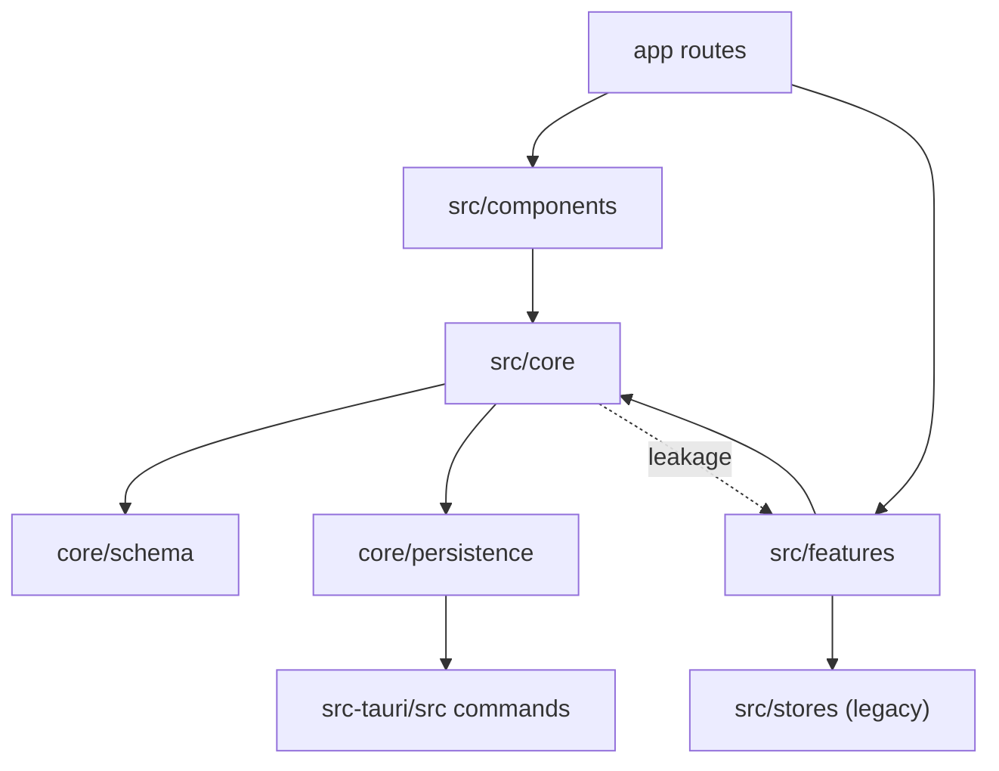

# System Architecture

Updated: 2026-03-15 (Asia/Manila)

This document maps the current architecture of `HVAC_Canvas_App`, based on source code under `hvac-design-app/` and `hvac-design-app/src-tauri/src`.

## High-Level System Overview

The application is a hybrid HVAC design system with:

- Next.js App Router frontend (`app/`) for routing and page composition.
- Feature-centric React/TypeScript runtime (`src/features/*`) with canvas-heavy domain logic.
- Shared core layer (`src/core/*`) for schemas, persistence, commands, services, and shared stores.
- Tauri Rust bridge (`src-tauri/src/*`) for native filesystem/storage-root operations.
- Zustand state split across modern `src/core/store`, feature stores, and legacy persisted stores in `src/stores`.

Current shape signals:

- Source files scanned (app + src + src-tauri/src + e2e): `642`
- `src/features` dominates the app surface (`212` files; `canvas` is `168` of those)
- Core layer remains large (`138` files)

## Module Map

| Module | Responsibility | Key Entry Points | Primary Dependencies |
|---|---|---|---|
| `hvac-design-app/app` | Route entrypoints and shell composition | `app/page.tsx`, `app/dashboard/page.tsx`, `app/(main)/canvas/[projectId]/page.tsx`, `app/(main)/canvas/page.tsx` | `src/components`, `src/features`, selective `src/core` |
| `src/features/canvas` | Main editor runtime: tools, hydration, rendering, calculations, autosave, inspectors | `CanvasPageWrapper.tsx`, `CanvasPage.tsx`, `hooks/useAutoSave.ts` | `src/core/store`, `src/core/commands`, `src/core/persistence`, `src/core/services`, `src/stores` |
| `src/features/dashboard` | Project list lifecycle (load/search/archive/duplicate/delete) and dashboard UI | `components/DashboardPage.tsx`, `store/projectListStore.ts` | `src/core/persistence`, `src/core/store`, `src/features/project` |
| `src/features/export` | Export UI and output generators (JSON/CSV/PDF/report) | `ExportMenu.tsx`, `ExportReportDialog.tsx` | `src/core/schema`, `src/core/store`, canvas state |
| `src/features/onboarding`, `src/features/project` | First-run setup and project setup workflow | `ProjectSetupWizard.tsx` (+ onboarding components under `src/components/onboarding`) | `src/core/schema`, `src/core/store`, `src/core/persistence` |
| `src/core/schema` | Canonical types and Zod schemas for entities/project file/versioning | `project-file.schema.ts`, entity schemas | Used by persistence, stores, services, features |
| `src/core/store` | Modern shared Zustand stores (project/entity/preferences/settings/storage/component library) | `project.store.ts`, `entityStore.ts`, `preferencesStore.ts` | `src/core/schema`, `src/core/services` |
| `src/core/commands` | Mutation and undo/redo command framework | `entityCommands.ts`, `historyStore.ts`, `types.ts` | `src/core/store`, plus `src/features/canvas/store/selectionStore` |
| `src/core/persistence` | Cross-platform persistence abstraction and repository policy | `StorageAdapter.ts`, `factory.ts`, `ProjectRepository.ts`, adapter impls | `src/core/schema`, `src/core/services`, Tauri/Web filesystem adapters |
| `src/core/services` | Cross-cutting logic (storage root, migration, calculation, automation, operations) | `StorageRootService.ts`, fitting/cost/operations services | `src/core/*`, occasional feature imports |
| `src/components` | Shared UI shell/dialog/onboarding layout | `layout/FileMenu.tsx`, `onboarding/AppInitializer.tsx` | `src/features/*`, `src/core/*`, `src/stores` |
| `src/stores` | Legacy persisted Zustand layer still used in runtime paths | `useProjectStore.ts`, `useAppStateStore.ts`, others | localStorage + mixed consumers |
| `src-tauri/src` | Native command handlers for storage root/filesystem discovery and validation | `lib.rs`, `commands/storage_root.rs` | Tauri plugins + Rust std/fs2 |
| `e2e` | Playwright scenario coverage | `00-*` to `03-*` suites | App routes and runtime behavior |

## Dependency Relationships

### Simplified dependency structure

```mermaid
graph TD
    app["app routes"] --> components["src/components"]
    app --> features["src/features"]
    features --> core["src/core"]
    components --> core
    features --> storesLegacy["src/stores (legacy)"]
    core --> schema["core/schema"]
    core --> persistence["core/persistence"]
    persistence --> tauri["src-tauri/src commands"]
    core -. leakage .-> features
```

### Observed import edges (non-test TS/TSX)

- `features -> core`: `214`
- `features -> components`: `91`
- `components -> core`: `38`
- `core -> core`: `39`
- `features -> storesLegacy`: `17`
- `core -> features`: `3` (layer leakage still present)

Known core-to-feature leakage:

- `src/core/commands/entityCommands.ts` imports `@/features/canvas/store/selectionStore`
- `src/core/services/fittingGeneration.ts` imports `@/features/canvas/entities/fittingDefaults`
- `src/core/services/automation/fittingInsertionService.ts` imports `@/features/canvas/entities/fittingDefaults`

## Data Flow

### 1. Startup and environment bootstrap

1. `app/page.tsx` renders `AppInitializer`.
2. `AppInitializer` detects environment (`isTauri`), hydrates app/preferences state, initializes storage root (`StorageRootService.initialize` + `validate`).
3. App routes user into wizard/tutorial/dashboard flow and may create a new project through `ProjectRepository.saveProject`.

### 2. Project listing and lifecycle

1. `app/dashboard/page.tsx` mounts `DashboardPage`.
2. `projectListStore.refreshProjects` resolves a `StorageAdapter` via `createStorageAdapter()`.
3. Adapter + repository supply metadata; dashboard actions perform CRUD/archival/duplication with optimistic state updates.

### 3. Canvas route and hydration

1. `/canvas/[projectId]` route mounts `CanvasPageWrapper`.
2. Wrapper resolves project from repository/file or local payload.
3. Hydrates core + feature stores (`entity`, `viewport`, `selection`, `viewMode`, `threeD`, `history`, `project settings`) and handles migration/version checks.

### 4. Edit and command pipeline

1. Active canvas tool operates through `ITool/BaseTool` contracts.
2. Mutations flow through `entityCommands` + `useEntityStore`.
3. `useHistoryStore` records reversible commands for undo/redo.
4. Render layers consume normalized state; calculation and BOM hooks recompute derived outputs.

### 5. Save/autosave and persistence

1. `useAutoSave` builds `ProjectFile` and local payload snapshots from multiple stores.
2. Schema validation/migration is enforced by `ProjectFileSchema` and persistence adapters/repository.
3. Writes target platform-specific adapter (Tauri FS, File System Access API, or IndexedDB fallback).

### 6. Export pipeline

1. Export UI (`ExportMenu`, dialogs) reads current entities/project metadata.
2. Output generators build JSON/CSV/PDF/report artifacts.
3. In Tauri mode, file paths are selected and written via native-backed FS utilities.

## Core Abstractions

| Abstraction | Location | Purpose | Interaction Pattern |
|---|---|---|---|
| `StorageAdapter` | `src/core/persistence/StorageAdapter.ts` | Platform-agnostic persistence contract | Implemented by `TauriStorageAdapter`, `FileSystemAccessAdapter`, `WebStorageAdapter`; selected by `factory.ts` |
| `ProjectRepository` | `src/core/persistence/ProjectRepository.ts` | Policy + locking + indexing/event layer over adapters | Uses `OperationQueue` + `StorageRootService`; dispatches project events |
| `ProjectFileSchema` | `src/core/schema/project-file.schema.ts` | Canonical persisted project schema/version boundary | Used by autosave, load, migration, export |
| `Command` / `ReversibleCommand` | `src/core/commands/types.ts` | Standard mutation envelope for undo/redo | Executed via `entityCommands` and persisted in `historyStore` |
| `useEntityStore` | `src/core/store/entityStore.ts` | Normalized source-of-truth for canvas entities | Feeds render/calculation/export pipelines |
| `useHistoryStore` | `src/core/commands/historyStore.ts` | Command stack management | Coupled with command execution hooks and UI undo/redo |
| `StorageRootService` | `src/core/services/StorageRootService.ts` | Storage root discovery, validation, relocation, health checks | Calls Tauri commands via filesystem bridge and updates storage state |
| Tauri storage commands | `src-tauri/src/commands/storage_root.rs` | Native path/disk/writability operations | Invoked from TS via persistence filesystem wrappers |

## Dependency Graph Hotspots and Coupling

High-coupling/high-fan-in runtime files:

- `src/features/canvas/hooks/useAutoSave.ts` (`826` LOC, `25` imports)
- `src/components/layout/FileMenu.tsx` (`710` LOC, `26` imports)
- `src/features/canvas/CanvasPage.tsx` (`27` imports)
- `src/features/canvas/CanvasPageWrapper.tsx` (`23` imports)
- `src/components/onboarding/AppInitializer.tsx` (`18` imports)

Large foundational modules likely to amplify regression radius:

- `src/core/persistence/adapters/TauriStorageAdapter.ts` (`761` LOC)
- `src/core/persistence/ProjectRepository.ts` (`640` LOC)
- `src/core/services/automation/fittingInsertionService.ts` (`606` LOC)
- `src/core/commands/entityCommands.ts` (`587` LOC)
- `src/core/services/operations/bulkOperationsService.ts` (`585` LOC)

## Potential Technical Debt / Maintenance Risks

1. Dual project store models in active runtime paths:
- Modern: `src/core/store/project.store.ts`
- Legacy: `src/stores/useProjectStore.ts`
- `CanvasPageWrapper` and `useAutoSave` still bridge both.

2. Core-layer leakage into feature-layer modules:
- Core commands/services depend on canvas-specific feature internals.
- Increases circular-change risk and complicates extraction/reuse.

3. Route-level orchestration concentration:
- `AppInitializer` and `CanvasPageWrapper` own many responsibilities (routing, hydration, migration checks, storage setup, state sync).
- Small changes in these files can impact broad flows.

4. Persistence-path complexity:
- Runtime supports Tauri FS, File System Access API, IndexedDB, and local payload fallback.
- Error handling and state reconciliation paths are numerous.

5. Canvas module dominance:
- `features/canvas` is the largest feature surface by far.
- Architectural pressure accumulates in cross-cutting hooks/components inside this module.

## Priority Refactor Candidates

1. Introduce a single project/session state authority and reduce legacy store coupling.
2. Extract core-to-feature dependencies behind neutral interfaces in `core`.
3. Split orchestration-heavy files (`useAutoSave`, `AppInitializer`, `CanvasPageWrapper`, `FileMenu`) into smaller services/hooks with explicit boundaries.
4. Consolidate persistence error policy and adapter fallback behavior into clearer strategy modules.
