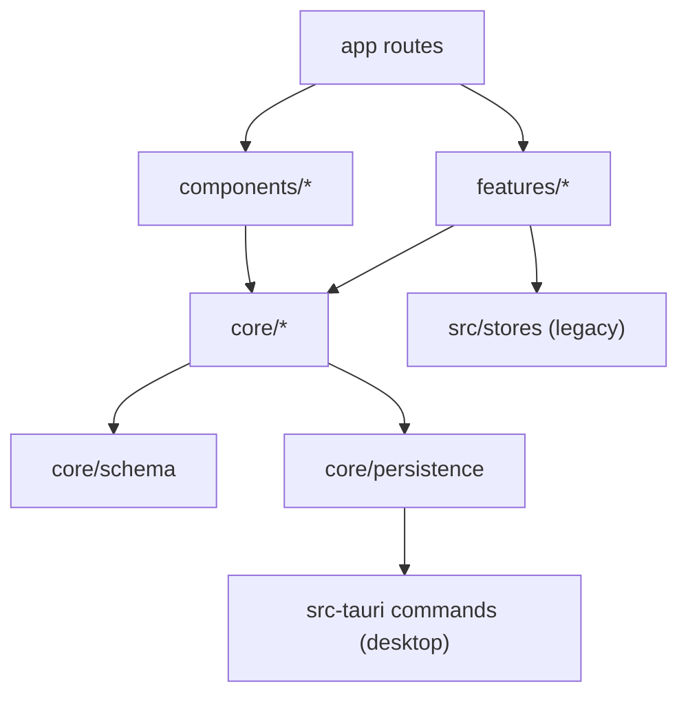

# System Architecture

This document is the current repository architecture map for `HVAC_Canvas_App`, based on the active code in `hvac-design-app/` and `src-tauri/`.

## High-Level Overview

The system is a hybrid desktop/web HVAC design application:

- Frontend: Next.js App Router + React + TypeScript.
- State: Zustand stores split between `src/core/store`, `src/features/*/store`, and legacy `src/stores`.
- Domain model: Zod schemas in `src/core/schema`.
- Persistence: pluggable `StorageAdapter` + `ProjectRepository` over Web (IndexedDB/localStorage) and Tauri filesystem.
- Canvas runtime: tool-driven editing, command history, and reactive calculations/BOM/export.
- Desktop bridge: Tauri Rust commands under `src-tauri/src/commands`.

## Module Map

| Module/Directory | Responsibility | Depends On |
|---|---|---|
| `hvac-design-app/app` | Route entrypoints (`/`, `/dashboard`, `/canvas/[projectId]`) and top-level layout | `src/features/*`, `src/components/*` |
| `hvac-design-app/src/features/canvas` | Main editor runtime: tools, viewport, selection, inspectors, 3D view state, autosave, calculations | `src/core/store`, `src/core/commands`, `src/core/schema`, `src/core/services`, `src/core/persistence` |
| `hvac-design-app/src/features/dashboard` | Project browsing/filtering/create/open/archive/duplicate UI and list orchestration | `src/core/persistence`, `src/core/store`, `src/features/onboarding` |
| `hvac-design-app/src/features/export` | BOM/report export UI and format generators | `src/core/store`, `src/core/services/export`, canvas data hooks |
| `hvac-design-app/src/core/schema` | Canonical entity/project/service/component schemas and migration versioning | Zod + used by stores/persistence/features |
| `hvac-design-app/src/core/store` | Global stores (project, entity, tool, settings, preferences, validation, storage, component library) | schema + selective services |
| `hvac-design-app/src/core/commands` | Reversible command model + undo/redo history + entity command helpers | `entityStore`, `historyStore`, selection/validation/services |
| `hvac-design-app/src/core/persistence` | Storage adapter contracts, adapters, serialization, repository policy layer, file utilities | schema + storage root service + platform fs |
| `hvac-design-app/src/core/services` | Calculation, validation, automation, migration, storage-root, operation queue services | schema/store/persistence; some imports from `features` |
| `hvac-design-app/src/components` | Shared shell/dialog/onboarding/ui components | core stores + feature components/hooks |
| `hvac-design-app/src/stores` | Legacy persisted stores still used by onboarding/canvas/dashboard paths | localStorage + selected feature/core usage |
| `hvac-design-app/src-tauri` | Native command handlers and Tauri plugin wiring | Rust std + Tauri plugins |
| `hvac-design-app/e2e` | Playwright coverage for onboarding/project/canvas flows | app routes/runtime behavior |
| `docs/` | Architecture/element/persistence/user-journey documentation | references code modules above |

## Dependency Relationships

### Simplified graph

```mermaid
graph TD
    app["app routes"] --> features["features/*"]
    app --> components["components/*"]
    features --> core["core/*"]
    components --> core
    core --> schema["core/schema"]
    core --> persistence["core/persistence"]
    persistence --> tauri["src-tauri commands (desktop)"]
    features --> storesLegacy["src/stores (legacy)"]
```

### Observed import density (module-level, TS imports)

- `features -> core`: 272
- `features -> components`: 91
- `components -> core`: 43
- `core -> core`: 61
- `core -> features`: 5 (layer leakage)

## Data Flow

### 1. Startup / onboarding

1. `app/page.tsx` renders `AppInitializer`.
2. `AppInitializer` checks launch state (`useAppStateStore`), hydrates preferences, initializes storage root (`StorageRootService`), and can create initial project (`ProjectRepository.saveProject`).
3. Successful creation updates both project list/session state, then navigates to `/canvas/:projectId`.

### 2. Dashboard project lifecycle

1. `app/dashboard/page.tsx` mounts `DashboardPage`.
2. `DashboardPage` uses `projectListStore.refreshProjects`.
3. `projectListStore` talks to `StorageAdapter` (list/update metadata) and `ProjectRepository` for event-driven sync.
4. CRUD actions (archive/restore/duplicate/delete) apply optimistic updates, then persist via adapter/repository.

### 3. Canvas project load/hydration

1. Route `app/(main)/canvas/[projectId]/page.tsx` mounts `CanvasPageWrapper`.
2. `CanvasPageWrapper` resolves project from repository + local payload and hydrates:
   - `core` project/entity stores,
   - feature stores (viewport, selection, 3D/view mode),
   - history + preferences where needed.
3. Wrapper then renders `CanvasPage`.

### 4. Edit pipeline (user action to rendered state)

1. Input handled by active tool implementing `ITool` (`BaseTool` contract).
2. Tool invokes command/store mutations (`entityCommands`, `entityStore`, selection).
3. `historyStore` captures reversible operations (undo/redo).
4. Canvas components read normalized entity + viewport + selection state and render.
5. Reactive hooks (`useCalculations`, `useBOM`, validation services) recompute derived results.

### 5. Save/export pipeline

1. `useAutoSave` snapshots combined state and writes to local payload + repository output path.
2. Serialization validates/migrates against `ProjectFileSchema`.
3. Export UI (`ExportMenu`, `ExportReportDialog`) builds BOM/report payloads and generates CSV/PDF using export services.

## Core Abstractions

| Abstraction | Location | Role |
|---|---|---|
| `StorageAdapter` (interface) | `src/core/persistence/StorageAdapter.ts` | Platform-independent persistence contract (CRUD, metadata, autosave, backups) |
| `ProjectRepository` | `src/core/persistence/ProjectRepository.ts` | Policy layer: canonical paths, locking via `OperationQueue`, index updates, repository events |
| `ProjectFileSchema` | `src/core/schema/project-file.schema.ts` | Canonical persisted project format and version boundary |
| `Command` / `ReversibleCommand` | `src/core/commands/types.ts` | Standard mutation envelope for undo/redo |
| `useHistoryStore` | `src/core/commands/historyStore.ts` | Reversible command stacks and history limits |
| `useEntityStore` | `src/core/store/entityStore.ts` | Normalized entity source-of-truth with hydration and flow recalculation |
| `ITool` / `BaseTool` | `src/features/canvas/tools/BaseTool.ts` | Tool lifecycle/input contract for canvas runtime |
| `projectListStore` | `src/features/dashboard/store/projectListStore.ts` | Project index, filtering, lifecycle actions, storage synchronization |

## High Coupling / Risk Areas

### Large and highly connected files

- `src/features/canvas/hooks/useAutoSave.ts` (~826 LOC, high import fan-in): mixes serialization, storage fallback, legacy + new store reads, and save orchestration.
- `src/components/layout/FileMenu.tsx` (~710 LOC, 24 imports): combines UI and persistence/migration actions.
- `src/core/persistence/ProjectRepository.ts` (~631 LOC): central policy layer with locking, indexing, import/export, relocation and events.
- `src/core/services/automation/fittingInsertionService.ts` (~606 LOC): heavy automation logic coupled to geometry/entity behavior.

### Architectural hotspots / technical debt

- Dual project-store model in active paths:
  - `src/core/store/project.store.ts` and `src/stores/useProjectStore.ts`.
  - `CanvasPageWrapper`/`useAutoSave` read both, increasing drift risk.
- Layer leakage from core to feature:
  - `core/commands/entityCommands.ts` imports `features/canvas/store/selectionStore`.
  - `core/services/*fitting*` imports `features/canvas/entities/fittingDefaults`.
- Route-level orchestration concentration:
  - `AppInitializer` and `CanvasPageWrapper` each coordinate many stores/services directly; behavior changes here are high-impact.
- Mixed persistence pathways:
  - Both adapter/repository model and localStorage payload helpers are used in parallel; error-handling paths are complex.

## Dependency Debt Summary

Most dependencies follow `app/components/features -> core`, but the current architecture still has:

1. Legacy state layer overlap (`src/stores`) in runtime-critical flows.
2. Core module dependencies on feature modules (inversion of intended layering).
3. Several orchestration files that are both large and cross-domain.

These three areas are the primary maintenance and regression risk centers.
