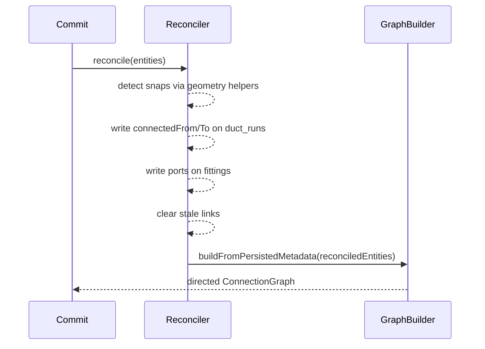

# T2 — ConnectionReconciliationService: Persisted Graph Authority

## Purpose

Create the `ConnectionReconciliationService` that writes authoritative `connectedFrom` / `connectedTo` on `duct_run` entities and authoritative `ports` on fittings after every committed canvas operation. This makes the persisted graph the single source of truth for all downstream calculation and validation work.

## Spec References

- spec:144cfcf2-5828-446d-85a5-abc486548367/8fc1d79f-9121-4037-ac93-36e96db87983 — `ConnectionReconciliationService` section, Key Decision #2
- spec:144cfcf2-5828-446d-85a5-abc486548367/f6059cc8-e09c-4fd3-833b-51538ca31ea4 — Flow 1, Steps 2–3

## What to Build

### `ConnectionReconciliationService`

A new service (e.g. file:hvac-design-app/src/core/services/graph/ConnectionReconciliationService.ts) with a single entry point:

```ts
reconcile(entities: Record<string, Entity>): Record<string, Entity>
```

It takes the current entity map after a committed operation and returns an updated entity map with all connection metadata corrected. It does **not** mutate the store directly — it returns a clean entity map for the store to apply.

**Responsibilities:**

1. **Duct-to-duct connections** — for each `duct_run`, detect which other `duct_run` or fitting endpoint its `start` and `end` points snap to (using existing geometry/snap helpers), and write `connectedFrom` / `connectedTo` accordingly.
2. **Duct-to-fitting connections** — for each fitting, detect which `duct_run` endpoints are at each of its connection points, and write authoritative `ports` (with `role`, `direction`, `connectedDuctRunId`, `connectedEnd`).
3. **Duct-to-equipment connections** — for each source equipment, detect which `duct_run` endpoint is at its connection point and write `connectedDuctId`.
4. **Stale link clearing** — if a previously connected entity has moved away from its partner, clear the stale `connectedFrom` / `connectedTo` / `ports` / `connectedDuctId` fields.
5. **Port role assignment** — for fittings, assign `role` based on fitting type and geometry:
  - Elbow: one `inlet`, one `outlet`
  - Tee: one `inlet`, one `straight_out`, one `branch_out`
  - Wye: one `inlet`, two `branch_out`
  - Reducer/Transition: one `inlet`, one `outlet`

### Update `ConnectionGraphBuilder`

Update file:hvac-design-app/src/core/services/graph/ConnectionGraphBuilder.ts to:

- Accept `duct_run` as a first-class node type (currently only `duct` is handled)
- Build directed edges from reconciled `connectedFrom` / `connectedTo` and fitting `ports`, not from geometry



## Acceptance Criteria

After any committed create/move/stretch/delete, duct_run.props.connectedFrom and connectedTo reflect the actual snapped neighborsAfter any committed operation, fitting props.ports contains one entry per connection point with correct role, direction, connectedDuctRunId, and connectedEndStale links are cleared when a duct or fitting is moved away from a snap pointConnectionGraphBuilder builds directed edges from persisted metadata and treats duct_run as a first-class nodeThe reconciler is a pure function (input entities → output entities); it does not call the store directlyExisting duct entities (legacy) are not broken by the graph builder update

## Out of Scope

- Topology validation (T3)
- Flow or pressure calculation (T4)
- Store wiring (T5)