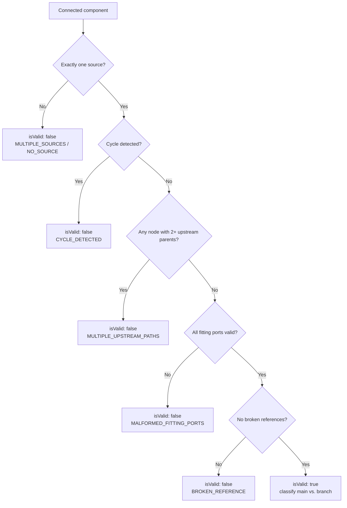

# T3 — TopologyValidationService: Single-Source Tree Guard

## Purpose

Create the `TopologyValidationService` that inspects each connected component of the graph and determines whether it is a valid single-source, tree-like network. Invalid components are flagged with a reason; only valid components proceed to flow and pressure calculation.

## Spec References

- spec:144cfcf2-5828-446d-85a5-abc486548367/8fc1d79f-9121-4037-ac93-36e96db87983 — `TopologyValidationService` section, Key Decision #4
- spec:144cfcf2-5828-446d-85a5-abc486548367/f6059cc8-e09c-4fd3-833b-51538ca31ea4 — Flow 1, Step 4 and Edge Cases

## What to Build

### `TopologyValidationService`

A new stateless service (e.g. file:hvac-design-app/src/core/services/graph/TopologyValidationService.ts):

```ts
validate(graph: ConnectionGraph, entities: Record<string, Entity>): TopologyValidationResult[]
```

Returns one `TopologyValidationResult` per connected component.

**Validation rules (v1):**

| Rule | Failure reason |
| --- | --- |
| Exactly one source equipment per component | `MULTIPLE_SOURCES` or `NO_SOURCE` |
| No cycles in the directed graph | `CYCLE_DETECTED` |
| No node with more than one upstream parent | `MULTIPLE_UPSTREAM_PATHS` |
| All fitting `ports` are valid and resolvable | `MALFORMED_FITTING_PORTS` |
| No broken `connectedFrom` / `connectedTo` references | `BROKEN_REFERENCE` |

**On failure:**

- The component is marked `isValid: false` with a `reason` string
- `affectedEntityIds` lists all entity IDs in the invalid component
- Calculation fields on affected entities are cleared (set to `undefined`)
- One validation warning is written per invalid component for the Validation panel

**Main vs. branch classification (for ASHRAE thresholds, used in T4/T7):**

- Segments upstream of the first graph split (node with > 1 downstream child) are classified as `main`
- All downstream child paths after a split are classified as `branch`
- This classification is stored on the `TopologyValidationResult` or as a separate `Record<ductRunId, 'main' | 'branch'>` map



## Acceptance Criteria

Each connected component receives exactly one TopologyValidationResultAll five failure rules are detected and produce the correct reasonValid components are marked isValid: true with sourceEquipmentId populatedInvalid components have affectedEntityIds listing all entity IDs in the componentMain vs. branch classification is produced for all duct_run nodes in valid componentsThe service is pure and stateless — no store accessValidation warnings for invalid components are returned in a format the Validation panel can display (T7 wires these into the UI)

## Out of Scope

- Flow or pressure calculation (T4)
- Store wiring (T5)
- Displaying warnings in the Validation panel (T7)