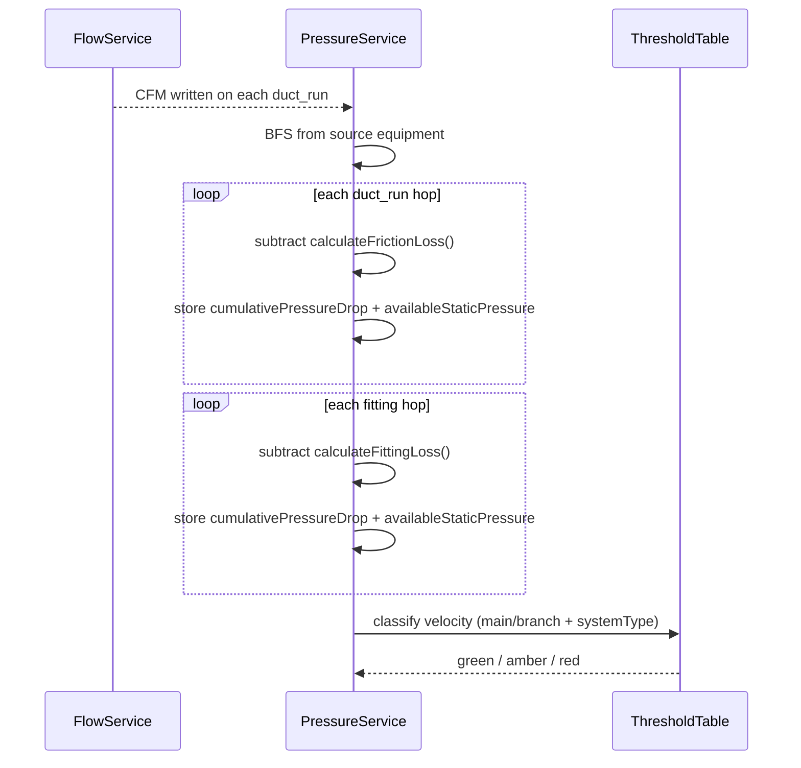

# T4 — PressurePropagationService and ASHRAE Velocity Thresholds

## Purpose

Implement the downstream pressure propagation engine and the ASHRAE-based velocity threshold table. This ticket produces the core engineering numbers — cumulative pressure drop, available static pressure, and velocity classification — that the UI and overlay consume.

## Spec References

- spec:144cfcf2-5828-446d-85a5-abc486548367/8fc1d79f-9121-4037-ac93-36e96db87983 — `PressurePropagationService`, `ductVelocityThresholds`, Key Decision #5 and #8
- spec:144cfcf2-5828-446d-85a5-abc486548367/f6059cc8-e09c-4fd3-833b-51538ca31ea4 — Flow 1 Steps 3–4, Flow 3 Step 4 (ASHRAE table)

## What to Build

### `PressurePropagationService`

A new stateless service (e.g. file:hvac-design-app/src/core/services/calculations/PressurePropagationService.ts):

```ts
calculatePressures(
  graph: ConnectionGraph,
  entities: Record<string, Entity>,
  validationResults: TopologyValidationResult[]
): Map<string, PressureResult>
```

**Algorithm (BFS downstream from source equipment):**

1. Start at source equipment — initial available SP = `equipment.props.staticPressure`
2. For each `duct_run` hop: subtract friction loss using existing `calculateFrictionLoss(velocity, equivalentDiameter, installLength)`
3. For each `fitting` hop: subtract fitting loss using existing `calculateFittingLoss(frictionPer100, equivalentLength)` where `equivalentLength` comes from `fitting.calculated.equivalentLength`
4. Store `cumulativePressureDrop` and `availableStaticPressure` on each node
5. Only runs on components where `TopologyValidationResult.isValid === true`
6. Uses visited-set BFS — no node is processed twice

**CFM propagation:** The existing `FlowPropagationService` (Leaf Peeling) continues to run unchanged for upstream CFM accumulation. `PressurePropagationService` reads the CFM values already written by `FlowPropagationService` to compute velocity.

### `ductVelocityThresholds`

A new constants/lookup file (e.g. file:hvac-design-app/src/core/services/calculations/ductVelocityThresholds.ts) keyed by `systemType + topologicalRole`:

| Key | Green (FPM) | Amber (FPM) | Red (FPM) |
| --- | --- | --- | --- |
| `supply_main` | < 1,500 | 1,500–2,500 | > 2,500 |
| `supply_branch` | < 1,000 | 1,000–1,800 | > 1,800 |
| `return_main` | < 1,200 | 1,200–2,000 | > 2,000 |
| `return_branch` | < 800 | 800–1,200 | > 1,200 |
| `exhaust_main` / `outside_air_main` | < 1,000 | 1,000–1,500 | > 1,500 |
| `exhaust_branch` / `outside_air_branch` | < 1,000 | 1,000–1,500 | > 1,500 |
| `unassigned_main` | < 1,200 | 1,200–2,000 | > 2,000 |
| `unassigned_branch` | < 1,200 | 1,200–2,000 | > 2,000 |

Role (`main` / `branch`) comes from the `TopologyValidationService` classification (T3).



## Acceptance Criteria

PressurePropagationService.calculatePressures() returns a PressureResult for every duct_run and fitting in valid componentsStarting pressure equals equipment.props.staticPressureEach duct hop subtracts friction loss via calculateFrictionLoss()Each fitting hop subtracts fitting loss via calculateFittingLoss() using fitting.calculated.equivalentLengthcumulativePressureDrop and availableStaticPressure are correct at each nodeInvalid components (per T3) are skipped — no pressure results are produced for themductVelocityThresholds returns the correct green/amber/red band for all 10 system-type + role combinationsVelocity classification uses topological role from T3, not a CFM heuristicThe service is pure and stateless

## Out of Scope

- Writing results back to the store (T5)
- Displaying results in the UI (T6, T7)