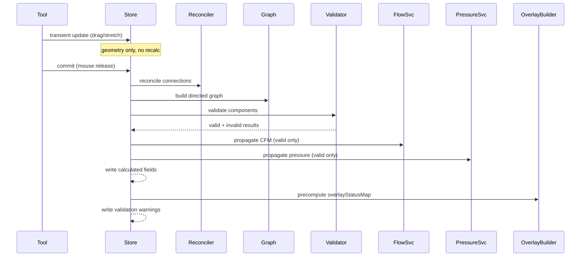

# T5 — entityStore Commit Pipeline: Transient vs. Authoritative Split

## Purpose

Wire the full authoritative calculation pipeline into `entityStore` and split the store's mutation paths so that drag/stretch interactions remain lightweight while committed operations trigger the complete reconcile → validate → calculate → overlay cycle.

## Spec References

- spec:144cfcf2-5828-446d-85a5-abc486548367/8fc1d79f-9121-4037-ac93-36e96db87983 — `entityStore` section, Key Decision #3, End-to-End Flow diagram
- spec:144cfcf2-5828-446d-85a5-abc486548367/f6059cc8-e09c-4fd3-833b-51538ca31ea4 — Flow 1, Steps 2–6

## What to Change

### Split `entityStore` mutation paths

In file:hvac-design-app/src/core/store/entityStore.ts, introduce two distinct mutation paths:

**Transient path** (used during drag/stretch preview):

- Updates geometry only
- Does **not** trigger reconciliation, graph build, validation, or calculation
- Does **not** update `recalculateFlows()`

**Committed path** (used on create, delete, mouse release, auto-fitting changes, hydrate):

- Runs the full authoritative pipeline in order:
  1. `ConnectionReconciliationService.reconcile(entities)` — write persisted connections
  2. `ConnectionGraphBuilder.buildFromPersistedMetadata(entities)` — build directed graph
  3. `TopologyValidationService.validate(graph, entities)` — validate components
  4. `FlowPropagationService.propagate(graph, entities, validResults)` — CFM upstream (existing)
  5. `PressurePropagationService.calculatePressures(graph, entities, validResults)` — pressure downstream
  6. Write all calculated fields back to entities in the store
  7. Write validation warnings for invalid components to the validation store

### Update `SelectTool` and `DuctTool`

- file:hvac-design-app/src/features/canvas/tools/SelectTool.ts — mouse move calls transient path; mouse release calls committed path
- file:hvac-design-app/src/features/canvas/tools/DuctTool.ts — snap preview uses transient path; endpoint commit on mouse release uses committed path

### `ductOverlayStore`

Add a new lightweight Zustand store (e.g. file:hvac-design-app/src/core/store/ductOverlayStore.ts):

- `overlayMode: 'off' | 'velocity' | 'pressure'`
- `overlayStatusMap: Record<string, OverlayStatus>` — precomputed per `duct_run` id

The overlay status map is recomputed at the end of the committed pipeline using the new calculated fields and `ductVelocityThresholds`.

## Acceptance Criteria

Drag/stretch interactions do not trigger reconciliation, graph build, validation, or calculationMouse release / commit triggers the full 7-step pipeline exactly onceCalculated fields (cumulativePressureDrop, availableStaticPressure, velocity, frictionLoss) are written back to entities after each commitValidation warnings for invalid components are written to the validation store after each commitductOverlayStore is created with overlayMode and overlayStatusMapoverlayStatusMap is recomputed at the end of every committed pipeline runEntities in invalid components have their calculated fields cleared (set to undefined) after each commitNo regression in existing recalculateFlows() behavior for legacy duct entities

## Out of Scope

- UI display of calculated values (T6)
- Overlay rendering and tooltip (T7)