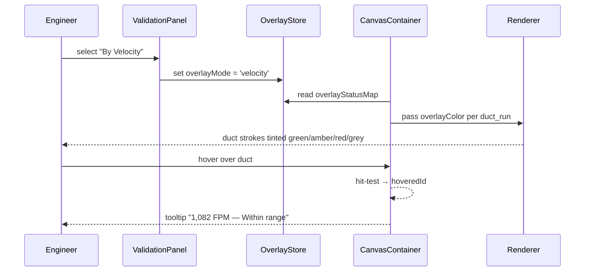

# T7 — Duct Color Overlay: Validation Toggle, Canvas Render, and Hover Tooltip

## Purpose

Add the "Duct Color Overlay" radio toggle to the Validation panel, wire the canvas renderer to apply precomputed overlay colors to duct runs, and implement the hover tooltip that shows exact value and status while the overlay is active.

## Spec References

- spec:144cfcf2-5828-446d-85a5-abc486548367/f6059cc8-e09c-4fd3-833b-51538ca31ea4 — Flow 3 (full flow + wireframe)
- spec:144cfcf2-5828-446d-85a5-abc486548367/8fc1d79f-9121-4037-ac93-36e96db87983 — `ductOverlayStore`, `CanvasContainer`, `renderDuctRun`, `ValidationDashboard` sections

## What to Change

### `ValidationDashboard`

In file:hvac-design-app/src/features/validation/ValidationDashboard.tsx:

- Add a **"Duct Color Overlay"** radio group at the top of the panel (above the existing issue list):
  - Options: **Off** · **By Velocity** · **By Pressure**
  - Default: **Off**
  - Selecting an option writes `overlayMode` to `ductOverlayStore`
- Surface unsupported-topology warnings produced by `TopologyValidationService` (from T3/T5) in the existing issue list — these appear as regular validation issues with a clear explanation message

**Reference wireframe:** See the Validation panel wireframe in spec:144cfcf2-5828-446d-85a5-abc486548367/f6059cc8-e09c-4fd3-833b-51538ca31ea4 (Flow 3).

### `renderDuctRun`

In file:hvac-design-app/src/features/canvas/renderers/DuctRunRenderer.ts (or equivalent):

- Accept an optional `overlayColor?: string | null` prop in `RenderContext`
- When `overlayColor` is provided and non-null, apply it to the duct body fill/stroke
- When a duct is selected while overlay is active, retain the overlay fill color; draw the selection indicator as an outline/border only (not a blue fill replacement)
- No threshold logic, topology logic, or tooltip logic lives in the renderer

### `CanvasContainer`

In file:hvac-design-app/src/features/canvas/components/CanvasContainer.tsx:

- Read `overlayStatusMap` from `ductOverlayStore` and pass `overlayColor` per duct run into the renderer
- Add **global hover hit-testing** on mouse move (independent of active tool):
  - When overlay is active, detect which `duct_run` the cursor is over
  - Update `hoveredId` in local state
  - Resolve tooltip content from `overlayStatusMap[hoveredId]`
- Render a **hover tooltip** outside the canvas render loop (e.g. as a positioned DOM element following cursor):
  - By Velocity: `"1,082 FPM — Within range"`
  - By Pressure: `"1.76 in.wg remaining — 88% available"`
  - Unsupported topology: `"No calculation — invalid network topology"`
  - Tooltip is only shown when overlay is active and a duct is hovered

### Overlay color mapping

| Status | Color |
| --- | --- |
| Green | `#16a34a` |
| Amber | `#d97706` |
| Red | `#dc2626` |
| Grey (no data / unsupported) | `#94a3b8` |

## Acceptance Criteria

Validation panel shows "Duct Color Overlay" radio group with Off / By Velocity / By Pressure optionsDefault state is Off — ducts render in their normal service colorBy Velocity — each duct run is tinted using ASHRAE thresholds from ductVelocityThresholds (T4)By Pressure — each duct run is tinted green (> 50%), amber (20–50%), red (< 20%) based on available SP percentageGrey tint applied to ducts with no data or unsupported topology in both overlay modesSelected duct retains overlay fill color; selection shown by outline/border onlyHovering a duct while overlay is active shows a tooltip with exact value and statusTooltip shows "No calculation — invalid network topology" for unsupported networksOverlay preference persists for the session (not saved to project file)Unsupported-topology warnings from T3/T5 appear in the Validation panel issue listNo overlay color logic or tooltip logic lives inside the renderer

## Out of Scope

- A persistent canvas legend (tooltip on hover is the chosen approach)
- Saving overlay preference to the project file