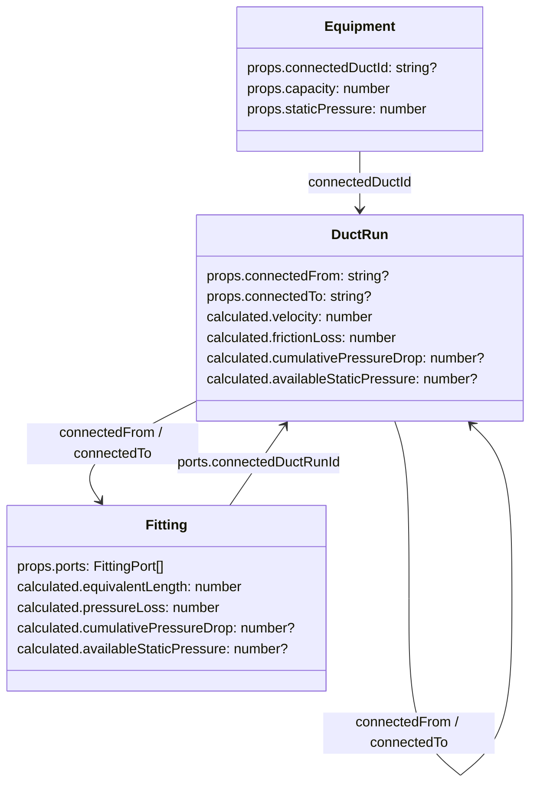
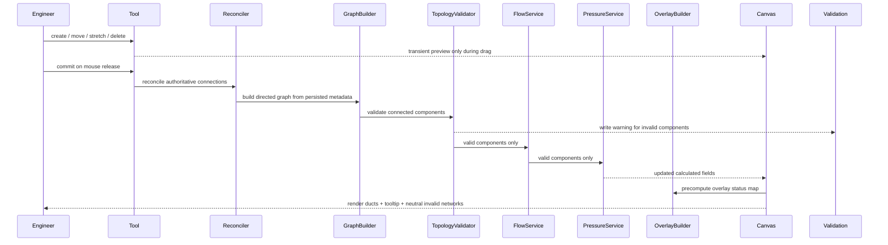

# Tech Plan — Magnetic Link Calculation Propagation

## Architectural Approach

### Key Decisions

**1. ****`duct_run`**** is the canonical calculation entity.**

All new connection, flow, pressure, overlay, and tooltip behavior targets `duct_run`. Legacy `duct` remains compatibility-only and is not the primary path for new engineering behavior. This fits the current canvas UX and renderer stack in file:hvac-design-app/src/features/canvas/components/CanvasContainer.tsx and file:hvac-design-app/src/features/canvas/renderers/DuctRunRenderer.ts.

**2. Persisted connectivity is authoritative.**

The calculation graph is built only from persisted connection metadata. Geometry, snap detection, and auto-fitting are inputs to a reconciliation step, not the source of truth themselves. This resolves the current mismatch between snap behavior in file:hvac-design-app/src/features/canvas/tools/DuctTool.ts and graph construction in file:hvac-design-app/src/core/services/graph/ConnectionGraphBuilder.ts.

**3. Interaction is hybrid: transient preview during drag/stretch, authoritative recalculation on commit.**

While dragging or stretching, the canvas updates temporary geometry and snap preview only. On mouse release / command commit, the system runs the full pipeline once: **reconcile connections → build graph → validate topology → propagate CFM → propagate pressure → precompute overlay status → update validation warnings**. This avoids full-network recalculation inside the hot mouse-move path in file:hvac-design-app/src/features/canvas/tools/SelectTool.ts.

**4. Topology validation gates all calculations.**

A network must be a **single-source, tree-like directed graph** to be calculable in v1. The system fails closed for cycles, multiple sources, multiple upstream paths, malformed fitting ports, or broken references. Invalid connected components do not get guessed calculations; affected entities show `—` values and neutral overlay, while the Validation panel surfaces a clear warning.

**5. ****`PressurePropagationService`**** stays pure and stateless, but only runs on validated components.**

The service still follows the existing `FlowPropagationService` shape, but it operates only after topology validation has confirmed a single-source tree. This keeps calculation logic simple and testable while making failure handling explicit.

**6. Fittings get explicit port semantics.**

Fittings store authoritative ports with role + direction + connected duct run. The Calculations panel reads those ports rather than inferring meaning from sorted duct ids or proximity. This is required to reliably show labels such as **Inlet**, **Straight Out**, and **Branch Out**.

**7. Overlay is precomputed, not resolved inside the render loop.**

The session-only overlay mode still lives in a lightweight Zustand store, but the color/status map is precomputed when entities, calculations, validation state, or overlay mode change. `CanvasContainer` reads that precomputed result; `renderDuctRun` only receives `overlayColor`. This keeps the per-frame canvas loop lightweight.

**8. Main vs. branch is inferred from graph topology, not airflow threshold.**

For ASHRAE velocity thresholds, segments upstream of the first split are treated as main; downstream child paths are treated as branches. No CFM heuristic is introduced, which keeps color changes stable and requirement-driven.

### Trade-offs

| Decision | Trade-off accepted |
| --- | --- |
| Persisted graph is canonical | More reconciliation work on create/move/stretch/delete, but graph behavior matches what is saved and recalculated |
| Fail-closed topology validation | Some user-drawn networks remain uncalculated in v1, but the app avoids misleading engineering results |
| Explicit fitting ports | Schema and fitting generation become more complex, but UI labels and traversal become reliable |
| Precomputed overlay map | One more derived-data layer is introduced, but canvas frame cost stays predictable |
| Commit-only authoritative recalculation | Engineers do not see live pressure/flow updates while dragging, but the interaction stays responsive |

## Data Model

### Schema Extensions

**`DuctCalculatedSchema`** (shared into `duct_run` via existing schema reuse):

- `cumulativePressureDrop?: number`
- `availableStaticPressure?: number`

These remain optional so existing project files continue to load safely.

**`FittingCalculatedSchema`****:**

- `cumulativePressureDrop?: number`
- `availableStaticPressure?: number`

Existing `equivalentLength` and `pressureLoss` remain unchanged.

**New authoritative fitting port schema:**

```ts
interface FittingPort {
  id: string;
  role: 'inlet' | 'outlet' | 'straight_out' | 'branch_out';
  direction: 'in' | 'out';
  connectedDuctRunId: string;
  connectedEnd: 'start' | 'end';
}
```

This `ports` collection becomes the authoritative fitting connectivity model for calculations and panel display. Existing `inletDuctId`, `outletDuctId`, and `connectionPoints` remain compatibility fields during migration, but new calculation logic reads `ports` first.

### New Service-Level Types

```ts
interface PressureResult {
  cumulativePressureDrop: number;
  availableStaticPressure: number;
  pressureLoss: number;
}

interface TopologyValidationResult {
  componentId: string;
  isValid: boolean;
  sourceEquipmentId?: string;
  affectedEntityIds: string[];
  reason?: string;
}

interface OverlayStatus {
  color: string | null;
  label: string;
  valueText: string;
  neutral: boolean;
}
```

### Entity Relationship



## Component Architecture

### New Components

#### `ConnectionReconciliationService`

**Responsibility:** After any connection-affecting commit, reconcile the authoritative persisted graph for the affected connected component.

**Responsibilities:**

- write `connectedFrom` / `connectedTo` on `duct_run`
- write authoritative `ports` on fittings
- keep equipment-to-duct references consistent
- clear stale links after move, stretch, delete, and auto-fitting reruns

This service uses existing geometry/snap helpers to determine what should be connected, but its output is persisted metadata.

#### `TopologyValidationService`

**Responsibility:** Validate each connected component before any flow or pressure calculation.

**Validation rules for v1:**

- exactly one source equipment in a component
- no cycles
- no node with more than one upstream parent
- all fitting ports valid and resolvable
- no broken references between ducts, fittings, and equipment

**Failure behavior:**

- affected component is marked unsupported for calculation
- calculation fields are cleared / left undefined
- overlay status is neutral grey
- one representative validation warning is written for the invalid component so the Validation panel explains why calculation could not complete

#### `PressurePropagationService`

**Responsibility:** Compute downstream cumulative pressure drop and available static pressure for a validated directed tree of `duct_run` and fitting nodes.

It remains a pure stateless service with this interface:

```ts
calculatePressures(graph: ConnectionGraph, entities: Record<string, Entity>): Map<string, PressureResult>
```

#### `ductVelocityThresholds`

**Responsibility:** Hold ASHRAE-based thresholds keyed by **system type + topological role**.

Example keys:

- `supply_main`
- `supply_branch`
- `return_main`
- `return_branch`
- `exhaust_main`
- `exhaust_branch`
- `outside_air_main`
- `outside_air_branch`
- `unassigned_main`
- `unassigned_branch`

Role is inferred from graph topology, not airflow.

#### `ductOverlayStore` + precomputed overlay status map

**Responsibility split:**

- `ductOverlayStore` stores only `overlayMode: 'off' | 'velocity' | 'pressure'`
- a derived overlay-status builder precomputes `Record<ductRunId, OverlayStatus>` whenever entities, calculations, validation results, or overlay mode change

This avoids storing duplicated derived state while still keeping the render loop cheap.

### Modified Components

#### `ConnectionGraphBuilder`

Must be updated so the graph is built from authoritative persisted metadata and supports `duct_run` as a first-class node type. Directed edges come from reconciled connection fields and fitting ports, not from geometry alone.

#### `entityStore`

The current automatic recalculation-on-every-update pattern in file:hvac-design-app/src/core/store/entityStore.ts is too expensive for drag/stretch interactions. The store layer is split into:

- **transient entity mutation path** — used during drag/stretch preview; does not trigger reconciliation or calculation
- **committed network update path** — used on create, delete, mouse release, auto-fitting changes, and hydrate; runs the full authoritative pipeline once

Committed pipeline order:

1. reconcile persisted connections
2. build graph
3. validate topology
4. run flow propagation for valid components
5. run pressure propagation for valid components
6. write calculated fields back to entities
7. update validation warnings for invalid components

#### `CalculationsPanel`

When one `duct_run` is selected, it reads calculated values directly from the entity.

When one fitting is selected, it reads port semantics from `fitting.props.ports` and looks up the connected `duct_run` airflow for each port. Port labels are therefore authoritative and not geometry-inferred at render time.

#### `CanvasContainer`

`CanvasContainer` gets two responsibilities beyond drawing:

1. **global hover hit-testing** on mouse move, independent of active tool
  - updates `hoveredId` for ducts when overlay is active
  - resolves tooltip content from the precomputed overlay-status map
2. **tooltip presentation outside the canvas render loop**
  - tooltip content is derived from overlay status
  - tooltip position follows cursor state already tracked by the canvas

`RenderContext` only needs `overlayColor?: string | null`; `overlayMode` does not need to be passed into the renderer.

#### `renderDuctRun`

Receives precomputed `overlayColor` and applies it to the duct body fill. Selection remains a blue outline drawn on top. No threshold logic, topology logic, or tooltip logic lives in the renderer.

#### `ValidationDashboard`

Adds the overlay toggle and also surfaces unsupported-topology warnings produced by the validation pipeline.

### End-to-End Flow

