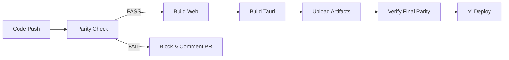

# Tauri-Web Parity Workflow

## 🎯 Overview

This workflow ensures that the **Tauri desktop app** and **web app** remain in perfect sync. While web updates happen first, our **priority is ensuring Tauri receives all changes**.

## 🏗️ Architecture

```
┌──────────────┐
│  Web Update  │
└──────┬───────┘
       │
       ▼
┌──────────────────────────┐
│  Parity Check (Auto)     │
│  • Platform guards       │
│  • Storage abstraction   │
│  • Config sync           │
│  • Component consistency │
└──────┬───────────────────┘
       │
       ├─PASS─► Build Both Versions
       │
       └─FAIL─► Block & Alert
```

## 🚀 Quick Start

### Check Parity Status

```bash
cd hvac-design-app
npm run parity:check
```

### Auto-Sync Changes

```bash
npm run sync:tauri
```

### Full Verification

```bash
npm run verify:all
```

## 📋 Available Scripts

### Core Scripts

| Script | Purpose | When to Use |
|--------|---------|-------------|
| `parity:check` | Analyze Tauri-Web consistency | Before committing changes |
| `sync:tauri` | Auto-apply web changes to Tauri | After web updates |
| `verify:all` | Run all quality checks | Before pushing to GitHub |

### Platform-Specific Scripts

| Script | Purpose | Platform |
|--------|---------|----------|
| `dev` | Start Next.js dev server | Web |
| `tauri:dev` | Start Tauri dev environment | Desktop |
| `build` | Build web version | Web |
| `tauri:build` | Build Tauri desktop app | Desktop |

## 🔍 What Gets Checked

### 1. **Platform-Specific Code**
- ✅ All Tauri API calls have platform guards
- ✅ Code works in both web and desktop environments
- ❌ **BLOCKS**: Unguarded `@tauri-apps/api` usage

**Example - ❌ BAD:**
```typescript
import { invoke } from '@tauri-apps/api/core';

export async function saveFile(data: string) {
  await invoke('save_file', { data }); // Will crash in web!
}
```

**Example - ✅ GOOD:**
```typescript
import { invoke } from '@tauri-apps/api/core';
import { isTauri } from '@/lib/platform';

export async function saveFile(data: string) {
  if (isTauri()) {
    await invoke('save_file', { data });
  } else {
    // Web fallback
    downloadAsFile(data);
  }
}
```

### 2. **Storage Abstraction**
- ✅ All persistence uses `createStorageAdapter()`
- ✅ No direct `localStorage`/`sessionStorage` calls
- ❌ **WARNS**: Direct storage API usage

**Example - ❌ BAD:**
```typescript
// Direct storage usage - platform-specific!
localStorage.setItem('settings', JSON.stringify(data));
```

**Example - ✅ GOOD:**
```typescript
import { createStorageAdapter } from '@/core/persistence/factory';

const storage = await createStorageAdapter();
await storage.write('settings.json', data);
```

### 3. **Configuration Parity**
- ✅ `package.json` version === `tauri.conf.json` version
- ✅ App names are consistent
- ✅ Build configurations are compatible
- ❌ **BLOCKS**: Version mismatches

### 4. **Component Consistency**
- ✅ No unused components
- ✅ All components work cross-platform
- ⚠️ **WARNS**: Unused components

## 🔄 Automated Workflow (GitHub Actions)

### When It Runs

- ✅ Every push to `main` or `develop`
- ✅ Every pull request
- ✅ Manual trigger via Actions tab

### What It Does



### Build Matrix

| Platform | OS | Output |
|----------|----|----|
| Windows | windows-latest | `.exe`, `.msi` |
| macOS | macos-latest | `.dmg`, `.app` |
| Linux | ubuntu-20.04 | `.deb`, `.AppImage` |

## 🛠️ Sync Process

When you run `npm run sync:tauri`, it automatically:

1. **Syncs Versions**
   - Updates `tauri.conf.json` version to match `package.json`

2. **Adds Platform Guards**
   - Detects Tauri API usage
   - Adds platform detection imports
   - (Manual review still needed for guard logic)

3. **Validates Storage**
   - Identifies direct storage API calls
   - Flags for manual migration to abstraction layer

4. **Checks Next.js Config**
   - Verifies `output: 'export'` is set
   - Ensures `images.unoptimized: true`

## 📊 Parity Report

After running checks, a detailed report is generated at:
```
hvac-design-app/parity-report.json
```

**Report Structure:**
```json
{
  "timestamp": "2024-02-02T...",
  "status": "PASS" | "FAIL",
  "totalIssues": 0,
  "totalWarnings": 2,
  "issues": [
    {
      "file": "src/components/ExampleComponent.tsx",
      "description": "Uses Tauri API without platform guard",
      "severity": "error"
    }
  ],
  "warnings": [...]
}
```

## 🚨 Handling Failures

### During Development

```bash
# Check what's wrong
npm run parity:check

# Fix automatically where possible
npm run sync:tauri

# Manually fix reported issues

# Verify fixes
npm run verify:all
```

### In Pull Requests

If parity check fails:
1. GitHub Actions will **block the PR**
2. A comment will list all issues
3. Fix issues locally
4. Push changes
5. CI re-runs automatically

## 💡 Best Practices

### ✅ DO

- **Always use platform guards** for Tauri APIs
- **Use storage abstraction** for all persistence
- **Test both platforms** before pushing
- **Run `verify:all`** before opening PRs
- **Keep versions synced** manually if needed

### ❌ DON'T

- **Don't use** `localStorage` directly
- **Don't call** Tauri APIs without guards
- **Don't bypass** parity checks
- **Don't deploy** without CI passing
- **Don't merge** PRs with parity failures

## 🔧 Manual Fixes

### Adding Platform Detection

```typescript
// 1. Add platform helper
import { isTauri } from '@/lib/platform';

// 2. Guard Tauri-specific code
if (isTauri()) {
  // Tauri-specific logic
} else {
  // Web fallback
}
```

### Using Storage Abstraction

```typescript
// 1. Import factory
import { createStorageAdapter } from '@/core/persistence/factory';

// 2. Create adapter
const storage = await createStorageAdapter();

// 3. Use adapter APIs
await storage.write('file.json', data);
const data = await storage.read('file.json');
```

### Updating Version Manually

```bash
# 1. Update package.json version
npm version patch  # or minor, major

# 2. Sync to Tauri config
npm run sync:tauri
```

## 📈 Monitoring

### Local Development

```bash
# Before committing
npm run parity:check
```

### CI/CD

- ✅ Check GitHub Actions tab
- ✅ Review parity report artifacts
- ✅ Monitor PR comments

## 🎯 Success Criteria

A successful parity state means:

- ✅ All parity checks pass
- ✅ No version mismatches
- ✅ No unguarded Tauri API calls
- ✅ All storage uses abstraction layer
- ✅ Both builds succeed
- ✅ Tests pass on both platforms

## 🔗 Related Documentation

- [Storage Abstraction](../docs/elements/10-persistence/FileSystem.md)
- [Platform Detection](../docs/core/platform.md)
- [Tauri Configuration](src-tauri/tauri.conf.json)
- [GitHub Actions](.github/workflows/tauri-web-parity-check.yml)

## 🆘 Troubleshooting

### "Version mismatch" Error

```bash
npm run sync:tauri  # Auto-fixes versions
```

### "Unguarded Tauri API" Error

Add platform guards manually:
```typescript
if (isTauri()) { /* use Tauri API */ }
```

### "Build Failed" Error

```bash
# Test both platforms locally
npm run dev         # Web
npm run tauri:dev   # Desktop
```

## 📞 Support

- **Issues**: GitHub Issues
- **PRs**: Include parity check results
- **Questions**: Team Slack #engineering

---

**Last Updated**: 2024-02-02  
**Maintained By**: Engineering Team
