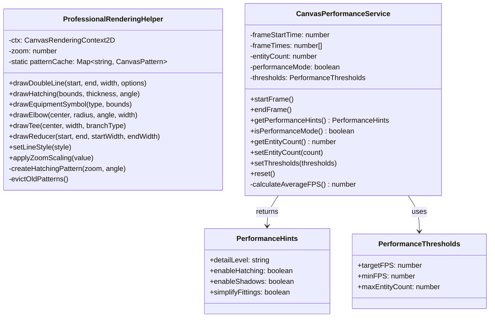

I have created the following plan after thorough exploration and analysis of the codebase. Follow the below plan verbatim. Trust the files and references. Do not re-verify what's written in the plan. Explore only when absolutely necessary. First implement all the proposed file changes and then I'll review all the changes together at the end.

## Observations

The HVAC Canvas App currently uses basic filled rectangles for rendering ducts and equipment, lacking professional ASHRAE/SMACNA standards. The codebase has a well-organized structure with renderers in `file:hvac-design-app/src/features/canvas/renderers/`, utilities in `file:hvac-design-app/src/features/canvas/utils/`, and uses Vitest for testing with `vitest-canvas-mock`. The `RenderContext` interface is defined with `ctx`, `zoom`, `isSelected`, and `isHovered` properties. Schema types show that ducts already have `insulated` and `insulationThickness` properties that aren't currently visualized. No `services/` directory exists under `features/canvas/` yet.

## Approach

Create two foundational classes: `ProfessionalRenderingHelper` for advanced rendering techniques (double-lines, hatching, ASHRAE symbols, parametric geometry) and `CanvasPerformanceService` for FPS monitoring and adaptive rendering. Place the helper in `utils/` following existing patterns, and create a new `services/` directory for the performance service. Implement comprehensive unit tests achieving >80% coverage using Vitest patterns. These components will serve as the foundation for future renderer enhancements without modifying existing renderers in this ticket.

## Implementation Steps

### 1. Create Directory Structure

Create the new services directory:
- Create `file:hvac-design-app/src/features/canvas/services/` directory
- Create `file:hvac-design-app/src/features/canvas/services/__tests__/` directory

### 2. Implement ProfessionalRenderingHelper Class

Create `file:hvac-design-app/src/features/canvas/utils/ProfessionalRenderingHelper.ts`:

**Class Structure:**
- Constructor accepting `CanvasRenderingContext2D` and `zoom: number`
- Private pattern cache as static `Map<string, CanvasPattern>` for hatching patterns
- Private helper methods for zoom-aware scaling

**Core Methods to Implement:**

**Double-Line Rendering:**
- `drawDoubleLine(start: Point, end: Point, width: number, options: LineOptions): void`
  - Calculate parallel offset lines based on width
  - Draw two separate strokes with proper spacing
  - Support line styles: 'solid', 'dashed', 'centerline'
  - Apply zoom-aware line weights

**Hatching Pattern:**
- `drawHatching(bounds: Rectangle, thickness: number, angle: number): void`
  - Use `ctx.createPattern()` for insulation hatching
  - Generate pattern canvas with diagonal lines at specified angle
  - Cache patterns by zoom level (key: `hatching-${Math.round(zoom * 100)}-${angle}`)
  - Apply pattern as fillStyle to bounds rectangle
  - Implement pattern cache cleanup (limit to 20 patterns, LRU eviction)

**Equipment Symbols:**
- `drawEquipmentSymbol(type: EquipmentType, bounds: Rectangle): void`
  - Implement ASHRAE-compliant symbols for each equipment type:
    - AHU: "X" symbol with coil representation
    - Fan: Circle with blade lines radiating from center
    - Hood: Trapezoid with exhaust arrow
    - Diffuser: Grid pattern with airflow indicators
    - Damper: Angled blade representation
  - Scale symbols proportionally to bounds
  - Apply zoom-aware line weights

**Parametric Fitting Geometry:**
- `drawElbow(center: Point, radius: number, angle: number, width: number): void`
  - Calculate elbow arc using radius = 1.5× width (ASHRAE standard)
  - Draw double-line arc with proper curvature
  - Add centerline for round ducts
  
- `drawTee(center: Point, width: number, branchType: 'top' | 'side' | 'bottom'): void`
  - Calculate branch connection geometry
  - Draw main run with double lines
  - Draw branch with proper connection angle (90° or 45°)
  - Ensure smooth transitions at junction
  
- `drawReducer(start: Point, end: Point, startWidth: number, endWidth: number): void`
  - Calculate tapered transition geometry
  - Draw converging/diverging double lines
  - Maintain smooth taper angle (max 30° per SMACNA)

**Utility Methods:**
- `setLineStyle(style: 'solid' | 'dashed' | 'centerline'): void`
  - Configure `ctx.setLineDash()` based on style
  - Solid: `[]`, Dashed: `[5/zoom, 5/zoom]`, Centerline: `[10/zoom, 5/zoom, 2/zoom, 5/zoom]`
  
- `applyZoomScaling(value: number): number`
  - Return `value / zoom` for zoom-independent sizing
  - Use for line weights, text sizes, pattern spacing

**Type Definitions:**
```typescript
interface Point { x: number; y: number; }
interface Rectangle { x: number; y: number; width: number; height: number; }
interface LineOptions {
  style?: 'solid' | 'dashed' | 'centerline';
  color?: string;
  weight?: number;
}
```

### 3. Implement CanvasPerformanceService Class

Create `file:hvac-design-app/src/features/canvas/services/CanvasPerformanceService.ts`:

**Class Structure:**
- Private properties for performance tracking:
  - `frameStartTime: number | null`
  - `frameTimes: number[]` (rolling window of last 60 frames)
  - `entityCount: number`
  - `performanceMode: boolean`
  - `thresholds: PerformanceThresholds`

**Performance Monitoring Methods:**
- `startFrame(): void`
  - Record `performance.now()` as frame start time
  
- `endFrame(): void`
  - Calculate frame duration: `performance.now() - frameStartTime`
  - Add to `frameTimes` array (maintain max 60 entries)
  - Calculate current FPS: `1000 / averageFrameTime`
  - Update `performanceMode` based on thresholds

**Performance Hints Methods:**
- `getPerformanceHints(): PerformanceHints`
  - Return hints object based on current performance state:
    - `detailLevel`: 'full' (FPS ≥ 50), 'simplified' (30-50 FPS), 'performance' (< 30 FPS)
    - `enableHatching`: true if FPS ≥ 40
    - `enableShadows`: true if FPS ≥ 50
    - `simplifyFittings`: true if FPS < 35 or entityCount > 500

**State Methods:**
- `isPerformanceMode(): boolean`
  - Return true if FPS < 30 or entityCount > 500
  
- `getEntityCount(): number`
  - Return current entity count
  
- `setEntityCount(count: number): void`
  - Update entity count for performance calculations

**Configuration Methods:**
- `setThresholds(thresholds: PerformanceThresholds): void`
  - Allow customization of FPS and entity count thresholds
  
- `reset(): void`
  - Clear frame times and reset state

**Type Definitions:**
```typescript
interface PerformanceHints {
  detailLevel: 'full' | 'simplified' | 'performance';
  enableHatching: boolean;
  enableShadows: boolean;
  simplifyFittings: boolean;
}

interface PerformanceThresholds {
  targetFPS: number;        // Default: 60
  minFPS: number;           // Default: 30
  maxEntityCount: number;   // Default: 500
}
```

**Helper Methods:**
- `private calculateAverageFPS(): number`
  - Calculate average from `frameTimes` array
  - Return 60 if insufficient data (< 10 frames)

### 4. Implement Unit Tests for ProfessionalRenderingHelper

Create `file:hvac-design-app/src/features/canvas/utils/__tests__/ProfessionalRenderingHelper.test.ts`:

**Test Structure:**
- Use `describe` blocks for each method group
- Mock `CanvasRenderingContext2D` using `vitest-canvas-mock`
- Create helper function to instantiate class with mocked context

**Test Cases:**

**Double-Line Rendering Tests:**
- Test parallel line calculation with various widths
- Verify two separate `stroke()` calls
- Test zoom-aware line weight application
- Test different line styles (solid, dashed, centerline)
- Verify `setLineDash()` calls for dashed/centerline styles

**Hatching Pattern Tests:**
- Test pattern creation with `createPattern()`
- Verify pattern caching (same zoom level returns cached pattern)
- Test pattern regeneration at different zoom levels
- Test cache size limit (verify LRU eviction after 20 patterns)
- Test angle parameter affects pattern orientation

**Equipment Symbol Tests:**
- Test each equipment type renders correctly
- Verify ASHRAE-compliant symbol shapes (AHU "X", fan blades, etc.)
- Test symbol scaling to bounds
- Test zoom-aware line weights in symbols

**Fitting Geometry Tests:**
- **Elbow:** Verify radius = 1.5× width, test arc drawing, test various angles
- **Tee:** Test branch positioning (top/side/bottom), verify 90° connections
- **Reducer:** Test taper calculation, verify smooth transitions, test max angle constraint

**Utility Method Tests:**
- Test `setLineStyle()` configures correct dash patterns
- Test `applyZoomScaling()` returns correct scaled values

**Coverage Target:** Achieve >80% coverage for all methods

### 5. Implement Unit Tests for CanvasPerformanceService

Create `file:hvac-design-app/src/features/canvas/services/__tests__/CanvasPerformanceService.test.ts`:

**Test Structure:**
- Mock `performance.now()` using Vitest's `vi.spyOn()`
- Create helper to simulate frame sequences

**Test Cases:**

**Frame Monitoring Tests:**
- Test `startFrame()` records timestamp
- Test `endFrame()` calculates frame duration
- Test frame times array maintains max 60 entries
- Test FPS calculation from frame times

**Performance Hints Tests:**
- Test `getPerformanceHints()` returns 'full' detail at 60 FPS
- Test 'simplified' detail at 40 FPS
- Test 'performance' detail at 25 FPS
- Test hatching disabled below 40 FPS
- Test shadows disabled below 50 FPS
- Test fitting simplification at high entity counts

**Performance Mode Tests:**
- Test `isPerformanceMode()` activates at < 30 FPS
- Test performance mode activates at > 500 entities
- Test performance mode deactivates when conditions improve

**Configuration Tests:**
- Test `setThresholds()` updates thresholds
- Test custom thresholds affect performance hints
- Test `reset()` clears state

**Edge Cases:**
- Test behavior with insufficient frame data (< 10 frames)
- Test rapid FPS fluctuations
- Test entity count changes

**Coverage Target:** Achieve >80% coverage for all methods

### 6. Create Type Definitions and Exports

**Update `file:hvac-design-app/src/features/canvas/utils/index.ts`:**
- Export `ProfessionalRenderingHelper` class
- Export related types: `Point`, `Rectangle`, `LineOptions`

**Create `file:hvac-design-app/src/features/canvas/services/index.ts`:**
- Export `CanvasPerformanceService` class
- Export related types: `PerformanceHints`, `PerformanceThresholds`

### 7. Documentation

**Add JSDoc comments to all public methods:**
- Include parameter descriptions
- Include return value descriptions
- Include usage examples for complex methods
- Document ASHRAE/SMACNA standards referenced

**Create README (optional but recommended):**
- `file:hvac-design-app/src/features/canvas/utils/README.md`
- Document `ProfessionalRenderingHelper` usage patterns
- Include visual examples of rendering techniques
- Document pattern cache behavior

## Acceptance Criteria Verification

**Checklist for completion:**

- [ ] `ProfessionalRenderingHelper` class created with all specified methods
- [ ] `drawDoubleLine()` produces two parallel strokes with proper spacing
- [ ] `drawHatching()` uses `ctx.createPattern()` and caches patterns per zoom level
- [ ] Equipment symbols follow ASHRAE standards (verified visually or with snapshots)
- [ ] Fitting geometry calculations are parametric (elbow radius = 1.5× width)
- [ ] `CanvasPerformanceService` monitors FPS and provides performance hints
- [ ] Performance mode activates when FPS < 30 or entity count > 500
- [ ] Unit tests cover all helper methods with >80% coverage
- [ ] Pattern cache properly manages memory (max 20 patterns with LRU eviction)
- [ ] All tests pass with `npm run test`
- [ ] No TypeScript errors with `npm run type-check`

## Architecture Diagram



## Testing Strategy

| Component | Test Type | Coverage Target | Key Focus Areas |
|-----------|-----------|-----------------|-----------------|
| ProfessionalRenderingHelper | Unit | >80% | Double-line math, pattern caching, ASHRAE symbols, parametric geometry |
| CanvasPerformanceService | Unit | >80% | FPS calculation, threshold detection, hint generation |
| Pattern Cache | Unit | 100% | Cache hits/misses, LRU eviction, memory management |
| Zoom Scaling | Unit | 100% | Correct scaling at various zoom levels |