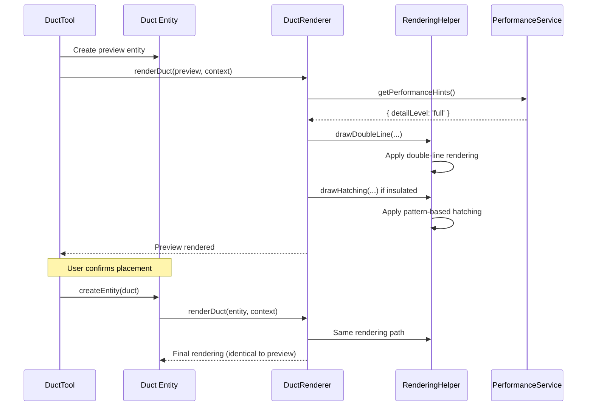
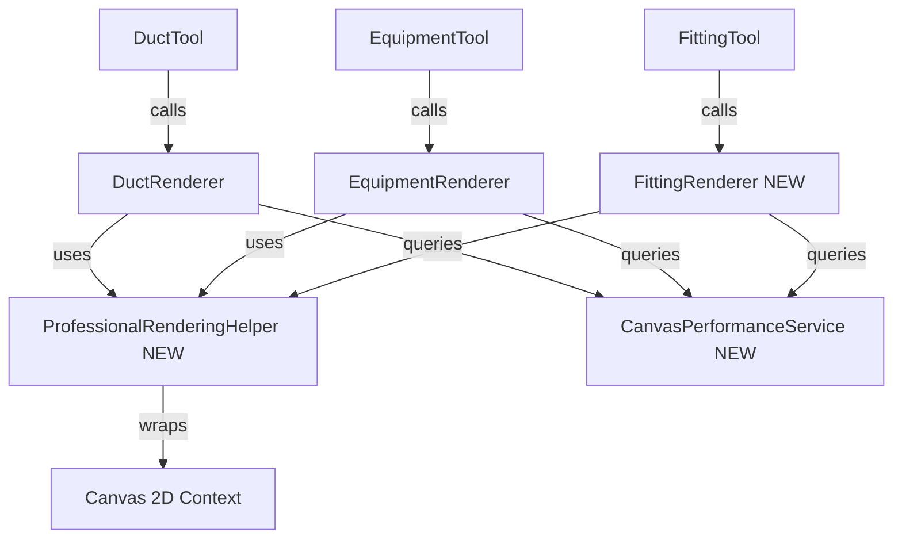

# Tech Plan: Professional HVAC Rendering


## Architectural Approach

### Core Design Decisions

**1. Rendering Helper Class Pattern**

Introduce a `ProfessionalRenderingHelper` class that wraps the canvas context and provides high-level rendering methods for professional HVAC drawing standards. This class encapsulates complex rendering logic (double-lines, hatching, ASHRAE symbols) while maintaining a clean API for renderers.

**Rationale:**
- **Reusability:** All renderers (Duct, Equipment, Fitting) and tools share the same professional rendering logic
- **Maintainability:** Changes to rendering standards happen in one place
- **Testability:** Helper class can be tested independently of entity renderers
- **Consistency:** Guarantees identical visual output across all components

**Trade-offs:**
- Adds an abstraction layer (acceptable for the consistency benefits)
- Slightly more object-oriented than current functional pattern (worth it for state management of patterns/styles)

**2. Performance Service Architecture**

Implement a dedicated `CanvasPerformanceService` that monitors rendering performance and provides adaptive rendering hints. This service operates independently of rendering logic, following separation of concerns.

**Rationale:**
- **Centralized Monitoring:** Single source of truth for performance state
- **Decoupled Logic:** Renderers don't need to know about performance monitoring
- **Adaptive Behavior:** Can adjust thresholds based on device capabilities
- **Observable Pattern:** Renderers subscribe to performance hints

**Trade-offs:**
- Additional service layer (justified by clean separation)
- Slight overhead for monitoring (negligible compared to rendering cost)

**3. WYSIWYG Preview Architecture**

Tools (DuctTool, EquipmentTool, FittingTool) create lightweight entity objects and call the same renderer functions used for final entities. This ensures perfect visual consistency between preview and final rendering.

**Rationale:**
- **Zero Visual Discrepancy:** Preview exactly matches final result
- **No Code Duplication:** Single rendering path for preview and final
- **Easier Maintenance:** Changes to rendering automatically apply to both

**Trade-offs:**
- Tools need to construct entity-like objects (minimal overhead)
- Slightly more complex tool code (worth it for WYSIWYG guarantee)

**4. Canvas Pattern-Based Hatching**

Use `ctx.createPattern()` for insulation hatching instead of drawing individual lines. Patterns are generated once per zoom level and reused across all insulated ducts.

**Rationale:**
- **Performance:** Browser-optimized pattern rendering
- **Consistency:** Identical hatching across all ducts
- **Zoom Adaptation:** Regenerate patterns at different zoom levels for crisp appearance

**Trade-offs:**
- Patterns don't rotate with ducts (acceptable - hatching is typically vertical/horizontal)
- Need to manage pattern cache (small memory footprint)

**5. Parametric Fitting Geometry**

Calculate fitting geometry dynamically based on connected duct dimensions and ASHRAE standards (e.g., elbow radius = 1.5× duct width). Geometry is computed at render time, not stored.

**Rationale:**
- **Accuracy:** Fittings match actual duct dimensions
- **Standards Compliance:** Follows ASHRAE/SMACNA geometric rules
- **Flexibility:** Adapts to any duct size automatically

**Trade-offs:**
- Computation at render time (negligible - simple geometry calculations)
- More complex renderer logic (justified by accuracy requirements)

### Technical Constraints

**Browser Compatibility:**
- HTML5 Canvas 2D API (widely supported)
- No WebGL or advanced features required
- Tested on Chrome, Firefox, Safari, Edge

**Performance Targets:**
- Maintain 60 FPS for drawings up to 500 entities
- Degrade gracefully to 30 FPS for larger drawings
- Performance mode activates automatically when needed

**Backward Compatibility:**
- Existing project files load without migration
- Schema changes are additive (optional fields)
- Rendering preferences default to professional mode

---

## Data Model

### Schema Extensions

**1. Rendering Preferences (Optional Fields)**

Add optional rendering configuration to entity schemas for future flexibility:

```typescript
// Add to DuctProps, EquipmentProps, FittingProps
interface RenderingPreferences {
  detailLevel?: 'full' | 'simplified' | 'performance';
  customStyle?: string; // Reserved for future use
}
```

**Rationale:**
- Future-proof for rendering customization
- Optional fields maintain backward compatibility
- Defaults to 'full' (professional rendering)

**2. Existing Schema Utilization**

Leverage existing schema properties without changes:

**Ducts:**
- `insulated: boolean` - Triggers hatching pattern
- `insulationThickness: number` - Affects visual width
- `shape: 'round' | 'rectangular'` - Determines rendering style
- `diameter` or `width/height` - Drives double-line spacing

**Equipment:**
- `equipmentType` - Determines ASHRAE symbol
- `width`, `depth`, `height` - Drives 3D appearance

**Fittings:**
- `fittingType` - Determines geometric shape
- `angle` - For elbow geometry calculations
- `connectionPoints` - For parametric geometry

**3. Derived Geometry (Not Stored)**

Fitting geometry is calculated at render time based on:
- Connected duct dimensions (from `inletDuctId`, `outletDuctId`)
- ASHRAE standard ratios (e.g., elbow radius = 1.5× width)
- Fitting type specifications

**Rationale:**
- Avoids data duplication
- Always reflects current duct dimensions
- Simpler data model

### Data Flow



---

## Component Architecture

### New Components

**1. ProfessionalRenderingHelper**

Rendering helper class that encapsulates professional HVAC drawing logic.

**Responsibilities:**
- Double-line rendering for ducts
- Pattern-based insulation hatching
- ASHRAE-compliant symbols for equipment
- Parametric fitting geometry
- Zoom-aware line weights and text

**Interface:**
```typescript
class ProfessionalRenderingHelper {
  constructor(ctx: CanvasRenderingContext2D, zoom: number);
  
  // Double-line rendering
  drawDoubleLine(start: Point, end: Point, width: number, options: LineOptions): void;
  
  // Hatching patterns
  drawHatching(bounds: Rectangle, thickness: number, angle: number): void;
  
  // Equipment symbols
  drawEquipmentSymbol(type: EquipmentType, bounds: Rectangle): void;
  
  // Fitting geometry
  drawElbow(center: Point, radius: number, angle: number, width: number): void;
  drawTee(center: Point, width: number, branchType: 'top' | 'side' | 'bottom'): void;
  drawReducer(start: Point, end: Point, startWidth: number, endWidth: number): void;
  
  // Utility methods
  setLineStyle(style: 'solid' | 'dashed' | 'centerline'): void;
  applyZoomScaling(value: number): number;
}
```

**2. CanvasPerformanceService**

Performance monitoring and adaptive rendering service.

**Responsibilities:**
- Monitor canvas FPS and render times
- Detect performance degradation
- Provide rendering hints to renderers
- Manage performance mode state

**Interface:**
```typescript
class CanvasPerformanceService {
  // Monitoring
  startFrame(): void;
  endFrame(): void;
  
  // Performance hints
  getPerformanceHints(): PerformanceHints;
  
  // State
  isPerformanceMode(): boolean;
  getEntityCount(): number;
  
  // Configuration
  setThresholds(thresholds: PerformanceThresholds): void;
}

interface PerformanceHints {
  detailLevel: 'full' | 'simplified' | 'performance';
  enableHatching: boolean;
  enableShadows: boolean;
  simplifyFittings: boolean;
}
```

**3. FittingRenderer**

New renderer for fitting entities (currently missing).

**Responsibilities:**
- Render elbows with accurate radius geometry
- Render tees with proper branch connections
- Render reducers with tapered transitions
- Render caps with end termination symbols
- Calculate parametric geometry based on connected ducts

**Interface:**
```typescript
function renderFitting(fitting: Fitting, context: RenderContext): void;
```

### Enhanced Components

**1. DuctRenderer Enhancement**

Enhance existing `file:hvac-design-app/src/features/canvas/renderers/DuctRenderer.ts`:

**Changes:**
- Replace single-line rendering with double-line using `ProfessionalRenderingHelper`
- Add insulation hatching when `insulated === true`
- Add centerline for round ducts
- Add flanges at endpoints
- Maintain existing airflow arrow and labels

**Integration:**
```typescript
export function renderDuct(duct: Duct, context: RenderContext): void {
  const helper = new ProfessionalRenderingHelper(context.ctx, context.zoom);
  const perfHints = performanceService.getPerformanceHints();
  
  // Double-line rendering
  helper.drawDoubleLine(start, end, width, { style: 'solid' });
  
  // Insulation hatching (if enabled and not in performance mode)
  if (duct.props.insulated && perfHints.enableHatching) {
    helper.drawHatching(bounds, duct.props.insulationThickness, 45);
  }
  
  // Existing airflow and labels
  // ...
}
```

**2. EquipmentRenderer Enhancement**

Enhance existing `file:hvac-design-app/src/features/canvas/renderers/EquipmentRenderer.ts`:

**Changes:**
- Add shadow/depth effects using helper
- Enhance type-specific symbols with ASHRAE standards
- Improve 3D appearance
- Maintain existing color coding

**Integration:**
```typescript
export function renderEquipment(equipment: Equipment, context: RenderContext): void {
  const helper = new ProfessionalRenderingHelper(context.ctx, context.zoom);
  const perfHints = performanceService.getPerformanceHints();
  
  // 3D appearance with shadow (if not in performance mode)
  if (perfHints.enableShadows) {
    context.ctx.shadowColor = 'rgba(0, 0, 0, 0.3)';
    context.ctx.shadowBlur = 10 / context.zoom;
  }
  
  // Professional symbol
  helper.drawEquipmentSymbol(equipment.props.equipmentType, bounds);
  
  // Existing labels
  // ...
}
```

**3. Tool Integration**

Enhance tools to use entity renderers for preview:

**DuctTool:**
```typescript
render(context: ToolRenderContext): void {
  // Create preview entity
  const previewDuct = createDuct({
    x: startPoint.x,
    y: startPoint.y,
    length: lengthFt,
    // ... other properties
  });
  
  // Use same renderer as final entities
  renderDuct(previewDuct, {
    ctx: context.ctx,
    zoom: context.zoom,
    isSelected: false,
    isHovered: false,
  });
}
```

**EquipmentTool, FittingTool:** Similar pattern

### Component Relationships



### Integration Points

**1. Canvas Component Integration**

The main canvas component initializes and manages the performance service:

```typescript
// In CanvasContainer or similar
const performanceService = new CanvasPerformanceService();

function renderFrame() {
  performanceService.startFrame();
  
  // Render all entities
  entities.forEach(entity => {
    if (entity.type === 'duct') renderDuct(entity, context);
    if (entity.type === 'equipment') renderEquipment(entity, context);
    if (entity.type === 'fitting') renderFitting(entity, context);
  });
  
  performanceService.endFrame();
}
```

**2. RenderContext Extension**

Extend the existing `RenderContext` interface to include performance hints:

```typescript
export interface RenderContext {
  ctx: CanvasRenderingContext2D;
  zoom: number;
  isSelected: boolean;
  isHovered: boolean;
  performanceHints?: PerformanceHints; // Optional for backward compatibility
}
```

**3. Pattern Cache Management**

The `ProfessionalRenderingHelper` maintains a cache of hatching patterns per zoom level:

```typescript
class ProfessionalRenderingHelper {
  private static patternCache = new Map<string, CanvasPattern="">();
  
  private getHatchingPattern(zoom: number): CanvasPattern {
    const key = `hatching-${Math.round(zoom * 100)}`;
    if (!ProfessionalRenderingHelper.patternCache.has(key)) {
      // Generate pattern for this zoom level
      const pattern = this.createHatchingPattern(zoom);
      ProfessionalRenderingHelper.patternCache.set(key, pattern);
    }
    return ProfessionalRenderingHelper.patternCache.get(key)!;
  }
}
```

### Rendering Pipeline

**End-to-End Flow:**

1. **User Action** → Tool activated (e.g., DuctTool)
2. **Preview Rendering** → Tool creates preview entity → Calls entity renderer → Uses ProfessionalRenderingHelper
3. **Performance Check** → PerformanceService provides hints → Renderer adapts detail level
4. **Entity Creation** → User confirms → Entity stored in state
5. **Final Rendering** → Canvas re-renders → Same renderer path → Identical visual output

**Performance Adaptation:**

1. **Normal Mode** (< 500 entities, 60 FPS):
   - Full double-line rendering
   - Insulation hatching enabled
   - Equipment shadows enabled
   - Parametric fitting geometry

2. **Performance Mode** (> 500 entities or < 30 FPS):
   - Maintain double-line rendering
   - Simplify/disable hatching patterns
   - Reduce shadow effects
   - Use simplified fitting geometry

---

## Key Design Principles

1. **Separation of Concerns:** Rendering logic, performance monitoring, and entity management are independent
2. **Single Responsibility:** Each component has one clear purpose
3. **WYSIWYG Guarantee:** Preview and final rendering use identical code paths
4. **Performance First:** Adaptive rendering maintains responsiveness
5. **Standards Compliance:** ASHRAE/SMACNA conventions throughout
6. **Backward Compatibility:** Existing projects work without changes
7. **Future-Proof:** Schema extensions allow for future customization

---

## Implementation Considerations

**Testing Strategy:**
- Unit tests for `ProfessionalRenderingHelper` methods
- Visual regression tests for renderer output
- Performance benchmarks for large drawings
- Integration tests for tool preview consistency

**Rollout Approach:**
- Implement helper class and performance service first
- Enhance DuctRenderer (most common entity)
- Add FittingRenderer (new functionality)
- Enhance EquipmentRenderer
- Update tools to use entity renderers

**Performance Monitoring:**
- Track FPS in production
- Monitor pattern cache size
- Measure render time per entity type
- Collect user feedback on visual quality
</string,>