```mermaid
sequenceDiagram
    participant User
    participant Canvas
    participant PropertiesPanel
    participant ParametricEngine
    participant CalculationEngine
    participant BOM

    User->>Canvas: Place rectangular duct
    Canvas->>PropertiesPanel: Open with default dimensions
    User->>PropertiesPanel: Change width 12" → 18"
    PropertiesPanel->>ParametricEngine: Apply dimension change
    ParametricEngine->>ParametricEngine: Resolve constraints
    ParametricEngine->>CalculationEngine: Recalculate engineering values
    CalculationEngine-->>PropertiesPanel: Updated velocity, pressure drop
    ParametricEngine->>Canvas: Update connected fittings
    Canvas-->>User: Visual feedback: "Elbow resized to match"
    CalculationEngine->>BOM: Update material quantities
    BOM-->>User: Real-time cost update
```

```mermaid
sequenceDiagram
    participant User
    participant Canvas
    participant DesignEngine
    participant ComponentLibrary
    participant BOM

    User->>Canvas: Draw duct segment A (horizontal)
    User->>Canvas: Start duct segment B (90° from A)
    Canvas->>DesignEngine: Detect connection at 90°
    DesignEngine->>ComponentLibrary: Find matching elbow (18x12, 90°)
    ComponentLibrary-->>DesignEngine: Return elbow component
    DesignEngine->>Canvas: Insert elbow at junction
    DesignEngine->>Canvas: Adjust duct endpoints
    Canvas-->>User: Visual feedback: "90° Elbow inserted"
    DesignEngine->>BOM: Add elbow to material list
    BOM-->>User: Cost updated
```

# Core User Flows - Unified Engineering Core

# Core User Flows - Unified Engineering Core

This document defines the key user flows for the Unified Engineering Core Architecture, which transforms the HVAC Canvas App into an engineering-grade system with parametric design and real-time cost estimation.

---

## Flow 1: Component Selection and Placement

**Description**: Browse the unified component library and place components on the canvas.

**Entry Point**: User opens the left sidebar "Components" tab.

**Steps**:

1. User sees unified component tree with all HVAC components organized hierarchically
2. User can search/filter components by name, material, or category
3. User expands categories (Ducts → Rectangular → Straight Duct)
4. User clicks on a component (e.g., "Rectangular Duct")
5. Component becomes the active drawing tool (similar to current Duct tool)
6. User clicks/drags on canvas to place the component
7. Properties panel opens automatically showing the new component's properties
8. User can continue placing more instances or select a different component

**Visual Reference**: See wireframe below for unified Component Browser.

```wireframe
<!DOCTYPE html>
<html>
<head>
<style>
body { margin: 0; font-family: -apple-system, sans-serif; background: #f8f9fa; }
.sidebar { width: 320px; height: 100vh; background: white; border-right: 1px solid #e2e8f0; display: flex; flex-direction: column; }
.header { padding: 12px 16px; border-bottom: 1px solid #e2e8f0; }
.tab { display: inline-block; padding: 6px 12px; background: #e2e8f0; border-radius: 6px; font-size: 13px; font-weight: 500; }
.search { margin: 12px 16px; }
.search input { width: 100%; padding: 8px 12px; border: 1px solid #cbd5e0; border-radius: 6px; font-size: 13px; }
.tree { flex: 1; overflow-y: auto; padding: 8px 16px; }
.category { margin-bottom: 8px; }
.category-header { display: flex; align-items: center; padding: 6px 8px; cursor: pointer; font-size: 13px; font-weight: 500; border-radius: 4px; }
.category-header:hover { background: #f1f5f9; }
.category-icon { margin-right: 6px; font-size: 10px; }
.component-item { padding: 8px 12px; margin-left: 20px; border: 1px solid #e2e8f0; border-radius: 4px; margin-bottom: 4px; cursor: pointer; background: white; }
.component-item:hover { background: #f8fafc; border-color: #3b82f6; }
.component-item.active { background: #dbeafe; border-color: #3b82f6; }
.component-name { font-size: 13px; font-weight: 500; color: #1e293b; }
.component-meta { font-size: 11px; color: #64748b; margin-top: 2px; }
.grip-icon { float: right; color: #94a3b8; font-size: 16px; }
</style>
</head>
<body>
<div class="sidebar">
  <div class="header">
    <span class="tab">Components</span>
  </div>
  
  <div class="search">
    <input type="text" placeholder="Search components..." data-element-id="component-search">
  </div>
  
  <div class="tree">
    <div class="category">
      <div class="category-header" data-element-id="category-ducts">
        <span class="category-icon">▼</span>
        <span>📦 Ducts</span>
      </div>
      <div class="component-item" data-element-id="component-rect-duct">
        <div class="component-name">Rectangular Duct <span class="grip-icon">⋮⋮</span></div>
        <div class="component-meta">Galvanized • Straight</div>
      </div>
      <div class="component-item active" data-element-id="component-round-duct">
        <div class="component-name">Round Spiral Duct <span class="grip-icon">⋮⋮</span></div>
        <div class="component-meta">Galvanized • Spiral</div>
      </div>
    </div>
    
    <div class="category">
      <div class="category-header" data-element-id="category-fittings">
        <span class="category-icon">▼</span>
        <span>🔧 Fittings</span>
      </div>
      <div class="component-item" data-element-id="component-elbow-90">
        <div class="component-name">90° Elbow <span class="grip-icon">⋮⋮</span></div>
        <div class="component-meta">Pressed • Standard</div>
      </div>
      <div class="component-item" data-element-id="component-tee">
        <div class="component-name">Tee Branch <span class="grip-icon">⋮⋮</span></div>
        <div class="component-meta">Welded • Standard</div>
      </div>
    </div>
    
    <div class="category">
      <div class="category-header" data-element-id="category-equipment">
        <span class="category-icon">▼</span>
        <span>⚙️ Equipment</span>
      </div>
      <div class="component-item" data-element-id="component-ahu">
        <div class="component-name">Air Handling Unit <span class="grip-icon">⋮⋮</span></div>
        <div class="component-meta">York MCA • 5000 CFM</div>
      </div>
      <div class="component-item" data-element-id="component-vav">
        <div class="component-name">VAV Box <span class="grip-icon">⋮⋮</span></div>
        <div class="component-meta">Trane • Single Duct</div>
      </div>
    </div>
    
    <div class="category">
      <div class="category-header" data-element-id="category-systems">
        <span class="category-icon">▶</span>
        <span>🔄 System Templates</span>
      </div>
    </div>
  </div>
</div>
</body>
</html>
```

---

## Flow 2: Parametric Design with Auto-Sizing

**Description**: Draw HVAC components with automatic constraint-based sizing and engineering validation.

**Entry Point**: User has selected a component and is placing it on canvas.

**Steps**:

1. User places a rectangular duct on canvas
2. System applies default dimensions based on project settings
3. User opens Properties panel to adjust dimensions
4. User changes duct width from 12" to 18"
5. System immediately recalculates:
  - Airflow velocity (updates in real-time)
  - Pressure drop (recalculated)
  - Connected fittings (auto-resized to match)
6. Properties panel shows updated engineering values
7. If constraint violated (e.g., velocity > 2000 fpm), warning appears in Properties panel
8. User sees visual feedback: "Width changed 12" → 18". Connected elbow resized to match."
9. BOM tab updates automatically with new material quantities

**Sequence Diagram**:



---

## Flow 3: Real-Time Cost Estimation

**Description**: View material takeoff and project costs as the design progresses.

**Entry Point**: User is actively designing on canvas.

**Steps**:

1. User draws ducts, places equipment, and adds fittings
2. System automatically tracks all placed components
3. User switches to BOM tab in right sidebar
4. BOM displays grouped by category (Ducts, Fittings, Equipment)
5. Each row shows:
  - Component name and specifications
  - Quantity (linear feet for ducts, count for fittings)
  - Unit cost (material)
  - Labor hours
  - Total cost (material + labor)
6. Bottom of BOM shows project totals:
  - Total Material Cost
  - Total Labor Hours
  - Total Labor Cost
  - Project Total (with markup applied)
7. User clicks "Export CSV" to generate bid document
8. As user adds/removes components, BOM updates in real-time

**Visual Reference**: See wireframe below for enhanced BOM panel.

```wireframe
<!DOCTYPE html>
<html>
<head>
<style>
body { margin: 0; font-family: -apple-system, sans-serif; background: #f8f9fa; }
.panel { width: 360px; height: 100vh; background: white; border-left: 1px solid #e2e8f0; display: flex; flex-direction: column; }
.header { padding: 12px 16px; border-bottom: 1px solid #e2e8f0; display: flex; justify-content: space-between; align-items: center; }
.tabs { display: flex; gap: 8px; }
.tab { padding: 6px 12px; font-size: 13px; border-radius: 6px; cursor: pointer; }
.tab.active { background: #e2e8f0; font-weight: 500; }
.controls { padding: 12px 16px; border-bottom: 1px solid #e2e8f0; display: flex; gap: 8px; }
.btn { padding: 6px 12px; font-size: 12px; border: 1px solid #cbd5e0; border-radius: 4px; background: white; cursor: pointer; }
.btn:hover { background: #f8fafc; }
.content { flex: 1; overflow-y: auto; padding: 16px; }
.section { margin-bottom: 16px; }
.section-title { font-size: 13px; font-weight: 600; margin-bottom: 8px; color: #475569; }
.table { width: 100%; border-collapse: collapse; font-size: 12px; }
.table th { text-align: left; padding: 6px 8px; background: #f1f5f9; font-weight: 500; color: #64748b; border-bottom: 1px solid #e2e8f0; }
.table td { padding: 6px 8px; border-bottom: 1px solid #f1f5f9; }
.table tr:hover { background: #f8fafc; }
.totals { background: #f8fafc; border: 1px solid #e2e8f0; border-radius: 6px; padding: 12px; margin-top: 16px; }
.total-row { display: flex; justify-content: space-between; padding: 4px 0; font-size: 13px; }
.total-row.grand { font-weight: 600; font-size: 14px; padding-top: 8px; border-top: 2px solid #cbd5e0; margin-top: 8px; }
</style>
</head>
<body>
<div class="panel">
  <div class="header">
    <div class="tabs">
      <span class="tab">Properties</span>
      <span class="tab active" data-element-id="tab-bom">BOM</span>
      <span class="tab">Calculations</span>
    </div>
  </div>
  
  <div class="controls">
    <button class="btn" data-element-id="btn-export-csv">📄 Export CSV</button>
    <button class="btn" data-element-id="btn-export-pdf">📑 Export PDF</button>
    <button class="btn" data-element-id="btn-settings">⚙️ Settings</button>
  </div>
  
  <div class="content">
    <div class="section">
      <div class="section-title">Ducts (3 items)</div>
      <table class="table">
        <thead>
          <tr>
            <th>Item</th>
            <th>Qty</th>
            <th>Unit Cost</th>
            <th>Labor Hrs</th>
            <th>Total</th>
          </tr>
        </thead>
        <tbody>
          <tr>
            <td>Rect Duct 18x12</td>
            <td>45 ft</td>
            <td>$8.50/ft</td>
            <td>2.5</td>
            <td>$507.50</td>
          </tr>
          <tr>
            <td>Rect Duct 24x12</td>
            <td>30 ft</td>
            <td>$10.20/ft</td>
            <td>1.8</td>
            <td>$396.00</td>
          </tr>
          <tr>
            <td>Round Duct 12"</td>
            <td>60 ft</td>
            <td>$6.75/ft</td>
            <td>3.0</td>
            <td>$555.00</td>
          </tr>
        </tbody>
      </table>
    </div>
    
    <div class="section">
      <div class="section-title">Fittings (5 items)</div>
      <table class="table">
        <thead>
          <tr>
            <th>Item</th>
            <th>Qty</th>
            <th>Unit Cost</th>
            <th>Labor Hrs</th>
            <th>Total</th>
          </tr>
        </thead>
        <tbody>
          <tr>
            <td>90° Elbow 18x12</td>
            <td>2 ea</td>
            <td>$45.00</td>
            <td>0.8</td>
            <td>$130.00</td>
          </tr>
          <tr>
            <td>Tee 24x12x12</td>
            <td>1 ea</td>
            <td>$85.00</td>
            <td>1.2</td>
            <td>$205.00</td>
          </tr>
        </tbody>
      </table>
    </div>
    
    <div class="section">
      <div class="section-title">Equipment (2 items)</div>
      <table class="table">
        <thead>
          <tr>
            <th>Item</th>
            <th>Qty</th>
            <th>Unit Cost</th>
            <th>Labor Hrs</th>
            <th>Total</th>
          </tr>
        </thead>
        <tbody>
          <tr>
            <td>AHU York MCA 5000</td>
            <td>1 ea</td>
            <td>$4,500</td>
            <td>16.0</td>
            <td>$6,100.00</td>
          </tr>
        </tbody>
      </table>
    </div>
    
    <div class="totals">
      <div class="total-row">
        <span>Material Subtotal:</span>
        <span>$5,893.50</span>
      </div>
      <div class="total-row">
        <span>Labor (25.3 hrs @ $65/hr):</span>
        <span>$1,644.50</span>
      </div>
      <div class="total-row">
        <span>Subtotal:</span>
        <span>$7,538.00</span>
      </div>
      <div class="total-row">
        <span>Markup (15%):</span>
        <span>$1,130.70</span>
      </div>
      <div class="total-row grand">
        <span>Project Total:</span>
        <span>$8,668.70</span>
      </div>
    </div>
  </div>
</div>
</body>
</html>
```

---

## Flow 4: Component Property Editing with Engineering Validation

**Description**: Edit component properties with tabbed interface showing dimensions, engineering data, and costing.

**Entry Point**: User selects a component on canvas.

**Steps**:

1. User clicks on a duct segment on canvas
2. Properties panel opens in right sidebar
3. Panel shows three tabs: "Dimensions", "Engineering", "Costing"
4. **Dimensions tab** (default):
  - Width, Height, Length fields
  - Material dropdown
  - Gauge/thickness selector
5. User switches to **Engineering tab**:
  - Airflow (CFM) - editable or calculated
  - Velocity (fpm) - calculated, shows ✓ or ⚠️ based on constraints
  - Pressure drop (in.wg) - calculated
  - Friction factor - calculated
  - Constraint status: "Velocity OK (1,450 fpm < 2,000 fpm limit)"
6. User switches to **Costing tab**:
  - Material cost breakdown
  - Labor hours estimate
  - Total component cost
7. User edits dimension → all tabs update in real-time
8. If constraint violated, Engineering tab shows warning icon and message

**Visual Reference**: See wireframe below for tabbed Properties panel.

```wireframe
<!DOCTYPE html>
<html>
<head>
<style>
body { margin: 0; font-family: -apple-system, sans-serif; background: #f8f9fa; }
.panel { width: 360px; background: white; border: 1px solid #e2e8f0; border-radius: 8px; }
.header { padding: 12px 16px; border-bottom: 1px solid #e2e8f0; font-weight: 600; font-size: 14px; }
.tabs { display: flex; border-bottom: 1px solid #e2e8f0; }
.tab { flex: 1; padding: 10px 16px; text-align: center; font-size: 13px; cursor: pointer; border-bottom: 2px solid transparent; }
.tab.active { border-bottom-color: #3b82f6; color: #3b82f6; font-weight: 500; }
.tab:hover { background: #f8fafc; }
.content { padding: 16px; }
.field { margin-bottom: 16px; }
.label { font-size: 12px; font-weight: 500; color: #475569; margin-bottom: 4px; }
.input { width: 100%; padding: 8px 12px; border: 1px solid #cbd5e0; border-radius: 4px; font-size: 13px; }
.select { width: 100%; padding: 8px 12px; border: 1px solid #cbd5e0; border-radius: 4px; font-size: 13px; }
.value-row { display: flex; justify-content: space-between; padding: 8px 0; border-bottom: 1px solid #f1f5f9; }
.value-label { font-size: 13px; color: #64748b; }
.value-data { font-size: 13px; font-weight: 500; color: #1e293b; }
.status-ok { color: #10b981; }
.status-warn { color: #f59e0b; }
.constraint-msg { background: #f0fdf4; border: 1px solid #86efac; border-radius: 4px; padding: 8px 12px; font-size: 12px; color: #166534; margin-top: 12px; }
</style>
</head>
<body>
<div class="panel">
  <div class="header">Rectangular Duct Properties</div>
  
  <div class="tabs">
    <div class="tab active" data-element-id="tab-dimensions">Dimensions</div>
    <div class="tab" data-element-id="tab-engineering">Engineering</div>
    <div class="tab" data-element-id="tab-costing">Costing</div>
  </div>
  
  <div class="content">
    <div class="field">
      <div class="label">Width (inches)</div>
      <input type="number" class="input" value="18" data-element-id="input-width">
    </div>
    
    <div class="field">
      <div class="label">Height (inches)</div>
      <input type="number" class="input" value="12" data-element-id="input-height">
    </div>
    
    <div class="field">
      <div class="label">Length (feet)</div>
      <input type="number" class="input" value="15" data-element-id="input-length">
    </div>
    
    <div class="field">
      <div class="label">Material</div>
      <select class="select" data-element-id="select-material">
        <option>Galvanized Steel (G-90)</option>
        <option>Stainless Steel (304)</option>
        <option>Aluminum</option>
      </select>
    </div>
    
    <div class="field">
      <div class="label">Gauge</div>
      <select class="select" data-element-id="select-gauge">
        <option>22 ga</option>
        <option>20 ga</option>
        <option>18 ga</option>
      </select>
    </div>
  </div>
</div>

<div style="height: 20px;"></div>

<div class="panel">
  <div class="header">Rectangular Duct Properties</div>
  
  <div class="tabs">
    <div class="tab" data-element-id="tab-dimensions-2">Dimensions</div>
    <div class="tab active" data-element-id="tab-engineering-2">Engineering</div>
    <div class="tab" data-element-id="tab-costing-2">Costing</div>
  </div>
  
  <div class="content">
    <div class="value-row">
      <span class="value-label">Airflow (CFM)</span>
      <span class="value-data">1,200</span>
    </div>
    
    <div class="value-row">
      <span class="value-label">Velocity (fpm)</span>
      <span class="value-data status-ok">1,450 ✓</span>
    </div>
    
    <div class="value-row">
      <span class="value-label">Pressure Drop (in.wg)</span>
      <span class="value-data">0.08</span>
    </div>
    
    <div class="value-row">
      <span class="value-label">Friction Factor</span>
      <span class="value-data">0.085</span>
    </div>
    
    <div class="value-row">
      <span class="value-label">Equivalent Diameter</span>
      <span class="value-data">14.2"</span>
    </div>
    
    <div class="constraint-msg">
      ✓ All constraints satisfied<br>
      Velocity: 1,450 fpm &lt; 2,000 fpm limit
    </div>
  </div>
</div>
</body>
</html>
```

---

## Flow 5: Automatic Fitting Insertion

**Description**: System automatically inserts appropriate fittings when ducts connect or change direction.

**Entry Point**: User is drawing duct segments on canvas.

**Steps**:

1. User draws a horizontal duct segment (18x12, 20 feet)
2. User starts drawing a second duct segment at 90° angle from the first
3. System detects the connection point and angle
4. System automatically:
  - Inserts a 90° elbow fitting at the junction
  - Sizes the elbow to match duct dimensions (18x12)
  - Adjusts duct segment endpoints to connect properly
5. Visual feedback appears: "90° Elbow (18x12) inserted automatically"
6. Elbow appears on canvas with subtle highlight
7. BOM updates to include the new fitting
8. User can click the elbow to adjust properties if needed
9. If user deletes one duct segment, system prompts: "Remove orphaned elbow?"

**Sequence Diagram**:



---

## Flow 6: Component Library Management

**Description**: Access dedicated library view to add, edit, and manage components and pricing.

**Entry Point**: User clicks Settings → "Manage Component Library" or navigates to Library page.

**Steps**:

1. User opens application settings menu
2. User clicks "Manage Component Library"
3. System opens dedicated Library view (full-page or modal)
4. Library view shows:
  - Left panel: Component tree (same structure as Component Browser)
  - Right panel: Selected component details
5. User selects "Rectangular Duct" from tree
6. Right panel shows editable fields:
  - Component name
  - Category and subcategory
  - Available sizes/dimensions
  - Material options
  - Unit cost (material)
  - Labor units (hours per unit)
  - Engineering properties (friction factors, etc.)
7. User clicks "Add New Component" button
8. Form appears for creating custom component
9. User fills in details and saves
10. New component appears in Component Browser immediately
11. User can import/export component library as CSV/JSON

**Visual Reference**: See wireframe below for Library Management view.

```wireframe
<!DOCTYPE html>
<html>
<head>
<style>
body { margin: 0; font-family: -apple-system, sans-serif; background: #f8f9fa; }
.container { display: flex; height: 100vh; }
.sidebar { width: 280px; background: white; border-right: 1px solid #e2e8f0; display: flex; flex-direction: column; }
.main { flex: 1; background: white; padding: 24px; overflow-y: auto; }
.header { padding: 16px; border-bottom: 1px solid #e2e8f0; }
.title { font-size: 16px; font-weight: 600; }
.toolbar { padding: 12px 16px; border-bottom: 1px solid #e2e8f0; display: flex; gap: 8px; }
.btn { padding: 6px 12px; font-size: 12px; border: 1px solid #cbd5e0; border-radius: 4px; background: white; cursor: pointer; }
.btn-primary { background: #3b82f6; color: white; border-color: #3b82f6; }
.tree { flex: 1; overflow-y: auto; padding: 12px 16px; }
.tree-item { padding: 6px 8px; margin-bottom: 2px; cursor: pointer; border-radius: 4px; font-size: 13px; }
.tree-item:hover { background: #f1f5f9; }
.tree-item.selected { background: #dbeafe; color: #1e40af; font-weight: 500; }
.form-section { margin-bottom: 24px; }
.section-title { font-size: 14px; font-weight: 600; margin-bottom: 12px; color: #1e293b; }
.form-grid { display: grid; grid-template-columns: 1fr 1fr; gap: 16px; }
.field { margin-bottom: 16px; }
.label { font-size: 12px; font-weight: 500; color: #475569; margin-bottom: 4px; display: block; }
.input { width: 100%; padding: 8px 12px; border: 1px solid #cbd5e0; border-radius: 4px; font-size: 13px; box-sizing: border-box; }
.actions { display: flex; gap: 12px; padding-top: 16px; border-top: 1px solid #e2e8f0; }
</style>
</head>
<body>
<div class="container">
  <div class="sidebar">
    <div class="header">
      <div class="title">Component Library</div>
    </div>
    
    <div class="toolbar">
      <button class="btn btn-primary" data-element-id="btn-add-component">+ Add Component</button>
      <button class="btn" data-element-id="btn-import">Import</button>
    </div>
    
    <div class="tree">
      <div class="tree-item">📦 Ducts</div>
      <div class="tree-item selected" data-element-id="tree-rect-duct">  → Rectangular Duct</div>
      <div class="tree-item">  → Round Spiral Duct</div>
      <div class="tree-item">🔧 Fittings</div>
      <div class="tree-item">  → 90° Elbow</div>
      <div class="tree-item">  → Tee Branch</div>
      <div class="tree-item">⚙️ Equipment</div>
      <div class="tree-item">  → Air Handling Unit</div>
      <div class="tree-item">  → VAV Box</div>
    </div>
  </div>
  
  <div class="main">
    <h2 style="margin-top: 0; font-size: 20px;">Edit Component: Rectangular Duct</h2>
    
    <div class="form-section">
      <div class="section-title">Basic Information</div>
      <div class="form-grid">
        <div class="field">
          <label class="label">Component Name</label>
          <input type="text" class="input" value="Rectangular Duct" data-element-id="input-name">
        </div>
        <div class="field">
          <label class="label">Category</label>
          <input type="text" class="input" value="Ducts" data-element-id="input-category">
        </div>
      </div>
      <div class="field">
        <label class="label">Description</label>
        <input type="text" class="input" value="Straight rectangular ductwork for HVAC systems" data-element-id="input-description">
      </div>
    </div>
    
    <div class="form-section">
      <div class="section-title">Pricing & Labor</div>
      <div class="form-grid">
        <div class="field">
          <label class="label">Material Cost (per linear foot)</label>
          <input type="number" class="input" value="8.50" data-element-id="input-material-cost">
        </div>
        <div class="field">
          <label class="label">Labor Units (hours per 10 ft)</label>
          <input type="number" class="input" value="0.5" data-element-id="input-labor-units">
        </div>
      </div>
    </div>
    
    <div class="form-section">
      <div class="section-title">Engineering Properties</div>
      <div class="form-grid">
        <div class="field">
          <label class="label">Friction Factor</label>
          <input type="number" class="input" value="0.085" data-element-id="input-friction">
        </div>
        <div class="field">
          <label class="label">Max Velocity (fpm)</label>
          <input type="number" class="input" value="2000" data-element-id="input-max-velocity">
        </div>
      </div>
    </div>
    
    <div class="form-section">
      <div class="section-title">Available Materials</div>
      <div class="field">
        <label class="label">Supported Materials</label>
        <div style="display: flex; gap: 12px; margin-top: 8px;">
          <label style="font-size: 13px;"><input type="checkbox" checked> Galvanized Steel</label>
          <label style="font-size: 13px;"><input type="checkbox" checked> Stainless Steel</label>
          <label style="font-size: 13px;"><input type="checkbox"> Aluminum</label>
        </div>
      </div>
    </div>
    
    <div class="actions">
      <button class="btn btn-primary" data-element-id="btn-save">Save Changes</button>
      <button class="btn" data-element-id="btn-cancel">Cancel</button>
      <button class="btn" data-element-id="btn-duplicate" style="margin-left: auto;">Duplicate Component</button>
      <button class="btn" data-element-id="btn-delete" style="color: #dc2626;">Delete</button>
    </div>
  </div>
</div>
</body>
</html>
```

---

## Flow 7: Calculation Settings Configuration

**Description**: Configure project-level calculation parameters with template support.

**Entry Point**: User needs to set labor rates, markup, or waste factors for the project.

**Steps**:

1. **Quick Access Path**: User opens BOM tab → clicks "Settings" button
2. **Project Properties Path**: User opens Left Sidebar → Project Properties tab → Calculation Settings section
3. Settings panel shows:
  - **Template Selector**: Dropdown with "Commercial Standard", "Residential Budget", "Industrial Heavy", "Custom"
  - **Labor Rates**: Base rate ($/hr), overtime multiplier, regional adjustment
  - **Markup**: Material markup (%), labor markup (%), overhead (%)
  - **Waste Factors**: Duct waste (%), fitting waste (%), equipment allowance (%)
  - **Engineering Assumptions**: Friction factors, velocity limits, pressure drop targets
4. User selects "Commercial Standard" template
5. All fields populate with template values
6. User can override individual values (switches to "Custom" template)
7. User clicks "Save as Template" to create new reusable template
8. Settings apply immediately to all calculations
9. BOM tab updates with new costs based on settings

**Visual Reference**: See wireframe below for Calculation Settings.

```wireframe
<!DOCTYPE html>
<html>
<head>
<style>
body { margin: 0; font-family: -apple-system, sans-serif; background: rgba(0,0,0,0.5); display: flex; align-items: center; justify-content: center; height: 100vh; }
.modal { width: 500px; background: white; border-radius: 8px; box-shadow: 0 4px 24px rgba(0,0,0,0.15); }
.header { padding: 16px 20px; border-bottom: 1px solid #e2e8f0; display: flex; justify-content: space-between; align-items: center; }
.title { font-size: 16px; font-weight: 600; }
.close { font-size: 20px; cursor: pointer; color: #64748b; }
.content { padding: 20px; max-height: 500px; overflow-y: auto; }
.section { margin-bottom: 20px; }
.section-title { font-size: 13px; font-weight: 600; margin-bottom: 12px; color: #475569; }
.field { margin-bottom: 12px; }
.label { font-size: 12px; font-weight: 500; color: #475569; margin-bottom: 4px; display: block; }
.input { width: 100%; padding: 8px 12px; border: 1px solid #cbd5e0; border-radius: 4px; font-size: 13px; box-sizing: border-box; }
.select { width: 100%; padding: 8px 12px; border: 1px solid #cbd5e0; border-radius: 4px; font-size: 13px; }
.grid { display: grid; grid-template-columns: 1fr 1fr; gap: 12px; }
.footer { padding: 16px 20px; border-top: 1px solid #e2e8f0; display: flex; justify-content: space-between; }
.btn { padding: 8px 16px; font-size: 13px; border: 1px solid #cbd5e0; border-radius: 4px; background: white; cursor: pointer; }
.btn-primary { background: #3b82f6; color: white; border-color: #3b82f6; }
</style>
</head>
<body>
<div class="modal">
  <div class="header">
    <div class="title">Calculation Settings</div>
    <div class="close" data-element-id="btn-close">×</div>
  </div>
  
  <div class="content">
    <div class="section">
      <div class="section-title">Template</div>
      <div class="field">
        <label class="label">Load Settings Template</label>
        <select class="select" data-element-id="select-template">
          <option>Commercial Standard</option>
          <option>Residential Budget</option>
          <option>Industrial Heavy</option>
          <option selected>Custom</option>
        </select>
      </div>
    </div>
    
    <div class="section">
      <div class="section-title">Labor Rates</div>
      <div class="grid">
        <div class="field">
          <label class="label">Base Rate ($/hr)</label>
          <input type="number" class="input" value="65.00" data-element-id="input-labor-rate">
        </div>
        <div class="field">
          <label class="label">Regional Multiplier</label>
          <input type="number" class="input" value="1.0" data-element-id="input-regional">
        </div>
      </div>
    </div>
    
    <div class="section">
      <div class="section-title">Markup & Overhead</div>
      <div class="grid">
        <div class="field">
          <label class="label">Material Markup (%)</label>
          <input type="number" class="input" value="15" data-element-id="input-material-markup">
        </div>
        <div class="field">
          <label class="label">Labor Markup (%)</label>
          <input type="number" class="input" value="10" data-element-id="input-labor-markup">
        </div>
      </div>
      <div class="field">
        <label class="label">Overhead (%)</label>
        <input type="number" class="input" value="8" data-element-id="input-overhead">
      </div>
    </div>
    
    <div class="section">
      <div class="section-title">Waste Factors</div>
      <div class="grid">
        <div class="field">
          <label class="label">Duct Waste (%)</label>
          <input type="number" class="input" value="10" data-element-id="input-duct-waste">
        </div>
        <div class="field">
          <label class="label">Fitting Waste (%)</label>
          <input type="number" class="input" value="5" data-element-id="input-fitting-waste">
        </div>
      </div>
    </div>
    
    <div class="section">
      <div class="section-title">Engineering Limits</div>
      <div class="grid">
        <div class="field">
          <label class="label">Max Velocity (fpm)</label>
          <input type="number" class="input" value="2000" data-element-id="input-max-velocity">
        </div>
        <div class="field">
          <label class="label">Target Pressure Drop (in.wg/100ft)</label>
          <input type="number" class="input" value="0.08" data-element-id="input-pressure-target">
        </div>
      </div>
    </div>
  </div>
  
  <div class="footer">
    <button class="btn" data-element-id="btn-save-template">Save as Template</button>
    <div style="display: flex; gap: 8px;">
      <button class="btn" data-element-id="btn-cancel">Cancel</button>
      <button class="btn btn-primary" data-element-id="btn-apply">Apply Settings</button>
    </div>
  </div>
</div>
</body>
</html>
```

---

## Flow 8: Project Export for Bidding

**Description**: Generate comprehensive BOM and cost estimates for project bidding.

**Entry Point**: User has completed design and needs to export for bidding.

**Steps**:

1. User opens BOM tab in right sidebar
2. User reviews material quantities and costs
3. User clicks "Export CSV" or "Export PDF" button
4. Export dialog appears with options:
  - **Format**: CSV, PDF, or Excel (.xlsx)
  - **Include**: Material list, labor breakdown, cost summary, engineering notes, project metadata
  - **Grouping**: By category, by floor/zone, by system type, or flat list
  - **Show pricing**: Yes/No (for internal vs. client-facing documents)
  - **Include images**: Option to embed canvas screenshots in PDF
  - **Template**: Use company letterhead template or plain format
5. User selects "PDF with pricing" for internal bid
6. System validates export (checks for constraint violations, missing data)
7. System generates PDF with:
  - Project header (name, location, date, client)
  - Executive summary (total cost, timeline estimate)
  - Material takeoff by category with quantities
  - Labor hours breakdown by trade
  - Cost summary with markup and taxes
  - Engineering notes (constraint violations flagged)
  - Calculation settings used (labor rates, markup percentages)
  - Optional: Canvas screenshots showing design
8. PDF downloads automatically to user's default location
9. Success notification: "Export complete: ProjectName_BOM_2024-02-11.pdf"
10. User can also export "CSV without pricing" for material ordering from suppliers
11. Export history tracked in project (who exported, when, what format)

**Export Format Details**:

- **CSV**: Flat table format, importable to Excel/ERP systems
- **PDF**: Formatted document with company branding, suitable for client presentation
- **Excel**: Multi-sheet workbook (Summary, Ducts, Fittings, Equipment, Labor)

**Error Handling**:

- If constraint violations exist: Show warning "Design has 3 constraint violations. Include in export notes?"
- If export fails: "Export failed. Check disk space and file permissions."
- If file already exists: "File exists. Overwrite or save as ProjectName_BOM_2024-02-11 (1).pdf?"

---

## Summary of Key Interaction Patterns

### Information Hierarchy

- **Primary**: Component Browser (left sidebar) and Canvas (center) for design work
- **Secondary**: Properties panel (right sidebar) for detailed editing
- **Tertiary**: BOM/Calculations tabs for estimation and validation

### User Journey Integration

- **Entry**: Component Browser → Select component
- **Design**: Canvas → Place and connect components
- **Refine**: Properties panel → Adjust dimensions and parameters
- **Validate**: Engineering tab → Check constraints
- **Estimate**: BOM tab → Review costs
- **Exit**: Export → Generate bid documents

### Placement & Affordances

- Components activate as drawing tools (click-to-activate pattern)
- Automatic fitting insertion reduces manual work
- Real-time feedback in Properties panel
- Persistent BOM tab for cost awareness

### Feedback & State Communication

- **Real-time**: Properties panel shows constraint violations immediately
- **Visual**: Canvas highlights auto-inserted fittings
- **Persistent**: BOM updates automatically as design changes
- **Validation**: Engineering tab shows detailed constraint status

---

## Design Principles

1. **Unified Experience**: Single component tree replaces fragmented catalog and services
2. **Immediate Feedback**: Real-time constraint validation and cost updates
3. **Intelligent Automation**: Auto-sizing and fitting insertion reduce manual work
4. **Professional Grade**: Engineering validation ensures designs meet standards
5. **Estimation-First**: Cost visibility throughout design process, not as afterthought
6. **Template-Driven**: Reusable calculation settings for consistent estimating
7. **Export-Ready**: One-click generation of bid-ready documents

---

# Additional User Flows

## Flow 9: Project Initialization and Setup

**Description**: Create a new project and configure initial settings for the unified engineering system.

**Entry Point**: User launches application or clicks "New Project" from project list.

**Steps**:

1. User clicks "New Project" button in application header
2. Project Setup Wizard appears with multi-step form:
  **Step 1: Project Details**
  - Project name (required)
  - Location/address
  - Client name
  - Project type: Residential, Commercial, Industrial
  - Start date
   **Step 2: Scope & Materials**
  - System types: Supply, Return, Exhaust (checkboxes)
  - Primary materials: Galvanized, Stainless, Aluminum (with grades)
  - Default duct sizing method: Manual, Auto-size by velocity, Auto-size by friction
   **Step 3: Calculation Settings**
  - Load template: "Commercial Standard", "Residential Budget", "Industrial Heavy", or "Custom"
  - Labor rate: $/hour
  - Markup percentage
  - Regional multiplier
   **Step 4: Engineering Parameters**
  - Max velocity limit (default: 2000 fpm)
  - Target pressure drop (default: 0.08 in.wg/100ft)
  - Friction factor defaults
3. User fills in required fields (project name minimum)
4. User can skip optional steps ("Use Defaults" button)
5. User clicks "Create Project"
6. System creates project with settings applied
7. Canvas opens with:
  - Empty design area
  - Component Browser populated with components matching selected materials
  - Project Properties pre-filled with wizard data
  - BOM tab ready (empty state)
8. Welcome tooltip appears: "Start by selecting a component from the Component Browser"

**First-Time User Experience**:

- If first project ever: Show quick tutorial overlay highlighting key areas
- Tutorial points: Component Browser → Canvas → Properties Panel → BOM Tab
- "Skip Tutorial" option available
- Tutorial can be replayed from Help menu

**Error Handling**:

- If project name empty: "Project name is required"
- If project name exists: "Project 'Office HVAC' already exists. Choose a different name."
- If invalid labor rate: "Labor rate must be between $10 and $500 per hour"

---

## Flow 10: System Template Application

**Description**: Apply HVAC system configurations (supply/return/exhaust) to organize and configure ductwork.

**Entry Point**: User needs to configure system types for different duct runs.

**Steps**:

1. User has drawn several duct segments on canvas
2. User opens Component Browser → expands "System Templates" category
3. System templates shown:
  - Supply Air System (blue icon)
  - Return Air System (green icon)
  - Exhaust System (red icon)
  - Custom System (gray icon)
4. User clicks "Supply Air System" template
5. Template becomes active (similar to tool activation)
6. User clicks on duct segments to apply system type
7. Selected ducts change color/style to indicate system type:
  - Supply: Blue outline
  - Return: Green outline
  - Exhaust: Red outline
8. Properties panel updates to show system-specific settings:
  - Pressure class (low, medium, high)
  - Insulation requirements
  - Sealing class
9. BOM automatically groups by system type
10. User can select multiple ducts (Shift+Click or drag-select) and apply system in bulk
11. System validates: "Warning: Mixing supply and return in same duct run"

**System Template Details**:  
Each template includes:

- Default pressure class
- Material preferences
- Color coding for visual identification
- Calculation parameters (velocity limits, pressure drop targets)
- Labor multipliers (exhaust systems may require more labor)

**Bulk Application**:

1. User selects multiple ducts (Shift+Click or Ctrl+Click)
2. Right-click → "Apply System Template"
3. Dialog shows: "Apply to 12 selected ducts"
4. User chooses template
5. All selected ducts update simultaneously
6. Undo available: "Undo: Apply Supply System to 12 ducts"

**Error Handling**:

- If incompatible components selected: "Cannot apply system template to equipment. Select ducts only."
- If system conflict detected: "Warning: Connecting supply and exhaust ducts may cause design issues."

---

## Flow 11: Bulk Component Operations

**Description**: Edit multiple components simultaneously (change material, resize, update properties).

**Entry Point**: User needs to make the same change to many components.

**Steps**:

**Scenario A: Bulk Material Change**

1. User has designed system with galvanized ducts
2. Client requests all ducts changed to stainless steel
3. User opens BOM tab → clicks "Bulk Edit" button
4. Bulk Edit dialog appears:
  - Filter: "Show: All Ducts (45 items)"
  - Action: "Change Material"
5. User selects "Change Material" → dropdown shows material options
6. User selects "Stainless Steel 304"
7. Preview shows: "45 ducts will be updated. Cost impact: +$2,340"
8. User clicks "Apply Changes"
9. System updates all ducts:
  - Material property changed
  - Costs recalculated
  - BOM updated
10. Success notification: "45 ducts updated to Stainless Steel 304"
11. Undo available: "Undo: Bulk material change"

**Scenario B: Bulk Resize**

1. User selects multiple duct segments on canvas (Shift+Click or drag-select)
2. Right-click → "Bulk Edit Properties"
3. Properties panel shows "Editing 8 ducts"
4. User changes width from 18" to 24"
5. System shows impact preview:
  - "8 ducts will resize"
  - "3 connected fittings will auto-resize"
  - "Cost change: +$145"
6. User clicks "Apply"
7. All selected ducts update simultaneously
8. Connected fittings auto-resize to match
9. Visual feedback: Updated ducts briefly highlight

**Scenario C: Bulk Delete**

1. User selects multiple components (ducts, fittings, equipment)
2. Presses Delete key or right-click → "Delete Selected"
3. Confirmation dialog: "Delete 15 items? This will remove:
  - 10 duct segments
  - 4 fittings
  - 1 equipment
   Cost impact: -$1,250"
4. User clicks "Delete"
5. Items removed from canvas and BOM
6. Orphaned fittings detected: "3 fittings are no longer connected. Delete them too?"
7. User chooses "Yes" or "No"
8. Undo available: "Undo: Delete 15 items"

**Bulk Edit Options**:

- Change material
- Change gauge/thickness
- Resize dimensions
- Apply system template
- Update labor rates
- Change insulation type
- Delete selected

**Error Handling**:

- If selection includes incompatible types: "Cannot bulk edit ducts and equipment together. Select one type."
- If change violates constraints: "Warning: 3 of 8 ducts will violate velocity constraints after resize. Continue?"
- If undo not possible: "Cannot undo: Project has been saved and closed."

---

## Flow 12: Design Validation and Error Resolution

**Description**: Systematically review and fix all constraint violations and design issues.

**Entry Point**: User has completed design and needs to validate before export.

**Steps**:

1. User clicks "Validate Design" button (in toolbar or Validation tab)
2. System runs comprehensive validation:
  - Constraint violations (velocity, pressure drop)
  - Disconnected components
  - Missing fittings
  - Incomplete specifications
  - Cost estimation issues
3. Validation Dashboard appears in right sidebar (Validation tab)
4. Issues grouped by severity:
  - **Errors (3)**: Must fix before export
  - **Warnings (7)**: Should review
  - **Info (2)**: Optional improvements

**Validation Dashboard Layout**:

```
┌─ Validation Results ─────────────┐
│ ✓ Design validated               │
│ ⚠ 3 errors, 7 warnings, 2 info  │
│                                  │
│ [Fix All Automatically] [Review] │
└──────────────────────────────────┘

┌─ Errors (3) ─────────────────────┐
│ ❌ Duct-12: Velocity 2,450 fpm   │
│    exceeds 2,000 fpm limit       │
│    [Fix] [Ignore] [Details]      │
│                                  │
│ ❌ Fitting-5: Disconnected elbow │
│    [Delete] [Reconnect] [Ignore] │
│                                  │
│ ❌ Equipment-2: Missing airflow  │
│    [Specify] [Auto-calculate]    │
└──────────────────────────────────┘
```

1. User clicks "Fix" on first error (Duct-12 velocity violation)
2. System:
  - Highlights Duct-12 on canvas (zooms to it)
  - Opens Properties panel
  - Shows Engineering tab with violation highlighted
  - Suggests fix: "Increase duct size to 20x14 to reduce velocity to 1,800 fpm"
3. User clicks "Apply Suggestion"
4. Duct resizes, validation updates: "✓ Duct-12 fixed"
5. User proceeds to next error
6. For disconnected fitting: User clicks "Delete" (orphaned fitting removed)
7. For missing airflow: User clicks "Auto-calculate" (system calculates based on connected ducts)
8. All errors resolved: "✓ All errors fixed. 7 warnings remain."
9. User reviews warnings (non-critical issues)
10. User can "Ignore All Warnings" or fix individually
11. Final validation: "✓ Design validated. Ready for export."

**Auto-Fix Capability**:

- User clicks "Fix All Automatically"
- System attempts to fix common issues:
  - Resize ducts to meet velocity constraints
  - Delete orphaned fittings
  - Auto-calculate missing values
- Shows summary: "Fixed 8 of 10 issues. 2 require manual review."
- User reviews remaining issues

**Validation Rules**:

- **Velocity**: Must be < max limit (default 2000 fpm)
- **Pressure drop**: Should be < target (default 0.08 in.wg/100ft)
- **Connections**: All fittings must connect to ducts
- **Specifications**: All equipment must have airflow/capacity
- **Materials**: All components must have material specified
- **Costs**: All components must have pricing data

**Error Handling**:

- If validation fails to run: "Validation error. Check project data integrity."
- If auto-fix fails: "Could not auto-fix Duct-12. Manual adjustment required."
- If user ignores critical error: "Warning: Exporting with errors may produce inaccurate estimates."

---

## Flow 13: Data Migration from Legacy System

**Description**: Import existing projects from the old product catalog system to the new unified component library.

**Entry Point**: User has existing projects in old format and needs to migrate.

**Steps**:

1. User opens application → clicks "Import Legacy Project"
2. Migration wizard appears:
  **Step 1: Select Source**
  - "Browse" button to select old project file (.hvac or .json)
  - Or: "Import from folder" to batch migrate multiple projects
   **Step 2: Preview Migration**
  - Shows project details from old file
  - Lists components to be migrated:
    - Old Product Catalog items → New Component Library
    - Old Services → New System Templates
    - Old pricing → New cost structure
  - Shows compatibility report:
    - ✓ 45 components will migrate automatically
    - ⚠ 3 components need manual mapping
    - ❌ 1 component not found in new library
   **Step 3: Map Incompatible Items**
  - For each unmapped item, shows:
    - Old: "Rectangular Duct - Custom Grade"
    - New: Dropdown to select equivalent component
    - Option: "Create new custom component"
  - User maps or creates components
   **Step 4: Migrate Settings**
  - Old calculation settings → New calculation template
  - User reviews and adjusts:
    - Labor rates
    - Markup percentages
    - Engineering parameters
   **Step 5: Confirm Migration**
  - Summary: "Migrating 'Office HVAC Project'
    - 48 components
    - 12 system configurations
    - Project settings
    - Estimated time: 30 seconds"
  - Checkbox: "Create backup of original project"
  - User clicks "Start Migration"
3. Migration progress bar appears
4. System migrates:
  - Canvas entities (ducts, fittings, equipment)
  - Component properties
  - System configurations
  - Calculation settings
  - Project metadata
5. Migration complete: "✓ Project migrated successfully"
6. Validation runs automatically
7. Migration report shows:
  - ✓ 45 components migrated
  - ✓ 3 components manually mapped
  - ⚠ 2 warnings: "Pricing data updated to current rates"
  - Backup saved: "Office_HVAC_backup_2024-02-11.hvac"
8. User reviews migrated project on canvas
9. User can "Undo Migration" if issues found
10. User saves migrated project in new format

**Batch Migration**:

1. User selects folder with multiple old projects
2. System scans and lists all projects
3. User selects which to migrate (checkboxes)
4. Migration runs for all selected projects
5. Summary report: "Migrated 15 of 17 projects. 2 failed (see log)."

**Error Handling**:

- If file format unrecognized: "Cannot read file. Ensure it's a valid .hvac project file."
- If component mapping fails: "Component 'Custom Duct XYZ' not found. Create custom component or skip?"
- If migration fails: "Migration failed at step 3. Project not modified. See error log."
- If validation fails after migration: "Project migrated but has 5 validation errors. Review before using."

---

## Flow 14: Advanced BOM Operations

**Description**: Search, filter, group, and analyze large material lists for complex projects.

**Entry Point**: User has large project with hundreds of components and needs to analyze BOM.

**Steps**:

**Scenario A: Search and Filter**

1. User opens BOM tab (shows 250+ items)
2. User types in search box: "stainless"
3. BOM filters to show only stainless steel components (35 items)
4. User clicks "Filter" button → advanced filter panel appears:
  - Material: Stainless, Galvanized, Aluminum (checkboxes)
  - Size range: Min/Max dimensions
  - Cost range: $0 - $1000+
  - System type: Supply, Return, Exhaust
  - Location: Floor 1, Floor 2, Roof
5. User selects "Material: Stainless" + "System: Supply"
6. BOM shows 18 items matching criteria
7. User can save filter as "Stainless Supply Items" for reuse
8. User clicks "Clear Filters" to reset

**Scenario B: Custom Grouping**

1. User clicks "Group By" dropdown in BOM tab
2. Options:
  - Category (default: Ducts, Fittings, Equipment)
  - System Type (Supply, Return, Exhaust)
  - Material (Galvanized, Stainless, etc.)
  - Floor/Zone (if project has multiple levels)
  - Cost Range (<$100, $100-$500, $500+)
3. User selects "Group By: Floor"
4. BOM reorganizes:
  ```
   Floor 1 (85 items, $12,450)
   ├─ Ducts (45 items)
   ├─ Fittings (35 items)
   └─ Equipment (5 items)

   Floor 2 (120 items, $18,200)
   ├─ Ducts (70 items)
   └─ Fittings (50 items)
  ```
5. User can expand/collapse groups
6. Subtotals shown for each group

**Scenario C: Cost Analysis**

1. User clicks "Analyze" button in BOM tab
2. Analysis panel appears with charts:
  - **Pie chart**: Cost breakdown by category
  - **Bar chart**: Material vs. Labor costs
  - **Line chart**: Cost by floor/zone
3. User hovers over chart segments to see details
4. User clicks chart segment → BOM filters to those items
5. User can export analysis as PDF report

**Scenario D: Comparison and What-If**

1. User clicks "Compare" button
2. Comparison mode activates
3. User changes material for several ducts (galvanized → stainless)
4. Side-by-side comparison shows:
  ```
   Original Design    |  Modified Design
   ─────────────────────────────────────
   Material: $8,500   |  Material: $11,200
   Labor: $3,200      |  Labor: $3,200
   Total: $11,700     |  Total: $14,400
   ─────────────────────────────────────
   Difference: +$2,700 (+23%)
  ```
5. User can accept changes or revert
6. User can save comparison as "Stainless Upgrade Option"

**Scenario E: Export Subsets**

1. User filters BOM to specific items (e.g., "Floor 2 Supply Ducts")
2. User clicks "Export Filtered Items"
3. Export dialog shows: "Export 45 items (Floor 2 Supply Ducts)"
4. User selects format (CSV, PDF, Excel)
5. Exported file contains only filtered items
6. Useful for: Ordering specific materials, subcontractor quotes, phase-based procurement

**Advanced Features**:

- **Saved Views**: Save filter/group combinations for quick access
- **Tags**: Add custom tags to items ("Phase 1", "Critical Path", "Long Lead")
- **Notes**: Add notes to specific BOM items
- **Sorting**: Multi-level sorting (by cost, then by size, then by material)
- **Highlighting**: Highlight items over budget or with long lead times

**Error Handling**:

- If search returns no results: "No items match 'xyz'. Try different search terms."
- If filter too restrictive: "No items match current filters. Adjust filter criteria."
- If export fails: "Export failed. Check file permissions and disk space."

---

## Flow 15: Onboarding - First-Time User Experience

**Description**: Guide new users through the unified engineering system with interactive tutorial.

**Entry Point**: User launches application for the first time.

**Steps**:

1. Application launches → detects first-time user
2. Welcome screen appears:
  ```
   ┌─────────────────────────────────────┐
   │  Welcome to HVAC Canvas App         │
   │  Unified Engineering Core           │
   │                                     │
   │  Professional HVAC design with      │
   │  real-time cost estimation          │
   │                                     │
   │  [Start Tutorial] [Skip to App]     │
   └─────────────────────────────────────┘
  ```
3. User clicks "Start Tutorial"
4. Interactive tutorial begins with sample project loaded

**Tutorial Steps**:

**Step 1: Component Browser**

- Spotlight highlights left sidebar
- Tooltip: "This is the Component Browser. All HVAC components are organized here."
- Task: "Click on 'Rectangular Duct' to select it"
- User clicks → ✓ "Great! The component is now active."

**Step 2: Place Component**

- Spotlight highlights canvas
- Tooltip: "Click and drag on the canvas to place a duct"
- User draws duct → ✓ "Perfect! You've placed your first component."

**Step 3: Properties Panel**

- Spotlight highlights right sidebar Properties tab
- Tooltip: "The Properties panel shows details for the selected component"
- Task: "Change the duct width to 18 inches"
- User edits → ✓ "Nice! Notice how the engineering values updated automatically."

**Step 4: Engineering Validation**

- Tooltip: "Click the 'Engineering' tab to see airflow calculations"
- User clicks → Shows velocity, pressure drop
- Tooltip: "The system validates your design in real-time. Green ✓ means constraints are satisfied."

**Step 5: Automatic Fitting**

- Tooltip: "Now draw another duct at a 90° angle from the first"
- User draws → System auto-inserts elbow
- Tooltip: "✓ The system automatically inserted a 90° elbow! This saves time and ensures proper connections."

**Step 6: Cost Estimation**

- Spotlight highlights BOM tab
- Tooltip: "Click the 'BOM' tab to see material costs"
- User clicks → Shows BOM with costs
- Tooltip: "Your design is automatically priced as you work. No separate takeoff needed!"

**Step 7: Complete**

- Success screen:

1. User clicks "Start New Project" → Project Setup Wizard (Flow 9)

**Tutorial Features**:

- **Skippable**: User can skip any step or entire tutorial
- **Replayable**: Available from Help menu anytime
- **Contextual**: Highlights specific UI elements
- **Interactive**: Requires user action to proceed
- **Progress**: Shows "Step 3 of 7" indicator
- **Sample project**: Pre-loaded with simple design for practice

**Help Resources**:

- **Video tutorials**: Embedded videos for complex features
- **Documentation**: Searchable help docs
- **Tooltips**: Hover over any button for quick help
- **Keyboard shortcuts**: Cheat sheet available (Ctrl+?)

---

# Error Handling and Edge Cases

## Constraint Violation Handling

**Scenario**: User changes duct dimension that violates velocity constraint.

**Flow**:

1. User edits duct width from 18" to 12" in Properties panel
2. System recalculates: Velocity = 2,450 fpm (exceeds 2,000 fpm limit)
3. **Allow with warning** (per user preference):
  - Change is applied immediately
  - Properties panel Engineering tab shows:
    ```
    ⚠ Velocity: 2,450 fpm
    Exceeds limit of 2,000 fpm

    Suggested fix: Increase width to 16"
    [Apply Suggestion] [Ignore Warning]
    ```
  - Visual indicator on canvas: Duct outline turns orange/yellow
  - Validation tab adds warning: "Duct-12: Velocity violation"
4. User can:
  - **Apply suggestion**: Duct resizes to 16", warning clears
  - **Ignore warning**: Warning persists, included in validation report
  - **Manual fix**: User adjusts to different size
5. If user tries to export with violations:
  - Dialog: "Design has 3 constraint violations. Include warnings in export notes?"
  - User chooses Yes/No

**Other Constraint Scenarios**:

- **Pressure drop exceeded**: Similar warning, suggest longer duct path or larger size
- **Material incompatibility**: "Cannot connect galvanized to stainless without transition"
- **Size mismatch**: "Fitting size (18x12) doesn't match duct (20x14). Auto-resize fitting?"

## Complex Fitting Scenarios

**Scenario**: Three ducts meet at a junction (T-junction or Y-junction).

**Flow**:

1. User draws Duct A (horizontal, 18x12)
2. User draws Duct B (vertical, connecting to Duct A at 90°)
3. System auto-inserts 90° elbow (simple case)
4. User draws Duct C (connecting to same junction point)
5. System detects complex junction (3 ducts meeting)
6. **Smart default** (per user preference):
  - System analyzes junction geometry
  - Determines most likely fitting: Tee branch
  - Auto-inserts Tee fitting sized to match ducts
  - Visual feedback: "Tee branch (18x12x12) inserted"
7. Fitting appears with subtle highlight
8. User can click fitting to adjust:
  - Change fitting type (Tee → Wye → Custom)
  - Adjust branch angles
  - Resize individual connections
9. If system cannot determine fitting:
  - Shows fitting picker dialog:
  - User selects fitting → inserted at junction

**Edge Cases**:

- **4+ ducts meeting**: System prompts for manual fitting selection
- **Misaligned ducts**: "Ducts not aligned. Adjust positions or insert transition?"
- **Size transitions**: System auto-selects transition fitting when duct sizes change

## Undo/Redo with Parametric Changes

**Scenario**: User undoes a dimension change that triggered cascading auto-adjustments.

**Flow**:

1. User changes Duct A width from 18" to 24"
2. System auto-adjusts:
  - Connected Elbow-1 resizes to 24x12
  - Connected Duct B resizes to match
  - BOM updates with new costs
3. User presses Ctrl+Z (Undo)
4. System reverts entire operation:
  - Duct A → 18"
  - Elbow-1 → 18x12
  - Duct B → original size
  - BOM → original costs
5. Undo notification: "Undone: Resize Duct A (and 2 connected components)"
6. User can Redo (Ctrl+Y) to reapply all changes

**Undo Stack**:

- Each parametric operation stored as single undo step
- Undo description shows scope: "Resize Duct A (affected 3 components)"
- Undo limit: 50 operations (configurable)
- Undo persists across save/load

**Edge Cases**:

- **Undo after save**: Works normally (undo stack preserved)
- **Undo after export**: Works normally (export doesn't affect undo)
- **Undo after project close**: Undo stack cleared on project close
- **Undo bulk operation**: "Undo: Bulk material change (45 ducts)"

## Network and Performance Issues

**Scenario**: Large project with 1000+ components causes performance issues.

**Flow**:

1. User opens large project
2. System detects size: "Large project detected (1,250 components)"
3. Performance mode activates automatically:
  - Simplified canvas rendering
  - Deferred BOM calculations
  - Reduced real-time updates
4. Notification: "Performance mode enabled for large project"
5. User can toggle: "Settings → Performance → Auto-optimize large projects"
6. When editing:
  - Changes apply immediately to selected component
  - BOM updates debounced (updates after 1 second of inactivity)
  - Validation runs on-demand (not real-time)
7. User clicks "Recalculate All" to force full update
8. Progress indicator shows: "Recalculating... 45%"

**Error Scenarios**:

- **Out of memory**: "Project too large. Consider splitting into multiple files."
- **Calculation timeout**: "Calculation taking too long. Simplify design or increase timeout in settings."
- **Render lag**: "Canvas rendering slow. Reduce zoom level or enable simplified view."

## Data Integrity and Recovery

**Scenario**: Application crashes during editing.

**Flow**:

1. User is editing project
2. Application crashes unexpectedly
3. User relaunches application
4. Auto-recovery dialog appears:
  ```
   ┌─ Recover Project ────────────────┐
   │ The application closed           │
   │ unexpectedly. Recover your work? │
   │                                  │
   │ Last saved: 2 minutes ago        │
   │ Auto-save: 30 seconds ago        │
   │                                  │
   │ [Recover Auto-save] [Open Last]  │
   │ [Discard] [View Details]         │
   └──────────────────────────────────┘
  ```
5. User clicks "Recover Auto-save"
6. Project opens with most recent auto-saved state
7. Notification: "Project recovered. Review changes and save."
8. User reviews, then saves manually

**Auto-save Features**:

- Auto-save every 60 seconds (configurable)
- Auto-save stored separately from manual saves
- Up to 5 auto-save versions kept
- Auto-save disabled during export/migration

**Corruption Handling**:

- If project file corrupted: "Cannot open project. File may be corrupted. Restore from backup?"
- Automatic backups created on each save (last 10 versions)
- Backup location: User documents folder

---

# Refined Flow Details

## Flow 1 Refinement: Component Selection and Placement

**Additional Details on Selection/Activation**:

**Component Activation States**:

1. **Inactive**: Component visible in browser, not selected
2. **Hover**: Mouse over component → shows tooltip with details
3. **Active**: Component clicked → becomes current drawing tool
  - Visual: Component highlighted in browser
  - Cursor changes to component icon
  - Status bar shows: "Active tool: Rectangular Duct (18x12)"
4. **Placing**: User clicking/dragging on canvas
5. **Placed**: Component on canvas, tool remains active for multiple placements

**Deactivation**:

- Click "Select" tool → deactivates component tool
- Press Escape key → returns to Select tool
- Click different component → switches to new component
- Right-click → context menu with "Deactivate Tool"

**Multi-placement Workflow**:

1. User clicks "Rectangular Duct" in Component Browser
2. Tool activates (duct highlighted, cursor changes)
3. User places first duct on canvas
4. Tool remains active (cursor still shows duct icon)
5. User places second duct
6. User places third duct
7. User presses Escape or clicks Select tool to finish
8. All three ducts remain selected for bulk editing

**Keyboard Shortcuts**:

- **V**: Activate Select tool
- **D**: Activate last-used duct component
- **F**: Activate last-used fitting component
- **E**: Activate last-used equipment component
- **Escape**: Deactivate current tool
- **Space**: Temporarily activate Pan tool (hold)

## Flow 2 Refinement: Parametric Design - Constraint Conflicts

**Detailed Constraint Conflict Resolution**:

**Scenario**: User sets duct width to 12" but airflow requires 18" minimum.

**Step-by-Step**:

1. User selects duct (current: 18x12, 1200 CFM)
2. User changes width to 12" in Properties panel
3. System calculates: Velocity = 2,400 fpm (exceeds 2,000 fpm limit)
4. **Allow with warning** (immediate application):
  - Width changes to 12" immediately
  - Engineering tab updates:
    ```
    ⚠ CONSTRAINT VIOLATION

    Velocity: 2,400 fpm
    Limit: 2,000 fpm
    Exceeded by: 400 fpm (20%)

    Impact:
    • Excessive noise
    • Increased pressure drop
    • May violate building codes

    Suggested fixes:
    ```
  1. Increase width to 16" (velocity: 1,800 fpm) ✓
  2. Reduce airflow to 900 CFM (velocity: 1,800 fpm)
  3. Split into two 10" ducts
    pply Fix #1] [Ignore] [Custom]  
    `  
    sual feedback:  
    Duct outline turns orange on canvas  
    Warning icon appears next to duct  
    Validation tab shows new warning
5. User options:
  - **Apply Fix #1**: Width changes to 16", warning clears
  - **Ignore**: Warning persists, user accepts responsibility
  - **Custom**: User manually adjusts to different solution
6. If user ignores and continues:
  - Warning remains visible in Properties panel
  - Validation tab tracks all ignored warnings
  - Export includes warning notes

**Multiple Constraint Conflicts**:  
If change violates multiple constraints:

```
⚠ MULTIPLE VIOLATIONS

1. Velocity: 2,400 fpm (exceeds 2,000 fpm)
2. Pressure drop: 0.12 in.wg (exceeds 0.08 in.wg)

Recommended: Increase duct size to 20x14
This fixes both violations.

[Apply Recommendation] [Fix Individually] [Ignore All]
```

## Flow 3 Refinement: Real-Time Cost Estimation - Update Triggers

**Cost Recalculation Triggers**:

**Immediate Updates** (< 100ms):

- Component added to canvas
- Component deleted from canvas
- Component quantity changed

**Debounced Updates** (500ms after last change):

- Dimension changes (wait for user to finish typing)
- Material changes
- Bulk operations

**Manual Updates**:

- Calculation settings changed (user clicks "Recalculate")
- Large projects (1000+ components) - user clicks "Update BOM"

**Update Process**:

1. User changes duct width from 18" to 24"
2. System waits 500ms (debounce period)
3. If no further changes:
  - Recalculates material quantity (linear feet unchanged, but weight increases)
  - Recalculates labor (wider duct = more labor)
  - Updates unit cost (larger duct = higher $/ft)
  - Updates total cost
  - Updates BOM display
  - Updates project total
4. Visual feedback:
  - Updated values briefly highlight (yellow flash)
  - "Updated" indicator appears briefly
  - Timestamp: "Last updated: 2 seconds ago"

**Cost Breakdown Visibility**:  
User clicks on BOM item → detail popup:

```
┌─ Duct Cost Breakdown ────────────┐
│ Rectangular Duct 24x12           │
│ Quantity: 45 linear feet         │
│                                  │
│ Material:                        │
│   Base cost: $10.20/ft           │
│   Quantity: 45 ft                │
│   Waste factor: 10%              │
│   Subtotal: $504.90              │
│                                  │
│ Labor:                           │
│   Labor units: 2.5 hrs           │
│   Rate: $65/hr                   │
│   Subtotal: $162.50              │
│                                  │
│ Total: $667.40                   │
│                                  │
│ [Edit Pricing] [Close]           │
└──────────────────────────────────┘
```

## Flow 5 Refinement: Automatic Fitting - Edge Cases

**Complex Junction Handling**:

**Scenario 1: T-Junction (3 ducts)**

1. Duct A (horizontal, 18x12) exists
2. User draws Duct B (vertical, 90° from A)
3. System inserts 90° elbow (simple case)
4. User draws Duct C (opposite side, creating T-junction)
5. System detects: "3 ducts at junction, elbow insufficient"
6. **Smart default behavior**:
  - Removes elbow
  - Analyzes duct sizes and angles
  - Determines: Tee branch most appropriate
  - Inserts Tee (18x12x12)
  - Adjusts duct endpoints to connect properly
7. Visual feedback:
  ```
   💡 Fitting updated
   90° Elbow → Tee Branch (18x12x12)
   Click to adjust if needed
  ```
8. User can click fitting → Properties panel shows:
  - Fitting type dropdown (Tee, Wye, Custom)
  - Branch angles (adjustable)
  - Connection sizes

**Scenario 2: Size Transition**

1. Duct A (18x12) exists
2. User draws Duct B (24x14) connecting to Duct A
3. System detects size mismatch
4. **Smart default**:
  - Inserts transition fitting (18x12 → 24x14)
  - Calculates transition length (typically 2-3 feet)
  - Adjusts duct endpoints
5. Visual feedback: "Transition (18x12 → 24x14) inserted"

**Scenario 3: Misaligned Ducts**

1. User draws Duct A (horizontal)
2. User draws Duct B (not quite aligned, 5° off)
3. System detects: "Ducts nearly aligned but offset"
4. Options dialog:
  ```
   ┌─ Connection Issue ───────────────┐
   │ Ducts are slightly misaligned    │
   │                                  │
   │ [Snap to Align] - Adjust Duct B  │
   │ [Insert Offset] - Add offset     │
   │ [Manual] - Leave as-is           │
   └──────────────────────────────────┘
  ```
5. User chooses option

**User Override**:

- User can disable auto-fitting: Settings → "Manual fitting placement"
- User can delete auto-inserted fitting and place manually
- User can change fitting type after insertion
- Undo always available: "Undo: Auto-insert Tee fitting"

## Flow 6 Refinement: Component Library - Import/Export

**Import Component Data**:

**CSV Import**:

1. User opens Library Management view
2. User clicks "Import" → "From CSV"
3. File picker appears
4. User selects CSV file (e.g., supplier catalog)
5. Import wizard appears:
  **Step 1: Map Columns**
   User maps columns or uses auto-detection
   **Step 2: Preview**  
   Shows first 10 rows with mapped data  
   User reviews for accuracy
   **Step 3: Import Options**
  - Overwrite existing components: Yes/No
  - Skip duplicates: Yes/No
  - Create new categories: Yes/No
   **Step 4: Import**  
   Progress bar: "Importing 150 components..."
6. Import complete: "✓ Imported 150 components. 3 skipped (duplicates)."
7. New components appear in Component Browser

**Export Component Data**:

1. User opens Library Management view
2. User selects components to export (or "Export All")
3. User clicks "Export" → "To CSV"
4. Export options:
  - Include pricing: Yes/No
  - Include engineering data: Yes/No
  - Include custom fields: Yes/No
5. File saves: "ComponentLibrary_2024-02-11.csv"
6. Success: "✓ Exported 150 components to CSV"

**Custom Component Creation**:

1. User clicks "Add New Component" in Library view
2. Component creation form appears:
  - **Basic Info**: Name, category, description
  - **Dimensions**: Parametric properties (width, height, length)
  - **Materials**: Supported materials and grades
  - **Pricing**: Material cost, labor units
  - **Engineering**: Friction factors, pressure drop coefficients
  - **Constraints**: Min/max dimensions, velocity limits
3. User fills in fields
4. User clicks "Save"
5. Validation runs: "✓ Component valid"
6. Component added to library
7. Immediately available in Component Browser

**Component Templates**:

- User can duplicate existing component as starting point
- Templates for common types: "Rectangular Duct Template", "Elbow Template"
- User can save custom component as template for reuse

---

# Summary of Enhancements

## New Flows Added (6)

1. **Flow 9**: Project Initialization and Setup
2. **Flow 10**: System Template Application
3. **Flow 11**: Bulk Component Operations
4. **Flow 12**: Design Validation and Error Resolution
5. **Flow 13**: Data Migration from Legacy System
6. **Flow 14**: Advanced BOM Operations
7. **Flow 15**: Onboarding - First-Time User Experience

## Existing Flows Refined (6)

1. **Flow 1**: Added detailed component activation states and keyboard shortcuts
2. **Flow 2**: Added comprehensive constraint conflict resolution
3. **Flow 3**: Added cost recalculation triggers and breakdown visibility
4. **Flow 5**: Added complex junction handling and user override options
5. **Flow 6**: Added detailed import/export and custom component creation
6. **Flow 8**: Added export format details and error handling

## Error Handling Added

- Constraint violation handling (allow with warning)
- Complex fitting scenarios (smart defaults)
- Undo/redo with parametric changes
- Network and performance issues
- Data integrity and recovery
- Auto-save and backup systems

## Total Flows

**15 comprehensive user flows** covering all aspects of the Unified Engineering Core system, from onboarding through advanced operations, with complete error handling and edge case documentation.