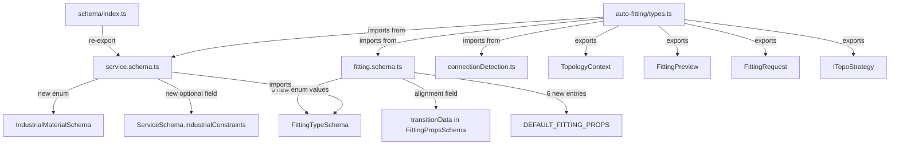

I have created the following plan after thorough exploration and analysis of the codebase. Follow the below plan verbatim. Trust the files and references. Do not re-verify what's written in the plan. Explore only when absolutely necessary. First implement all the proposed file changes and then I'll review all the changes together at the end.

## Observations

- `file:hvac-design-app/src/core/schema/fitting.schema.ts` currently has 5 values in `FittingTypeSchema` (`elbow_90`, `elbow_45`, `tee`, `reducer`, `cap`) and a `transitionData` object without an `alignment` field. `DEFAULT_FITTING_PROPS` has exactly 5 entries matching the enum.
- `file:hvac-design-app/src/core/schema/service.schema.ts` has `DuctMaterial` as a standalone enum and `ServiceSchema` with no `industrialConstraints` field. It is **not** currently re-exported from `file:hvac-design-app/src/core/schema/index.ts`.
- The `auto-fitting/` directory does not exist yet under `src/features/canvas/`.
- `ConnectionPoint` is already defined in `file:hvac-design-app/src/core/services/connectionDetection.ts` and can be imported directly.

## Approach

This ticket is pure schema/type work with no business logic. The changes are isolated to two existing files and one new file, making the blast radius minimal. The plan follows the exact scope defined in the ticket: extend enums, add optional fields, and create the shared types file.

---

## Implementation Steps

### Step 1 — Extend `FittingTypeSchema` in `file:hvac-design-app/src/core/schema/fitting.schema.ts`

Add the 6 new string literals to the existing `z.enum([...])` call on line 8:

| Value | Description |
|---|---|
| `transition_square_to_round` | Rect → Round |
| `reducer_tapered` | 15° aerodynamic convergence |
| `reducer_eccentric` | Offset, flat-top or flat-bottom |
| `wye` | Y-branch, 45° split |
| `elbow_mitered` | No-vane, industrial only |
| `end_boot` | Round → Rectangular terminal |

The `FittingType` inferred type will automatically include the new values since it uses `z.infer`.

### Step 2 — Add `alignment` to `transitionData` in `file:hvac-design-app/src/core/schema/fitting.schema.ts`

Inside the existing `transitionData` object definition (lines 34–43), add one new optional field after `toHeight`:

```
alignment: z.enum(['center_line', 'flat_top', 'flat_bottom']).optional()
```

Default is `center_line` (applied at the strategy layer, not enforced by Zod default here, consistent with the rest of the optional fields in `transitionData`).

### Step 3 — Extend `DEFAULT_FITTING_PROPS` in `file:hvac-design-app/src/core/schema/fitting.schema.ts`

The `DEFAULT_FITTING_PROPS` constant is typed as `Record<FittingType, FittingProps>`. After adding the 6 new enum values, TypeScript will raise a compile error until all 6 new keys are present. Add an entry for each:

| Key | Notable props |
|---|---|
| `transition_square_to_round` | `fittingType`, `autoGenerated: false`, `autoInserted: false` |
| `reducer_tapered` | same pattern |
| `reducer_eccentric` | same pattern |
| `wye` | same pattern |
| `elbow_mitered` | `angle: 90` (mitered default), same flags |
| `end_boot` | same pattern |

Follow the exact same shape as the existing 5 entries.

### Step 4 — Add `IndustrialMaterialSchema` to `file:hvac-design-app/src/core/schema/service.schema.ts`

After the existing `DuctMaterialSchema` declaration, add a new, **separate** Zod enum:

```
IndustrialMaterialSchema = z.enum([
  'black_iron_16ga',
  'black_iron_18ga',
  'stainless_304',
  'stainless_316',
  'aluminized_steel',
])
```

Export the inferred `IndustrialMaterial` type. Do **not** modify `DuctMaterialSchema`.

### Step 5 — Add `industrialConstraints` to `ServiceSchema` in `file:hvac-design-app/src/core/schema/service.schema.ts`

`service.schema.ts` must import `FittingTypeSchema` from `./fitting.schema` (it does not currently import it). Add this import at the top of the file.

Then extend `ServiceSchema` with a new optional field after `fittingRules`:

```
industrialConstraints: z.object({
  industrialType: z.enum(['kitchen_exhaust', 'generator_exhaust', 'commercial_supply', 'fume_hood']),
  forbiddenFittings: z.array(FittingTypeSchema),
  requiredMaterial: IndustrialMaterialSchema,
  minTransitionSlopeInchesPerFoot: z.number(),
  maxVelocityFPM: z.number(),
  allowFlexConnectors: z.boolean(),
  maxFlexLengthInches: z.number(),
  preferredElbowType: FittingTypeSchema,
}).partial().optional()
```

Export the inferred `IndustrialConstraints` type (`z.infer<typeof ...>`).

### Step 6 — Export `service.schema` from the schema barrel in `file:hvac-design-app/src/core/schema/index.ts`

`service.schema.ts` is currently not re-exported from the barrel. Add:

```
export * from './service.schema';
```

This makes `IndustrialMaterialSchema`, `IndustrialMaterial`, `IndustrialConstraints`, `DuctMaterial`, `Service`, etc. importable from `@/core/schema` — consistent with how `fitting.schema` is already exported.

### Step 7 — Create `file:hvac-design-app/src/features/canvas/auto-fitting/types.ts`

Create the new directory `auto-fitting/` and the `types.ts` file. Import `ConnectionPoint` from `@/core/services/connectionDetection` and the relevant schema types from `@/core/schema`.

Define and export the following four items in this order:

1. **`TopologyContext`** — input to all strategy engines:
   - `connections: ConnectionPoint[]`
   - `topologyType: 'turn' | 'transition' | 'junction' | 'termination' | 'straight'`
   - `constraints: { service: Service | null; industrial: IndustrialConstraints | null }`
   - Optional metadata: `angleDeg?`, `primaryRunIndex?`, `branchIndices?`, `shapeSignature?`

2. **`FittingPreview`** — resolver preview output:
   - `fittings: Array<{ fittingType: FittingType; sequenceIndex: number }>`
   - `isValid: boolean`
   - `validationFailureType?: 'geometry_impossible' | 'service_violation'`
   - `invalidReason?: string`
   - `tooltipText: string`
   - `ghostColor: 'green' | 'red'`

3. **`FittingRequest`** — strategy engine output (strategies return `FittingRequest[]`):
   - `fittingType: FittingType`
   - `material: DuctMaterial | IndustrialMaterial`
   - `length?: number`
   - `alignment?: 'center_line' | 'flat_top' | 'flat_bottom'`
   - `angle?: number`
   - `serviceId?: string`
   - `sequenceIndex: number`
   - `autoInserted: true` (literal type)

4. **`ITopoStrategy`** — interface all strategy engines must implement:
   - Single method: `calculate(ctx: TopologyContext): FittingRequest[]`

All four must be exported as named exports. Use TypeScript `interface` for `TopologyContext`, `FittingPreview`, `FittingRequest`, and `ITopoStrategy` — consistent with the existing interface style in `connectionDetection.ts`.

---

## Change Summary

