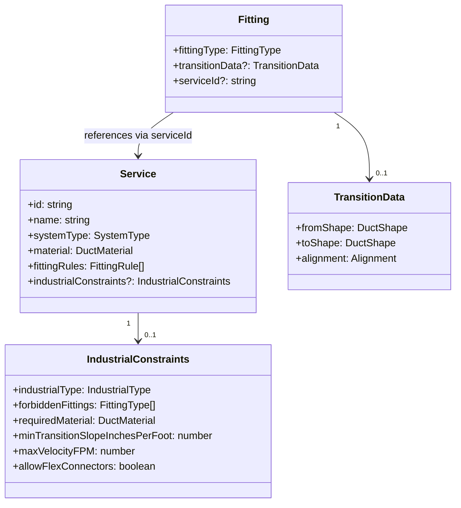
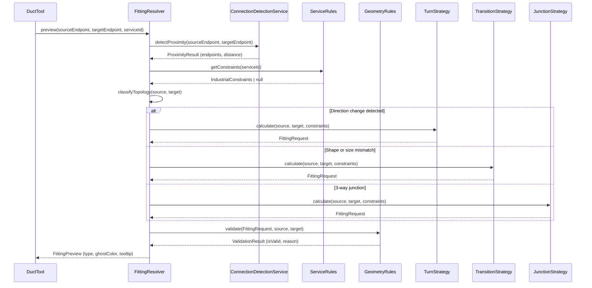

# Tech Plan — Auto-Fitting Resolver & Strategy Architecture


## 1. Architectural Approach

### Core Pattern: Adapter-Wrapped Resolver + Strategy Dispatch

The architecture is built on two interlocking patterns:

1. **Adapter (Resolver wraps ConnectionDetectionService)**: `FittingResolver` is the single public API for all fitting logic. It wraps `ConnectionDetectionService` as a private internal dependency — proximity detection is reused, classification is replaced. The existing `DuctTool` call site changes from calling `fittingInsertionService` directly to calling `FittingResolver`.

2. **Strategy (Resolver dispatches to specialist engines)**: Once topology is classified, the Resolver delegates to the appropriate `ITopoStrategy` implementation. Each strategy is a pure, stateless engine that knows only its own geometric problem.

### Two Execution Modes

The Resolver operates in two distinct modes, both sharing the same dispatch logic:

| Mode | Trigger | Output | Side Effects |
|---|---|---|---|
| **Preview** | `DuctTool.onMouseMove` (snap detected) | `FittingPreview` — type, isValid, reason, tooltip | None — read-only |
| **Commit** | `DuctTool.onMouseUp` (duct finalized) | `FittingRequest` — full fitting entity props | Creates entities via `createEntities()` |

This separation ensures the Ghost Preview never mutates state and the commit path is the single source of truth for entity creation.

### Key Constraints

- **Documentation scope only**: This plan specifies the architecture for PRD update. No code is changed in this initiative.
- **Existing pipeline preserved**: `ConnectionDetectionService` is not deleted — it becomes a private dependency of `FittingResolver`. The `fittingInsertionService` is superseded by the Strategy engines.
- **Service constraints travel with the entity**: Industrial rules are stored in `Service.industrialConstraints` (schema extension), not in a separate static file. This allows custom services to define their own rules.
- **Zod validation**: All new schema fields use Zod, consistent with the existing `service.schema.ts` and `fitting.schema.ts` patterns.
- **Pure Canvas 2D rendering**: Ghost Preview renders via the existing `CanvasRenderingContext2D` in `DuctTool.render()` — no new rendering library.

### Resolved Trade-offs

| Decision | Choice | Rationale |
|---|---|---|
| Resolver integration | Wrap as adapter | Preserves proximity detection logic; minimizes blast radius |
| Service constraints storage | Extend `ServiceSchema` | Constraints travel with service definition; user-configurable via custom services |
| Ghost Preview state | Resolver preview mode | Single source of truth for fitting type; no duplicated classification logic |

---

## 2. Data Model

### 2a. FittingType Enum — 6 New Values

The `FittingTypeSchema` Zod enum in `file:hvac-design-app/src/core/schema/fitting.schema.ts` is extended:

```
// Existing: 'elbow_90' | 'elbow_45' | 'tee' | 'reducer' | 'cap'
// New additions:
'transition_square_to_round'   // Rect → Round (spin-in or welded)
'reducer_tapered'              // Aerodynamic 15° convergence
'reducer_eccentric'            // Offset, flat-top or flat-bottom
'wye'                          // Y-branch, 45° split
'elbow_mitered'                // No-vane, industrial only
'end_boot'                     // Round → Rectangular terminal
```

Each new type requires a corresponding entry in `DEFAULT_FITTING_PROPS`.

### 2b. FittingPropsSchema — Alignment Field

The existing `transitionData` object in `FittingPropsSchema` gains one new optional field:

```
transitionData: {
  fromShape, toShape,           // existing
  fromDiameter, toDiameter,     // existing
  fromWidth, fromHeight,        // existing
  toWidth, toHeight,            // existing
  alignment: 'center_line' | 'flat_top' | 'flat_bottom'  // NEW
}
```

Default alignment is `center_line`. The `TransitionStrategy` reads this field to compute offset geometry.

### 2c. ServiceSchema — Industrial Constraints Extension

The `ServiceSchema` in `file:hvac-design-app/src/core/schema/service.schema.ts` gains a new optional `industrialConstraints` object:

```
industrialConstraints: {
  industrialType: 'kitchen_exhaust' | 'generator_exhaust'
                | 'commercial_supply' | 'fume_hood'  // discriminator
  forbiddenFittings: FittingType[]       // e.g. ['transition_square_to_round'] for spin-ins
  requiredMaterial: DuctMaterial         // e.g. 'black_iron_16ga' for grease
  minTransitionSlopeInchesPerFoot: number  // e.g. 3 for NFPA 96
  maxVelocityFPM: number                 // e.g. 4000 for kitchen exhaust
  allowFlexConnectors: boolean
  maxFlexLengthInches: number            // only relevant if allowFlexConnectors = true
  preferredElbowType: FittingType        // e.g. 'elbow_mitered' for industrial
}
```

All fields are optional within the object; the object itself is optional on `ServiceSchema`. Services without `industrialConstraints` fall through to standard ASHRAE logic.

### 2d. New Shared Types

Two new types are introduced to carry data between the Resolver and its consumers:

**`FittingPreview`** — output of Resolver in preview mode:
```
{
  fittingType: FittingType
  isValid: boolean
  invalidReason?: string       // e.g. "Spin-in forbidden by NFPA 96"
  tooltipText: string          // e.g. "Auto-inserting: 12×12 to 12Ø Transition (Black Iron)"
  ghostColor: 'green' | 'red'
}
```

**`FittingRequest`** — output of Strategy engines in commit mode:
```
{
  fittingType: FittingType
  material: DuctMaterial
  length?: number              // computed transition length in inches
  alignment?: 'center_line' | 'flat_top' | 'flat_bottom'
  angle?: number
  serviceId?: string
  autoInserted: true
}
```

### Entity Relationship



---

## 3. Component Architecture

### Module Map

The new `auto-fitting/` module lives at `src/features/canvas/auto-fitting/` and contains:

| Component | Responsibility |
|---|---|
| `FittingResolver` | Public API. Wraps `ConnectionDetectionService`. Classifies topology, dispatches to strategies, returns `FittingPreview` or `FittingRequest`. |
| `ITopoStrategy` | Interface contract all strategy engines must implement. Defines `calculate(source, target, serviceConstraints)` → `FittingRequest`. |
| `TurnStrategy` | Handles direction changes. Selects between `elbow_90`, `elbow_45`, `elbow_mitered` based on angle and service rules. |
| `TransitionStrategy` | Handles shape/size mismatches. Applies Connector Logic Matrix, Flat Side Rule, and service slope constraints. |
| `JunctionStrategy` | Handles 3-way and 4-way junctions. Selects between `tee`, `wye`, `cross` based on branch angles and service rules. |
| `TerminationStrategy` | Handles terminal connections. Selects between `cap`, `end_boot`, `grille` based on target entity type. |
| `ServiceRules` | Queries `Service.industrialConstraints`. Returns the applicable constraint set for a given service. Enforces forbidden fittings and required materials. |
| `GeometryRules` | Validates geometric feasibility. Enforces min gap (> 6 inches), max taper angle, slope requirements. Returns `{ isValid, reason }`. |

### Resolver Dispatch Flow



### Ghost Preview Integration

The existing `renderGhostFitting()` method in `file:hvac-design-app/src/features/canvas/tools/DuctTool.ts` is the integration point. In the new architecture:

1. `DuctTool.onMouseMove` detects a snap target (existing behavior)
2. Calls `FittingResolver.preview()` → receives `FittingPreview`
3. Passes `FittingPreview` to `renderGhostFitting()` which renders:
   - **Green arc/shape** if `ghostColor === 'green'`
   - **Red arc/shape** if `ghostColor === 'red'`
   - **Tooltip text** from `FittingPreview.tooltipText` (e.g., `"Auto-inserting: 12×12 to 12Ø Transition (Black Iron)"`)

The current stub only draws a blue elbow arc. The new version draws the correct fitting shape (arc for elbows, trapezoid for transitions, Y-shape for wyes) in the correct color.

### Ghost Preview Wireframe

```wireframe

<html>
<head>
<style>
  body { font-family: sans-serif; background: #1a1a2e; margin: 0; padding: 20px; }
  .canvas-area { background: #16213e; border: 1px solid #333; border-radius: 4px; padding: 0; position: relative; height: 320px; overflow: hidden; }
  .canvas-label { color: #888; font-size: 11px; padding: 6px 10px; border-bottom: 1px solid #333; }
  svg { width: 100%; height: 280px; }
  .tooltip { position: absolute; background: rgba(0,0,0,0.85); color: #fff; font-size: 11px; padding: 4px 8px; border-radius: 3px; border: 1px solid #555; pointer-events: none; }
  .tooltip.valid { border-color: #4caf50; }
  .tooltip.invalid { border-color: #f44336; }
  .legend { display: flex; gap: 20px; margin-top: 12px; }
  .legend-item { display: flex; align-items: center; gap: 6px; color: #aaa; font-size: 12px; }
  .dot { width: 12px; height: 12px; border-radius: 50%; }
  .dot.green { background: #4caf50; }
  .dot.red { background: #f44336; }
  .dot.blue { background: #2196f3; }
</style>
</head>
<body>
  <div class="canvas-area">
    <div class="canvas-label">Canvas Preview — Ghost Fitting States</div>
    <svg viewBox="0 0 600 280">
      
      <defs>
        <pattern id="grid" width="20" height="20" patternUnits="userSpaceOnUse">
          <path d="M 20 0 L 0 0 0 20" fill="none" stroke="#1e2a3a" stroke-width="0.5"></path>
        </pattern>
      </defs>
      <rect width="600" height="280" fill="url(#grid)"></rect>

      
      
      <rect x="40" y="95" width="120" height="20" fill="none" stroke="#555" stroke-width="2"></rect>
      <line x1="40" y1="105" x2="160" y2="105" stroke="#555" stroke-width="1" stroke-dasharray="4,3"></line>
      
      <polygon points="160,95 200,100 200,110 160,115" fill="rgba(76,175,80,0.15)" stroke="#4caf50" stroke-width="1.5" stroke-dasharray="4,2"></polygon>
      
      <line x1="200" y1="100" x2="280" y2="100" stroke="#555" stroke-width="2"></line>
      <line x1="200" y1="110" x2="280" y2="110" stroke="#555" stroke-width="2"></line>
      <line x1="200" y1="105" x2="280" y2="105" stroke="#555" stroke-width="1" stroke-dasharray="4,3"></line>
      
      <circle cx="160" cy="105" r="5" fill="none" stroke="#4caf50" stroke-width="1.5"></circle>
      <circle cx="200" cy="105" r="5" fill="none" stroke="#4caf50" stroke-width="1.5"></circle>
      
      <text x="160" y="140" fill="#4caf50" font-size="10" text-anchor="middle">✓ Valid</text>
      <text x="160" y="153" fill="#888" font-size="9" text-anchor="middle">12×12 → 12Ø Transition</text>

      
      
      <rect x="320" y="95" width="120" height="20" fill="none" stroke="#555" stroke-width="2"></rect>
      <line x1="320" y1="105" x2="440" y2="105" stroke="#555" stroke-width="1" stroke-dasharray="4,3"></line>
      
      <polygon points="440,95 480,100 480,110 440,115" fill="rgba(244,67,54,0.15)" stroke="#f44336" stroke-width="1.5" stroke-dasharray="4,2"></polygon>
      
      <line x1="480" y1="100" x2="560" y2="100" stroke="#555" stroke-width="2"></line>
      <line x1="480" y1="110" x2="560" y2="110" stroke="#555" stroke-width="2"></line>
      
      <circle cx="440" cy="105" r="5" fill="none" stroke="#f44336" stroke-width="1.5"></circle>
      <circle cx="480" cy="105" r="5" fill="none" stroke="#f44336" stroke-width="1.5"></circle>
      
      <line x1="455" y1="98" x2="465" y2="112" stroke="#f44336" stroke-width="2"></line>
      <line x1="465" y1="98" x2="455" y2="112" stroke="#f44336" stroke-width="2"></line>
      
      <text x="460" y="140" fill="#f44336" font-size="10" text-anchor="middle">✗ Invalid</text>
      <text x="460" y="153" fill="#888" font-size="9" text-anchor="middle">Spin-in forbidden (NFPA 96)</text>

      
      <text x="160" y="30" fill="#aaa" font-size="11" text-anchor="middle" font-weight="bold">Scenario A — Commercial Supply</text>
      <text x="460" y="30" fill="#aaa" font-size="11" text-anchor="middle" font-weight="bold">Scenario B — Kitchen Exhaust (Grease)</text>
      <line x1="300" y1="20" x2="300" y2="260" stroke="#333" stroke-width="1" stroke-dasharray="4,4"></line>
    </svg>

    
    <div class="tooltip valid" style="left: 120px; top: 160px;">
      Auto-inserting: 12×12 to 12Ø Transition (Galvanized)
    </div>
    
    <div class="tooltip invalid" style="left: 390px; top: 160px;">
      ✗ Spin-in forbidden by NFPA 96 — use Welded Transition
    </div>
  </div>

  <div class="legend">
    <div class="legend-item"><div class="dot green"></div> Valid fitting — geometry and service rules pass</div>
    <div class="legend-item"><div class="dot red"></div> Invalid — service rule violation or impossible geometry</div>
    <div class="legend-item"><div class="dot blue"></div> Snap detected — no fitting required (straight connection)</div>
  </div>
</body>
</html>
```

### ITopoStrategy Interface Contract

All strategy engines implement the same interface:

```
interface ITopoStrategy {
  calculate(
    source: ConnectionPoint,
    target: ConnectionPoint,
    constraints: IndustrialConstraints | null
  ): FittingRequest
}
```

This contract ensures every strategy is independently testable — unit tests for `TransitionStrategy` require no knowledge of `TurnStrategy` or the Resolver.

### Integration Points Summary

| Existing Component | Change Required |
|---|---|
| `file:hvac-design-app/src/features/canvas/tools/DuctTool.ts` | Replace `fittingInsertionService` call with `FittingResolver.commit()`; enhance `renderGhostFitting()` to accept `FittingPreview` |
| `file:hvac-design-app/src/core/services/connectionDetection.ts` | No change — becomes private dependency of `FittingResolver` |
| `file:hvac-design-app/src/core/services/automation/fittingInsertionService.ts` | Superseded by Strategy engines; deprecated but not deleted |
| `file:hvac-design-app/src/core/schema/fitting.schema.ts` | Add 6 new `FittingType` values; add `alignment` to `transitionData` |
| `file:hvac-design-app/src/core/schema/service.schema.ts` | Add optional `industrialConstraints` object |
    