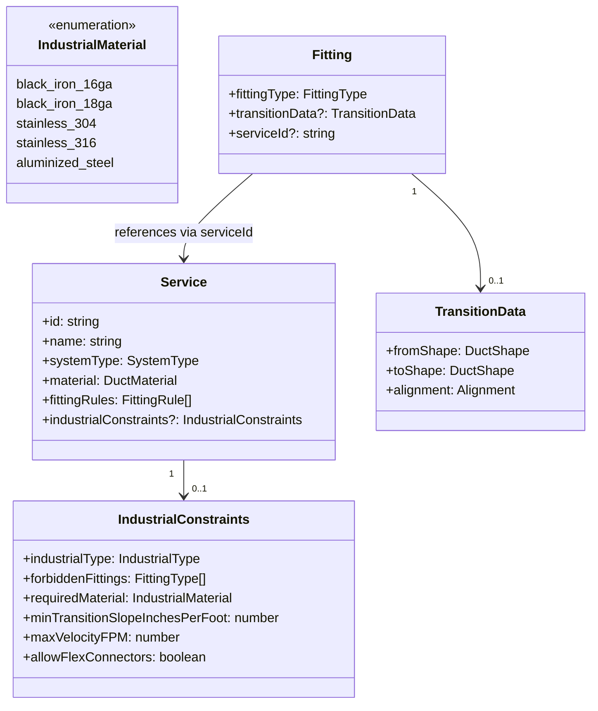
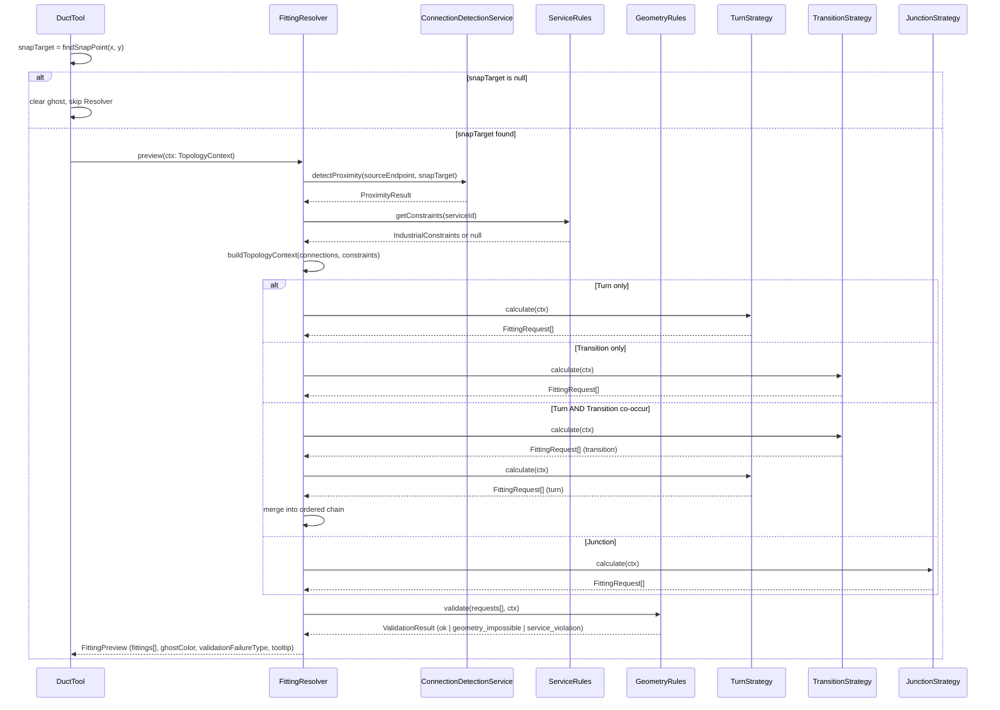

# Tech Plan — Auto-Fitting Resolver & Strategy Architecture

## 1. Architectural Approach

### Core Pattern: Adapter-Wrapped Resolver + Strategy Dispatch

The architecture is built on two interlocking patterns:

1. **Adapter (Resolver wraps ConnectionDetectionService)**: `FittingResolver` is the single public API for all fitting logic. It wraps `ConnectionDetectionService` as a private internal dependency — proximity detection is reused, classification is replaced. The existing `DuctTool` call site changes from calling `fittingInsertionService` directly to calling `FittingResolver`.
2. **Strategy (Resolver dispatches to specialist engines)**: Once topology is classified, the Resolver delegates to the appropriate `ITopoStrategy` implementation. Each strategy is a pure, stateless engine that knows only its own geometric problem.

### Two Execution Modes

The Resolver operates in two distinct modes, both sharing the same dispatch logic:


| Mode        | Trigger                                                      | Output                                                     | Side Effects                            |
| ----------- | ------------------------------------------------------------ | ---------------------------------------------------------- | --------------------------------------- |
| **Preview** | `DuctTool.onMouseMove` — **only when `snapTarget !== null**` | `FittingPreview` — type, isValid, failureType, tooltip     | None — read-only                        |
| **Commit**  | `DuctTool.onMouseUp` (duct finalized)                        | `FittingRequest[]` — ordered chain of fitting entity props | Creates entities via `createEntities()` |


This separation ensures the Ghost Preview never mutates state and the commit path is the single source of truth for entity creation.

**Ghost Preview performance gate**: `DuctTool.onMouseMove` must follow this sequence:

1. `snapTarget = findSnapPoint(x, y)`
2. If `snapTarget === null` → skip Resolver entirely, clear any existing ghost
3. If `snapTarget !== null` → call `FittingResolver.preview()`; optionally cache result keyed by `snapTarget.ductId` to skip re-runs when the snap target hasn't changed

### Validation Classification (Commit Mode)

When `FittingResolver.commit()` is called, `GeometryRules` classifies failures into two distinct types with different behaviors:


| Failure Type          | Meaning                                                                           | Commit Behavior                                                              | User Feedback                                          |
| --------------------- | --------------------------------------------------------------------------------- | ---------------------------------------------------------------------------- | ------------------------------------------------------ |
| `geometry_impossible` | Fitting physically cannot be inserted (gap < 6", impossible angle)                | **Hard block** — duct created, no fitting inserted                           | Toast: `"Cannot connect: [reason]"`                    |
| `service_violation`   | Fitting is geometrically valid but code-prohibited (e.g., spin-in on grease duct) | **Warn and insert** — fitting inserted with `constraintStatus = 'violation'` | Warning toast + red/orange indicator on canvas and BOM |
| `ok`                  | All checks pass                                                                   | Normal insert                                                                | None                                                   |


This distinction prevents corrupt geometry states while preserving the professional workflow of "draw now, fix violations later."

### Key Constraints

- **Documentation scope only**: This plan specifies the architecture for PRD update. No code is changed in this initiative.
- **Existing pipeline preserved**: `ConnectionDetectionService` is not deleted — it becomes a private dependency of `FittingResolver`. The `fittingInsertionService` is superseded by the Strategy engines.
- **Service constraints travel with the entity**: Industrial rules are stored in `Service.industrialConstraints` (schema extension), not in a separate static file. This allows custom services to define their own rules.
- **Zod validation**: All new schema fields use Zod, consistent with the existing `service.schema.ts` and `fitting.schema.ts` patterns.
- **Pure Canvas 2D rendering**: Ghost Preview renders via the existing `CanvasRenderingContext2D` in `DuctTool.render()` — no new rendering library.

### Resolved Trade-offs


| Decision                    | Choice                        | Rationale                                                                                                                        |
| --------------------------- | ----------------------------- | -------------------------------------------------------------------------------------------------------------------------------- |
| Resolver integration        | Wrap as adapter               | Preserves proximity detection logic; minimizes blast radius                                                                      |
| Service constraints storage | Extend `ServiceSchema`        | Constraints travel with service definition; user-configurable via custom services                                                |
| Ghost Preview state         | Resolver preview mode         | Single source of truth for fitting type; no duplicated classification logic                                                      |
| ITopoStrategy signature     | `TopologyContext` object      | Future-proof for N-duct junctions and metadata; avoids signature churn                                                           |
| Industrial material typing  | New `IndustrialMaterial` enum | Keeps `DuctMaterial` clean for air-side; embeds gauge into industrial type for code-grade precision                              |
| Commit-mode failure         | Two-class validation          | `geometry_impossible` hard-blocks; `service_violation` warns and flags — prevents corrupt geometry while preserving pro workflow |
| Co-occurring topology       | Compound `FittingRequest[]`   | Transition + Turn can both fire; Resolver assembles chain (transition first, then turn)                                          |
| Ghost Preview performance   | Snap-gate only                | Resolver only runs when `snapTarget !== null`; biggest win for least complexity                                                  |


---

## 2. Data Model

### 2a. FittingType Enum — 6 New Values

The `FittingTypeSchema` Zod enum in file:hvac-design-app/src/core/schema/fitting.schema.ts is extended:

```
// Existing: 'elbow_90' | 'elbow_45' | 'tee' | 'reducer' | 'cap'
// New additions:
'transition_square_to_round'   // Rect → Round (spin-in or welded)
'reducer_tapered'              // Aerodynamic 15° convergence
'reducer_eccentric'            // Offset, flat-top or flat-bottom
'wye'                          // Y-branch, 45° split
'elbow_mitered'                // No-vane, industrial only
'end_boot'                     // Round → Rectangular terminal
```

Each new type requires a corresponding entry in `DEFAULT_FITTING_PROPS`.

### 2b. FittingPropsSchema — Alignment Field

The existing `transitionData` object in `FittingPropsSchema` gains one new optional field:

```
transitionData: {
  fromShape, toShape,           // existing
  fromDiameter, toDiameter,     // existing
  fromWidth, fromHeight,        // existing
  toWidth, toHeight,            // existing
  alignment: 'center_line' | 'flat_top' | 'flat_bottom'  // NEW
}
```

Default alignment is `center_line`. The `TransitionStrategy` reads this field to compute offset geometry.

### 2c. New IndustrialMaterial Type

A new `IndustrialMaterialSchema` Zod enum is added to hvac-design-app/src/core/schema/service.schema.ts. It is **separate from** the existing `DuctMaterial` enum, which remains unchanged for general air-side use:

```
// Existing DuctMaterial (unchanged):
'galvanized' | 'stainless' | 'aluminum' | 'flex'

// New IndustrialMaterial (code-grade specifications with gauge embedded):
'black_iron_16ga'   // NFPA 96 grease duct standard
'black_iron_18ga'   // Lighter gauge industrial
'stainless_304'     // Fume hood / corrosive exhaust
'stainless_316'     // High-corrosion environments
'aluminized_steel'  // Generator exhaust / high-temp
```

Gauge is embedded in the enum value because it is a code-grade specification, not a user preference. An invalid combination (e.g., `black_iron_20ga` for NFPA 96) is impossible to represent at compile-time and schema-time by design.

### 2d. ServiceSchema — Industrial Constraints Extension

The `ServiceSchema` in file:hvac-design-app/src/core/schema/service.schema.ts gains a new optional `industrialConstraints` object:

```
industrialConstraints: {
  industrialType: 'kitchen_exhaust' | 'generator_exhaust'
                | 'commercial_supply' | 'fume_hood'  // discriminator
  forbiddenFittings: FittingType[]          // e.g. ['transition_square_to_round'] for spin-ins
  requiredMaterial: IndustrialMaterial      // e.g. 'black_iron_16ga' for NFPA 96 grease
  minTransitionSlopeInchesPerFoot: number   // e.g. 3 for NFPA 96
  maxVelocityFPM: number                    // e.g. 4000 for kitchen exhaust
  allowFlexConnectors: boolean
  maxFlexLengthInches: number               // only relevant if allowFlexConnectors = true
  preferredElbowType: FittingType           // e.g. 'elbow_mitered' for industrial
}
```

All fields are optional within the object; the object itself is optional on `ServiceSchema`. Services without `industrialConstraints` fall through to standard ASHRAE logic. Migration impact is low — this is a new field domain that does not touch existing air-duct entities.

### 2e. New Shared Types

Three new types are introduced to carry data between the Resolver and its consumers:

`**TopologyContext**` — the single input to all Strategy engines:

```
{
  connections: ConnectionPoint[]          // 2 for turn/transition; 3+ for junctions
  topologyType: 'turn' | 'transition'
             | 'junction' | 'termination' | 'straight'
  constraints: {
    service: Service | null
    industrial: IndustrialConstraints | null
  }
  // Optional metadata for advanced strategies:
  angleDeg?: number                       // angle between primary ducts
  primaryRunIndex?: number                // index of the main-run duct in connections[]
  branchIndices?: number[]               // indices of branch ducts
  shapeSignature?: string                // e.g. 'rect->round' for fast matrix lookup
}
```

Strategies validate `connections.length` at entry: Turn/Transition require exactly 2; JunctionStrategy requires ≥ 3.

`**FittingPreview**` — output of Resolver in preview mode:

```
{
  fittings: Array<{ fittingType: FittingType; sequenceIndex: number }>
  isValid: boolean
  validationFailureType?: 'geometry_impossible' | 'service_violation'
  invalidReason?: string       // e.g. "Spin-in forbidden by NFPA 96"
  tooltipText: string          // e.g. "Auto-inserting: 12×12→ 12Ø Transition + 45° Elbow"
  ghostColor: 'green' | 'red'
}
```

`**FittingRequest**` — output of Strategy engines; strategies return an **ordered array**:

```
// Strategies return: FittingRequest[]
{
  fittingType: FittingType
  material: DuctMaterial | IndustrialMaterial
  length?: number              // computed transition length in inches
  alignment?: 'center_line' | 'flat_top' | 'flat_bottom'
  angle?: number
  serviceId?: string
  sequenceIndex: number        // 0 = first in chain (e.g. transition before elbow)
  autoInserted: true
}
```

**Compound chain ordering rule**: When multiple fittings are required (e.g., shape mismatch at an angle), the Resolver assembles them in this order: **Transition first, Turn second**. The elbow is defined on the resulting shape/orientation after the transition. For junctions, the junction fitting dominates; per-branch transitions are appended as additional items in the array.

### Entity Relationship



---

## 3. Component Architecture

### Module Map

The new `auto-fitting/` module lives at `src/features/canvas/auto-fitting/` and contains:


| Component             | Responsibility                                                                                                                                                                                                              |
| --------------------- | --------------------------------------------------------------------------------------------------------------------------------------------------------------------------------------------------------------------------- |
| `FittingResolver`     | Public API. Wraps `ConnectionDetectionService`. Builds `TopologyContext`, dispatches to strategies, assembles compound `FittingRequest[]` chain, returns `FittingPreview` (preview mode) or creates entities (commit mode). |
| `ITopoStrategy`       | Interface contract all strategy engines must implement. Defines `calculate(ctx: TopologyContext)` → `FittingRequest[]`. Turn/Transition assert `connections.length === 2`; JunctionStrategy asserts `>= 3`.                 |
| `TurnStrategy`        | Handles direction changes. Selects between `elbow_90`, `elbow_45`, `elbow_mitered` based on angle and service rules.                                                                                                        |
| `TransitionStrategy`  | Handles shape/size mismatches. Applies Connector Logic Matrix, Flat Side Rule, and service slope constraints.                                                                                                               |
| `JunctionStrategy`    | Handles 3-way and 4-way junctions. Selects between `tee`, `wye`, `cross` based on branch angles and service rules.                                                                                                          |
| `TerminationStrategy` | Handles terminal connections. Selects between `cap`, `end_boot`, `grille` based on target entity type.                                                                                                                      |
| `ServiceRules`        | Queries `Service.industrialConstraints`. Returns the applicable constraint set for a given service. Enforces forbidden fittings and required materials.                                                                     |
| `GeometryRules`       | Validates geometric feasibility. Enforces min gap (> 6 inches), max taper angle, slope requirements. Returns `{ isValid, reason }`.                                                                                         |


### Resolver Dispatch Flow



### Ghost Preview Integration

The existing `renderGhostFitting()` method in file:hvac-design-app/src/features/canvas/tools/DuctTool.ts is the integration point. In the new architecture:

1. `DuctTool.onMouseMove` calls `findSnapPoint()` — **existing behavior unchanged**
2. **If `snapTarget === null**`: clear any existing ghost and return immediately — Resolver is never called
3. **If `snapTarget !== null**`: call `FittingResolver.preview(ctx)` → receives `FittingPreview`
4. Optionally check cached result: if `snapTarget.ductId` matches last preview's target, reuse cached `FittingPreview` without re-running the pipeline
5. Pass `FittingPreview` to `renderGhostFitting()` which renders:
  - **Green shape** if `ghostColor === 'green'` (all checks pass)
  - **Red shape** if `ghostColor === 'red'` — tooltip distinguishes `geometry_impossible` vs `service_violation`
  - **Compound ghost**: if `FittingPreview.fittings` contains multiple items (e.g., transition + elbow), render each in sequence
  - **Tooltip text** from `FittingPreview.tooltipText` (e.g., `"Auto-inserting: 12×12→ 12Ø Transition + 45° Elbow"`)

The current stub only draws a blue elbow arc. The new version draws the correct fitting shape per type (arc for elbows, trapezoid for transitions, Y-shape for wyes) in the correct color, and can render a chain of ghost shapes for compound results.

### Ghost Preview Wireframe

```wireframe

<html>
<head>
<style>
  body { font-family: sans-serif; background: #1a1a2e; margin: 0; padding: 20px; }
  .canvas-area { background: #16213e; border: 1px solid #333; border-radius: 4px; padding: 0; position: relative; height: 320px; overflow: hidden; }
  .canvas-label { color: #888; font-size: 11px; padding: 6px 10px; border-bottom: 1px solid #333; }
  svg { width: 100%; height: 280px; }
  .tooltip { position: absolute; background: rgba(0,0,0,0.85); color: #fff; font-size: 11px; padding: 4px 8px; border-radius: 3px; border: 1px solid #555; pointer-events: none; }
  .tooltip.valid { border-color: #4caf50; }
  .tooltip.invalid { border-color: #f44336; }
  .legend { display: flex; gap: 20px; margin-top: 12px; }
  .legend-item { display: flex; align-items: center; gap: 6px; color: #aaa; font-size: 12px; }
  .dot { width: 12px; height: 12px; border-radius: 50%; }
  .dot.green { background: #4caf50; }
  .dot.red { background: #f44336; }
  .dot.blue { background: #2196f3; }
</style>
</head>
<body>
  <div class="canvas-area">
    <div class="canvas-label">Canvas Preview — Ghost Fitting States</div>
    <svg viewBox="0 0 600 280">
      
      <defs>
        <pattern id="grid" width="20" height="20" patternUnits="userSpaceOnUse">
          <path d="M 20 0 L 0 0 0 20" fill="none" stroke="#1e2a3a" stroke-width="0.5"></path>
        </pattern>
      </defs>
      <rect width="600" height="280" fill="url(#grid)"></rect>

      
      
      <rect x="40" y="95" width="120" height="20" fill="none" stroke="#555" stroke-width="2"></rect>
      <line x1="40" y1="105" x2="160" y2="105" stroke="#555" stroke-width="1" stroke-dasharray="4,3"></line>
      
      <polygon points="160,95 200,100 200,110 160,115" fill="rgba(76,175,80,0.15)" stroke="#4caf50" stroke-width="1.5" stroke-dasharray="4,2"></polygon>
      
      <line x1="200" y1="100" x2="280" y2="100" stroke="#555" stroke-width="2"></line>
      <line x1="200" y1="110" x2="280" y2="110" stroke="#555" stroke-width="2"></line>
      <line x1="200" y1="105" x2="280" y2="105" stroke="#555" stroke-width="1" stroke-dasharray="4,3"></line>
      
      <circle cx="160" cy="105" r="5" fill="none" stroke="#4caf50" stroke-width="1.5"></circle>
      <circle cx="200" cy="105" r="5" fill="none" stroke="#4caf50" stroke-width="1.5"></circle>
      
      <text x="160" y="140" fill="#4caf50" font-size="10" text-anchor="middle">✓ Valid</text>
      <text x="160" y="153" fill="#888" font-size="9" text-anchor="middle">12×12 → 12Ø Transition</text>

      
      
      <rect x="320" y="95" width="120" height="20" fill="none" stroke="#555" stroke-width="2"></rect>
      <line x1="320" y1="105" x2="440" y2="105" stroke="#555" stroke-width="1" stroke-dasharray="4,3"></line>
      
      <polygon points="440,95 480,100 480,110 440,115" fill="rgba(244,67,54,0.15)" stroke="#f44336" stroke-width="1.5" stroke-dasharray="4,2"></polygon>
      
      <line x1="480" y1="100" x2="560" y2="100" stroke="#555" stroke-width="2"></line>
      <line x1="480" y1="110" x2="560" y2="110" stroke="#555" stroke-width="2"></line>
      
      <circle cx="440" cy="105" r="5" fill="none" stroke="#f44336" stroke-width="1.5"></circle>
      <circle cx="480" cy="105" r="5" fill="none" stroke="#f44336" stroke-width="1.5"></circle>
      
      <line x1="455" y1="98" x2="465" y2="112" stroke="#f44336" stroke-width="2"></line>
      <line x1="465" y1="98" x2="455" y2="112" stroke="#f44336" stroke-width="2"></line>
      
      <text x="460" y="140" fill="#f44336" font-size="10" text-anchor="middle">✗ Invalid</text>
      <text x="460" y="153" fill="#888" font-size="9" text-anchor="middle">Spin-in forbidden (NFPA 96)</text>

      
      <text x="160" y="30" fill="#aaa" font-size="11" text-anchor="middle" font-weight="bold">Scenario A — Commercial Supply</text>
      <text x="460" y="30" fill="#aaa" font-size="11" text-anchor="middle" font-weight="bold">Scenario B — Kitchen Exhaust (Grease)</text>
      <line x1="300" y1="20" x2="300" y2="260" stroke="#333" stroke-width="1" stroke-dasharray="4,4"></line>
    </svg>

    
    <div class="tooltip valid" style="left: 120px; top: 160px;">
      Auto-inserting: 12×12 to 12Ø Transition (Galvanized)
    </div>
    
    <div class="tooltip invalid" style="left: 390px; top: 160px;">
      ✗ Spin-in forbidden by NFPA 96 — use Welded Transition
    </div>
  </div>

  <div class="legend">
    <div class="legend-item"><div class="dot green"></div> Valid fitting — geometry and service rules pass</div>
    <div class="legend-item"><div class="dot red"></div> Invalid — service rule violation or impossible geometry</div>
    <div class="legend-item"><div class="dot blue"></div> Snap detected — no fitting required (straight connection)</div>
  </div>
</body>
</html>
```

### ITopoStrategy Interface Contract

All strategy engines implement the same interface:

```
interface ITopoStrategy {
  calculate(ctx: TopologyContext): FittingRequest[]
}
```

All strategies receive a single `TopologyContext` and return an **ordered array** of `FittingRequest` objects (empty array if no fitting is needed). Strategies validate `ctx.connections.length` at entry:

- `TurnStrategy` and `TransitionStrategy`: assert `connections.length === 2`
- `JunctionStrategy`: assert `connections.length >= 3`

This contract ensures every strategy is independently testable — unit tests for `TransitionStrategy` require no knowledge of `TurnStrategy` or the Resolver. Tests construct a `TopologyContext` directly without mocking the full pipeline.

### Integration Points Summary


| Existing Component                                                           | Change Required                                                                                                                                                                                                      |
| ---------------------------------------------------------------------------- | -------------------------------------------------------------------------------------------------------------------------------------------------------------------------------------------------------------------- |
| file:hvac-design-app/src/features/canvas/tools/DuctTool.ts                   | Replace `fittingInsertionService` call with `FittingResolver.commit()`; add snap-gate to `onMouseMove`; enhance `renderGhostFitting()` to accept `FittingPreview` with compound fittings and `validationFailureType` |
| file:hvac-design-app/src/core/services/connectionDetection.ts                | No change — becomes private dependency of `FittingResolver`                                                                                                                                                          |
| file:hvac-design-app/src/core/services/automation/fittingInsertionService.ts | Superseded by Strategy engines; deprecated but not deleted                                                                                                                                                           |
| file:hvac-design-app/src/core/schema/service.schema.ts                       | Add optional `industrialConstraints` object; add new `IndustrialMaterialSchema` Zod enum                                                                                                                             |
| file:hvac-design-app/src/core/schema/fitting.schema.ts                       | Add 6 new `FittingType` values; add `alignment` to `transitionData`; update `FittingRequest` to array output                                                                                                         |


