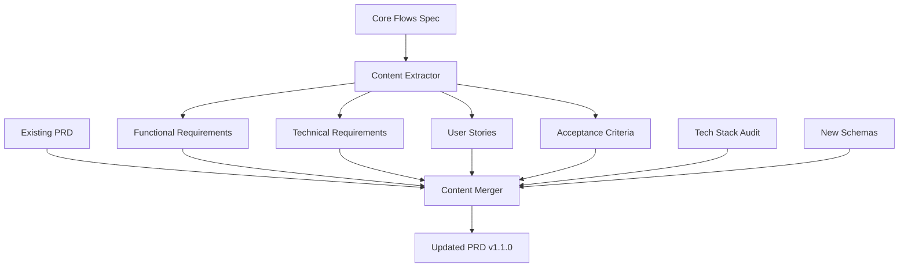
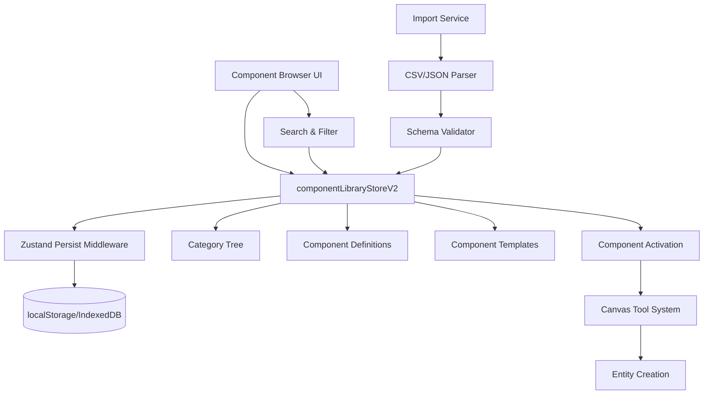
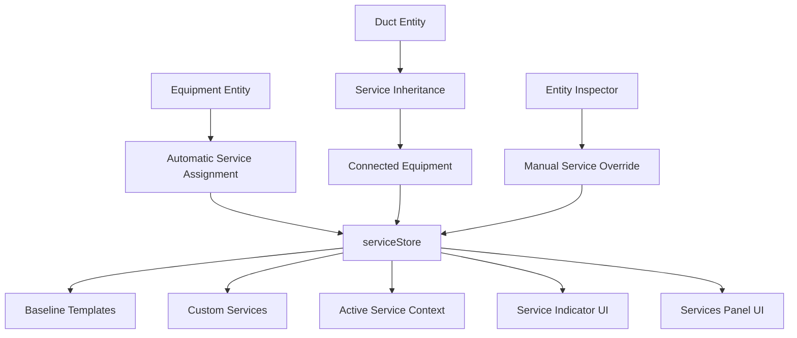
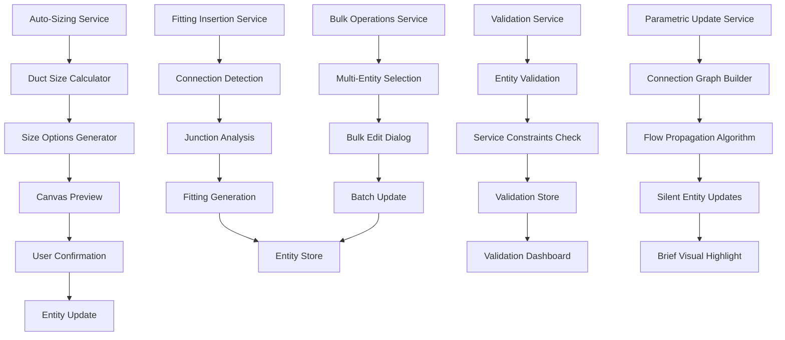

# Technical Plan - PRD Enhancement & Feature Architecture Documentation

This technical plan addresses two objectives:
1. **Documentation Strategy**: How to update `file:docs/PRD.md` to reflect evolved features
2. **Feature Architecture**: Technical architecture of Component Library, Service System, and Automation features

---

## Part A: Documentation Strategy

### Architectural Approach

**1. Incremental Enhancement Pattern**

The PRD update follows an **incremental enhancement** approach rather than a complete rewrite:

- **Preserve existing structure**: Maintain the current section organization (Functional Requirements, Technical Requirements, User Stories, Acceptance Criteria)
- **Insert new sections**: Add new subsections within existing categories rather than creating entirely new top-level sections
- **Version tracking**: Update version from 1.0.0 to 1.1.0 to reflect significant additions
- **Cross-reference**: Link new content to existing sections where features interact

**Rationale**: The existing PRD has a solid structure. Incremental updates minimize disruption while ensuring completeness.

**2. Content Integration Strategy**

New content will be integrated using a **layered documentation** approach:

```
Layer 1: High-Level Overview (Executive Summary)
  ↓
Layer 2: Functional Requirements (What users can do)
  ↓
Layer 3: Technical Requirements (How it's built)
  ↓
Layer 4: User Stories (Detailed workflows)
  ↓
Layer 5: Acceptance Criteria (Testable outcomes)
```

Each new feature (Component Library, Services, Automation) will be documented across all layers for consistency.

**3. Technology Stack Updates**

Update outdated version numbers using a **version audit table**:

| Component | Current (PRD) | Actual (Codebase) | Action |
|-----------|---------------|-------------------|--------|
| Tauri | 1.x | 2.10.1 | Update to 2.x |
| Next.js | 14.x | 16.1.5 | Update to 16.x |
| Zustand | 4.x | 5.0.11 | Update to 5.x |
| Zod | 3.x | 4.3.6 | Update to 4.x |

**Constraint**: Maintain backward compatibility references for teams using older versions.

**4. Schema Documentation Pattern**

New entity schemas (Note, Group, UnifiedComponent) will follow the existing pattern:

```typescript
// Pattern established in PRD Section 3.3
interface NewEntity extends BaseEntity {
  type: 'entity_type';
  props: { /* properties */ };
  calculated?: { /* derived values */ };
}
```

**Trade-off**: Consistency vs. completeness. We prioritize consistency with existing schema documentation style over exhaustive technical details.

---

### Data Model

**1. PRD Document Structure**

The PRD is a **single markdown file** with hierarchical sections. New content will be inserted as follows:

```
docs/PRD.md
├── 1. Executive Summary
│   └── [UPDATE] Add Component Library, Services, Automation to MVP goals
├── 2. Functional Requirements
│   ├── 2.1 Dashboard (existing)
│   ├── 2.2 Canvas Interface (existing)
│   ├── [NEW] 2.3 Component Library Management
│   ├── [NEW] 2.4 Service System
│   ├── [NEW] 2.5 Automation Features
│   ├── 2.6 Calculations Engine (existing, renumbered)
│   └── ...
├── 3. Technical Requirements
│   ├── 3.1 Technology Stack [UPDATE versions]
│   ├── 3.2 Architecture Patterns (existing)
│   ├── 3.3 Data Models
│   │   ├── [UPDATE] Add Note, Group, UnifiedComponent schemas
│   │   └── [NEW] Add Service schema
│   └── [NEW] 3.4 State Management Architecture
├── 4. User Stories
│   ├── [NEW] 4.X Component Library Stories
│   ├── [NEW] 4.Y Service Management Stories
│   └── [NEW] 4.Z Automation Stories
└── 5. Acceptance Criteria
    └── [NEW] Criteria for new features
```

**2. Content Mapping from Core Flows Spec**

Map content from `spec:49e1d357-1c5b-462c-a59e-409059a9ca4c/7d4caa2f-3386-4a8b-ae8d-9b3656a2233f`:

| Core Flows Section | PRD Destination | Transformation |
|--------------------|-----------------|----------------|
| 1. Component Library Management | FR-2.3 + US-4.X | Extract functional requirements, convert flows to user stories |
| 2. Service System | FR-2.4 + US-4.Y + TR-3.3 | Add functional requirements, user stories, and Service schema |
| 3. Auto-Sizing | FR-2.5.1 + US-4.Z.1 | Extract as automation subsection |
| 4. Fitting Insertion | FR-2.5.2 + US-4.Z.2 | Extract as automation subsection |
| 5. Bulk Operations | FR-2.5.3 + US-4.Z.3 | Extract as automation subsection |
| 6. Validation Dashboard | FR-2.5.4 + US-4.Z.4 | Extract as automation subsection |
| 7. Parametric Updates | FR-2.5.5 + US-4.Z.5 | Extract as automation subsection |

**3. Reference Integrity**

Maintain cross-references between sections:

```markdown

See [Component Library Schema](#component-library-schema) for data structure.
Refer to [Auto-Sizing User Story](#us-auto-001) for workflow details.
```

---

### Component Architecture

**1. Documentation Components**

The PRD update consists of these logical components:

- **Content Extractor**: Logic to extract relevant information from Core Flows spec
- **Section Generator**: Templates for each PRD section type (FR, TR, US, AC)
- **Version Updater**: Update version numbers and technology stack
- **Cross-Reference Linker**: Ensure internal links remain valid
- **Table of Contents Generator**: Auto-update TOC with new sections

**2. Integration Points**

New content integrates with existing PRD at these points:



**3. Quality Gates**

Before finalizing PRD updates:

- **Consistency Check**: All new sections follow existing formatting patterns
- **Completeness Check**: Each feature documented across all layers (FR → TR → US → AC)
- **Link Validation**: All internal references resolve correctly
- **Version Alignment**: Technology versions match `file:hvac-design-app/package.json`

---

## Part B: Feature Architecture Documentation

### Architectural Approach

**1. Component Library System**

The Component Library follows a **centralized catalog pattern** with hierarchical organization:

**Key Architectural Decisions**:

- **Unified Component Model**: Single `UnifiedComponentDefinition` schema combines ComponentDefinition, CatalogItem, and Service concepts
- **Hierarchical Categories**: Tree structure allows nested categorization (e.g., Ducts → Round → Galvanized)
- **Template System**: Reusable component templates with preset configurations
- **Persistence Strategy**: Zustand persist middleware stores library in browser localStorage/IndexedDB

**Trade-offs**:
- ✅ **Pro**: Single source of truth for all component data
- ✅ **Pro**: Flexible categorization supports complex taxonomies
- ⚠️ **Con**: Large libraries may impact initial load time (mitigated by lazy loading)

**Constraints**:
- Must support both baseline (system-provided) and custom (user-created) components
- Import/export must handle CSV and JSON formats
- Component activation must integrate with existing tool system

**2. Service System**

The Service System uses a **context-based assignment pattern** with automatic propagation:

**Key Architectural Decisions**:

- **Service as Context**: Services define the "working context" for duct/equipment creation
- **Automatic Inheritance**: New entities inherit service from connected equipment/ducts
- **Template-Based**: Baseline service templates provide starting points
- **Color Coding**: Visual differentiation via service-specific colors

**Trade-offs**:
- ✅ **Pro**: Reduces manual service assignment (automatic propagation)
- ✅ **Pro**: Visual feedback via color coding improves UX
- ⚠️ **Con**: Automatic assignment may occasionally be incorrect (mitigated by manual override)

**Constraints**:
- Service assignment must not break existing entity connections
- Color coding must be accessible (WCAG AA compliance)
- Service changes must trigger validation re-runs

**3. Automation Features**

Automation follows a **reactive calculation pattern** with user confirmation:

**Key Architectural Decisions**:

- **Auto-Sizing**: Reactive calculations triggered by airflow changes, user confirms suggestions
- **Fitting Insertion**: Fully automatic on connection, user can edit/delete afterward
- **Bulk Operations**: Context-menu triggered, batch updates with preview
- **Validation**: Real-time validation with dashboard aggregation
- **Parametric Updates**: Silent propagation with brief visual feedback

**Trade-offs**:
- ✅ **Pro**: Reduces repetitive manual work
- ✅ **Pro**: Maintains data consistency across connected entities
- ⚠️ **Con**: Automatic changes may surprise users (mitigated by undo support and visual feedback)

**Constraints**:
- All automation must be undoable as single operation
- Performance must remain acceptable with 500+ entities
- Validation must complete within 1 second

---

### Data Model

**1. Component Library Schema**

```typescript
// Unified Component Definition
interface UnifiedComponentDefinition {
  // Identity
  id: string;
  name: string;
  category: 'duct' | 'fitting' | 'equipment' | 'accessory';
  type: string;
  subtype?: string;
  
  // Catalog Information
  manufacturer?: string;
  model?: string;
  partNumber?: string;
  sku?: string;
  description?: string;
  thumbnail?: string;
  
  // Service Integration
  systemType?: 'supply' | 'return' | 'exhaust';
  pressureClass?: 'low' | 'medium' | 'high';
  
  // Engineering Properties
  engineeringProperties: {
    frictionFactor: number;
    maxVelocity: number;
    minVelocity?: number;
    pressureCoefficient?: number;
    roughness?: number;
  };
  
  // Pricing
  pricing: {
    materialCost: number;
    laborUnits: number;
    laborRate?: number;
    wasteFactor: number;
    markup?: number;
  };
  
  // Materials
  materials: MaterialSpec[];
  defaultDimensions?: Record<string, number>;
  
  // Metadata
  tags?: string[];
  customFields?: Record<string, unknown>;
  isCustom: boolean;
  createdAt?: Date;
  updatedAt?: Date;
}

// Hierarchical Categories
interface ComponentCategory {
  id: string;
  name: string;
  parentId: string | null;
  description?: string;
  icon?: string;
  subcategories?: ComponentCategory[];
}

// Component Templates
interface ComponentTemplate {
  id: string;
  name: string;
  description?: string;
  componentId: string;
  dimensions?: Record<string, number>;
  materialId?: string;
  engineeringOverrides?: {
    airflow?: number;
    velocity?: number;
    pressureClass?: string;
  };
  createdBy?: string;
  isShared: boolean;
  createdAt?: Date;
}
```

**Relationships**:
- Component → Category (many-to-one)
- Component → Materials (one-to-many)
- Template → Component (many-to-one)
- Component → Canvas Entity (one-to-many via `catalogItemId`)

**2. Service Schema**

```typescript
// Service Definition
interface Service {
  id: string;
  name: string;
  description?: string;
  systemType: 'supply' | 'return' | 'exhaust';
  material: 'galvanized' | 'stainless' | 'aluminum' | 'fiberglass' | 'flexible';
  pressureClass: 'low' | 'medium' | 'high';
  
  // Dimensional Constraints
  dimensionalConstraints: {
    minDiameter: number;
    maxDiameter: number;
    minWidth: number;
    maxWidth: number;
    minHeight: number;
    maxHeight: number;
    allowedShapes: ('round' | 'rectangular')[];
  };
  
  // Fitting Rules
  fittingRules: Array<{ angle: number; fittingType: string; preference: string }>;
  
  // Preferences
  manufacturerPreferences: string[];
  
  // Metadata
  source: 'baseline' | 'custom';
  color: string; // Hex color for visual coding
  createdAt?: Date;
  updatedAt?: Date;
}

// Service Template (baseline)
interface ServiceTemplate extends Omit<Service, 'id' | 'createdAt' | 'updatedAt'> {
  id: string;
  isTemplate: true;
}
```

**Relationships**:
- Service → Entities (one-to-many via `serviceId` on Duct/Equipment)
- ServiceTemplate → Service (template-to-instance via cloning)

**3. New Entity Schemas**

```typescript
// Note Entity (for canvas annotations)
interface Note extends BaseEntity {
  type: 'note';
  props: {
    content: string; // 1-10,000 chars
    fontSize: number; // 8-72
    color: string; // Hex color
  };
}

// Group Entity (for grouping multiple entities)
interface Group extends BaseEntity {
  type: 'group';
  props: {
    name: string; // 1-100 chars
    childIds: string[]; // Min 2 entities
  };
}
```

**Integration with Existing Schemas**:
- Both extend `BaseEntity` (id, type, transform, zIndex, timestamps)
- Stored in same `entityStore` as Room, Duct, Equipment, Fitting
- Rendered by specialized renderers in render loop

**4. Automation Data Structures**

```typescript
// Auto-Sizing Result
interface SizeOption {
  size: {
    diameter?: number;
    width?: number;
    height?: number;
  };
  velocity: number; // FPM
  pressureDrop: number; // in.w.g./100ft
  recommendation: string; // "Optimal", "Low velocity", etc.
}

// Validation Result
interface ValidationResult {
  entityId: string;
  serviceId: string;
  catalogStatus: 'resolved' | 'unresolved';
  catalogMessage?: string;
  violations: Array<{ severity: 'blocker' | 'warning' | 'info'; message: string; field?: string }>;
}

// Bulk Edit Changes
interface BulkEditChanges {
  material?: string;
  insulation?: string;
  costMarkup?: number;
  systemAssignment?: string;
  category?: string;
}
```

---

### Component Architecture

**1. Component Library Architecture**



**Key Components**:

- **componentLibraryStoreV2**: Zustand store managing all component library state
  - Normalized storage: components by ID, categories as tree
  - Actions: add/update/delete components, search, filter, activate
  - Persistence: Auto-saves to localStorage with `sws.componentLibrary.v2` key

- **UnifiedComponentBrowser**: React component for browsing/selecting
  - Hierarchical category tree (expandable/collapsible)
  - Search with fuzzy matching on name/description/tags
  - Active component indicator
  - Integration with tool system

- **Import/Export Services**:
  - CSV parser with column mapping
  - JSON validator using Zod schemas
  - Preview before import
  - Error handling with detailed messages

**Integration Points**:
- **Tool System**: Component activation switches active tool (duct/fitting/equipment)
- **Entity Store**: Created entities reference component via `catalogItemId`
- **Validation**: Components provide constraints for entity validation

**2. Service System Architecture**



**Key Components**:

- **serviceStore**: Zustand store with Immer middleware
  - Baseline templates: 4 predefined services (Supply Low/Medium, Return, Exhaust)
  - Custom services: User-created via cloning
  - Active service: Current working context
  - Actions: add/update/remove, setActive, clone

- **Service Assignment Logic**:
  - Equipment placement: Service assigned based on equipment type
  - Duct creation: Inherits from connected equipment/duct
  - Propagation: Service flows through duct network
  - Manual override: User can change via inspector

- **Visual Indicators**:
  - Toolbar: Persistent service indicator with name, color, system type
  - Canvas: Entities color-coded by service
  - Services Panel: List with filter by system type

**Integration Points**:
- **Entity Store**: Entities have `serviceId` property
- **Validation**: Service constraints validate entity dimensions
- **Component Library**: Components can specify `systemType`

**3. Automation Architecture**



**Key Components**:

- **AutoSizingService**:
  - Calculates optimal duct sizes based on airflow
  - Generates 3-4 options with different velocity targets
  - Provides pressure drop calculations
  - Triggers on airflow change (300ms debounce)

- **FittingInsertionService**:
  - Detects duct connections (12px tolerance)
  - Analyzes junction angle and sizes
  - Selects appropriate fitting type (elbow/tee/wye)
  - Inserts fitting automatically

- **BulkOperationsService**:
  - Supports batch updates to multiple entities
  - Properties: material, insulation, cost markup, system assignment
  - Preview before apply
  - Single undo operation

- **ValidationAggregationService**:
  - Real-time validation of entities
  - Groups issues by service
  - Severity levels: blocker, warning, info
  - Dashboard with click-to-navigate

- **ParametricUpdateService**:
  - Propagates changes through connected entities
  - Uses Leaf Peeling algorithm for flow distribution
  - Silent updates with 0.5s highlight
  - Full undo support

**Integration Points**:
- **Entity Store**: All services read/write entity state
- **Canvas Rendering**: Preview overlays, highlights
- **Command System**: All updates wrapped in commands for undo
- **Validation Store**: Separate store for validation results

---

## Implementation Considerations

### Performance Constraints

- **Component Library**: Lazy load categories/components (virtualized list for 1000+ items)
- **Service Assignment**: O(1) lookup via indexed service store
- **Validation**: Debounced validation (300ms) to avoid excessive re-runs
- **Parametric Updates**: Graph traversal optimized with memoization

### Error Handling

- **Import Failures**: Show detailed error messages with row numbers
- **Validation Errors**: Non-blocking warnings, blocking errors prevent export
- **Service Assignment**: Fallback to default service if automatic assignment fails
- **Undo Failures**: Log error, maintain state consistency

### Testing Strategy

- **Unit Tests**: Zustand stores, calculation services, validation logic
- **Integration Tests**: Component activation → tool switch → entity creation
- **E2E Tests**: Full user flows from Core Flows spec
- **Performance Tests**: 500+ entities, bulk operations on 100+ items

---

## Migration Path

### Existing Projects

Projects created before Component Library/Services implementation:

1. **Auto-Migration**: On project load, create default service assignments
2. **Component Resolution**: Map existing entities to baseline components
3. **Validation**: Run validation, flag unresolved items
4. **User Action**: Resolve unresolved items via Resolution Wizard

### Backward Compatibility

- **File Format**: `.sws` files remain JSON-based, new fields optional
- **Schema Versioning**: `schemaVersion` field tracks format version
- **Graceful Degradation**: Missing component/service data uses defaults

---

## Documentation Deliverables

### PRD Updates

1. **Section 2.3**: Component Library Management (Functional Requirements)
2. **Section 2.4**: Service System (Functional Requirements)
3. **Section 2.5**: Automation Features (Functional Requirements)
4. **Section 3.1**: Updated Technology Stack versions
5. **Section 3.3**: New entity schemas (Note, Group, UnifiedComponent, Service)
6. **Section 3.4**: State Management Architecture (new section)
7. **Section 4.X-Z**: User Stories for new features
8. **Section 5.X-Z**: Acceptance Criteria for new features

### Supporting Documentation

1. **ARCHITECTURE.md**: Update with Component Library and Service System
2. **User Journey docs**: Add flows for component selection, service management
3. **API Documentation**: Document store interfaces and service APIs

---

## Success Criteria

### Documentation Quality

- ✅ All new features documented across all PRD layers (FR → TR → US → AC)
- ✅ Technology stack versions accurate to codebase
- ✅ Internal cross-references valid
- ✅ Consistent formatting with existing PRD style

### Technical Accuracy

- ✅ Schemas match actual implementation in codebase
- ✅ Architecture diagrams reflect actual component relationships
- ✅ Integration points correctly identified
- ✅ Performance constraints realistic and testable

### Completeness

- ✅ Component Library fully documented (browse, select, create, import)
- ✅ Service System fully documented (assignment, propagation, override)
- ✅ All 5 automation features documented (auto-sizing, fitting insertion, bulk ops, validation, parametric)
- ✅ Migration path for existing projects defined

---

*End of Technical Plan*