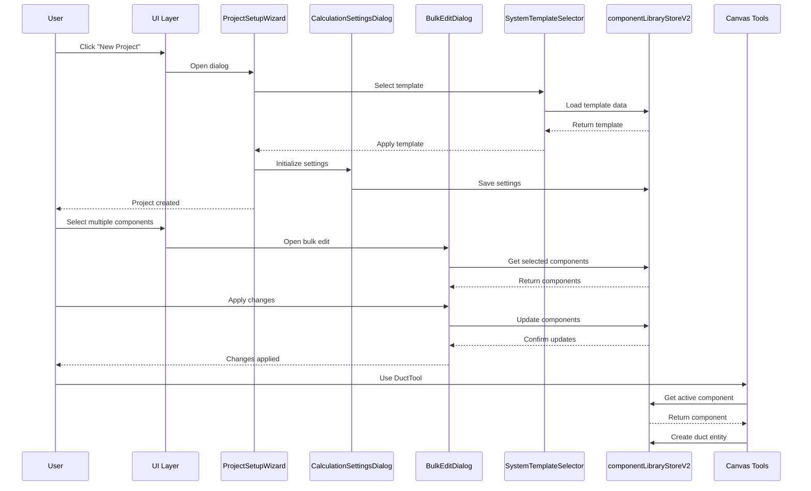

I have created the following plan after thorough exploration and analysis of the codebase. Follow the below plan verbatim. Trust the files and references. Do not re-verify what's written in the plan. Explore only when absolutely necessary. First implement all the proposed file changes and then I'll review all the changes together at the end.

## Observations

The verification report is significantly outdated. Many components marked as "missing" actually exist and are fully implemented (ProjectSetupWizard, CalculationSettingsDialog, BulkEditDialog, SystemTemplateSelector, MigrationWizard). The DuctInspector already uses TabbedPropertiesPanel, not accordions. Several components (LibraryManagementView, useBOM, BulkEditDialog) already use componentLibraryStoreV2. The real gaps are: (1) new UI components exist but aren't integrated into the app, (2) canvas tools still use serviceStore instead of componentLibraryStoreV2, and (3) no menu/navigation to access the new features.

## Approach

Focus on integration rather than creation. The components exist but are orphaned—they need to be wired into the application through navigation, menu items, and proper routing. Migrate canvas tools from serviceStore to componentLibraryStoreV2 to complete the unified architecture. Add feature flags and progressive rollout to ensure stability. This approach leverages existing work and focuses on the final 40% needed to complete the epic.

## Implementation Steps

### Phase 1: UI Component Integration (High Priority)

#### 1.1 Add Navigation and Menu Items

**Location**: `file:hvac-design-app/src/components/layout/ToolsMenu.tsx` or main navigation component

- Add menu items for:
  - "New Project" → Opens `ProjectSetupWizard`
  - "Calculation Settings" → Opens `CalculationSettingsDialog`
  - "Bulk Edit Components" → Opens `BulkEditDialog`
  - "Apply System Template" → Opens `SystemTemplateSelector`
  - "Migrate Data" → Opens `MigrationWizard` (if old data detected)

**Integration Points**:
- Import the dialog components
- Add state management for dialog open/close
- Wire up onClick handlers to open respective dialogs
- Add keyboard shortcuts (e.g., Ctrl+N for New Project)

#### 1.2 Integrate ProjectSetupWizard into App Initialization

**Location**: `file:hvac-design-app/app/` (main app entry point)

- Detect first-time users (check localStorage or project state)
- Auto-open `ProjectSetupWizard` on first launch
- Store project configuration in appropriate store (likely `calculationSettingsStore`)
- Pass `onComplete` handler to initialize project with selected settings

#### 1.3 Add Settings Menu Integration

**Location**: Settings panel or toolbar

- Add "Settings" button that opens `CalculationSettingsDialog`
- Ensure dialog reads from and writes to `calculationSettingsStore`
- Add visual indicator when settings differ from defaults

#### 1.4 Add Bulk Operations Access

**Location**: Component library or selection context menu

- Add "Bulk Edit" button when multiple components are selected
- Open `BulkEditDialog` with pre-selected components
- Alternatively, add to library management toolbar

#### 1.5 Add Template Selector Access

**Location**: Project initialization or settings menu

- Add "Apply Template" option in project settings
- Open `SystemTemplateSelector` dialog
- Apply selected template to current project settings

#### 1.6 Add Migration Detection

**Location**: App initialization or data loading logic

- Use `VersionDetector` from `file:hvac-design-app/src/core/services/migration/VersionDetector.ts`
- Auto-open `MigrationWizard` when old data format detected
- Show migration status in UI during process

### Phase 2: Store Migration (Medium Priority)

#### 2.1 Migrate DuctTool to componentLibraryStoreV2

**Location**: `file:hvac-design-app/src/features/canvas/tools/DuctTool.ts`

**Current State**: Uses `useServiceStore` (lines 14, 118-122, 206-209)

**Changes Needed**:
- Replace `useServiceStore` imports with `useComponentLibraryStoreV2`
- Update service lookup logic to query unified components
- Map service properties to unified component schema
- Maintain backward compatibility during transition

**Pattern to Follow**:
```
// Instead of:
const activeServiceId = useServiceStore.getState().activeServiceId;
const services = useServiceStore.getState().services;

// Use:
const activeComponent = useComponentLibraryStoreV2.getState().getActiveComponent();
const components = useComponentLibraryStoreV2.getState().components;
```

#### 2.2 Migrate EquipmentTool to componentLibraryStoreV2

**Location**: `file:hvac-design-app/src/features/canvas/tools/EquipmentTool.ts`

- Follow same pattern as DuctTool migration
- Update equipment selection logic
- Ensure equipment properties map correctly to unified schema

#### 2.3 Migrate FittingTool to componentLibraryStoreV2

**Location**: `file:hvac-design-app/src/features/canvas/tools/FittingTool.ts`

- Follow same pattern as DuctTool migration
- Update fitting type selection
- Ensure fitting insertion service works with new store

#### 2.4 Update Validation and Service References

**Locations**:
- `file:hvac-design-app/src/features/canvas/components/ValidationDashboard.tsx` (lines 11, 21-22)
- `file:hvac-design-app/src/features/canvas/components/ServicesPanel.tsx` (lines 13-14)
- `file:hvac-design-app/src/features/canvas/components/ServiceEditor.tsx` (lines 12, 23-26)
- `file:hvac-design-app/src/core/services/fittingGeneration.ts` (lines 15, 20-24)

**Strategy**:
- Determine if serviceStore should remain for service-specific logic (system types, pressure classes)
- Or migrate service concepts into componentLibraryStoreV2 as component metadata
- Update references to use unified store where appropriate
- Maintain service-specific functionality if needed

### Phase 3: Feature Enablement and Testing (Medium Priority)

#### 3.1 Add Feature Flags

**Location**: `file:hvac-design-app/src/core/store/componentLibraryStoreV2.ts` (already has `ENABLE_UNIFIED_COMPONENT_LIBRARY` at line 274)

- Use existing feature flag to control new UI visibility
- Add flags for individual features:
  - `ENABLE_PROJECT_WIZARD`
  - `ENABLE_BULK_OPERATIONS`
  - `ENABLE_SYSTEM_TEMPLATES`
  - `ENABLE_MIGRATION_WIZARD`
- Allow gradual rollout and easy rollback

#### 3.2 Add Integration Tests

**Location**: `file:hvac-design-app/src/features/` (create new test files)

- Test ProjectSetupWizard flow end-to-end
- Test CalculationSettingsDialog saves correctly
- Test BulkEditDialog updates multiple components
- Test SystemTemplateSelector applies templates
- Test MigrationWizard handles version upgrades

#### 3.3 Update Documentation

**Location**: `file:docs/` directory

- Document new project initialization flow
- Document bulk operations workflow
- Document system template usage
- Document migration process
- Update user guide with new features

### Phase 4: Cleanup and Optimization (Low Priority)

#### 4.1 Remove Old Store References (if applicable)

**Locations**: Various files using `catalogStore`

- Audit remaining `catalogStore` usage
- Migrate or remove as appropriate
- Ensure no breaking changes

#### 4.2 Consolidate Component Browser Implementations

**Locations**:
- `file:hvac-design-app/src/features/canvas/components/ComponentBrowser/index.tsx`
- `file:hvac-design-app/src/features/canvas/components/UnifiedComponentBrowser.tsx`
- `file:hvac-design-app/src/features/canvas/components/LibraryBrowserPanel.tsx`
- `file:hvac-design-app/src/features/canvas/components/ProductCatalogPanel.tsx`

**Action**:
- Determine which component browser is the canonical implementation
- Deprecate or remove duplicates
- Ensure single source of truth for component selection

#### 4.3 Performance Optimization

**Location**: Component library store and related services

- Add memoization for filtered component lists
- Optimize search performance for large libraries
- Add pagination if component count is high
- Profile and optimize render performance

### Phase 5: Verification and Deployment

#### 5.1 Create Verification Checklist

- [ ] All new dialogs accessible from UI
- [ ] ProjectSetupWizard creates valid projects
- [ ] CalculationSettingsDialog persists settings
- [ ] BulkEditDialog updates components correctly
- [ ] SystemTemplateSelector applies templates
- [ ] MigrationWizard handles data upgrades
- [ ] Canvas tools use componentLibraryStoreV2
- [ ] No console errors or warnings
- [ ] All existing tests pass
- [ ] New integration tests pass

#### 5.2 User Acceptance Testing

- Test complete user workflows:
  - Flow 1: Component Selection and Placement
  - Flow 7: Calculation Settings Configuration
  - Flow 9: Project Initialization
  - Flow 10: System Template Application
  - Flow 11: Bulk Component Operations
  - Flow 13: Data Migration
- Gather feedback on UX
- Iterate on issues found

#### 5.3 Deployment Strategy

- Deploy behind feature flags initially
- Enable for internal testing first
- Gradual rollout to users
- Monitor for issues
- Full release once stable

## Architecture Diagram



## Key Files Reference

### New UI Components (Exist, Need Integration)
- `file:hvac-design-app/src/features/project/components/ProjectSetupWizard.tsx`
- `file:hvac-design-app/src/features/canvas/components/CalculationSettingsDialog.tsx`
- `file:hvac-design-app/src/features/canvas/components/BulkEditDialog.tsx`
- `file:hvac-design-app/src/features/canvas/components/SystemTemplateSelector.tsx`
- `file:hvac-design-app/src/components/dialogs/MigrationWizard.tsx`

### Stores
- `file:hvac-design-app/src/core/store/componentLibraryStoreV2.ts` (new unified store)
- `file:hvac-design-app/src/core/store/componentLibraryStore.ts` (old store)
- `file:hvac-design-app/src/core/store/serviceStore.ts` (still in use)
- `file:hvac-design-app/src/core/store/catalogStore.ts` (old store)

### Tools to Migrate
- `file:hvac-design-app/src/features/canvas/tools/DuctTool.ts`
- `file:hvac-design-app/src/features/canvas/tools/EquipmentTool.ts`
- `file:hvac-design-app/src/features/canvas/tools/FittingTool.ts`

### Already Using V2 Store
- `file:hvac-design-app/src/features/library/LibraryManagementView.tsx`
- `file:hvac-design-app/src/features/canvas/hooks/useBOM.ts`
- `file:hvac-design-app/src/features/canvas/components/ComponentBrowser/index.tsx`
- `file:hvac-design-app/src/features/canvas/components/UnifiedComponentBrowser.tsx`
- `file:hvac-design-app/src/features/canvas/components/LibraryBrowserPanel.tsx`

### Inspector (Already Uses Tabs)
- `file:hvac-design-app/src/features/canvas/components/Inspector/DuctInspector.tsx`
- `file:hvac-design-app/src/features/canvas/components/Inspector/TabbedPropertiesPanel.tsx`