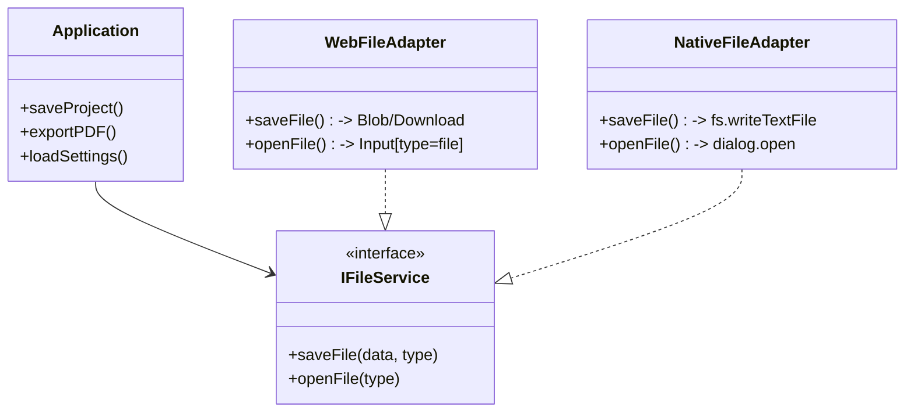

# Platform Adapter Architecture

## Overview
To support both **Web (Hybrid)** and **Desktop (Native/Tauri)** environments without duplicating application logic, SizeWise uses a **Platform Adapter Pattern**.

The core application code (React components, MobX stores) is "Platform Agnostic". It interacts with interfaces (`IFileService`, `IStorageService`) rather than calling browser APIs or Tauri commands directly.

## Architecture

## Interfaces

### IFileService
Handles all file I/O operations (Project Files, Exports, Images).

| Method | Web Implementation | Native Implementation |
|--------|-------------------|-----------------------|
| `saveProject(data)` | Downloads `project.json` (Blob) or Saves to IDB (Auto) | Opens Save Dialog -> Writes `.hvac` file to Disk |
| `openProject()` | Triggers hidden `<input type="file">` | Opens Native File Picker Dialog |
| `exportPDF(blob)` | `URL.createObjectURL` + Click Link | Opens Save Dialog -> Writes Binary to Disk |

### IStorageService
Handles persistent user preferences and temporary state.

| Method | Web Implementation | Native Implementation |
|--------|-------------------|-----------------------|
| `saveSettings(json)` | `localStorage.setItem('prefs', json)` | Writes to `%APPDATA%/SizeWise/settings.json` |
| `getSettings()` | `localStorage.getItem('prefs')` | Reads from `%APPDATA%/SizeWise/settings.json` |

## Implementation Strategy
1. **Detection**: At startup, `ServiceFactory` checks `window.__TAURI__`.
2. **Injection**: Instantiates `WebAdapter` or `NativeAdapter`.
3. **Usage**: Components call `ServiceFactory.file.saveProject()`.

## Related Documentation
- [08-file-management](../user-journeys/08-file-management/INDEX.md) - I/O Implementation Details
- [09-export](../user-journeys/09-export/INDEX.md) - Export Implementation Details
- [13-settings](../user-journeys/13-settings-and-preferences/INDEX.md) - Storage Implementation Details

## Risks & Considerations
For a detailed analysis of runtime assumptions, storage quotas, and feature parity risks, please refer to:
- **[02-implementation-risks.md](./02-implementation-risks.md)**
