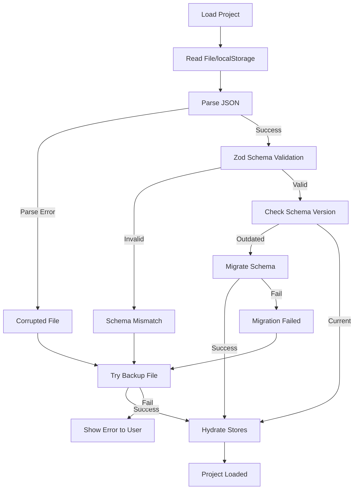
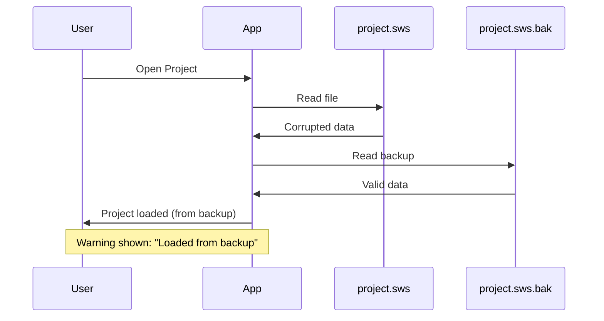

# OS-INIT-003: Database Integrity Check

## Overview

This document describes the **data integrity validation** that occurs during application startup and project loading. The integrity check ensures:

- Stored data is valid and uncorrupted
- Schema versions are compatible
- Corrupt data is detected and recovered
- User is notified of data issues

**Scope**: Startup validation, not runtime validation during editing.

---

## Integrity Check Phases

### Phase 1: Startup Validation

**Process**:

1.  **Preferences (localStorage)**:
    - Checks `sws.preferences`
    - Validates JSON integrity
    - Falls back to default settings if corrupt

2.  **Project Data (localStorage)**:
    - Checks `hvac-project-{projectId}` entries
    - Does NOT load full projects on startup (Lazy Loading)
    - Validates index/metadata only

**Stores Validated**:
- `sws.preferences` → `preferencesStore`
- `sws.projectIndex` → `projectListStore`
- `hvac-project-{projectId}` → Project Data (Lazy)

---

### Phase 2: Project File Validation (Load)

**Timing**: When user opens .sws file or loads from localStorage

**Process**:



#### Step 1: Read File

**Code Reference**: `hvac-design-app/src/core/persistence/projectIO.ts:55-63`

```typescript
// From projectIO.ts:55-63
export async function loadProject(path: string): Promise<LoadResult> {
  try {
    // Check if file exists
    if (!(await exists(path))) {
      return { success: false, error: 'File not found' };
    }

    // Read file
    const content = await readTextFile(path);
```

**Validation**: File existence check

**Errors Detected**:
- File not found
- Permission denied
- I/O errors

#### Step 2: Parse JSON

**Code Reference**: `hvac-design-app/src/core/persistence/projectIO.ts:63-66`

```typescript
// Implicit in projectIO.ts:66
const result = deserializeProject(content); // Calls JSON.parse internally
```

**Validation**: Valid JSON syntax

**Errors Detected**:
- Invalid JSON syntax
- Truncated file (incomplete JSON)
- Binary/corrupted data

**Recovery**: Falls back to backup file (see Phase 3)

#### Step 3: Zod Schema Validation

**Code Reference**: Schema in `hvac-design-app/src/core/schema/project-file.schema.ts`

```typescript
// Conceptual example from serialization.ts
import { projectFileSchema } from '@/core/schema';

export function deserializeProject(jsonString: string) {
  try {
    const parsed = JSON.parse(jsonString);
    const validated = projectFileSchema.parse(parsed); // Zod validation
    return { success: true, data: validated };
  } catch (error) {
    if (error instanceof z.ZodError) {
      return { success: false, error: 'Schema validation failed', zodError: error };
    }
    return { success: false, error: 'Parse error' };
  }
}
```

**Validation Rules**:
- Required fields present
- Correct data types
- Valid entity types
- Valid UUIDs
- Numeric ranges

**Errors Detected**:
- Missing required fields
- Wrong data types
- Invalid enum values
- Invalid references

See [OS-SL-002-SwsFileFormat.md](../02-storage-layers/OS-SL-002-SwsFileFormat.md) for complete schema.

#### Step 4: Schema Version Check

**Code Reference**: `hvac-design-app/src/core/persistence/projectIO.ts:68-76`

```typescript
// From projectIO.ts:68-76
if (!result.success) {
  // Check if migration is needed
  if (result.requiresMigration && result.foundVersion) {
    const parsed = JSON.parse(content);
    const migrated = migrateProject(parsed, result.foundVersion);
    if (migrated.success) {
      return { success: true, project: migrated.data };
    }
  }
```

**Current Version**: 1.0.0

**Validation**: Compare file version with current schema version

**Actions**:
- **Same version**: Proceed with loading
- **Older version**: Attempt migration
- **Newer version**: Error (app too old)

See [OS-MIG-001-SchemaVersioning.md](../06-migration/OS-MIG-001-SchemaVersioning.md) for details.

---

### Phase 3: Backup Recovery

**Timing**: When main file fails validation

**Code Reference**: `hvac-design-app/src/core/persistence/projectIO.ts:78-86`

```typescript
// From projectIO.ts:78-86
// Try loading backup if main file is corrupted
return loadBackup(path);
```

**Process**:



**Code Reference**: `hvac-design-app/src/core/persistence/projectIO.ts:92-118`

```typescript
// From projectIO.ts:92-118
export async function loadBackup(originalPath: string): Promise<LoadResult> {
  const backupPath = `${originalPath}.bak`;

  try {
    if (!(await exists(backupPath))) {
      return { success: false, error: 'No backup file available' };
    }

    const content = await readTextFile(backupPath);
    const result = deserializeProject(content);

    if (!result.success) {
      return { success: false, error: 'Backup file is also corrupted' };
    }

    return {
      success: true,
      project: result.data,
      loadedFromBackup: true,  // Flag for user notification
    };
  } catch (error) {
    return {
      success: false,
      error: error instanceof Error ? error.message : 'Backup load failed',
    };
  }
}
```

**User Notification**: `loadedFromBackup: true` flag allows UI to show warning message.

---

## Validation Rules

### Project-Level Validation

| Field | Validation | Error Message |
|-------|-----------|---------------|
| `version` | Semantic version string | "Invalid version format" |
| `project.id` | Valid UUID v4 | "Invalid project ID" |
| `project.name` | String, 1-100 chars | "Project name required" |
| `project.createdAt` | ISO 8601 date string | "Invalid creation date" |
| `project.updatedAt` | ISO 8601 date string | "Invalid update date" |

### Entity-Level Validation

| Field | Validation | Error Message |
|-------|-----------|---------------|
| `entities` | Array | "Entities must be an array" |
| `entity.id` | Valid UUID v4 | "Invalid entity ID" |
| `entity.type` | Valid enum value | "Unknown entity type" |
| `entity.position` | `{x: number, y: number}` | "Invalid position" |
| `entity.properties` | Object | "Properties must be an object" |

### Viewport Validation

| Field | Validation | Error Message |
|-------|-----------|---------------|
| `viewport.x` | Number | "Invalid viewport X coordinate" |
| `viewport.y` | Number | "Invalid viewport Y coordinate" |
| `viewport.scale` | Number, 0.1 - 10 | "Invalid zoom scale" |

---

## Error Scenarios and Recovery

### Scenario 1: Corrupted JSON (Truncated File)

**Cause**: File write interrupted (crash, power loss)

**Detection**: JSON parse error

**Error Example**:
```json
{
  "version": "1.0.0",
  "project": {
    "id": "123e4567-e89b
```

**Recovery**:
1. Attempt to load `.bak` backup file
2. If backup valid: Load backup, warn user
3. If backup also corrupted: Show error, offer to start new project

**User Impact**: Lose changes since last backup (typically last save)

### Scenario 2: Schema Validation Failure

**Cause**: File manually edited, corrupted field

**Detection**: Zod validation error

**Error Example**:
```json
{
  "project": {
    "id": "not-a-uuid",  // Invalid UUID format
    "name": "",          // Empty name
  }
}
```

**Recovery**:
1. Show detailed Zod error (which field failed)
2. Attempt backup load
3. Offer to repair (set default values for invalid fields)

**User Impact**: May lose specific invalid entities, but rest of project preserved

### Scenario 3: Version Mismatch (Newer File)

**Cause**: File created by newer version of app

**Detection**: Version comparison (file version > app version)

**Error Example**:
```json
{
  "version": "2.0.0",  // App only supports 1.x
  ...
}
```

**Recovery**: None - app cannot load future schema versions

**User Action Required**: Update application to newer version

### Scenario 4: Missing Backup File

**Cause**: First save, or backup deleted

**Detection**: `exists(backupPath)` returns false

**Recovery**: None - cannot recover

**User Action Required**: Accept data loss, start new project or restore from manual backup

---

## Integrity Check Logging

### Console Logging

**Development**:
```typescript
console.error('[ProjectIO] Failed to load project:', error);
console.warn('[ProjectIO] Loaded from backup:', backupPath);
console.info('[ProjectIO] Migration successful:', fromVersion, '→', toVersion);
```

**Production**: Errors logged to console, could integrate with error tracking service (Sentry, etc.)

### User-Facing Notifications

**Success**:
- "Project loaded successfully"

**Warning**:
- "⚠️ Project loaded from backup. Main file was corrupted."
- "⚠️ Project migrated from version 1.0.0 to 1.1.0"

**Error**:
- "❌ Failed to load project: File not found"
- "❌ Project file is corrupted and no backup available"
- "❌ Project requires newer version of app (v2.0.0+)"

---

## Performance Impact

### Validation Overhead

| Check | Time | Blocking? |
|-------|------|-----------|
| File exists | 1-5ms | Yes |
| Read file | 10-50ms | Yes |
| JSON parse | 5-20ms | Yes |
| Zod validation | 10-50ms | Yes |
| **Total** | **26-125ms** | Yes |

**Impact on UX**:
- Small projects (< 50 entities): Negligible (~50ms)
- Medium projects (50-200 entities): Noticeable (~100ms)
- Large projects (200+ entities): Significant (~200ms+)

**Optimization**: Show loading indicator during validation.

---

## Testing Integrity Checks

### Unit Tests

```typescript
describe('Project File Validation', () => {
  it('should reject corrupted JSON', async () => {
    const corruptedContent = '{ "version": "1.0.0", "project"';
    const result = deserializeProject(corruptedContent);

    expect(result.success).toBe(false);
    expect(result.error).toContain('Parse error');
  });

  it('should reject invalid schema', async () => {
    const invalidContent = JSON.stringify({
      version: '1.0.0',
      project: { id: 'not-a-uuid', name: '' },
    });
    const result = deserializeProject(invalidContent);

    expect(result.success).toBe(false);
    expect(result.error).toContain('Schema validation failed');
  });

  it('should accept valid project', async () => {
    const validContent = JSON.stringify({
      version: '1.0.0',
      project: {
        id: '123e4567-e89b-12d3-a456-426614174000',
        name: 'Test Project',
        createdAt: '2026-01-09T12:00:00Z',
        updatedAt: '2026-01-09T12:00:00Z',
      },
      entities: [],
      viewport: { x: 0, y: 0, scale: 1 },
      settings: {},
    });
    const result = deserializeProject(validContent);

    expect(result.success).toBe(true);
    expect(result.data?.project.name).toBe('Test Project');
  });
});
```

### Integration Tests

```typescript
describe('Backup Recovery', () => {
  it('should load backup when main file corrupted', async () => {
    // Setup: Create corrupted main file
    await writeTextFile('/tmp/test.sws', '{ corrupted json');

    // Setup: Create valid backup
    const validProject = { /* valid project data */ };
    await writeTextFile('/tmp/test.sws.bak', JSON.stringify(validProject));

    // Test
    const result = await loadProject('/tmp/test.sws');

    expect(result.success).toBe(true);
    expect(result.loadedFromBackup).toBe(true);
  });

  it('should fail when both files corrupted', async () => {
    await writeTextFile('/tmp/test.sws', '{ corrupted');
    await writeTextFile('/tmp/test.sws.bak', '{ also corrupted');

    const result = await loadProject('/tmp/test.sws');

    expect(result.success).toBe(false);
    expect(result.error).toContain('Backup file is also corrupted');
  });
});
```

---

## Related Documentation

- [Corruption Detection](../07-error-recovery/OS-ERR-001-CorruptionDetection.md) - Detailed error scenarios
- [Backup Recovery](../07-error-recovery/OS-ERR-002-BackupRecovery.md) - Recovery procedures
- [Schema Versioning](../06-migration/OS-MIG-001-SchemaVersioning.md) - Version compatibility
- [.sws File Format](../02-storage-layers/OS-SL-002-SwsFileFormat.md) - Complete schema

---

## Implementation Status

✅ **Fully Implemented**
- JSON parse error handling
- Zod schema validation
- Backup file fallback
- Version detection

⚠️ **Partially Implemented**
- Schema migration (only v1.0.0 handler exists)
- User notifications (basic, could be more informative)
- Error logging (console only, no telemetry)

❌ **Not Implemented**
- Automatic repair of invalid fields
- Detailed validation error messages in UI
- File integrity checksum (detect silent corruption)
- localStorage quota check on startup

See [IMPLEMENTATION_STATUS.md](../../IMPLEMENTATION_STATUS.md) for complete details.

---

## Future Enhancements

1. **Checksum Validation**: Add SHA-256 hash to detect silent corruption
2. **Partial Recovery**: Salvage valid entities from partially corrupted files
3. **Validation Report**: Show detailed list of validation errors in UI
4. **Auto-Repair**: Attempt to fix common validation errors automatically
5. **Backup Management**: Keep multiple backup versions (not just 1)
6. **Health Check Command**: Manual integrity check for all stored projects
