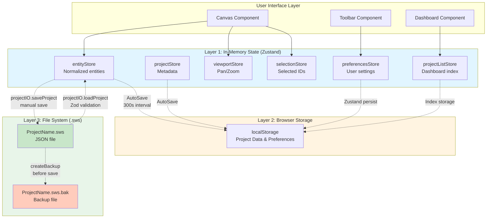
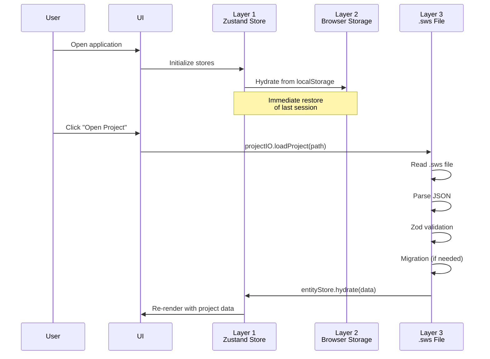
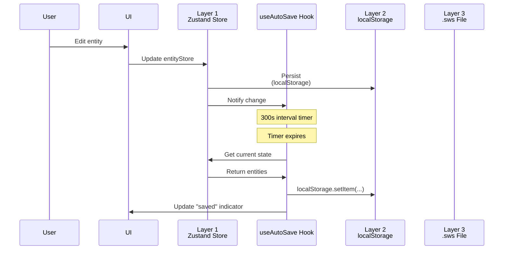

# OS-SL-001: Storage Layers Architecture Overview

## Overview

The HVAC Canvas App implements a **three-layer storage architecture** that provides:

1. **Fast in-memory access** for UI performance
2. **Browser-level persistence** for page refresh resilience
3. **Permanent file storage** for long-term project archival

This architecture enables the application to work seamlessly across both **desktop (Tauri)** and **web browser** environments with appropriate fallbacks.

---

## Three-Layer Architecture



---

## Layer 1: In-Memory State (Zustand Stores)

### Purpose
- **Source of truth** during application runtime
- Provides fast read/write access for UI updates
- Manages application state with React hooks integration

### Key Stores

| Store | Purpose | Location | Persistence |
|-------|---------|----------|-------------|
| `entityStore` | Canvas entities (ducts, equipment) | `src/core/store/entityStore.ts` | Yes (Layer 2) |
| `projectStore` | Current project metadata | `src/stores/projectStore.ts` | Yes (Layer 2) |
| `viewportStore` | Pan/zoom state | `src/features/canvas/store/viewportStore.ts` | No |
| `selectionStore` | Selected entity IDs | `src/features/canvas/store/selectionStore.ts` | No |
| `preferencesStore` | User preferences | `src/stores/preferencesStore.ts` | Yes (localStorage) |
| `projectListStore` | Dashboard project list | `src/features/dashboard/store/projectListStore.ts` | Yes (localStorage) |

### Architecture Pattern

All stores follow the **normalized state pattern**:

```typescript
interface EntityStore {
  byId: Record<string, Entity>;  // Fast O(1) lookup
  allIds: string[];              // Maintain order
}
```

**Benefits**:
- Fast entity lookups by ID
- Efficient updates (no array traversal)
- Easy to detect changes
- Prevents duplicate entities

### Code Reference

See `src/core/store/entityStore.ts:15-30` for the normalized pattern implementation.

---

## Layer 2: Browser Storage (Hybrid)

### Purpose
- **localStorage**: Project data and user preferences (Settings, UI State)
- **Fallback**: Enables offline capability in Web Environment

### Storage Strategy

| Type | Store | Technology | Purpose |
|------|-------|------------|---------|
| **Project** | `hvac-project-{id}` | **localStorage** | Full project graph (Entities, Connections) |
| **Settings** | `sws.preferences` | **localStorage** | User UI preferences (Theme, Units) |
| **Index** | `sws.projectIndex` | **localStorage** | Dashboard list |

### Implementation Notes

localStorage is the only browser persistence layer; IndexedDB is rejected under the current policy.

---

## Layer 3: File System (.sws Files)

### Purpose
- **Permanent storage** for desktop application
- User-controlled file location
- Enables file sharing and backup
- Long-term archival

### File Format

```json
{
  "version": "1.0.0",
  "project": {
    "id": "uuid-v4",
    "name": "Project Name",
    "createdAt": "2026-01-09T12:00:00Z",
    "updatedAt": "2026-01-09T12:30:00Z"
  },
  "entities": [
    {
      "id": "entity-uuid",
      "type": "duct",
      "properties": { ... }
    }
  ],
  "viewport": {
    "x": 0,
    "y": 0,
    "scale": 1
  },
  "settings": { ... }
}
```

**Schema**: Validated by Zod schema in `src/core/schema/project-file.schema.ts`

### Backup Strategy

```
Original:  project.sws       (active file)
Backup:    project.sws.bak   (previous save)
```

**Backup Creation**: `src/core/persistence/projectIO.ts:33-37`

**Limitation**: Only 1 backup maintained (not 5 versions as documented elsewhere)

### Desktop-Only Feature

File system access requires **Tauri runtime**:

```typescript
// Environment detection
function isTauri(): boolean {
  return typeof window !== 'undefined' && '__TAURI__' in window;
}
```

**Code Reference**: `src/core/persistence/filesystem.ts:10-12`

**Fallback**: If Tauri unavailable, app uses Layer 2 (localStorage).

---

## Data Flow Between Layers

### Startup/Load Flow



### Save Flow (Auto-Save)



### Manual Save Flow (Cmd/Ctrl+S)


---

## Environment Detection and Fallbacks

### Runtime Environment Check

```typescript
function isTauri(): boolean {
  return typeof window !== 'undefined' && '__TAURI__' in window;
}
```

### Fallback Strategy

| Feature | Desktop (Tauri) | Web Browser | Fallback |
|---------|----------------|-------------|----------|
| Project save | .sws file | localStorage | localStorage → manual .sws export |
| Project load | File picker | localStorage | Import .sws into localStorage |
| Backup | .bak file | Cloud backup (manual) | Manual export |
| Auto-save | .sws file | localStorage | N/A |

### Graceful Degradation

```typescript
async function saveProject(path: string, data: ProjectFile) {
  if (isTauri()) {
    // Desktop: Use Tauri APIs
    await FileSystem.writeTextFile(path, JSON.stringify(data, null, 2));
  } else {
    // Web: Persist to localStorage
    localStorage.setItem(`hvac-project-${data.projectId}`, JSON.stringify(data));
    // Optional: triggerDownload(data, path);
  }
}
```

**Code Reference**: `src/core/persistence/projectIO.ts` (conceptual example)

---

## Performance Characteristics

| Operation | Layer 1 (Zustand) | Layer 2 (localStorage) | Layer 3 (.sws) |
|-----------|------------------|------------------------|---------------|
| Read speed | < 1ms | ~1-5ms | ~50-200ms |
| Write speed | < 1ms | ~2-10ms | ~100-500ms |
| Size limit | RAM limit | ~5MB (Quota) | OS file system |
| Persistence | Session only | Browser lifetime | Permanent |
| Sync/Async | Sync | Sync | Async |

### Optimization Strategies

1. **In-Memory First**: All UI reads from Zustand stores (Layer 1)
2. **Interval Writes**: 300-second interval to Layer 2 (reduces churn)
3. **Selective Persistence**: Only essential state persisted to Layer 2
4. **Lazy Hydration**: Load Layer 3 data only when project opened

---

## State Synchronization

### Automatic Synchronization

```
User Action → Layer 1 (immediate) → Layer 2 (sync) → Layer 3 (manual save)
```

### Conflict Resolution

**Current Implementation**: Last-write-wins (no conflict detection)

**Limitation**: No multi-device sync or concurrent edit detection

See [Known Limitations](../../07-error-recovery/OS-ERR-003-KnownLimitations.md) for details.

---

## Testing Strategy

### Unit Tests
- Store logic (selectors, actions)
- Serialization/deserialization
- Schema validation

### Integration Tests
- Store ↔ localStorage persistence
- Store ↔ file system save/load
- Hydration/dehydration flow

### E2E Tests
- Full save/load cycle
- Auto-save during editing
- Recovery from corrupt files

**Test Coverage**: See `src/core/persistence/*.test.ts` files

---

## Related Documentation

- [IndexedDB Storage Details](./OS-SL-003-IndexedDBStorage.md) (Deprecated)
- [.sws File Format](./OS-SL-002-SwsFileFormat.md)
- [Zustand Store Architecture](../03-in-memory-state/OS-MEM-001-ZustandStoreArchitecture.md)
- [Environment Detection](../01-initialization/OS-INIT-002-EnvironmentDetection.md)
- [ProjectIO Element Documentation](../../elements/10-persistence/ProjectIO.md)

---

## Implementation Status

✅ **Fully Implemented**
- Three-layer architecture framework
- Zustand store pattern
- File system persistence via Tauri
- Environment detection and fallback

⚠️ **Partially Implemented**
- localStorage persistence (localStorage-only policy)
- Backup management

❌ **Not Implemented**
- Conflict resolution
- Multi-device sync

See [IMPLEMENTATION_STATUS.md](../../IMPLEMENTATION_STATUS.md) for complete details.
