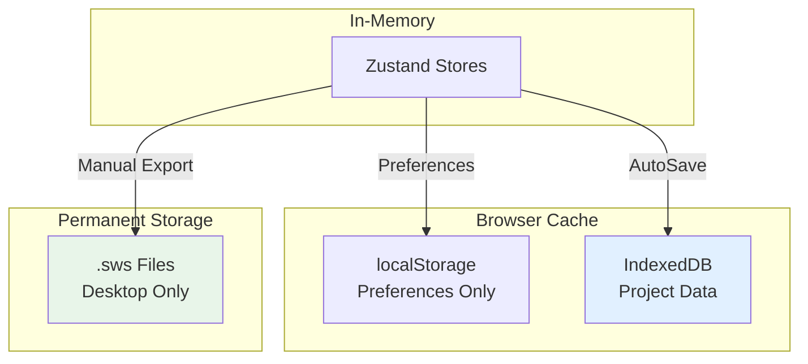

# OS-SL-003: IndexedDB Storage Architecture

> **Status**: ❌ Deprecated. IndexedDB is rejected under the localStorage-only policy. This document is retained for historical reference only.

## 1. Overview

### Purpose
Document the **IndexedDB implementation** for browser-based caching. This is a deprecated reference and is not part of the current persistence plan.

### Scope
- Caching project state in the browser
- Handling storage quotas (>5MB)
- Fallback for offline usage on Web

### Implementation Status
- **Status**: ❌ Deprecated (localStorage-only policy)
- **Previous Alternative**: localStorage (current standard)
- **Priority**: None (no implementation planned)
- **Last Updated**: 2026-01-15

---

## 2. Architecture Context

### Current Storage Layers



---

## 5. Comparison: localStorage vs IndexedDB

### Technical Comparison

| Feature | localStorage | IndexedDB | Notes |
|---------|-------------|-----------|-------|
| **API complexity** | Simple (setItem/getItem) | Complex (transactions, cursors) | localStorage wins |
| **Storage limit** | ~5MB per origin | ~50GB+ (browser-dependent) | IndexedDB wins |
| **Data types** | Strings only | Structured cloneables, Blobs | IndexedDB wins |
| **Synchronous** | Yes | No (async only) | localStorage simpler |
| **Indexing** | None | Yes (multi-index support) | IndexedDB wins |
| **Queries** | None | Yes (key ranges, filters) | IndexedDB wins |
| **Versioning** | Manual | Built-in schema migrations | IndexedDB wins |
| **Browser support** | 100% | 98%+ (IE10+) | Both fine |
| **DevTools** | Easy (Application tab) | Harder (requires plugins) | localStorage wins |
| **Performance** | Fast for small data | Faster for large data | Depends on size |

### When to Choose Each

**Choose localStorage when**:
- Data size <1MB
- Simple key-value storage
- No complex queries needed
- Synchronous access preferred
- Simplicity matters

**Choose IndexedDB when**:
- Data size >5MB
- Complex data structures
- Indexed queries needed
- Blob storage required
- Building offline-first PWA

---

## 6. Implementation Roadmap

### Phase 1: Research and Planning (2 weeks)

**Tasks**:
1. Benchmark current localStorage usage across 100 projects
2. Identify storage bottlenecks and quota issues
3. Evaluate IndexedDB libraries (Dexie.js, idb, etc.)
4. Design schema for IndexedDB storage
5. Create migration plan from localStorage

**Deliverables**:
- Usage metrics report
- Library comparison matrix
- Schema design document
- Migration strategy

### Phase 2: Implementation (4 weeks)

**Tasks**:
1. Install and configure IndexedDB library (recommend Dexie.js)
2. Create IndexedDB wrapper abstraction layer
3. Implement project cache storage
4. Implement query layer for project list
5. Add thumbnail/blob storage
6. Create migration script from localStorage

**Deliverables**:
- IndexedDB service layer
- Unit tests for DB operations
- Integration tests for cache flows
- Migration utility

### Phase 3: Testing and Migration (2 weeks)

**Tasks**:
1. Test with large datasets (1000+ entities)
2. Performance benchmarking vs localStorage
3. Browser compatibility testing
4. User acceptance testing
5. Gradual rollout with feature flag

**Deliverables**:
- Performance report
- Browser compatibility matrix
- Feature flag configuration
- User migration guide

---

## 7. Recommended Technology Stack

### Option 1: Dexie.js (Recommended)

**Pros**:
- Simple API (similar to MongoDB)
- TypeScript support
- Promise-based (async/await)
- Schema versioning built-in
- Active maintenance

**Cons**:
- 30KB bundle size
- Learning curve

**Example**:
```typescript
import Dexie, { Table } from 'dexie';

interface ProjectCache {
  projectId: string;
  projectName: string;
  entities: NormalizedEntities;
  cachedAt: string;
}

class ProjectDatabase extends Dexie {
  projects!: Table<ProjectCache>;

  constructor() {
    super('HVACProjectCache');
    this.version(1).stores({
      projects: 'projectId, projectName, cachedAt',
    });
  }
}

const db = new ProjectDatabase();

// Store project
await db.projects.put({
  projectId: '123',
  projectName: 'HVAC Design',
  entities: { byId: {}, allIds: [] },
  cachedAt: new Date().toISOString(),
});

// Query project
const project = await db.projects.get('123');

// Query by name
const projects = await db.projects.where('projectName').startsWithIgnoreCase('HVAC').toArray();
```

### Option 2: idb (Lightweight)

**Pros**:
- Very small (1.5KB)
- Promise-based
- Low-level control

**Cons**:
- More boilerplate
- No schema management
- Manual migrations

### Option 3: Native IndexedDB API

**Pros**:
- No dependencies
- Full control

**Cons**:
- Very complex API
- Callback-based (requires promisification)
- Verbose boilerplate

**Recommendation**: Use Dexie.js for balance of simplicity and features

---

## 8. Schema Design

### Proposed IndexedDB Schema

```typescript
// Version 1 schema
db.version(1).stores({
  // Projects cache (full project state)
  projects: 'projectId, projectName, clientName, modifiedAt',

  // Thumbnails (base64 or blob)
  thumbnails: 'projectId',

  // PDF plans cache
  plans: 'projectId, pageIndex',

  // User preferences (migrate from localStorage)
  preferences: 'key',
});

interface ProjectCache {
  projectId: string; // Primary key
  projectName: string; // Indexed
  clientName: string; // Indexed
  projectNumber?: string;
  entities: NormalizedEntities;
  viewportState: ViewportState;
  settings: ProjectSettings;
  modifiedAt: string; // Indexed
  cachedAt: string;
}

interface ThumbnailCache {
  projectId: string; // Primary key
  thumbnail: Blob; // Binary image data
  generatedAt: string;
}

interface PlanCache {
  projectId: string; // Compound key
  pageIndex: number; // Compound key
  imageBlob: Blob;
  cachedAt: string;
}

interface PreferenceItem {
  key: string; // Primary key
  value: unknown; // JSON-serializable value
}
```

---

## 9. Migration Strategy

### Migrating from localStorage to IndexedDB

**Step 1: Detect existing localStorage data**
```typescript
async function detectLocalStorageData(): Promise<boolean> {
  const keys = Object.keys(localStorage);
  return keys.some(key =>
    key.startsWith('hvac-project-') ||
    key === 'sws.preferences' ||
    key === 'sws.projectIndex'
  );
}
```

**Step 2: Migrate data**
```typescript
async function migrateToIndexedDB() {
  const db = new ProjectDatabase();

  // Migrate preferences
  const prefs = localStorage.getItem('sws.preferences');
  if (prefs) {
    const parsed = JSON.parse(prefs);
    await db.preferences.put({ key: 'app', value: parsed });
  }

  // Migrate project caches
  for (const key of Object.keys(localStorage)) {
    if (key.startsWith('hvac-project-')) {
      const projectId = key.replace('hvac-project-', '');
      const data = JSON.parse(localStorage.getItem(key)!);
      await db.projects.put({
        projectId,
        ...data,
        cachedAt: new Date().toISOString(),
      });
    }
  }

  // Mark migration complete
  localStorage.setItem('indexeddb-migrated', 'true');
}
```

**Step 3: Feature flag**
```typescript
const USE_INDEXEDDB = localStorage.getItem('indexeddb-migrated') === 'true';

async function saveProjectCache(project: StoredProject) {
  if (USE_INDEXEDDB) {
    await db.projects.put(project);
  } else {
    localStorage.setItem(`hvac-project-${project.projectId}`, JSON.stringify(project));
  }
}
```

---

## 10. Performance Considerations

### Expected Performance

| Operation | localStorage | IndexedDB | Notes |
|-----------|-------------|-----------|-------|
| Store 1 project (100KB) | ~5ms | ~10ms | IndexedDB slower (async overhead) |
| Store 10 projects (1MB) | ~50ms | ~30ms | IndexedDB faster (bulk insert) |
| Query by name | ~20ms (linear scan) | ~2ms (indexed) | IndexedDB much faster |
| Store blob (1MB image) | ❌ Not practical | ~15ms | IndexedDB only |
| Clear all data | ~5ms | ~20ms | Both fast enough |

### Optimization Tips

1. **Use transactions**: Batch operations in single transaction
2. **Index wisely**: Only index fields you query on
3. **Limit blob size**: Compress images before storing
4. **Cache invalidation**: Clear old caches periodically
5. **Lazy loading**: Don't load all data on app start

---

## 11. Known Challenges

### Challenge 1: Browser Compatibility

**Issue**: IndexedDB works differently in Safari vs Chrome

**Mitigation**:
- Test on all major browsers
- Use Dexie.js (handles browser quirks)
- Provide localStorage fallback

### Challenge 2: Storage Quota

**Issue**: Browser may limit IndexedDB to 50MB in private browsing

**Mitigation**:
- Detect quota limits at runtime
- Warn user if quota exceeded
- Implement cache eviction strategy

### Challenge 3: Schema Migrations

**Issue**: Changing IndexedDB schema requires version bump

**Mitigation**:
- Use Dexie.js schema versioning
- Write migration handlers for each version
- Test migrations thoroughly

### Challenge 4: Debugging

**Issue**: IndexedDB data not easily inspectable in DevTools

**Mitigation**:
- Use Chrome DevTools Application tab
- Install IndexedDB debugging extensions
- Implement admin panel to view DB contents

---

## 12. Cost-Benefit Analysis

### Benefits of IndexedDB

1. **Unlimited storage**: Store 100+ projects offline
2. **Better queries**: Fast indexed searches
3. **Blob support**: Cache PDF plans and thumbnails
4. **PWA readiness**: Standard for offline-first apps
5. **Structured data**: Better than localStorage key-value

### Costs of IndexedDB

1. **Complexity**: 5x more code than localStorage
2. **Bundle size**: +30KB (Dexie.js)
3. **Learning curve**: Team needs to learn IndexedDB
4. **Testing**: More edge cases and browser quirks
5. **Migration effort**: 2 weeks to migrate existing data

### Recommendation

**Defer IndexedDB implementation** until:
- User feedback indicates storage issues
- Projects regularly exceed 5MB
- PWA deployment is planned
- Blob storage (thumbnails/PDFs) is needed

**Current priority**: Low (Phase 2 or 3)

---

## 13. Alternative: Hybrid Approach

### Keep Both localStorage and IndexedDB

**Strategy**:
- **localStorage**: Preferences, small metadata (<100KB)
- **IndexedDB**: Project caches, blobs (>100KB)
- **Best of both worlds**: Simple for small data, scalable for large

**Benefits**:
- No migration needed for preferences
- Complexity only where needed
- Gradual adoption possible

**Example**:
```typescript
// Preferences stay in localStorage
localStorage.setItem('sws.preferences', JSON.stringify(prefs));

// Project caches use IndexedDB
await db.projects.put(projectCache);
```

---

## 14. Related Documentation

### Prerequisites
- [localStorage Cache](../02-storage-layers/OS-SL-003-LocalStorageCache.md)
- [Zustand Persistence](../02-storage-layers/OS-SL-004-ZustandPersistence.md)

### Related Resources
- [MDN: IndexedDB API](https://developer.mozilla.org/en-US/docs/Web/API/IndexedDB_API)
- [Dexie.js Documentation](https://dexie.org/)
- [idb Library](https://github.com/jakearchibald/idb)

---

## 15. Changelog

| Date | Version | Change | Author |
|------|---------|--------|--------|
| 2026-01-09 | 1.0.0 | Initial IndexedDB implementation plan | System |

---

## 16. Notes

### Why Not Implemented Yet

1. **localStorage is sufficient**: Current projects fit in 5MB limit
2. **Complexity vs benefit**: IndexedDB adds 5x complexity for minimal gain
3. **Phase 1 priorities**: Focus on core features first
4. **User feedback**: No reports of storage issues yet

### When to Revisit

Revisit this plan when:
1. Users report "storage quota exceeded" errors
2. PWA deployment is planned
3. Thumbnail caching is needed
4. Multi-device sync is implemented
5. Advanced search/filtering is required

### Decision Log

- **2025-Q4**: Decided to use localStorage for Phase 1
- **2026-Q1**: Re-evaluated IndexedDB, deferred to Phase 2+
- **Next review**: After Phase 1 user feedback
