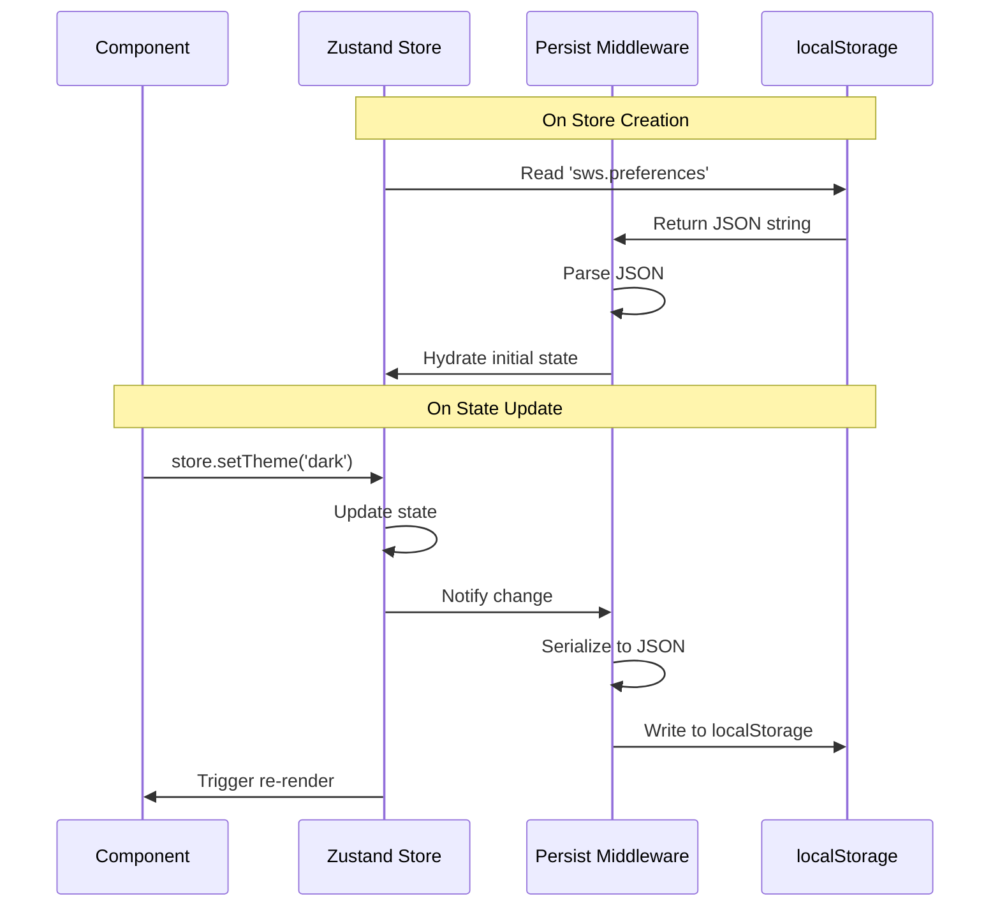

# OS-SL-003: localStorage Cache Layer

## Overview

The **localStorage cache layer** provides automatic browser-level persistence for the HVAC Canvas App. This layer:

- Survives page refreshes and browser restarts
- Works in both desktop (Tauri) and web browser environments
- Provides fallback storage when file system unavailable
- Enables quick application restore without file I/O

**Implementation**: Zustand `persist` middleware writes to browser's localStorage API

---

## Storage Keys

### Active Storage Keys

| Key | Store | Content | Typical Size | Purpose |
|-----|-------|---------|--------------|---------|
| `hvac-project-{projectId}` | Auto-save hook | Serialized project snapshot | 50KB - 5MB | Recovery from crashes |
| `sws.preferences` | `preferencesStore` | User preferences JSON | ~1KB | Settings persistence |
| `sws.projectIndex` | `projectListStore` | Dashboard project list | ~5KB | Recent projects |
| `project-storage` | `useProjectStore` | Current project metadata | ~2KB | Project info |

### Key Naming Convention

```
<namespace>.<store-name>
```

- **Namespace**: `sws` (Senior Web Solutions)
- **Store name**: Matches Zustand store name
- **Auto-save keys**: Use `hvac-project-` prefix with project ID

---

## Implementation: Zustand Persist Middleware

### Basic Pattern

```typescript
import { create } from 'zustand';
import { persist, createJSONStorage } from 'zustand/middleware';

export const usePreferencesStore = create<PreferencesStore>()(
  persist(
    (set, get) => ({
      // Store state
      theme: 'light',
      language: 'en',

      // Actions
      setTheme: (theme) => set({ theme }),
      setLanguage: (language) => set({ language }),
    }),
    {
      name: 'sws.preferences',  // localStorage key
      storage: createJSONStorage(() => localStorage),
    }
  )
);
```

**Code Reference**: `src/stores/preferencesStore.ts:40-65`

### How Persist Middleware Works



### Automatic Hydration

On application startup:

1. Zustand persist middleware reads from localStorage
2. Parses JSON string to JavaScript object
3. Hydrates store with persisted state
4. Application resumes with previous state

**No manual restore code required** - completely automatic.

---

## Stores Using localStorage Persistence

### 1. `preferencesStore` (User Settings)

**localStorage Key**: `sws.preferences`

**Persisted State**:
```typescript
{
  theme: 'light' | 'dark',
  language: 'en' | 'es',
  gridVisible: boolean,
  snapToGrid: boolean,
  gridSize: number,
  autoSaveEnabled: boolean,
  // ... other preferences
}
```

**Code**: `src/stores/preferencesStore.ts`

**Why Persisted**: User settings should persist across sessions

---

### 2. `projectListStore` (Dashboard Index)

**localStorage Key**: `sws.projectIndex`

**Persisted State**:
```typescript
{
  projects: Array<{
    id: string;
    name: string;
    path: string;
    lastOpened: string;
    thumbnail?: string;
  }>;
  recentProjects: string[];  // Project IDs in recency order
}
```

**Code**: `src/features/dashboard/store/projectListStore.ts`

**Why Persisted**: Dashboard needs project list immediately on startup

---

### 3. `useProjectStore` (Current Project Metadata)

**localStorage Key**: `project-storage`

**Persisted State**:
```typescript
{
  currentProject: {
    id: string;
    name: string;
    filePath: string;
    createdAt: string;
    updatedAt: string;
  } | null;
}
```

**Code**: `src/stores/projectStore.ts` (exact location TBD)

**Why Persisted**: Restore current project on page refresh

---

### 4. Auto-Save Hook (Project Snapshots)

**localStorage Key**: `hvac-project-{projectId}`

**Persisted State**: Full serialized project (same format as .sws file)

```typescript
{
  version: "1.0.0",
  project: { ... },
  entities: [ ... ],
  viewport: { ... },
  settings: { ... }
}
```

**Code**: `src/features/canvas/hooks/useAutoSave.ts`

**Why Persisted**: Recovery from browser crashes without file system access

---

## Storage Limits and Management

### Browser Limits

| Browser | localStorage Limit | Behavior on Exceed |
|---------|-------------------|-------------------|
| Chrome | ~10MB per origin | `QuotaExceededError` |
| Firefox | ~10MB per origin | `QuotaExceededError` |
| Safari | ~5MB per origin | `QuotaExceededError` |
| Edge | ~10MB per origin | `QuotaExceededError` |

**Practical Limit**: Target **<5MB total** to ensure cross-browser compatibility.

### Current Usage Estimates

| Key | Typical Size | Max Size | Risk |
|-----|--------------|----------|------|
| `sws.preferences` | 1KB | 5KB | Low |
| `sws.projectIndex` | 5KB | 50KB | Low |
| `project-storage` | 2KB | 10KB | Low |
| `hvac-project-*` | 50KB - 2MB | 5MB | Medium |

**Total Typical**: ~60KB - 2MB

**Risk Assessment**: Low risk unless projects exceed 1000+ entities

### Cleanup Strategies

#### Manual Cleanup (User-Triggered)

```typescript
function clearProjectCache() {
  const keys = Object.keys(localStorage);
  keys.forEach(key => {
    if (key.startsWith('hvac-project-')) {
      localStorage.removeItem(key);
    }
  });
}
```

#### Automatic Cleanup (Size-Based)

**Not Implemented** - Future enhancement to auto-remove old project snapshots.

**Proposed Logic**:
1. Track last access time for each `hvac-project-*` key
2. When approaching 5MB limit, remove least recently used (LRU)
3. Always keep current project snapshot

---

## Error Handling

### QuotaExceededError

**Cause**: localStorage full (exceeded browser limit)

**Current Behavior**: Error thrown, state update fails

**Recovery**:
1. Catch `QuotaExceededError` in persist middleware
2. Log error to console
3. Continue with in-memory state only
4. Notify user of limited persistence

**Example**:

```typescript
try {
  localStorage.setItem(key, JSON.stringify(value));
} catch (error) {
  if (error.name === 'QuotaExceededError') {
    console.error('localStorage quota exceeded');
    // Fall back to in-memory only
  }
}
```

### Corrupted localStorage Data

**Cause**: Invalid JSON, schema mismatch, browser bug

**Recovery**:
1. Zustand persist middleware catches JSON parse errors
2. Falls back to default initial state
3. Overwrites corrupted data on next save

**Automatic Recovery**: Yes, no user intervention required

---

## Performance Characteristics

### Write Performance

| Operation | Time | Blocking? |
|-----------|------|-----------|
| Small write (1KB) | ~1ms | Yes (synchronous) |
| Medium write (50KB) | ~5-10ms | Yes (synchronous) |
| Large write (1MB) | ~50-100ms | Yes (synchronous) |

**Impact**: Large writes can block main thread and cause UI jank.

**Mitigation**: Zustand persist middleware writes asynchronously via `setTimeout(0)` to minimize blocking.

### Read Performance

| Operation | Time | Blocking? |
|-----------|------|-----------|
| Read any size | ~1-5ms | Yes (synchronous) |
| Parse JSON | ~5-20ms | Yes (synchronous) |

**Impact**: Hydration on startup can delay initial render by 10-50ms for large states.

---

## Security Considerations

### Data Exposure

- **localStorage is NOT encrypted** - stored as plain text
- **Accessible to any script** on the same origin
- **Visible in browser DevTools** - Application > localStorage

**Recommendation**: Do NOT store sensitive data (passwords, tokens) in localStorage.

### XSS Vulnerability

If application vulnerable to XSS:
- Attacker can read all localStorage data
- Attacker can modify or delete data

**Mitigation**: Follow XSS prevention best practices (CSP, input sanitization).

### Storage Persistence

- **Incognito/Private mode**: localStorage cleared on window close
- **User clearing data**: localStorage deleted
- **Browser updates**: Usually preserved, but not guaranteed

**Recommendation**: Always maintain .sws file as source of truth for desktop app.

---

## Debugging localStorage

### Inspect localStorage in DevTools

**Chrome/Edge**:
1. Open DevTools (F12)
2. Go to **Application** tab
3. Click **Local Storage** > `https://your-domain.com`
4. View/edit/delete keys

**Firefox**:
1. Open DevTools (F12)
2. Go to **Storage** tab
3. Click **Local Storage**

### View Persisted State

```javascript
// In browser console
console.log(localStorage.getItem('sws.preferences'));
console.log(localStorage.getItem('sws.projectIndex'));
console.log(localStorage.getItem('project-storage'));
```

### Clear All App Data

```javascript
// In browser console
Object.keys(localStorage).forEach(key => {
  if (key.startsWith('sws.') || key.startsWith('hvac-project-')) {
    localStorage.removeItem(key);
  }
});
```

### Monitor localStorage Writes

```javascript
// Add in development environment
const originalSetItem = localStorage.setItem;
localStorage.setItem = function(key, value) {
  console.log(`localStorage.setItem('${key}', ${value.length} bytes)`);
  return originalSetItem.apply(this, arguments);
};
```

---

## Relationship to .sws Files

### Desktop (Tauri) Environment

```
User edits → Zustand store → localStorage (immediate) → .sws file (2s debounce)
```

- localStorage provides quick recovery if app crashes before file save
- .sws file is **source of truth** for long-term storage
- localStorage acts as **intermediate cache**

### Web Browser Environment

```
User edits → Zustand store → localStorage (immediate)
```

- localStorage is **only persistence layer** (no file system)
- User must manually download `.sws` file for archival
- Page refresh restores from localStorage

---

## Testing localStorage Persistence

### Unit Test Example

```typescript
import { renderHook, act } from '@testing-library/react';
import { usePreferencesStore } from './preferencesStore';

describe('preferencesStore persistence', () => {
  beforeEach(() => {
    localStorage.clear();
  });

  it('should persist theme change to localStorage', () => {
    const { result } = renderHook(() => usePreferencesStore());

    act(() => {
      result.current.setTheme('dark');
    });

    const stored = localStorage.getItem('sws.preferences');
    expect(JSON.parse(stored)).toMatchObject({ theme: 'dark' });
  });

  it('should hydrate from localStorage on mount', () => {
    localStorage.setItem('sws.preferences', JSON.stringify({ theme: 'dark' }));

    const { result } = renderHook(() => usePreferencesStore());

    expect(result.current.theme).toBe('dark');
  });
});
```

### Integration Test Example

```typescript
describe('localStorage integration', () => {
  it('should survive page refresh', async () => {
    // Setup: Create project
    const { result } = renderHook(() => useProjectStore());
    act(() => {
      result.current.createProject('Test Project');
    });

    // Simulate page refresh by unmounting/remounting
    const { result: result2 } = renderHook(() => useProjectStore());

    // Verify state restored
    expect(result2.current.currentProject?.name).toBe('Test Project');
  });
});
```

---

## Migration from IndexedDB (If Needed)

### Current State

- **Planned**: PRD mentions IndexedDB as caching layer
- **Implemented**: localStorage via Zustand persist
- **Decision**: localStorage sufficient for current scale

### When to Migrate to IndexedDB

Migrate when **any** of these conditions met:

1. Projects regularly exceed 5MB
2. Need complex queries (spatial indexing)
3. Need offline queue for pending operations
4. Need structured data with relationships

### Migration Strategy

```typescript
// Step 1: Implement IndexedDB store
import { openDB } from 'idb';

const db = await openDB('hvac-canvas-db', 1, {
  upgrade(db) {
    db.createObjectStore('projects', { keyPath: 'id' });
    db.createObjectStore('preferences', { keyPath: 'id' });
  },
});

// Step 2: Migrate existing localStorage data
const preferences = localStorage.getItem('sws.preferences');
if (preferences) {
  await db.put('preferences', JSON.parse(preferences));
  localStorage.removeItem('sws.preferences');
}

// Step 3: Update Zustand persist storage
const storage: StateStorage = {
  getItem: async (name) => {
    return db.get('preferences', name);
  },
  setItem: async (name, value) => {
    await db.put('preferences', { id: name, data: value });
  },
  removeItem: async (name) => {
    await db.delete('preferences', name);
  },
};
```

See [04-future-enhancements/OS-FE-001-IndexedDBPlan.md](../04-future-enhancements/OS-FE-001-IndexedDBPlan.md) for details.

---

## Related Documentation

- [Architecture Overview](./OS-SL-001-ArchitectureOverview.md) - Three-layer storage architecture
- [Zustand Persistence](./OS-SL-004-ZustandPersistence.md) - How persist middleware works
- [Auto-Save Flow](../05-data-flow/OS-DF-003-AutoSaveFlow.md) - localStorage in auto-save
- [IndexedDB Plan](../04-future-enhancements/OS-FE-001-IndexedDBPlan.md) - Future migration plan
- [Known Limitations](../07-error-recovery/OS-ERR-003-KnownLimitations.md) - Current constraints

---

## Implementation Status

✅ **Fully Implemented**
- Zustand persist middleware integration
- Automatic hydration on startup
- Stores persist to localStorage

⚠️ **Partially Implemented**
- QuotaExceededError handling (basic, not comprehensive)
- Performance optimization (setTimeout used, but not ideal for large states)

❌ **Not Implemented**
- Automatic cleanup of old project snapshots
- Size monitoring and warnings
- Migration to IndexedDB

See [IMPLEMENTATION_STATUS.md](../../IMPLEMENTATION_STATUS.md) for complete details.
