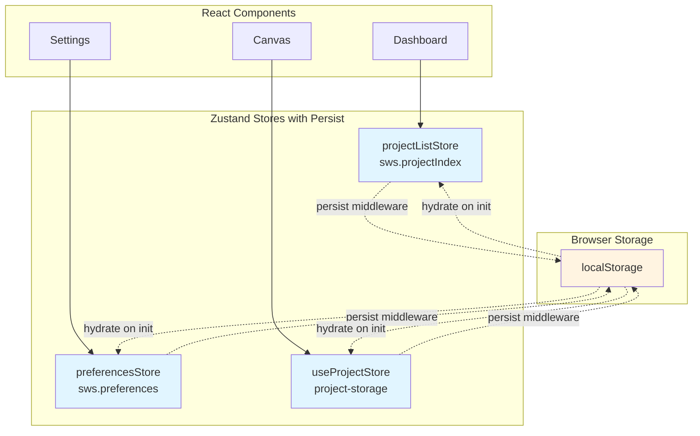
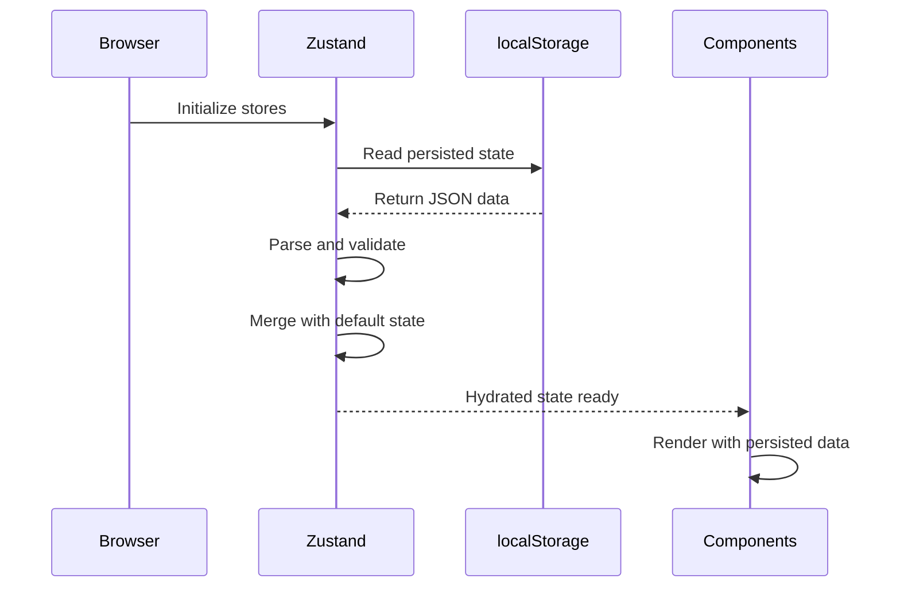
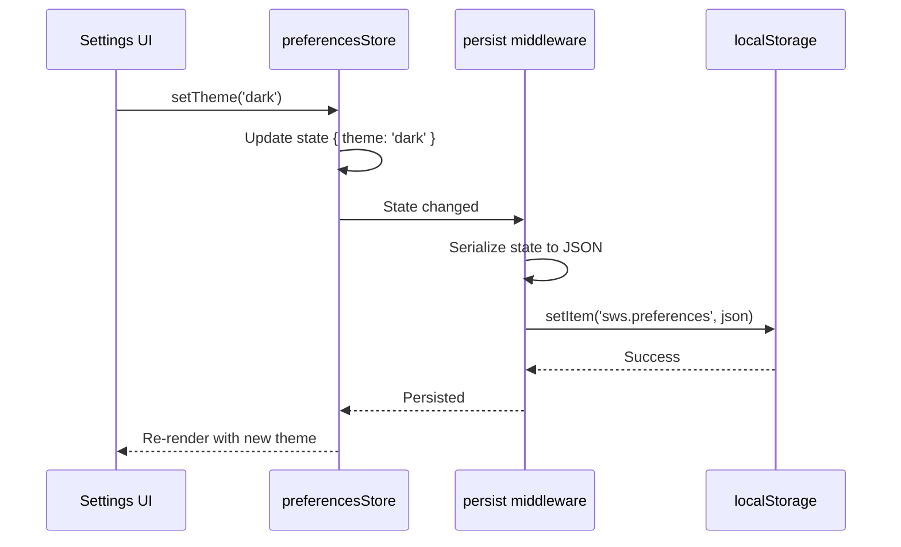
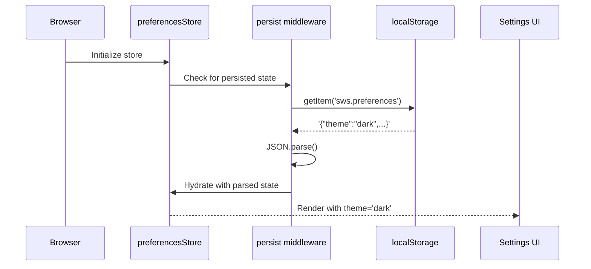

# Offline Storage: Zustand Persistence Middleware

## 1. Overview

### Purpose
Document the **Zustand persist middleware** implementation used across multiple stores to provide automatic localStorage synchronization for application state.

### Scope
- Zustand `persist` middleware configuration and behavior
- Stores using persistence: `preferencesStore`, `projectListStore`, `useProjectStore`
- Storage keys and namespacing strategy
- Hydration and rehydration flow
- Selective persistence (what gets stored vs computed)

### Implementation Status
- **Status**: ✅ Implemented
- **Code Locations**:
  - `hvac-design-app/src/core/store/preferencesStore.ts`
  - `hvac-design-app/src/features/dashboard/store/projectListStore.ts`
  - `hvac-design-app/src/stores/useProjectStore.ts`
- **Last Verified**: 2026-01-09

---

## 2. PRD References

### Related PRD Sections
- **Section 4.2: Offline-First Architecture** - localStorage as browser cache layer
- **FR-FILE-004**: Auto-save functionality relies on **localStorage** persistence

### Related User Journeys
- [UJ-GS-001](../../user-journeys/00-getting-started/tauri-offline/UJ-GS-001-FirstLaunchExperience.md): First launch experience
- [UJ-FM-002](../../user-journeys/08-file-management/tauri-offline/UJ-FM-002-AutoSave.md): Auto-save behavior

---

## 3. Technical Architecture

### Zustand Persist Middleware

The `persist` middleware is part of the Zustand ecosystem and provides automatic synchronization between store state and browser storage (localStorage).

```typescript
import { create } from 'zustand';
import { persist } from 'zustand/middleware';

const useStore = create(
  persist(
    (set) => ({
      // state and actions
    }),
    { name: 'storage-key' } // localStorage key
  )
);
```

### Architecture Diagram



---

## 4. Stores Using Persistence

### 4.1 Preferences Store

**Purpose**: Persist user preferences across sessions

**Code Location**: `hvac-design-app/src/core/store/preferencesStore.ts`

```typescript
export const usePreferencesStore = create<PreferencesStore>()(
  persist(
    (set) => ({
      projectFolder: '/projects',
      unitSystem: 'imperial',
      autoSaveInterval: 60000,
      gridSize: 24,
      theme: 'light',

      setProjectFolder: (path) => set({ projectFolder: path }),
      setUnitSystem: (system) => set({ unitSystem: system }),
      setAutoSaveInterval: (ms) => set({ autoSaveInterval: ms }),
      setGridSize: (size) => set({ gridSize: size }),
      setTheme: (theme) => set({ theme }),
    }),
    { name: 'sws.preferences' }
  )
);
```

**Storage Key**: `sws.preferences`

**Persisted State**:
- `projectFolder` - Default project directory path
- `unitSystem` - Imperial or metric units
- `autoSaveInterval` - Auto-save frequency (milliseconds)
- `gridSize` - Canvas grid size (pixels)
- `theme` - Light or dark theme

**Not Persisted**: Actions (functions) are automatically excluded by Zustand

---

### 4.2 Project List Store

**Purpose**: Persist the dashboard project index across sessions

**Code Location**: `hvac-design-app/src/features/dashboard/store/projectListStore.ts`

```typescript
export const useProjectListStore = create<ProjectListStore>()(
  persist(
    (set, get) => ({
      projects: [],
      loading: false,

      addProject: (project) => { /* ... */ },
      updateProject: (projectId, updates) => { /* ... */ },
      removeProject: (projectId) => { /* ... */ },
      archiveProject: (projectId) => { /* ... */ },
      restoreProject: (projectId) => { /* ... */ },
      duplicateProject: (projectId, newName) => { /* ... */ },
    }),
    { name: 'sws.projectIndex' }
  )
);
```

**Storage Key**: `sws.projectIndex`

**Persisted State**:
- `projects: ProjectListItem[]` - Array of project metadata
  - `projectId` - UUID
  - `projectName` - Display name
  - `projectNumber` - Optional project number
  - `clientName` - Optional client name
  - `createdAt` - ISO timestamp
  - `modifiedAt` - ISO timestamp
  - `storagePath` - File path reference
  - `isArchived` - Archive status

**Not Persisted**:
- `loading` - Transient UI state
- Actions (automatically excluded)

---

### 4.3 Project Store

**Purpose**: Persist simplified project list for quick access

**Code Location**: `hvac-design-app/src/stores/useProjectStore.ts`

```typescript
export const useProjectStore = create<ProjectStoreState>()(
  persist(
    (set, get) => ({
      projects: [],

      addProject: (project) => set((state) => ({
        projects: [project, ...state.projects],
      })),

      getProject: (id) => get().projects.find((p) => p.id === id),

      updateProject: (id, updates) => set((state) => ({
        projects: state.projects.map((p) =>
          p.id === id ? { ...p, ...updates, modifiedAt: new Date().toISOString() } : p
        ),
      })),

      deleteProject: (id) => set((state) => ({
        projects: state.projects.filter((p) => p.id !== id),
      })),
    }),
    { name: 'project-storage' }
  )
);
```

**Storage Key**: `project-storage`

**Persisted State**:
- `projects: Project[]` - Full project objects including:
  - `id`, `name`, `projectNumber`, `clientName`, `location`
  - `scope` - Project scope details
  - `siteConditions` - Environmental conditions
  - `createdAt`, `modifiedAt`
  - `entityCount` - Number of entities
  - `thumbnailUrl` - Preview image
  - `isArchived` - Archive status

---

## 5. Storage Keys and Namespacing

### Key Naming Convention

The application uses a consistent naming convention for localStorage keys:

| Store | Storage Key | Purpose |
|-------|-------------|---------|
| Preferences | `sws.preferences` | User settings |
| Project Index | `sws.projectIndex` | Dashboard project list |
| Project Storage | `project-storage` | Full project metadata |
| Auto-save | `hvac-project-{projectId}` | Individual project state (see [OS-SL-003](./OS-SL-003-LocalStorageCache.md)) |

**Namespace Strategy**:
- `sws.*` prefix for application-wide settings
- `hvac-project-*` prefix for project-specific data
- No prefix for legacy/third-party stores

---

## 6. Persistence Configuration

### Default Configuration

Zustand persist middleware uses these defaults:

```typescript
{
  name: 'storage-key',           // localStorage key (required)
  storage: createJSONStorage(() => localStorage), // default storage
  partialize: (state) => state,  // default: persist everything
  version: 0,                    // schema version (optional)
  migrate: undefined,            // migration function (optional)
}
```

### HVAC App Configuration

All stores use minimal configuration:

```typescript
{ name: 'storage-key' }
```

This means:
- **Storage engine**: localStorage (default)
- **Serialization**: JSON.stringify/parse (default)
- **Partialize**: Store entire state (default)
- **Version**: 0 (no versioning)
- **Migration**: None (no schema migrations)

---

## 7. Hydration Flow

### Application Startup Sequence



### Hydration Process

1. **Store Initialization**: Zustand creates store with default values
2. **Storage Read**: Persist middleware reads from localStorage
3. **JSON Parse**: Parse stored JSON string
4. **State Merge**: Merge persisted state with defaults
5. **Validation**: Implicit validation via TypeScript types
6. **Ready**: Store is ready for component consumption

### Hydration Code Path

```typescript
// Internal Zustand persist middleware flow (simplified)
const persistedState = localStorage.getItem(config.name);
if (persistedState) {
  const parsed = JSON.parse(persistedState);
  // Merge with initial state
  const merged = { ...initialState, ...parsed };
  set(merged);
}
```

---

## 8. Dehydration (Saving)

### Automatic Saving

Zustand persist middleware **automatically saves** to localStorage on every state change:

```typescript
// When you call an action:
setTheme('dark')

// Persist middleware automatically:
// 1. Serializes entire state to JSON
// 2. Writes to localStorage
localStorage.setItem('sws.preferences', JSON.stringify(state));
```

### Save Timing

- **Trigger**: Every store state change (via `set()`)
- **Debouncing**: None (immediate save)
- **Async**: Synchronous write to localStorage
- **Error Handling**: Silent failure (localStorage quota exceeded)

---

## 9. Selective Persistence

### What Gets Persisted

By default, Zustand persists **all state properties**:

```typescript
{
  projectFolder: '/projects',    // ✅ Persisted
  unitSystem: 'imperial',        // ✅ Persisted
  autoSaveInterval: 60000,       // ✅ Persisted
  gridSize: 24,                  // ✅ Persisted
  theme: 'light',                // ✅ Persisted
}
```

### What's Excluded

Functions (actions) are automatically excluded by JSON serialization:

```typescript
{
  setTheme: (theme) => set({ theme }), // ❌ Not persisted (function)
  setGridSize: (size) => set({ gridSize: size }), // ❌ Not persisted (function)
}
```

### Custom Partialize (Not Used)

The app doesn't use custom `partialize`, but it could exclude fields:

```typescript
// Example: Exclude loading state from persistence
persist(
  (set) => ({ /* ... */ }),
  {
    name: 'sws.projectIndex',
    partialize: (state) => {
      const { loading, error, ...rest } = state;
      return rest; // Exclude loading and error
    }
  }
)
```

---

## 10. Data Flow Example

### Setting a Preference



### Loading Persisted Data



---

## 11. Edge Cases and Handling

| Edge Case | Scenario | Handling | Test Coverage |
|-----------|----------|----------|---------------|
| **localStorage full** | Quota exceeded | Silent failure, state not persisted | Manual testing |
| **Corrupted JSON** | Invalid JSON in storage | Falls back to default state | None |
| **Missing key** | First launch, key doesn't exist | Uses default state | Implicit |
| **Partial state** | Old localStorage, missing fields | Merges with defaults | Implicit |
| **Type mismatch** | Wrong data type in storage | TypeScript warning, uses value as-is | None |
| **Browser incognito** | localStorage disabled | Silent failure, no persistence | Manual testing |

---

## 12. Error Scenarios

| Error | Cause | Recovery | User Message |
|-------|-------|----------|--------------|
| **QuotaExceededError** | localStorage full (>5MB) | State works in-memory, not persisted | None (silent) |
| **SecurityError** | Incognito mode, cookies disabled | State works in-memory | None (silent) |
| **JSON.parse error** | Corrupted localStorage data | Falls back to default state | None (silent) |
| **Type error** | Schema changed, old data incompatible | Uses whatever parses, may have type issues | None (silent) |

**Important**: Zustand persist middleware **fails silently** on errors. The app continues to work with in-memory state, but changes won't persist.

---

## 13. Performance Considerations

### Metrics

| Operation | Target | Measured | Notes |
|-----------|--------|----------|-------|
| Read from localStorage | <5ms | ~2ms | Synchronous, blocks main thread |
| Parse JSON | <10ms | ~5ms | Depends on state size |
| Write to localStorage | <5ms | ~3ms | Synchronous, blocks main thread |
| Serialize to JSON | <10ms | ~5ms | Depends on state complexity |

### Optimization Strategies

1. **Minimize stored data**: Only persist necessary fields
2. **Avoid frequent updates**: Batch state changes when possible
3. **Use partialize**: Exclude computed or transient fields
4. **Consider debouncing**: For high-frequency updates (not currently implemented)

### Performance Warnings

- **localStorage is synchronous** and blocks the main thread
- **Large objects** (>100KB) can cause noticeable UI lag
- **Frequent writes** (>10/second) can impact performance

**Current State**:
- Preferences store: ~1KB (negligible impact)
- Project list: ~10KB (20 projects x 500 bytes each)
- Project storage: ~50KB (detailed project data)
- Total: ~61KB (well under 5MB quota)

---

## 14. Security Considerations

### Data Sensitivity
- **Low sensitivity**: User preferences (theme, units, grid size)
- **Medium sensitivity**: Project metadata (names, dates)
- **Not stored**: Authentication tokens, API keys

### Encryption
- **Current**: None (localStorage stores plain text JSON)
- **Risk**: Anyone with access to browser can read data
- **Mitigation**: Desktop app (Tauri) has OS-level file permissions

### Access Control
- **localStorage scope**: Per-origin (protocol + domain + port)
- **Cross-site access**: Not possible (same-origin policy)
- **Incognito mode**: Separate localStorage, cleared on browser close

---

## 15. Related Documentation

### Prerequisites
- [localStorage Cache](./OS-SL-003-LocalStorageCache.md) - Browser storage layer
- [Architecture Overview](./OS-SL-001-ArchitectureOverview.md) - Three-layer architecture

### Related Elements
- [PreferencesStore Test](../../../hvac-design-app/src/core/store/__tests__/preferencesStore.test.ts)
- [ProjectListStore Test](../../../hvac-design-app/src/features/dashboard/store/__tests__/projectListStore.test.ts)

### Related Stores
- [Entity Store](../../elements/10-persistence/EntityStore.md) - Does NOT use persist (in-memory only)
- [Viewport Store](../../elements/10-persistence/ViewportStore.md) - Does NOT use persist

### Next Steps
- [State Hydration/Dehydration](../03-in-memory-state/OS-MEM-002-StateHydrationDehydration.md)
- [Auto-Save Flow](../05-data-flow/OS-DF-003-AutoSaveFlow.md)

---

## 16. Known Limitations

| Limitation | Impact | Workaround | Future Fix |
|------------|--------|------------|------------|
| **No versioning** | Schema changes break old data | None | Add version + migrate config |
| **No migration** | Can't evolve schema over time | Manual localStorage clear | Implement migrate function |
| **Silent failures** | No user feedback on errors | None | Add error notifications |
| **No debouncing** | High-frequency updates lag UI | Batch state changes | Add debounce wrapper |
| **5MB quota** | Large projects may exceed limit | Export/split projects | No alternative storage planned |
| **Synchronous I/O** | Blocks main thread | None | Consider async storage adapter |

---

## 17. Comparison with Other Persistence Methods

| Method | Current Use | Pros | Cons |
|--------|-------------|------|------|
| **Zustand persist** | Preferences, project list | Automatic, declarative | No versioning, silent failures |
| **Manual localStorage** | Auto-save (useAutoSave) | Full control, error handling | Manual serialization |
| **.sws files** | Desktop permanent storage | Full project data, backups | Requires Tauri, manual save |
| **IndexedDB (Rejected)** | Not implemented | Large storage, indexed queries | Not aligned with localStorage-only policy |

---

## 18. Testing Strategy

### Unit Tests

**Existing Coverage**:
- `preferencesStore.test.ts` - Tests store actions and state
- `projectListStore.test.ts` - Tests CRUD operations

**Missing Coverage**:
- localStorage integration tests
- Hydration from corrupted data
- Quota exceeded scenarios

### Integration Tests

**Recommended Tests**:
1. Fresh browser → Store hydrates with defaults
2. Existing localStorage → Store hydrates with persisted data
3. Corrupted localStorage → Store falls back to defaults
4. localStorage full → Store works in-memory without persistence

---

## 19. Changelog

| Date | Version | Change | Author |
|------|---------|--------|--------|
| 2026-01-09 | 1.0.0 | Initial documentation of Zustand persist middleware | System |

---

## 20. Notes

### Design Decisions

1. **Why Zustand persist over manual localStorage?**
   - Declarative: Automatic sync without boilerplate
   - Type-safe: TypeScript integration
   - Simple: Minimal configuration

2. **Why no versioning/migration?**
   - Schema is stable (v1.0.0)
   - Breaking changes handled by manual localStorage clear
   - Future enhancement when needed

3. **Why silent failures?**
   - Zustand persist middleware default behavior
   - App still works without persistence
   - User not interrupted by storage errors

### Future Enhancements

1. **Add versioning**: Implement `version` and `migrate` config
2. **Add debouncing**: Reduce write frequency for high-change stores
3. **Add error notifications**: Alert user when persistence fails
4. **Add partialize**: Exclude transient fields from storage
5. **Reinforce localStorage limits**: Encourage exports for large projects
