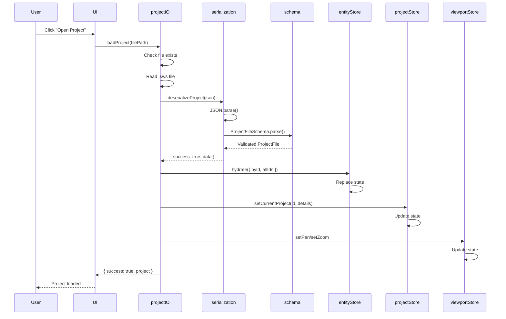
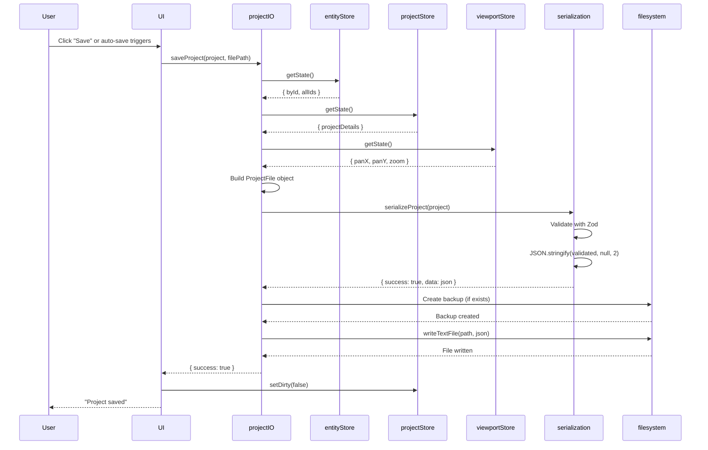
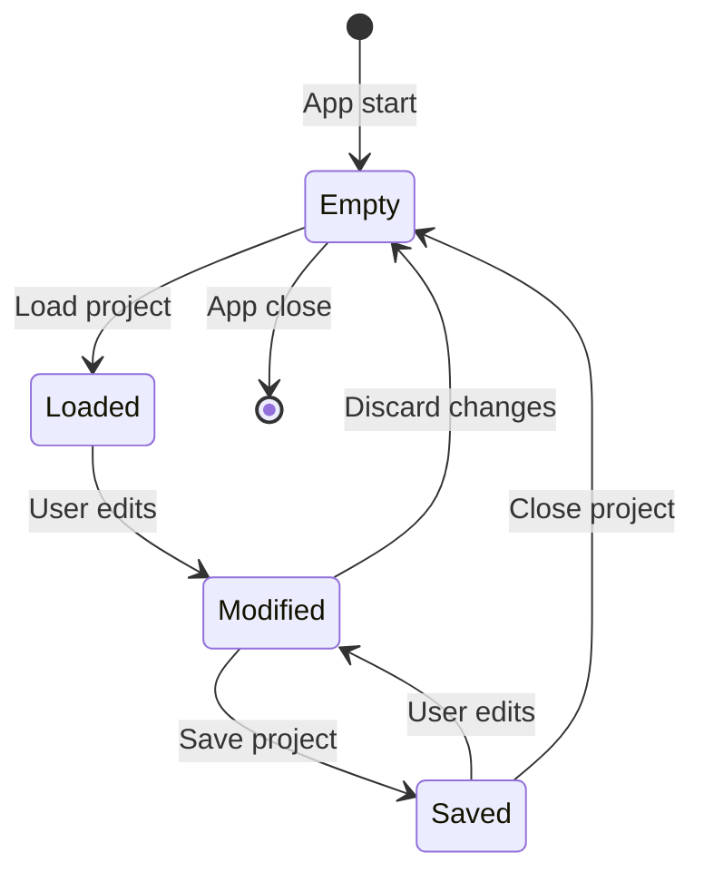

# Offline Storage: State Hydration and Dehydration

## 1. Overview

### Purpose
Document the **hydration and dehydration** process for loading and saving application state, including the flow from .sws files to Zustand stores and back.

### Scope
- Hydration: Loading .sws file → deserialize → validate → populate stores
- Dehydration: Collect store state → serialize → save to .sws file
- Store clearing on project close
- Memory management strategies

### Implementation Status
- **Status**: ✅ Implemented
- **Code Locations**:
  - `hvac-design-app/src/core/persistence/projectIO.ts` - File I/O
  - `hvac-design-app/src/core/persistence/serialization.ts` - Serialize/deserialize
  - `hvac-design-app/src/core/store/entityStore.ts` - hydrate() action
- **Last Verified**: 2026-01-09

---

## 2. PRD References

### Related PRD Sections
- **Section 4.2: Offline-First Architecture** - State management layer
- **FR-FILE-001**: Open existing project file

### Related User Journeys
- [UJ-FM-001](../../user-journey/UJ-FM-001-OpenProject.md): Open project workflow
- [UJ-FM-002](../../user-journey/UJ-FM-002-AutoSaveProject.md): Save project workflow

---

## 3. Hydration Flow (Loading Project)

### Complete Hydration Sequence



### Code Path

**1. User Initiates Load**
```typescript
// In UI component
const handleOpen = async (filePath: string) => {
  const result = await loadProject(filePath);
  if (result.success && result.project) {
    hydrateStores(result.project);
  }
};
```

**2. Load from File**
```typescript
// projectIO.ts:55-87
export async function loadProject(path: string): Promise<LoadResult> {
  // Check if file exists
  if (!(await exists(path))) {
    return { success: false, error: 'File not found' };
  }

  // Read file
  const content = await readTextFile(path);

  // Deserialize
  const result = deserializeProject(content);

  if (!result.success) {
    // Check if migration is needed
    if (result.requiresMigration && result.foundVersion) {
      const parsed = JSON.parse(content);
      const migrated = migrateProject(parsed, result.foundVersion);
      if (migrated.success) {
        return { success: true, project: migrated.data };
      }
    }

    // Try loading backup if main file is corrupted
    return loadBackup(path);
  }

  return { success: true, project: result.data };
}
```

**3. Deserialize and Validate**
```typescript
// serialization.ts:48-75
export function deserializeProject(json: string): DeserializationResult {
  try {
    const parsed = JSON.parse(json);

    // Check schema version
    if (parsed.schemaVersion !== CURRENT_SCHEMA_VERSION) {
      return {
        success: false,
        requiresMigration: true,
        foundVersion: parsed.schemaVersion,
        error: `Schema version mismatch`,
      };
    }

    // Validate against schema
    const validated = ProjectFileSchema.parse(parsed);

    return { success: true, data: validated };
  } catch (error) {
    if (error instanceof SyntaxError) {
      return { success: false, error: 'Invalid JSON format' };
    }
    return { success: false, error: error.message };
  }
}
```

**4. Hydrate Entity Store**
```typescript
// entityStore.ts:78-83
hydrate: (newState) =>
  set((state) => {
    state.byId = newState.byId;
    state.allIds = newState.allIds;
  }),
```

**5. Hydrate Project Store**
```typescript
// projectStore.ts (inferred)
setCurrentProject: (id: string, details: ProjectDetails) =>
  set({
    currentProjectId: id,
    projectDetails: details,
    isDirty: false,
    lastSavedAt: null,
  }),
```

**6. Hydrate Viewport Store**
```typescript
// viewportStore.ts (inferred)
const { panX, panY, zoom } = projectFile.viewportState;
viewportStore.getState().setPan(panX, panY);
viewportStore.getState().setZoom(zoom);
```

---

## 4. Dehydration Flow (Saving Project)

### Complete Dehydration Sequence



### Code Path

**1. Collect State from Stores**
```typescript
// Build complete project state
const projectFile: ProjectFile = {
  schemaVersion: CURRENT_SCHEMA_VERSION,
  projectId: currentProjectId,
  projectName: projectDetails.projectName,
  projectNumber: projectDetails.projectNumber,
  clientName: projectDetails.clientName,
  createdAt: projectDetails.createdAt,
  modifiedAt: new Date().toISOString(),

  // Entity state
  entities: {
    byId: entityStore.getState().byId,
    allIds: entityStore.getState().allIds,
  },

  // Viewport state
  viewportState: {
    panX: viewportStore.getState().panX,
    panY: viewportStore.getState().panY,
    zoom: viewportStore.getState().zoom,
  },

  // Settings
  settings: {
    unitSystem: preferencesStore.getState().unitSystem,
    gridSize: viewportStore.getState().gridSize,
    gridVisible: viewportStore.getState().gridVisible,
  },
};
```

**2. Serialize**
```typescript
// serialization.ts:27-42
export function serializeProject(project: ProjectFile): SerializationResult {
  try {
    // Validate before serializing
    const validated = ProjectFileSchema.parse(project);

    // Format with indentation for readability
    const json = JSON.stringify(validated, null, 2);

    return { success: true, data: json };
  } catch (error) {
    return {
      success: false,
      error: error instanceof Error ? error.message : 'Serialization failed',
    };
  }
}
```

**3. Save to File**
```typescript
// projectIO.ts:25-49
export async function saveProject(project: ProjectFile, path: string): Promise<IOResult> {
  try {
    // Serialize project
    const serialized = serializeProject(project);
    if (!serialized.success || !serialized.data) {
      return { success: false, error: serialized.error };
    }

    // Create backup of existing file
    if (await exists(path)) {
      const currentContent = await readTextFile(path);
      await writeTextFile(`${path}.bak`, currentContent);
    }

    // Write new file
    await writeTextFile(path, serialized.data);

    return { success: true };
  } catch (error) {
    return {
      success: false,
      error: error instanceof Error ? error.message : 'Save failed',
    };
  }
}
```

---

## 5. Store Clearing (Project Close)

### When to Clear

1. **User closes project**: Return to dashboard
2. **User opens different project**: Before loading new project
3. **Application error**: Reset to clean state

### Clearing Sequence

```typescript
// Clear all project-specific stores
function clearProjectStores() {
  // Clear entities
  useEntityStore.getState().clearAllEntities();

  // Clear project metadata
  useProjectStore.getState().clearProject();

  // Reset viewport
  useViewportStore.getState().resetViewport();

  // Clear selection
  useSelectionStore.getState().clearSelection();

  // Reset tool to default
  useToolStore.getState().setTool('select');
}
```

### What NOT to Clear

- **preferencesStore**: User preferences persist across projects
- **projectListStore**: Dashboard project index remains
- **localStorage keys**: Keep cached data for faster reload

---

## 6. Memory Management

### Memory Lifecycle



### Entity Store Size Estimation

| Entities | Memory Usage | Notes |
|----------|--------------|-------|
| 10 | ~10KB | Small project |
| 100 | ~100KB | Medium project |
| 1,000 | ~1MB | Large project |
| 10,000 | ~10MB | Very large project (may impact performance) |

**Formula**: ~1KB per entity (includes all properties, connections, metadata)

### Garbage Collection

Zustand stores are **garbage collected** when no components subscribe:

```typescript
// Store is eligible for GC when:
// 1. No React components use hooks (useEntityStore)
// 2. No external references (getState())
// 3. Store is cleared (clearAllEntities)
```

**Best Practice**: Always clear stores on project close to free memory.

---

## 7. Hydration Edge Cases

### Case 1: Partial Hydration

**Scenario**: Project file has viewport state but no entities

**Handling**:
```typescript
// Zod schema allows optional/default values
const ProjectFileSchema = z.object({
  entities: NormalizedEntitiesSchema.default({ byId: {}, allIds: [] }),
  viewportState: ViewportStateSchema.default({ panX: 0, panY: 0, zoom: 1 }),
});
```

### Case 2: Corrupted Entity Data

**Scenario**: One entity in file has invalid shape

**Handling**:
```typescript
// Zod validation fails on entire file
const result = deserializeProject(json);
if (!result.success) {
  // Fall back to backup
  return loadBackup(path);
}
```

**Future Enhancement**: Skip invalid entities, load rest

### Case 3: Schema Version Mismatch

**Scenario**: File has `schemaVersion: '0.9.0'`, app expects `1.0.0`

**Handling**:
```typescript
if (parsed.schemaVersion !== CURRENT_SCHEMA_VERSION) {
  return {
    success: false,
    requiresMigration: true,
    foundVersion: parsed.schemaVersion,
  };
}

// Caller handles migration
if (result.requiresMigration) {
  const migrated = migrateProject(parsed, result.foundVersion);
  // ... hydrate migrated data
}
```

See [OS-MIG-001](../06-migration/OS-MIG-001-SchemaVersioning.md) for migration details.

---

## 8. Dehydration Edge Cases

### Case 1: Missing Required Field

**Scenario**: Entity store has entity missing `id` field

**Handling**:
```typescript
// Zod validation fails during serialization
const validated = ProjectFileSchema.parse(project);
// Throws ZodError, serialization returns { success: false }
```

**Prevention**: TypeScript + runtime validation prevent this

### Case 2: Circular References

**Scenario**: Entity A references Entity B which references Entity A

**Handling**:
```typescript
// JSON.stringify throws on circular references
try {
  const json = JSON.stringify(project);
} catch (error) {
  return { success: false, error: 'Circular reference detected' };
}
```

**Prevention**: Schema design prevents circular references

### Case 3: Large Entity Count

**Scenario**: 10,000 entities, JSON is 10MB

**Handling**:
- Serialization takes longer (~500ms)
- File write may be slow
- User sees loading indicator
- No size limit (Tauri can write large files)

**Future Enhancement**: Stream serialization, compression

---

## 9. Performance Considerations

### Hydration Performance

| Operation | 100 entities | 1,000 entities | 10,000 entities |
|-----------|--------------|----------------|-----------------|
| Read file | ~5ms | ~10ms | ~50ms |
| JSON.parse | ~2ms | ~15ms | ~150ms |
| Zod validation | ~5ms | ~40ms | ~400ms |
| Store hydration | ~1ms | ~5ms | ~50ms |
| **Total** | **~13ms** | **~70ms** | **~650ms** |

**Target**: <100ms for typical projects (1,000 entities)

### Dehydration Performance

| Operation | 100 entities | 1,000 entities | 10,000 entities |
|-----------|--------------|----------------|-----------------|
| Collect state | ~1ms | ~3ms | ~30ms |
| Zod validation | ~5ms | ~40ms | ~400ms |
| JSON.stringify | ~2ms | ~15ms | ~150ms |
| Write file | ~10ms | ~20ms | ~100ms |
| **Total** | **~18ms** | **~78ms** | **~680ms** |

**Target**: <100ms for typical projects (1,000 entities)

### Optimization Strategies

1. **Lazy validation**: Skip Zod on save, validate on load only
2. **Incremental serialization**: Only serialize changed entities
3. **Compression**: gzip JSON before writing
4. **Worker threads**: Offload serialization to Web Worker
5. **Streaming**: Stream large files instead of buffering

**Current Status**: None implemented (performance acceptable for Phase 1)

---

## 10. Testing Strategy

### Hydration Tests

```typescript
describe('Hydration', () => {
  it('loads empty project', async () => {
    const project = createEmptyProjectFile();
    const json = JSON.stringify(project);
    const result = deserializeProject(json);
    expect(result.success).toBe(true);
  });

  it('loads project with 100 entities', async () => {
    const project = createProjectWithEntities(100);
    const json = JSON.stringify(project);
    const result = deserializeProject(json);
    expect(result.success).toBe(true);
    expect(result.data?.entities.allIds).toHaveLength(100);
  });

  it('rejects invalid JSON', async () => {
    const result = deserializeProject('{ invalid json }');
    expect(result.success).toBe(false);
    expect(result.error).toContain('Invalid JSON');
  });

  it('rejects invalid schema', async () => {
    const invalid = { schemaVersion: '1.0.0', projectId: 'not-a-uuid' };
    const result = deserializeProject(JSON.stringify(invalid));
    expect(result.success).toBe(false);
  });
});
```

### Dehydration Tests

```typescript
describe('Dehydration', () => {
  it('serializes empty project', () => {
    const project = createEmptyProjectFile();
    const result = serializeProject(project);
    expect(result.success).toBe(true);
    expect(result.data).toContain('"schemaVersion":"1.0.0"');
  });

  it('serializes project with entities', () => {
    const project = createProjectWithEntities(10);
    const result = serializeProject(project);
    expect(result.success).toBe(true);
    expect(JSON.parse(result.data!).entities.allIds).toHaveLength(10);
  });

  it('rejects invalid project', () => {
    const invalid = { schemaVersion: 123 }; // Wrong type
    const result = serializeProject(invalid as any);
    expect(result.success).toBe(false);
  });
});
```

**Existing Coverage**:
- `serialization.test.ts` - 16 tests
- `projectIO.test.ts` - 40+ tests

---

## 11. Related Documentation

### Prerequisites
- [Zustand Store Architecture](./OS-MEM-001-ZustandStoreArchitecture.md)
- [.sws File Format](../02-storage-layers/OS-SL-002-SwsFileFormat.md)

### Related Elements
- [ProjectIO Element Docs](../../elements/10-persistence/ProjectIO.md)
- [Serialization Element Docs](../../elements/10-persistence/Serialization.md)

### Next Steps
- [Import Flow](../05-data-flow/OS-DF-001-ImportFlow.md)
- [Export Flow](../05-data-flow/OS-DF-002-ExportFlow.md)

---

## 12. Known Limitations

| Limitation | Impact | Workaround | Future Fix |
|------------|--------|------------|------------|
| **No partial hydration** | Invalid entity corrupts entire load | Use backup file | Skip invalid entities |
| **Synchronous validation** | Large files block UI | Show loading | Move to Web Worker |
| **No compression** | Large files (10MB+) slow to save/load | None | Implement gzip |
| **No streaming** | Large files load entirely into memory | None | Implement stream parsing |
| **No progress indicator** | User doesn't know load progress | Generic spinner | Emit progress events |

---

## 13. Changelog

| Date | Version | Change | Author |
|------|---------|--------|--------|
| 2026-01-09 | 1.0.0 | Initial documentation of hydration/dehydration | System |

---

## 14. Notes

### Design Decisions

1. **Why validate on both serialize and deserialize?**
   - Serialize: Catch bugs early (invalid state shouldn't be saved)
   - Deserialize: Protect against corrupted/tampered files

2. **Why not use IndexedDB for hydration?**
   - IndexedDB is rejected under the localStorage-only policy
   - .sws files are source of truth on desktop
   - localStorage is used for web persistence and auto-save

3. **Why replace entire state instead of merge?**
   - Simpler: No complex merge logic
   - Safer: Avoids state inconsistencies
   - Faster: Single assignment vs iterating and comparing

### Future Enhancements

1. **Partial hydration**: Load entities incrementally
2. **Lazy validation**: Validate on-demand, not upfront
3. **Compression**: gzip large project files
4. **Streaming**: Parse/write files in chunks
5. **Progress events**: Emit progress for large files
