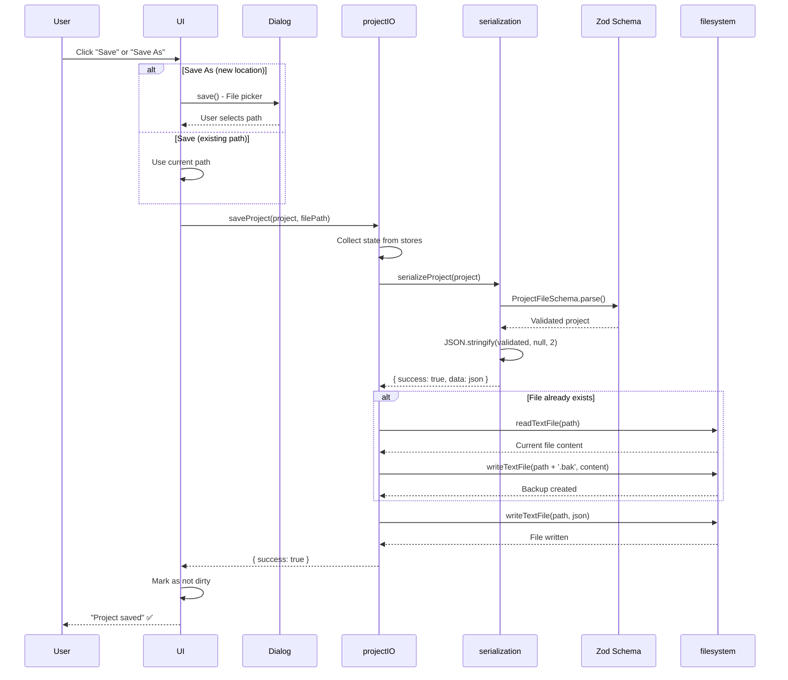

# Offline Storage: Export Flow

## 1. Overview

### Purpose
Document the **export flow** for saving projects and exporting data in various formats (.sws, CSV, JSON, PDF).

### Scope
- .sws file export (primary save format)
- CSV export for bill of materials
- JSON export for data interchange
- PDF export for documentation/printing
- File dialogs and user feedback
- Error handling

### Implementation Status
- **Status**: ✅ .sws export implemented, ⚠️ CSV/JSON/PDF partially implemented
- **Code Locations**:
  - `hvac-design-app/src/core/persistence/projectIO.ts:saveProject()`
  - `hvac-design-app/src/core/persistence/serialization.ts:serializeProject()`
  - Export features (location varies by format)
- **Last Verified**: 2026-01-09

---

## 2. Export Types Overview

| Export Type | File Extension | Purpose | Status |
|-------------|---------------|---------|--------|
| **.sws** | `.sws` | Primary project save format | ✅ Implemented |
| **CSV** | `.csv` | Bill of materials export | ⚠️ Planned |
| **JSON** | `.json` | Data interchange, backups | ⚠️ Partial |
| **PDF** | `.pdf` | Documentation, printing | ⚠️ Planned |

---

## 3. .SWS Export Flow (Primary Save)

### Complete Save Flow



### Code Implementation

**Location**: `projectIO.ts:25-49`

```typescript
export async function saveProject(project: ProjectFile, path: string): Promise<IOResult> {
  try {
    // Serialize project
    const serialized = serializeProject(project);
    if (!serialized.success || !serialized.data) {
      return { success: false, error: serialized.error };
    }

    // Create backup of existing file
    if (await exists(path)) {
      const currentContent = await readTextFile(path);
      await writeTextFile(`${path}.bak`, currentContent);
    }

    // Write new file
    await writeTextFile(path, serialized.data);

    return { success: true };
  } catch (error) {
    return {
      success: false,
      error: error instanceof Error ? error.message : 'Save failed',
    };
  }
}
```

### Serialization Logic

**Location**: `serialization.ts:27-42`

```typescript
export function serializeProject(project: ProjectFile): SerializationResult {
  try {
    // Validate before serializing
    const validated = ProjectFileSchema.parse(project);

    // Format with indentation for readability
    const json = JSON.stringify(validated, null, 2);

    return { success: true, data: json };
  } catch (error) {
    return {
      success: false,
      error: error instanceof Error ? error.message : 'Serialization failed',
    };
  }
}
```

---

## 4. Save vs Save As

### Save (Cmd/Ctrl+S)

**When**: Project already has a file path

**Flow**:
```typescript
async function handleSave() {
  const currentPath = useProjectStore.getState().filePath;

  if (!currentPath) {
    // No path yet, redirect to Save As
    return handleSaveAs();
  }

  const project = collectProjectState();
  const result = await saveProject(project, currentPath);

  if (result.success) {
    toast.success('Project saved');
    useProjectStore.getState().setDirty(false);
  } else {
    toast.error(result.error || 'Save failed');
  }
}
```

### Save As (Cmd/Ctrl+Shift+S)

**When**: User wants to save with new name/location

**Flow**:
```typescript
async function handleSaveAs() {
  const filePath = await saveFileDialog({
    filters: [{ name: 'SWS Project', extensions: ['sws'] }],
    defaultPath: await getDocumentsDir(),
  });

  if (!filePath) return; // User cancelled

  const project = collectProjectState();
  const result = await saveProject(project, filePath);

  if (result.success) {
    toast.success('Project saved');
    useProjectStore.getState().setFilePath(filePath);
    useProjectStore.getState().setDirty(false);
  } else {
    toast.error(result.error || 'Save failed');
  }
}
```

---

## 5. Collecting Project State

### Dehydrating All Stores

```typescript
function collectProjectState(): ProjectFile {
  const entityStore = useEntityStore.getState();
  const projectStore = useProjectStore.getState();
  const viewportStore = useViewportStore.getState();
  const preferencesStore = usePreferencesStore.getState();

  return {
    schemaVersion: CURRENT_SCHEMA_VERSION,
    projectId: projectStore.currentProjectId!,
    projectName: projectStore.projectDetails!.projectName,
    projectNumber: projectStore.projectDetails?.projectNumber,
    clientName: projectStore.projectDetails?.clientName,
    createdAt: projectStore.projectDetails!.createdAt,
    modifiedAt: new Date().toISOString(), // Update timestamp

    // Entities (main canvas data)
    entities: {
      byId: entityStore.byId,
      allIds: entityStore.allIds,
    },

    // Viewport state
    viewportState: {
      panX: viewportStore.panX,
      panY: viewportStore.panY,
      zoom: viewportStore.zoom,
    },

    // Settings
    settings: {
      unitSystem: preferencesStore.unitSystem,
      gridSize: viewportStore.gridSize,
      gridVisible: viewportStore.gridVisible,
    },
  };
}
```

See [OS-MEM-002](../03-in-memory-state/OS-MEM-002-StateHydrationDehydration.md) for dehydration details.

---

## 6. Backup Creation

### Automatic Backup on Save

**Purpose**: Preserve previous version in case of corruption or mistake

**Implementation**:
```typescript
// Create backup of existing file
if (await exists(path)) {
  const currentContent = await readTextFile(path);
  await writeTextFile(`${path}.bak`, currentContent);
}
```

**Backup Strategy**:
- **When**: Every save (if file already exists)
- **Format**: `{filename}.sws.bak`
- **Retention**: Only 1 backup kept (overwrites previous backup)

**Future Enhancement**: Keep multiple backup versions (e.g., 5 most recent)

See [OS-ERR-002](../07-error-recovery/OS-ERR-002-BackupRecovery.md) for backup details.

---

## 7. CSV Export

### Bill of Materials Export

**Purpose**: Export equipment/material list for procurement

**Status**: ⚠️ Planned (not fully implemented)

**Proposed Flow**:
```typescript
async function exportToCSV(projectId: string) {
  const entities = selectAllEntities();
  const equipment = entities.filter(e => e.type === 'equipment');

  // Build CSV with BOM byte order mark for Excel compatibility
  const BOM = '\uFEFF';
  const headers = 'Type,Model,Quantity,Size,Location\n';
  const rows = equipment.map(e =>
    `${e.equipmentType},${e.model || 'N/A'},1,${e.size || 'N/A'},${e.position.x},${e.position.y}`
  ).join('\n');

  const csv = BOM + headers + rows;

  // Save to file
  const path = await saveFileDialog({
    filters: [{ name: 'CSV', extensions: ['csv'] }],
    defaultPath: `${projectName}-bom.csv`,
  });

  if (path) {
    await writeTextFile(path, csv);
    toast.success('BOM exported to CSV');
  }
}
```

**CSV Format**:
```csv
Type,Model,Quantity,Size,Location
Air Handler,AHU-100,1,5000 CFM,100,200
Duct,Rectangular,1,24x12,150,200
```

---

## 8. JSON Export

### Data Interchange Format

**Purpose**: Export project data for external tools or backups

**Status**: ⚠️ Partial (can save .sws as .json)

**Flow**:
```typescript
async function exportToJSON(projectId: string) {
  const project = collectProjectState();
  const serialized = serializeProject(project);

  if (!serialized.success) {
    toast.error('Failed to serialize project');
    return;
  }

  const path = await saveFileDialog({
    filters: [{ name: 'JSON', extensions: ['json'] }],
    defaultPath: `${project.projectName}.json`,
  });

  if (path) {
    await writeTextFile(path, serialized.data!);
    toast.success('Project exported to JSON');
  }
}
```

**Difference from .sws**:
- Same content, different extension
- May omit internal metadata (e.g., viewport state)
- Intended for data exchange, not primary save format

---

## 9. PDF Export

### Documentation and Printing

**Purpose**: Generate printable documentation with canvas snapshot

**Status**: ⚠️ Planned (not implemented)

**Proposed Architecture**:
1. **Capture canvas**: Render canvas to image (PNG/SVG)
2. **Generate PDF**: Use library like `jsPDF` or `pdfkit`
3. **Include data**: Add entity table, project metadata
4. **Save to file**: Write PDF via Tauri file system

**Proposed Flow**:
```typescript
async function exportToPDF(projectId: string) {
  // 1. Capture canvas
  const canvasElement = document.querySelector('#canvas');
  const canvasImage = await captureCanvasAsImage(canvasElement);

  // 2. Generate PDF
  const pdf = new jsPDF('landscape', 'mm', 'a4');

  // Title page
  pdf.setFontSize(20);
  pdf.text(projectName, 10, 10);
  pdf.setFontSize(12);
  pdf.text(`Client: ${clientName}`, 10, 20);
  pdf.text(`Date: ${new Date().toLocaleDateString()}`, 10, 25);

  // Canvas image
  pdf.addPage();
  pdf.addImage(canvasImage, 'PNG', 10, 10, 277, 190);

  // Equipment list
  pdf.addPage();
  pdf.text('Equipment List', 10, 10);
  // ... add table

  // 3. Save PDF
  const pdfBlob = pdf.output('blob');
  const pdfBuffer = await pdfBlob.arrayBuffer();

  const path = await saveFileDialog({
    filters: [{ name: 'PDF', extensions: ['pdf'] }],
    defaultPath: `${projectName}.pdf`,
  });

  if (path) {
    await writeBinaryFile(path, new Uint8Array(pdfBuffer));
    toast.success('PDF exported');
  }
}
```

---

## 10. Performance Metrics

### Export Performance

| Operation | Small (10KB) | Medium (100KB) | Large (1MB) | Very Large (10MB) |
|-----------|--------------|----------------|-------------|-------------------|
| Collect state | 1ms | 3ms | 10ms | 50ms |
| Serialize | 2ms | 5ms | 20ms | 150ms |
| Validate (Zod) | 5ms | 10ms | 50ms | 400ms |
| Create backup | 5ms | 10ms | 50ms | 200ms |
| Write file | 10ms | 20ms | 100ms | 500ms |
| **Total** | **~23ms** | **~48ms** | **~230ms** | **~1300ms** |

**Target**: <100ms for typical projects (100-1000 entities)

---

## 11. Error Scenarios

| Error | Cause | User Message | Recovery |
|-------|-------|--------------|----------|
| **Write permission denied** | OS file permissions | "Cannot save: Permission denied" | Choose different location |
| **Disk full** | Insufficient storage space | "Cannot save: Disk full" | Free up space |
| **Invalid path** | Path contains invalid characters | "Invalid file path" | Choose valid path |
| **Serialization failed** | Invalid entity data | "Failed to save: Invalid data" | Check console, fix data |
| **File locked** | Another process has file open | "Cannot save: File is open" | Close other app |

---

## 12. Edge Cases

### Case 1: Extremely Large Project

**Scenario**: 10,000 entities, serialization takes >1 second

**Handling**:
- Show progress indicator
- Don't block UI (use Web Worker in future)
- Warn user about large file size

### Case 2: Special Characters in Filename

**Scenario**: User enters `My Project / Version 2.sws`

**Handling**:
- OS file dialog sanitizes automatically
- Tauri API rejects invalid paths
- Show error message

### Case 3: Save During Auto-Save

**Scenario**: User saves while auto-save is in progress

**Handling**:
- Cancel auto-save
- Prioritize manual save
- Update last saved timestamp

---

## 13. Testing Strategy

### Unit Tests

```typescript
describe('saveProject', () => {
  it('saves valid project', async () => {
    const project = createValidProject();
    const result = await saveProject(project, '/tmp/test.sws');
    expect(result.success).toBe(true);
  });

  it('creates backup before overwriting', async () => {
    const project = createValidProject();
    await saveProject(project, '/tmp/test.sws');
    await saveProject(project, '/tmp/test.sws'); // Save again
    const backupExists = await exists('/tmp/test.sws.bak');
    expect(backupExists).toBe(true);
  });

  it('rejects invalid project data', async () => {
    const invalid = { schemaVersion: 'wrong' };
    const result = await saveProject(invalid as any, '/tmp/test.sws');
    expect(result.success).toBe(false);
  });
});
```

### Integration Tests

1. **Full save flow**: Create project → Edit → Save → Verify file exists
2. **Save As flow**: Open project → Save As new name → Verify both files exist
3. **Backup flow**: Save → Edit → Save again → Verify backup created
4. **CSV export**: Create project with equipment → Export CSV → Verify format

---

## 14. Related Documentation

### Prerequisites
- [.sws File Format](../02-storage-layers/OS-SL-002-SwsFileFormat.md)
- [State Dehydration](../03-in-memory-state/OS-MEM-002-StateHydrationDehydration.md)

### Related Elements
- [ProjectIO Element Docs](../../elements/10-persistence/ProjectIO.md)
- [Serialization Element Docs](../../elements/10-persistence/Serialization.md)

### Related Flows
- [Import Flow](./OS-DF-001-ImportFlow.md)
- [Auto-Save Flow](./OS-DF-003-AutoSaveFlow.md)
- [Manual Save Flow](./OS-DF-004-ManualSaveFlow.md)

---

## 15. Known Limitations

| Limitation | Impact | Workaround | Future Fix |
|------------|--------|------------|------------|
| **No progress indicator** | Large saves have no feedback | Generic spinner | Emit progress events |
| **No compression** | Large files slow to save | None | Implement gzip |
| **Single backup only** | Can't recover from multiple mistakes | Manual backups | Keep 5 versions |
| **No atomic writes** | Crash during save corrupts file | Backup exists | Write to temp, then rename |
| **CSV export basic** | Limited formatting | Manual Excel cleanup | Rich Excel export |
| **PDF export missing** | Can't print documentation | Screenshot canvas | Full PDF generation |

---

## 16. Changelog

| Date | Version | Change | Author |
|------|---------|--------|--------|
| 2026-01-09 | 1.0.0 | Initial export flow documentation | System |

---

## 17. Notes

### Design Decisions

1. **Why JSON with indentation?**
   - Human-readable for debugging
   - Git-friendly (easier to diff)
   - Only ~10% larger than minified

2. **Why single backup?**
   - Simple implementation for Phase 1
   - Most users don't need version history
   - Can add rotation later

3. **Why validate before save?**
   - Catch bugs early (don't save invalid data)
   - Ensures files can always be loaded

### Future Enhancements

1. **Backup rotation**: Keep last 5 versions
2. **Compression**: gzip large files
3. **Atomic writes**: Write to temp file, then rename
4. **Progress events**: Show progress for large exports
5. **Rich CSV export**: Excel-compatible with formatting
6. **PDF generation**: Canvas snapshot + data tables
