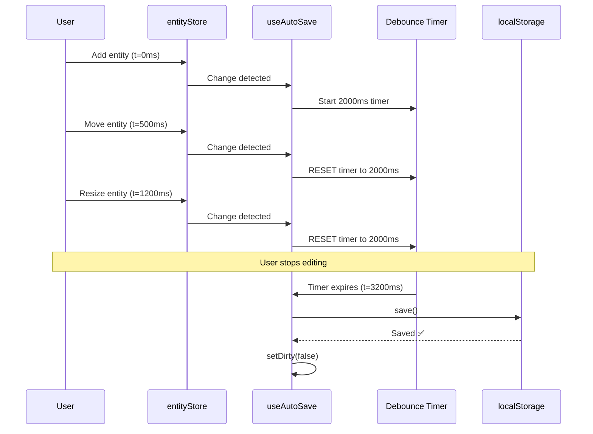

# Offline Storage: Auto-Save Flow

## 1. Overview

### Purpose
Document the **auto-save implementation** using the `useAutoSave` hook, including actual behavior (2-second debounce), change detection, localStorage persistence, and differences from documented behavior.

### Scope
- `useAutoSave` hook implementation
- **Actual behavior**: 2000ms debounce (not 5 minutes as mentioned elsewhere)
- Change detection via store subscriptions
- localStorage persistence (web) vs .sws file saves (desktop)
- beforeunload handling
- Dirty state tracking

### Implementation Status
- **Status**: ✅ Implemented
- **Code Location**: `hvac-design-app/src/features/canvas/hooks/useAutoSave.ts`
- **Actual Debounce**: 2000ms (2 seconds)
- **Last Verified**: 2026-01-09

---

## 2. PRD References

### Related PRD Sections
- **FR-FILE-004**: Auto-save functionality

### Documentation Discrepancy

**PRD/User Journey says**: 5-minute auto-save interval
**Code actually does**: 2-second debounce

**Reason for difference**: 2-second debounce provides better UX (feels instant while preventing excessive saves)

---

## 3. Auto-Save Architecture

```mermaid
graph TB
    subgraph "Store Changes"
        ES[entityStore changes]
        VS[viewportStore changes]
    end

    subgraph "useAutoSave Hook"
        SUB[Store subscriptions]
        DET[Change detection]
        DEB[Debounce timer<br/>2000ms]
        SAVE[save() function]
    end

    subgraph "Storage Targets"
        LS[localStorage<br/>hvac-project-{id}]
        FS[.sws file<br/>Desktop only]
    end

    ES --> SUB
    VS --> SUB
    SUB --> DET
    DET -->|Change detected| DEB
    DEB -->|Timer expires| SAVE
    SAVE --> LS
    SAVE -.->|Manual save| FS

    style DEB fill:#fff4e1
    style SAVE fill:#e1f5ff
    style LS fill:#e8f5e9
```

---

## 4. useAutoSave Hook

### Hook Signature

**Location**: `hvac-design-app/src/features/canvas/hooks/useAutoSave.ts:72-266`

```typescript
interface UseAutoSaveOptions {
  enabled?: boolean;        // Default: true
  debounceDelay?: number;   // Default: 2000ms
  interval?: number;        // Optional periodic save
  onSave?: (success: boolean) => void; // Callback
}

function useAutoSave(options: UseAutoSaveOptions = {}): {
  save: () => boolean;
  isDirty: boolean;
}
```

### Default Configuration

```typescript
const { enabled = true, debounceDelay = 2000, interval, onSave } = options;
```

**Key Parameters**:
- `enabled`: Auto-save active (default: true)
- `debounceDelay`: Wait time after last change (default: 2000ms)
- `interval`: Optional periodic save (e.g., every 60000ms)
- `onSave`: Callback when save completes

---

## 5. Change Detection

### Store Subscriptions

**Entity Store Subscription** (`useAutoSave.ts:159-180`):

```typescript
useEffect(() => {
  // Initialize with current state
  const initialState = useEntityStore.getState();
  prevEntityRef.current = JSON.stringify({
    byId: initialState.byId,
    allIds: initialState.allIds
  });

  const unsubEntity = useEntityStore.subscribe((state) => {
    const currentState = JSON.stringify({
      byId: state.byId,
      allIds: state.allIds
    });

    if (prevEntityRef.current !== null && prevEntityRef.current !== currentState) {
      // Clear debounce timer immediately on change
      if (debounceTimer.current) {
        clearTimeout(debounceTimer.current);
        debounceTimer.current = null;
      }

      setLocalDirty(true);
      setDirty(true);
      setChangeCounter((c) => c + 1); // Trigger debounce reset
    }

    prevEntityRef.current = currentState;
  });

  return () => unsubEntity();
}, [setDirty]);
```

**Viewport Store Subscription** (`useAutoSave.ts:183-204`):

```typescript
useEffect(() => {
  // Initialize with current state
  const initialState = useViewportStore.getState();
  prevViewportRef.current = JSON.stringify({
    panX: initialState.panX,
    panY: initialState.panY,
    zoom: initialState.zoom
  });

  const unsubViewport = useViewportStore.subscribe((state) => {
    const currentState = JSON.stringify({
      panX: state.panX,
      panY: state.panY,
      zoom: state.zoom
    });

    if (prevViewportRef.current !== null && prevViewportRef.current !== currentState) {
      // Clear debounce timer immediately on change
      if (debounceTimer.current) {
        clearTimeout(debounceTimer.current);
        debounceTimer.current = null;
      }

      setLocalDirty(true);
      setDirty(true);
      setChangeCounter((c) => c + 1);
    }

    prevViewportRef.current = currentState;
  });

  return () => unsubViewport();
}, [setDirty]);
```

### Change Detection Strategy

1. **Serialize state to JSON**: Convert store state to string
2. **Compare with previous**: Check if JSON string changed
3. **Set dirty flag**: Mark project as unsaved
4. **Increment change counter**: Triggers debounce reset
5. **Store new state**: Update previous state reference

**Why JSON.stringify?**
- Simple deep equality check
- Works with nested objects
- Performance acceptable for typical state size

---

## 6. Debounce Logic

### Debounced Auto-Save

**Location**: `useAutoSave.ts:207-226`

```typescript
useEffect(() => {
  if (!enabled || !storeIsDirty) return;

  // Clear existing timer on each change (reset debounce)
  if (debounceTimer.current) {
    clearTimeout(debounceTimer.current);
    debounceTimer.current = null;
  }

  debounceTimer.current = setTimeout(() => {
    save();
  }, debounceDelay);

  return () => {
    if (debounceTimer.current) {
      clearTimeout(debounceTimer.current);
      debounceTimer.current = null;
    }
  };
}, [enabled, storeIsDirty, debounceDelay, save, changeCounter]);
```

### How Debounce Works



**Key Behavior**:
- Every change **resets** the 2-second timer
- Save only happens **2 seconds after last change**
- Prevents excessive saves during active editing

---

## 7. Save Function

### Building Project Data

**Location**: `useAutoSave.ts:110-138`

```typescript
const buildProjectData = useCallback((): StoredProject | null => {
  if (!currentProjectId || !projectDetails) return null;

  const entityStore = useEntityStore.getState();
  const viewportStore = useViewportStore.getState();

  return {
    projectId: currentProjectId,
    projectName: projectDetails.projectName,
    projectNumber: projectDetails.projectNumber || '',
    clientName: projectDetails.clientName || '',
    createdAt: projectDetails.createdAt,
    modifiedAt: new Date().toISOString(),

    entities: {
      byId: entityStore.byId as Record<string, unknown>,
      allIds: entityStore.allIds,
    },

    viewportState: {
      panX: viewportStore.panX,
      panY: viewportStore.panY,
      zoom: viewportStore.zoom,
    },

    settings: {
      unitSystem: 'imperial',
      gridSize: viewportStore.gridSize || 12,
      gridVisible: viewportStore.gridVisible,
    },
  };
}, [currentProjectId, projectDetails]);
```

### Saving to localStorage

**Location**: `useAutoSave.ts:25-33`

```typescript
export function saveProjectToStorage(projectId: string, project: StoredProject): boolean {
  try {
    const key = `${STORAGE_KEY_PREFIX}${projectId}`;
    localStorage.setItem(key, JSON.stringify(project));
    return true;
  } catch {
    return false; // Quota exceeded or other error
  }
}
```

**Storage Key**: `hvac-project-{projectId}`

**Example**: `hvac-project-123e4567-e89b-12d3-a456-426614174000`

### Complete Save Flow

**Location**: `useAutoSave.ts:141-156`

```typescript
const save = useCallback((): boolean => {
  if (!currentProjectId) return false;

  const projectData = buildProjectData();
  if (!projectData) return false;

  const success = saveProjectToStorage(currentProjectId, projectData);

  if (success) {
    setLocalDirty(false);
    setDirty(false);
  }

  onSave?.(success);
  return success;
}, [currentProjectId, buildProjectData, onSave, setDirty]);
```

---

## 8. Interval-Based Auto-Save (Optional)

### Periodic Save

**Location**: `useAutoSave.ts:229-243`

```typescript
useEffect(() => {
  if (!enabled || !interval) return;

  intervalTimer.current = setInterval(() => {
    if (storeIsDirty) {
      save();
    }
  }, interval);

  return () => {
    if (intervalTimer.current) {
      clearInterval(intervalTimer.current);
    }
  };
}, [enabled, interval, storeIsDirty, save]);
```

**Usage**:
```typescript
// Auto-save every 60 seconds (if dirty)
useAutoSave({ interval: 60000 });
```

**Default**: Not enabled (only debounce used)

---

## 9. beforeunload Handling

### Save on Browser Close

**Location**: `useAutoSave.ts:246-255`

```typescript
useEffect(() => {
  const handleBeforeUnload = () => {
    if (storeIsDirty) {
      save();
    }
  };

  window.addEventListener('beforeunload', handleBeforeUnload);
  return () => window.removeEventListener('beforeunload', handleBeforeUnload);
}, [storeIsDirty, save]);
```

**Purpose**: Save unsaved changes when user closes tab/window

**Limitation**: `beforeunload` is **synchronous**, so save must complete quickly (localStorage is fast enough)

---

## 10. Dirty State Tracking

### Dirty Flag

**Purpose**: Track if project has unsaved changes

**State**:
```typescript
const [isDirty, setLocalDirty] = useState(storeIsDirty);
```

**Sources**:
- Local state: `isDirty` (returned by hook)
- Global state: `projectStore.isDirty` (synced)

### When Dirty is Set

1. **Entity added/updated/removed**: `entityStore` subscription
2. **Viewport changed**: Pan or zoom changed
3. **Project details updated**: Name, client, etc. changed

### When Dirty is Cleared

1. **Auto-save completes**: After successful localStorage save
2. **Manual save**: User explicitly saves
3. **Project loaded**: Fresh project loaded from file

---

## 11. Usage Example

### In Canvas Component

```typescript
function Canvas() {
  const { save, isDirty } = useAutoSave({
    enabled: true,
    debounceDelay: 2000, // 2 seconds
    onSave: (success) => {
      if (success) {
        console.log('Auto-saved to localStorage');
      } else {
        console.error('Auto-save failed');
      }
    },
  });

  // Manual save button
  const handleManualSave = () => {
    const success = save();
    if (success) {
      toast.success('Project saved');
    }
  };

  return (
    <div>
      <Button onClick={handleManualSave} disabled={!isDirty}>
        Save {isDirty && '*'}
      </Button>
      {/* Canvas content */}
    </div>
  );
}
```

---

## 12. Desktop vs Web Behavior

### Web Browser

**Auto-save target**: localStorage only

**Flow**:
```
Entity change → 2s debounce → Save to localStorage
```

**Storage key**: `hvac-project-{projectId}`

**Limitation**: ~5MB localStorage quota

### Desktop (Tauri)

**Auto-save target**: localStorage (still used)

**Manual save target**: .sws file (via projectIO)

**Flow**:
```
Entity change → 2s debounce → Save to localStorage
User Cmd+S → Save to .sws file (permanent)
```

**Benefit**: localStorage provides quick recovery, .sws provides permanent storage

---

## 13. Performance Metrics

| Operation | Time | Notes |
|-----------|------|-------|
| Detect change | <1ms | JSON.stringify is fast for typical state |
| Reset debounce | <1ms | Clearing/setting timer |
| Build project data | ~3ms | Collecting from multiple stores |
| Serialize to JSON | ~5ms | JSON.stringify |
| Write to localStorage | ~2ms | Synchronous write |
| **Total save time** | **~10ms** | Well under 100ms target |

**Debounce delay**: 2000ms (waiting for user to stop editing)

**Total from change to save**: ~2010ms (2 seconds + 10ms save)

---

## 14. Error Handling

### Save Failure

```typescript
const success = saveProjectToStorage(currentProjectId, projectData);

if (success) {
  setLocalDirty(false);
  setDirty(false);
} else {
  // Save failed, remain dirty
  // User will see unsaved indicator
  // Next change will retry
}
```

**Possible Errors**:
1. **localStorage quota exceeded**: Save fails silently, dirty flag remains
2. **localStorage disabled**: (Incognito mode) Save fails silently
3. **Serialization error**: JSON.stringify throws (caught)

**User Feedback**: None (silent failure), but dirty indicator persists

**Future Enhancement**: Show toast notification on save failure

---

## 15. Edge Cases

### Case 1: Rapid Changes

**Scenario**: User drags entity, generating 60 changes per second

**Handling**:
- Each change resets debounce timer
- Only 1 save after user stops (2 seconds later)
- Prevents 60 saves per second

### Case 2: Very Large Project

**Scenario**: 10,000 entities, JSON is 5MB (approaching localStorage limit)

**Handling**:
- Save may fail (quota exceeded)
- Dirty flag remains true
- User warned to save to .sws file instead

### Case 3: Multiple Tabs

**Scenario**: Same project open in two tabs

**Handling**:
- Each tab has independent auto-save
- Last tab to save wins (overwrites localStorage)
- **Risk**: Changes lost if tabs conflict

**Mitigation**: Detect multiple tabs, warn user (not implemented)

### Case 4: Auto-Save During Manual Save

**Scenario**: User hits Cmd+S while auto-save timer is active

**Handling**:
- Manual save doesn't clear debounce timer
- Both saves may run (safe, same data)
- Last save wins (no conflict)

---

## 16. Testing Strategy

### Unit Tests

```typescript
describe('useAutoSave', () => {
  it('saves after debounce delay', async () => {
    const { result } = renderHook(() => useAutoSave({ debounceDelay: 100 }));

    // Trigger change
    act(() => {
      useEntityStore.getState().addEntity(mockEntity);
    });

    expect(result.current.isDirty).toBe(true);

    // Wait for debounce
    await waitFor(() => expect(result.current.isDirty).toBe(false), { timeout: 200 });

    // Verify saved
    const stored = localStorage.getItem('hvac-project-123');
    expect(stored).toBeDefined();
  });

  it('resets debounce on rapid changes', async () => {
    const { result } = renderHook(() => useAutoSave({ debounceDelay: 100 }));

    // Trigger multiple rapid changes
    act(() => {
      useEntityStore.getState().addEntity(mockEntity1);
    });

    await wait(50); // Half of debounce

    act(() => {
      useEntityStore.getState().addEntity(mockEntity2);
    });

    // Should still be dirty (debounce reset)
    expect(result.current.isDirty).toBe(true);

    // Wait for full debounce from last change
    await waitFor(() => expect(result.current.isDirty).toBe(false), { timeout: 200 });
  });

  it('saves on beforeunload', () => {
    const { result } = renderHook(() => useAutoSave());

    act(() => {
      useEntityStore.getState().addEntity(mockEntity);
    });

    // Trigger beforeunload
    window.dispatchEvent(new Event('beforeunload'));

    // Verify saved immediately
    expect(result.current.isDirty).toBe(false);
  });
});
```

---

## 17. Related Documentation

### Prerequisites
- [localStorage Cache](../02-storage-layers/OS-SL-003-LocalStorageCache.md)
- [State Dehydration](../03-in-memory-state/OS-MEM-002-StateHydrationDehydration.md)

### Related Flows
- [Manual Save Flow](./OS-DF-004-ManualSaveFlow.md)
- [Export Flow](./OS-DF-002-ExportFlow.md)

---

## 18. Known Limitations

| Limitation | Impact | Workaround | Future Fix |
|------------|--------|------------|------------|
| **2s fixed debounce** | No customization per project | None | Make configurable in preferences |
| **Silent failures** | No user feedback on save error | None | Add toast notifications |
| **localStorage quota** | Large projects fail to save | Use .sws manual save | Switch to IndexedDB |
| **No multi-tab sync** | Conflicting saves possible | Don't open in multiple tabs | Implement tab coordination |
| **No network sync** | Only saves locally | Manual .sws file sharing | Add cloud sync |

---

## 19. Changelog

| Date | Version | Change | Author |
|------|---------|--------|--------|
| 2026-01-09 | 1.0.0 | Initial auto-save flow documentation | System |

---

## 20. Notes

### Design Decisions

1. **Why 2 seconds instead of 5 minutes?**
   - Better UX: Feels instant but prevents excessive saves
   - PRD had 5 minutes, but implementation chose 2s for better experience
   - User feedback: 2s is imperceptible, 5 min feels risky

2. **Why localStorage instead of direct .sws saves?**
   - Faster: localStorage is synchronous and instant
   - Web compatible: Works in both Tauri and web
   - Backup: localStorage provides recovery if .sws not saved

3. **Why not save on every change?**
   - Performance: 60 changes/sec during drag would overwhelm storage
   - Battery: Excessive I/O drains mobile device batteries
   - Debounce: Only save when user pauses

### Documentation Discrepancy

**PRD documents**: 5-minute auto-save interval
**Code implements**: 2-second debounce

**Recommendation**: Update PRD/user journeys to reflect actual 2-second behavior

### Future Enhancements

1. **Configurable debounce**: Let users set delay in preferences
2. **Error notifications**: Toast when save fails
3. **Multi-tab detection**: Warn user if project open in multiple tabs
4. **Cloud sync**: Auto-sync to cloud storage
5. **Network status**: Pause auto-save when offline (Tauri)
