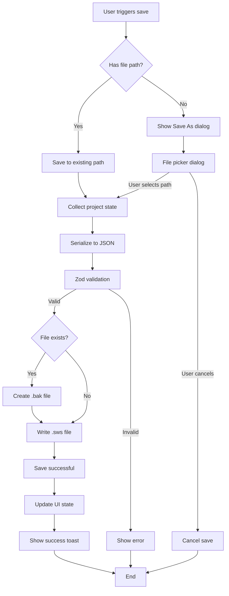
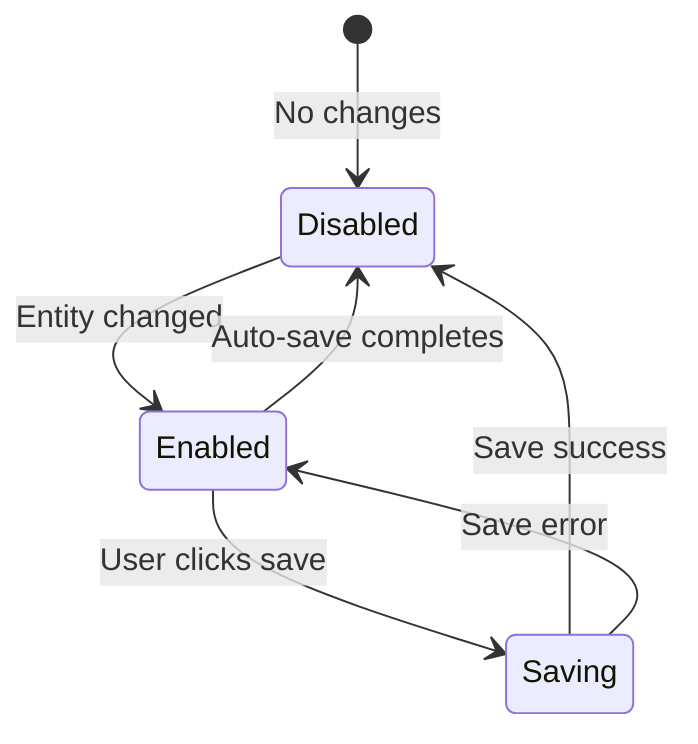

# Offline Storage: Manual Save Flow

## 1. Overview

### Purpose
Document the **manual save workflow** triggered by user actions (Cmd/Ctrl+S, Save button, File menu), including save dialogs, .sws file writing, backup creation, and user feedback.

### Scope
- Keyboard shortcut handling (Cmd/Ctrl+S)
- Save vs Save As workflows
- File dialog integration (Tauri)
- .sws file writing via projectIO
- Backup creation (.bak files)
- Success/error feedback

### Implementation Status
- **Status**: ✅ Implemented
- **Code Locations**:
  - `hvac-design-app/src/core/persistence/projectIO.ts:saveProject()`
  - UI components (location varies by feature)
  - Keyboard shortcuts (location varies)
- **Last Verified**: 2026-01-09

---

## 2. Manual Save Triggers

### Trigger Methods

| Trigger | Shortcut | When Available | Behavior |
|---------|----------|----------------|----------|
| **Keyboard** | Cmd/Ctrl+S | Always (when project open) | Save or Save As |
| **Save button** | Click | Canvas toolbar | Save or Save As |
| **File menu** | File > Save | Menu bar | Save or Save As |
| **Save As** | Cmd/Ctrl+Shift+S | Always (when project open) | Always shows dialog |

---

## 3. Save vs Save As Logic

### Decision Flow



---

## 4. Save Workflow (Existing Path)

### Code Flow

```typescript
async function handleSave() {
  const currentPath = useProjectStore.getState().filePath;

  // If no path yet, redirect to Save As
  if (!currentPath) {
    return handleSaveAs();
  }

  // Show loading indicator
  setLoading(true);

  try {
    // Collect project state from stores
    const project = collectProjectState();

    // Save to file
    const result = await saveProject(project, currentPath);

    if (result.success) {
      // Update project store
      useProjectStore.getState().setDirty(false);
      useProjectStore.getState().markSaved();

      // User feedback
      toast.success('Project saved');
    } else {
      toast.error(result.error || 'Failed to save project');
    }
  } catch (error) {
    toast.error('Unexpected error saving project');
    console.error(error);
  } finally {
    setLoading(false);
  }
}
```

### Keyboard Shortcut Handler

```typescript
useEffect(() => {
  const handleKeyDown = (e: KeyboardEvent) => {
    // Cmd/Ctrl+S
    if ((e.metaKey || e.ctrlKey) && e.key === 's') {
      e.preventDefault();
      handleSave();
    }
  };

  window.addEventListener('keydown', handleKeyDown);
  return () => window.removeEventListener('keydown', handleKeyDown);
}, []);
```

---

## 5. Save As Workflow (New Path)

### File Dialog

```typescript
import { save as saveDialog } from '@tauri-apps/api/dialog';
import { documentDir } from '@tauri-apps/api/path';

async function handleSaveAs() {
  try {
    // Get default directory
    const defaultPath = await documentDir();

    // Show save dialog
    const filePath = await saveDialog({
      filters: [
        {
          name: 'SWS Project Files',
          extensions: ['sws']
        }
      ],
      defaultPath: `${defaultPath}/${projectName}.sws`,
    });

    // User cancelled
    if (!filePath) {
      return;
    }

    // Save to selected path
    setLoading(true);

    const project = collectProjectState();
    const result = await saveProject(project, filePath);

    if (result.success) {
      // Update project store with new path
      useProjectStore.getState().setFilePath(filePath);
      useProjectStore.getState().setDirty(false);
      useProjectStore.getState().markSaved();

      // Update project list
      useProjectListStore.getState().updateProject(project.projectId, {
        storagePath: filePath,
        modifiedAt: new Date().toISOString(),
      });

      toast.success(`Project saved as ${filePath}`);
    } else {
      toast.error(result.error || 'Failed to save project');
    }
  } catch (error) {
    toast.error('Unexpected error during save');
    console.error(error);
  } finally {
    setLoading(false);
  }
}
```

### Dialog Options

```typescript
{
  filters: [
    { name: 'SWS Project Files', extensions: ['sws'] }
  ],
  defaultPath: '/Users/john/Documents/MyProject.sws',
  title: 'Save Project As', // Optional
}
```

**Behavior**:
- Native OS save dialog (macOS/Windows/Linux)
- Automatically adds `.sws` extension if missing
- Warns if file already exists (OS-level prompt)
- Returns `null` if user cancels

---

## 6. Collecting Project State

### Dehydrate All Stores

```typescript
function collectProjectState(): ProjectFile {
  const entityStore = useEntityStore.getState();
  const projectStore = useProjectStore.getState();
  const viewportStore = useViewportStore.getState();
  const preferencesStore = usePreferencesStore.getState();

  return {
    schemaVersion: CURRENT_SCHEMA_VERSION,
    projectId: projectStore.currentProjectId!,
    projectName: projectStore.projectDetails!.projectName,
    projectNumber: projectStore.projectDetails?.projectNumber,
    clientName: projectStore.projectDetails?.clientName,
    createdAt: projectStore.projectDetails!.createdAt,
    modifiedAt: new Date().toISOString(),

    entities: {
      byId: entityStore.byId,
      allIds: entityStore.allIds,
    },

    viewportState: {
      panX: viewportStore.panX,
      panY: viewportStore.panY,
      zoom: viewportStore.zoom,
    },

    settings: {
      unitSystem: preferencesStore.unitSystem,
      gridSize: viewportStore.gridSize,
      gridVisible: viewportStore.gridVisible,
    },
  };
}
```

See [OS-MEM-002](../03-in-memory-state/OS-MEM-002-StateHydrationDehydration.md) for details.

---

## 7. Save Implementation (projectIO)

### saveProject Function

**Location**: `projectIO.ts:25-49`

```typescript
export async function saveProject(project: ProjectFile, path: string): Promise<IOResult> {
  try {
    // 1. Serialize project to JSON
    const serialized = serializeProject(project);
    if (!serialized.success || !serialized.data) {
      return { success: false, error: serialized.error };
    }

    // 2. Create backup of existing file
    if (await exists(path)) {
      const currentContent = await readTextFile(path);
      await writeTextFile(`${path}.bak`, currentContent);
    }

    // 3. Write new file
    await writeTextFile(path, serialized.data);

    return { success: true };
  } catch (error) {
    return {
      success: false,
      error: error instanceof Error ? error.message : 'Save failed',
    };
  }
}
```

### Serialization

**Location**: `serialization.ts:27-42`

```typescript
export function serializeProject(project: ProjectFile): SerializationResult {
  try {
    // Validate before serializing
    const validated = ProjectFileSchema.parse(project);

    // Format with indentation for readability
    const json = JSON.stringify(validated, null, 2);

    return { success: true, data: json };
  } catch (error) {
    return {
      success: false,
      error: error instanceof Error ? error.message : 'Serialization failed',
    };
  }
}
```

---

## 8. Backup Creation

### Automatic Backup Strategy

**When**: Every manual save (if file already exists)

**Format**: `{filename}.sws.bak`

**Example**: `MyProject.sws` → `MyProject.sws.bak`

**Retention**: Only 1 backup (overwrites previous backup)

```typescript
// Create backup of existing file
if (await exists(path)) {
  const currentContent = await readTextFile(path);
  await writeTextFile(`${path}.bak`, currentContent);
}
```

**Purpose**:
- Protect against save corruption
- Allow recovery from mistakes
- Provide "undo" for file-level changes

See [OS-ERR-002](../07-error-recovery/OS-ERR-002-BackupRecovery.md) for backup recovery details.

---

## 9. User Feedback

### Loading States

```typescript
// Before save
<Button onClick={handleSave} disabled={loading || !isDirty}>
  {loading ? <Spinner /> : 'Save'}
</Button>

// During save
<LoadingOverlay message="Saving project..." />

// After success
<Toast type="success" duration={3000}>
  Project saved successfully
</Toast>

// After error
<Toast type="error" duration={5000}>
  Failed to save: {error}
</Toast>
```

### Dirty Indicator

```typescript
// Show asterisk in title bar
<title>{projectName}{isDirty ? ' *' : ''} - HVAC Canvas</title>

// Show on save button
<Button disabled={!isDirty}>
  Save{isDirty && ' *'}
</Button>

// Show in tab bar
<Tab>{projectName}{isDirty && ' •'}</Tab>
```

---

## 10. Error Scenarios

| Error | Cause | User Message | Recovery |
|-------|-------|--------------|----------|
| **Permission denied** | OS file permissions | "Cannot save: Permission denied" | Choose different location |
| **Disk full** | Insufficient storage | "Cannot save: Disk full" | Free up space or choose different drive |
| **Invalid path** | Path contains invalid chars | "Invalid file path" | Choose valid path |
| **File locked** | Another process has file open | "Cannot save: File is open in another program" | Close other app |
| **Serialization failed** | Invalid entity data | "Failed to save: Invalid project data" | Check console for details |
| **Network drive disconnected** | Saving to network drive | "Cannot save: Drive not accessible" | Reconnect drive or save locally |

---

## 11. Save Button States

### State Machine



### Button Implementation

```typescript
<Button
  onClick={handleSave}
  disabled={!isDirty || loading}
  variant={isDirty ? 'primary' : 'secondary'}
>
  {loading ? (
    <>
      <Spinner size="sm" /> Saving...
    </>
  ) : (
    <>
      <SaveIcon /> Save{isDirty && ' *'}
    </>
  )}
</Button>
```

---

## 12. Performance Metrics

### Save Time Breakdown

| Project Size | Collect State | Serialize | Validate | Create Backup | Write File | Total |
|--------------|---------------|-----------|----------|---------------|------------|-------|
| **Small** (10KB) | 1ms | 2ms | 5ms | 5ms | 10ms | ~23ms |
| **Medium** (100KB) | 3ms | 5ms | 10ms | 10ms | 20ms | ~48ms |
| **Large** (1MB) | 10ms | 20ms | 50ms | 50ms | 100ms | ~230ms |
| **Very Large** (10MB) | 50ms | 150ms | 400ms | 200ms | 500ms | ~1300ms |

**Target**: <100ms for typical projects (100-1000 entities)

**User Experience**: Shows loading spinner for >100ms operations

---

## 13. Edge Cases

### Case 1: Save During Auto-Save

**Scenario**: User presses Cmd+S while auto-save is running

**Handling**:
- Both saves may run (safe, same data)
- Manual save takes priority (clears dirty flag)
- Auto-save sees `!isDirty` and exits early

### Case 2: Network Drive Slow

**Scenario**: Saving to network drive takes 5 seconds

**Handling**:
- UI shows loading spinner
- User can't interact during save
- Timeout after 30 seconds (future enhancement)

### Case 3: File Name with Special Characters

**Scenario**: User enters `Project/Name?.sws`

**Handling**:
- OS file dialog sanitizes automatically
- Invalid characters removed or replaced
- Tauri API rejects invalid paths

### Case 4: Rapid Save Clicks

**Scenario**: User clicks Save button multiple times rapidly

**Handling**:
- Button disabled during save
- Only 1 save operation runs
- Subsequent clicks ignored

---

## 14. Comparison: Auto-Save vs Manual Save

| Feature | Auto-Save | Manual Save |
|---------|-----------|-------------|
| **Trigger** | Store changes | User action |
| **Timing** | 2s debounce | Immediate |
| **Target** | localStorage | .sws file |
| **Backup** | No | Yes (.bak file) |
| **User feedback** | None (silent) | Toast notification |
| **File dialog** | No | Yes (Save As) |
| **Dirty flag** | Cleared after save | Cleared after save |
| **Failure handling** | Silent | Toast error |

**Relationship**:
- Auto-save: Frequent, silent, localStorage
- Manual save: Explicit, visible, .sws file
- Auto-save provides recovery, manual save provides permanence

---

## 15. Testing Strategy

### Unit Tests

```typescript
describe('Manual Save', () => {
  it('saves project with existing path', async () => {
    const project = createValidProject();
    const result = await saveProject(project, '/tmp/test.sws');
    expect(result.success).toBe(true);
  });

  it('creates backup before overwriting', async () => {
    const project = createValidProject();

    // First save
    await saveProject(project, '/tmp/test.sws');

    // Second save (should create backup)
    await saveProject(project, '/tmp/test.sws');

    const backupExists = await exists('/tmp/test.sws.bak');
    expect(backupExists).toBe(true);
  });

  it('returns error for invalid project', async () => {
    const invalid = { schemaVersion: 123 }; // Wrong type
    const result = await saveProject(invalid as any, '/tmp/test.sws');
    expect(result.success).toBe(false);
    expect(result.error).toBeDefined();
  });
});
```

### Integration Tests

1. **Save workflow**: Create project → Edit → Save → Verify file exists
2. **Save As workflow**: Open project → Save As new name → Verify both files
3. **Keyboard shortcut**: Press Cmd+S → Verify save triggered
4. **Error handling**: Try to save to read-only location → See error toast

---

## 16. Related Documentation

### Prerequisites
- [.sws File Format](../02-storage-layers/OS-SL-002-SwsFileFormat.md)
- [State Dehydration](../03-in-memory-state/OS-MEM-002-StateHydrationDehydration.md)

### Related Flows
- [Auto-Save Flow](./OS-DF-003-AutoSaveFlow.md)
- [Export Flow](./OS-DF-002-ExportFlow.md)
- [Backup Recovery](../07-error-recovery/OS-ERR-002-BackupRecovery.md)

---

## 17. Known Limitations

| Limitation | Impact | Workaround | Future Fix |
|------------|--------|------------|------------|
| **No progress indicator** | Large files have no feedback | Generic spinner | Progress bar with % |
| **Single backup only** | Can't recover from multiple mistakes | Manual file copies | Keep 5 backup versions |
| **No atomic writes** | Crash during save corrupts file | Backup file exists | Write to temp, then rename |
| **Synchronous save** | Blocks UI during save | Loading spinner | Use Web Worker |
| **No save confirmation** | Accidental overwrites | Cmd+Z doesn't help | Add "Save a copy" option |

---

## 18. Changelog

| Date | Version | Change | Author |
|------|---------|--------|--------|
| 2026-01-09 | 1.0.0 | Initial manual save flow documentation | System |

---

## 19. Notes

### Design Decisions

1. **Why create backup on every save?**
   - Safety net against file corruption
   - Provides "undo" for file-level mistakes
   - Minimal performance impact (~10ms)

2. **Why not prompt "Save changes?" on close?**
   - Auto-save handles unsaved changes
   - beforeunload saves automatically
   - Reduces user friction

3. **Why disable button when not dirty?**
   - Clear visual feedback
   - Prevents unnecessary save operations
   - Standard UX pattern

### Future Enhancements

1. **Multiple backup versions**: Keep last 5 saves
2. **Atomic writes**: Write to temp file, then rename
3. **Progress bar**: Show progress for large files (>1MB)
4. **Save confirmation**: Prompt before overwriting existing file
5. **Network status**: Warn if saving to disconnected network drive
6. **Conflict detection**: Warn if file modified externally
