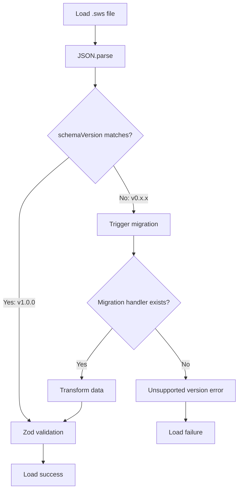

# Offline Storage: Schema Versioning

## 1. Overview

### Purpose
Document the **schema versioning strategy** for .sws project files, including semantic versioning, version detection, and future migration planning.

### Scope
- Semantic versioning strategy
- Current schema version (1.0.0)
- Version detection on file load
- Breaking vs non-breaking changes
- Migration trigger conditions

### Implementation Status
- **Status**: ✅ Versioning implemented, ⚠️ Only v1.0.0 supported
- **Current Version**: `1.0.0`
- **Code Location**: `hvac-design-app/src/core/schema/project-file.schema.ts`
- **Last Verified**: 2026-01-09

---

## 2. Semantic Versioning Strategy

### Version Format

**Format**: `MAJOR.MINOR.PATCH`

**Example**: `1.0.0`

### Version Component Meanings

| Component | Meaning | Example Change |
|-----------|---------|----------------|
| **MAJOR** | Breaking changes, incompatible with previous versions | Remove required field, change data types |
| **MINOR** | New features, backwards-compatible | Add optional field, new entity type |
| **PATCH** | Bug fixes, fully backwards-compatible | Fix typo in field name, validation adjustment |

---

## 3. Current Schema Version

### Version Declaration

**Location**: `project-file.schema.ts:195`

```typescript
/**
 * Current schema version for migration support
 */
export const CURRENT_SCHEMA_VERSION = '1.0.0';
```

### Schema Definition

**Location**: `project-file.schema.ts:124-146`

```typescript
export const ProjectFileSchema = z.object({
  schemaVersion: z.string().regex(/^\d+\.\d+\.\d+$/),
  projectId: z.string().uuid(),
  projectName: z.string().min(1).max(100),
  projectNumber: z.string().max(50).optional(),
  clientName: z.string().max(100).optional(),
  createdAt: z.string().datetime(),
  modifiedAt: z.string().datetime(),

  // Entity data
  entities: NormalizedEntitiesSchema,
  canvas: CanvasStateSchema.optional(),

  // Viewport and settings
  viewportState: ViewportStateSchema,
  settings: ProjectSettingsSchema,

  // Future fields
  calculations: CalculationResultsSchema,
  billOfMaterials: BillOfMaterialsSchema,
  commandHistory: z.object({
    commands: z.array(z.unknown()),
    currentIndex: z.number().int().nonnegative(),
  }).optional(),
});
```

---

## 4. Version Detection

### On File Load

**Location**: `serialization.ts:48-60`

```typescript
export function deserializeProject(json: string): DeserializationResult {
  try {
    const parsed = JSON.parse(json);

    // Check schema version
    if (parsed.schemaVersion !== CURRENT_SCHEMA_VERSION) {
      return {
        success: false,
        requiresMigration: true,
        foundVersion: parsed.schemaVersion,
        error: `Schema version mismatch: found ${parsed.schemaVersion}, expected ${CURRENT_SCHEMA_VERSION}`,
      };
    }

    // ... validate and return
  } catch (error) {
    // ... error handling
  }
}
```

### Version Check Flow



---

## 5. Version History

### v1.0.0 (Current)

**Released**: 2025-Q4 (Phase 1 launch)

**Features**:
- Basic entity storage (ducts, equipment, fittings, rooms, notes, groups)
- Normalized entity structure (byId + allIds)
- Viewport state (pan, zoom)
- Project settings (units, grid)
- Metadata (projectId, name, dates)

**Schema**:
- `schemaVersion`: "1.0.0"
- `projectId`: UUID
- `entities`: { byId, allIds }
- `viewportState`: { panX, panY, zoom }
- `settings`: { unitSystem, gridSize, gridVisible }

**Breaking Changes from v0.x**: N/A (first stable version)

---

## 6. Future Version Planning

### Hypothetical v1.1.0 (Minor)

**Potential Features**:
- Add `plan` field for PDF plan reference
- Add `planScale` for pixel-to-unit conversion
- Add `tags` array for entity categorization

**Migration Required**: No (backwards-compatible)

**Schema Changes**:
```typescript
export const ProjectFileSchema = z.object({
  schemaVersion: z.string().regex(/^\d+\.\d+\.\d+$/),
  // ... existing fields ...

  // NEW: Optional fields (backwards-compatible)
  plan: PlanReferenceSchema.optional(),
  tags: z.array(z.string()).optional(),
});
```

### Hypothetical v2.0.0 (Major)

**Potential Features**:
- Replace `entities` with `canvas` (nested plan support)
- Change `viewportState` structure (separate per plan)
- Remove `commandHistory` (moved to separate file)

**Migration Required**: Yes (breaking changes)

**Schema Changes**:
```typescript
export const ProjectFileSchema = z.object({
  schemaVersion: z.string().regex(/^\d+\.\d+\.\d+$/),
  // ... existing fields ...

  // CHANGED: entities moved under canvas
  canvas: CanvasStateSchema, // Was optional, now required
  entities: NormalizedEntitiesSchema, // REMOVED in v2.0.0

  // CHANGED: viewport per canvas
  viewportState: ViewportStateSchema, // REMOVED
  canvases: z.array(z.object({
    canvasId: z.string().uuid(),
    entities: NormalizedEntitiesSchema,
    viewport: ViewportStateSchema,
  })),
});
```

---

## 7. Version Upgrade Strategy

### Backwards-Compatible Changes (MINOR)

**Process**:
1. Add new optional fields to schema
2. Update `CURRENT_SCHEMA_VERSION` to `1.1.0`
3. Old files (v1.0.0) load without migration
4. New files (v1.1.0) save with new fields

**Example**: Adding `tags` field
```typescript
// v1.0.0 file (no tags)
{
  "schemaVersion": "1.0.0",
  "projectId": "...",
  // ... no tags field
}

// v1.1.0 file (with tags)
{
  "schemaVersion": "1.1.0",
  "projectId": "...",
  "tags": ["commercial", "hvac"]
}

// Loading v1.0.0 file in v1.1.0 app
// - Schema validation passes (tags is optional)
// - tags defaults to undefined
// - No migration needed
```

### Breaking Changes (MAJOR)

**Process**:
1. Create migration handler for previous version
2. Update `CURRENT_SCHEMA_VERSION` to `2.0.0`
3. Old files (v1.x.x) require migration
4. Migration transforms old structure to new

**Example**: Moving entities under canvas
```typescript
// Migration handler
function migrateFrom1to2(oldProject: V1ProjectFile): V2ProjectFile {
  return {
    schemaVersion: '2.0.0',
    projectId: oldProject.projectId,
    // ... copy other fields

    // TRANSFORM: Move entities under canvas
    canvases: [
      {
        canvasId: crypto.randomUUID(),
        entities: oldProject.entities, // Moved from root
        viewport: oldProject.viewportState, // Moved from root
      }
    ],

    // REMOVED: entities and viewportState at root
  };
}
```

---

## 8. Version Validation

### Regex Pattern

**Location**: `project-file.schema.ts:125`

```typescript
schemaVersion: z.string().regex(/^\d+\.\d+\.\d+$/)
```

**Valid Versions**:
- `1.0.0` ✅
- `1.2.3` ✅
- `10.0.0` ✅

**Invalid Versions**:
- `1.0` ❌ (missing patch)
- `v1.0.0` ❌ (extra prefix)
- `1.0.0-beta` ❌ (extra suffix)

### Strict Equality Check

```typescript
if (parsed.schemaVersion !== CURRENT_SCHEMA_VERSION) {
  // Trigger migration (even for minor/patch versions)
}
```

**Design Decision**: Strict equality check even for minor versions to ensure explicit migration handling.

---

## 9. Edge Cases

### Case 1: Future Version

**Scenario**: User has v2.0.0 file, app is v1.0.0

**Handling**:
```typescript
if (parsed.schemaVersion > CURRENT_SCHEMA_VERSION) {
  return {
    success: false,
    error: 'This file was created with a newer version of the app. Please update.',
  };
}
```

**Status**: Not implemented (returns "Unknown schema version" error)

### Case 2: Invalid Version Format

**Scenario**: File has `schemaVersion: "1.0"` (missing patch)

**Handling**: Zod validation fails before version check

### Case 3: Missing schemaVersion

**Scenario**: Very old file has no `schemaVersion` field

**Handling**: Zod validation fails (required field)

---

## 10. Testing Strategy

### Unit Tests

```typescript
describe('Schema Versioning', () => {
  it('accepts current version', () => {
    const project = { schemaVersion: '1.0.0', /* ... */ };
    const result = ProjectFileSchema.safeParse(project);
    expect(result.success).toBe(true);
  });

  it('rejects invalid version format', () => {
    const project = { schemaVersion: '1.0', /* ... */ };
    const result = ProjectFileSchema.safeParse(project);
    expect(result.success).toBe(false);
  });

  it('detects version mismatch', () => {
    const json = JSON.stringify({ schemaVersion: '0.9.0', /* ... */ });
    const result = deserializeProject(json);
    expect(result.requiresMigration).toBe(true);
    expect(result.foundVersion).toBe('0.9.0');
  });
});
```

---

## 11. Related Documentation

### Prerequisites
- [.sws File Format](../02-storage-layers/OS-SL-002-SwsFileFormat.md)

### Related Topics
- [Migration Implementation](./OS-MIG-002-MigrationImplementation.md)
- [Import Flow](../05-data-flow/OS-DF-001-ImportFlow.md)

---

## 12. Known Limitations

| Limitation | Impact | Workaround | Future Fix |
|------------|--------|------------|------------|
| **Strict version check** | Minor version changes require migration | Relax for minor versions | Check MAJOR only |
| **No forward compatibility** | Can't open files from newer app versions | None | Add "ignore unknown fields" |
| **No pre-release versions** | Can't use 1.0.0-beta | Stick to stable versions | Support semver prerelease |

---

## 13. Changelog

| Date | Version | Change | Author |
|------|---------|--------|--------|
| 2026-01-09 | 1.0.0 | Initial schema versioning documentation | System |

---

## 14. Notes

### Design Decisions

1. **Why semantic versioning?**
   - Standard, widely understood
   - Clear communication of compatibility
   - Tooling support (npm, etc.)

2. **Why strict equality check?**
   - Explicit migration handling
   - No ambiguity about compatibility
   - Can relax later if needed

3. **Why store version in file?**
   - Self-describing files
   - No external manifest needed
   - Easy to inspect with text editor

### Future Enhancements

1. **Relax minor version check**: Allow v1.1.0 app to open v1.0.0 files without migration
2. **Forward compatibility**: Add "ignore unknown fields" for graceful degradation
3. **Pre-release versions**: Support `1.0.0-beta.1` format
4. **Version range**: Support "compatible with v1.x.x"
