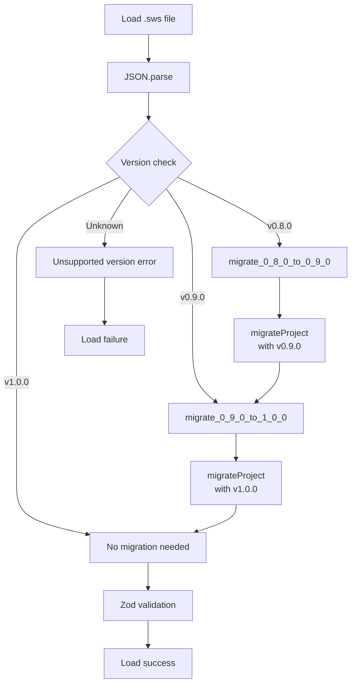

# Offline Storage: Migration Implementation

## 1. Overview

### Purpose
Document the **migration implementation** for transforming old schema versions to the current version, including the migration framework, handlers, and testing strategy.

### Scope
- Migration framework architecture
- Current implementation status (v1.0.0 only)
- How to add new migration handlers
- Testing migrations
- Rollback considerations

### Implementation Status
- **Status**: ⚠️ Partial (Framework exists, only v1.0.0 handler)
- **Code Location**: `hvac-design-app/src/core/persistence/serialization.ts:migrateProject()`
- **Migrations Implemented**: v1.0.0 → v1.0.0 (no-op)
- **Last Verified**: 2026-01-09

---

## 2. Migration Architecture



---

## 3. Current Implementation

### migrateProject Function

**Location**: `serialization.ts:82-99`

```typescript
/**
 * Migrate project from older schema version
 * Currently supports migration from 1.0.0 (no changes needed)
 * Future versions will add migration logic here
 */
export function migrateProject(project: unknown, fromVersion: string): DeserializationResult {
  // For v1.0.0, no migrations needed yet
  // Future migrations will be added here as version-specific handlers
  if (fromVersion === '1.0.0') {
    return deserializeProject(JSON.stringify(project));
  }

  // Add future migration handlers here:
  // if (fromVersion === '0.9.0') {
  //   const migrated = migrateFrom090(project);
  //   return migrateProject(migrated, '1.0.0');
  // }

  return {
    success: false,
    error: `Unknown schema version: ${fromVersion}`,
  };
}
```

**Current Behavior**:
- Only accepts `1.0.0` (current version)
- Returns error for any other version
- Placeholder for future migration handlers

---

## 4. Adding New Migrations

### Example: v0.9.0 → v1.0.0

**Scenario**: v0.9.0 used `entityList: Entity[]`, v1.0.0 uses normalized `entities: { byId, allIds }`

**Migration Handler**:

```typescript
interface V0_9_0_Project {
  schemaVersion: '0.9.0';
  projectId: string;
  projectName: string;
  entityList: Entity[]; // OLD: Array of entities
  viewportState: ViewportState;
  settings: ProjectSettings;
  createdAt: string;
  modifiedAt: string;
}

interface V1_0_0_Project {
  schemaVersion: '1.0.0';
  projectId: string;
  projectName: string;
  entities: { byId: Record<string, Entity>; allIds: string[] }; // NEW: Normalized
  viewportState: ViewportState;
  settings: ProjectSettings;
  createdAt: string;
  modifiedAt: string;
}

/**
 * Migrate from v0.9.0 to v1.0.0
 * Transform array-based entities to normalized structure
 */
function migrateFrom090(project: V0_9_0_Project): V1_0_0_Project {
  // Normalize entity array to byId + allIds
  const byId: Record<string, Entity> = {};
  const allIds: string[] = [];

  for (const entity of project.entityList) {
    byId[entity.id] = entity;
    allIds.push(entity.id);
  }

  return {
    schemaVersion: '1.0.0',
    projectId: project.projectId,
    projectName: project.projectName,
    entities: { byId, allIds }, // Transformed
    viewportState: project.viewportState,
    settings: project.settings,
    createdAt: project.createdAt,
    modifiedAt: project.modifiedAt,
  };
}
```

**Update migrateProject**:

```typescript
export function migrateProject(project: unknown, fromVersion: string): DeserializationResult {
  if (fromVersion === '1.0.0') {
    return deserializeProject(JSON.stringify(project));
  }

  // NEW: Add v0.9.0 handler
  if (fromVersion === '0.9.0') {
    const migrated = migrateFrom090(project as V0_9_0_Project);
    // Recursively migrate to current version (in case of chain)
    return migrateProject(migrated, '1.0.0');
  }

  return {
    success: false,
    error: `Unknown schema version: ${fromVersion}`,
  };
}
```

---

## 5. Migration Chain

### Multi-Step Migrations

**Scenario**: User has v0.8.0 file, app is v1.0.0

**Migration Chain**: v0.8.0 → v0.9.0 → v1.0.0

**Implementation**:

```typescript
export function migrateProject(project: unknown, fromVersion: string): DeserializationResult {
  if (fromVersion === '1.0.0') {
    return deserializeProject(JSON.stringify(project));
  }

  // v0.9.0 → v1.0.0
  if (fromVersion === '0.9.0') {
    const migrated = migrateFrom090(project as V0_9_0_Project);
    return migrateProject(migrated, '1.0.0'); // Recursive call
  }

  // v0.8.0 → v0.9.0
  if (fromVersion === '0.8.0') {
    const migrated = migrateFrom080(project as V0_8_0_Project);
    return migrateProject(migrated, '0.9.0'); // Chains to next migration
  }

  return {
    success: false,
    error: `Unknown schema version: ${fromVersion}`,
  };
}
```

**Flow**:
```
v0.8.0 file
  → migrateFrom080()
  → v0.9.0 intermediate
  → migrateFrom090()
  → v1.0.0 final
  → deserializeProject()
  → Zod validation
  → Success
```

---

## 6. Migration Patterns

### Pattern 1: Add Optional Field

**Change**: Add `tags: string[]` field

**Migration**: No transformation needed (optional field)

```typescript
// v1.0.0 (no tags)
{
  "schemaVersion": "1.0.0",
  "projectId": "...",
  // ... no tags
}

// v1.1.0 (with tags)
{
  "schemaVersion": "1.1.0",
  "projectId": "...",
  "tags": ["commercial"]
}

// Migration: None (backwards-compatible)
```

### Pattern 2: Rename Field

**Change**: Rename `clientName` → `client`

**Migration**: Copy field with new name

```typescript
function migrateFrom100to110(project: V1_0_0_Project): V1_1_0_Project {
  return {
    ...project,
    schemaVersion: '1.1.0',
    client: project.clientName, // Renamed
    // clientName removed
  };
}
```

### Pattern 3: Restructure Data

**Change**: Move `entities` under `canvas`

**Migration**: Nest data under new structure

```typescript
function migrateFrom100to200(project: V1_0_0_Project): V2_0_0_Project {
  return {
    ...project,
    schemaVersion: '2.0.0',
    canvas: {
      entities: project.entities, // Moved under canvas
      plan: undefined, // New optional field
    },
    // entities removed from root
  };
}
```

### Pattern 4: Change Data Type

**Change**: Change `gridSize: number` → `gridSize: { value: number; unit: 'px' | 'in' }`

**Migration**: Wrap primitive in object

```typescript
function migrateGridSize(project: V1_0_0_Project): V1_1_0_Project {
  return {
    ...project,
    schemaVersion: '1.1.0',
    settings: {
      ...project.settings,
      gridSize: {
        value: project.settings.gridSize, // Wrap primitive
        unit: 'px', // Default unit
      },
    },
  };
}
```

---

## 7. Testing Migrations

### Unit Tests

```typescript
describe('Migration: v0.9.0 → v1.0.0', () => {
  it('converts entity array to normalized structure', () => {
    const v090Project: V0_9_0_Project = {
      schemaVersion: '0.9.0',
      projectId: '123',
      projectName: 'Test',
      entityList: [
        { id: 'e1', type: 'duct', /* ... */ },
        { id: 'e2', type: 'equipment', /* ... */ },
      ],
      viewportState: { panX: 0, panY: 0, zoom: 1 },
      settings: { unitSystem: 'imperial', gridSize: 24, gridVisible: true },
      createdAt: '2025-01-01T00:00:00Z',
      modifiedAt: '2025-01-01T00:00:00Z',
    };

    const result = migrateProject(v090Project, '0.9.0');

    expect(result.success).toBe(true);
    expect(result.data?.schemaVersion).toBe('1.0.0');
    expect(result.data?.entities.byId['e1']).toBeDefined();
    expect(result.data?.entities.byId['e2']).toBeDefined();
    expect(result.data?.entities.allIds).toEqual(['e1', 'e2']);
  });

  it('preserves entity properties', () => {
    const v090Project = { /* ... */ };
    const result = migrateProject(v090Project, '0.9.0');

    const migratedEntity = result.data?.entities.byId['e1'];
    expect(migratedEntity?.type).toBe('duct');
    expect(migratedEntity?.position).toEqual({ x: 100, y: 200 });
  });

  it('chains multiple migrations', () => {
    const v080Project = { schemaVersion: '0.8.0', /* ... */ };
    const result = migrateProject(v080Project, '0.8.0');

    expect(result.success).toBe(true);
    expect(result.data?.schemaVersion).toBe('1.0.0'); // Final version
  });
});
```

### Integration Tests

```typescript
describe('Migration Integration', () => {
  it('loads and migrates v0.9.0 file', async () => {
    // Create v0.9.0 file
    const v090Content = JSON.stringify({
      schemaVersion: '0.9.0',
      // ... v0.9.0 structure
    });

    await writeTextFile('/tmp/test-v090.sws', v090Content);

    // Load with current app version
    const result = await loadProject('/tmp/test-v090.sws');

    expect(result.success).toBe(true);
    expect(result.project?.schemaVersion).toBe('1.0.0');
  });
});
```

---

## 8. Migration Validation

### Before Migration

```typescript
function migrateFrom090(project: unknown): V1_0_0_Project {
  // Validate input is v0.9.0 format
  const validated = V0_9_0_Schema.parse(project);

  // ... perform migration

  // Return migrated data (will be validated by deserializeProject)
  return migrated;
}
```

### After Migration

```typescript
export function migrateProject(project: unknown, fromVersion: string): DeserializationResult {
  // ... migration handlers

  if (fromVersion === '0.9.0') {
    const migrated = migrateFrom090(project);
    // Recursive call validates via deserializeProject → Zod
    return migrateProject(migrated, '1.0.0');
  }
}
```

---

## 9. Error Handling

### Migration Failure

```typescript
function migrateFrom090(project: unknown): V1_0_0_Project {
  try {
    const validated = V0_9_0_Schema.parse(project);

    // ... perform migration

    return migrated;
  } catch (error) {
    // Log detailed error
    console.error('Migration failed:', error);

    // Throw to bubble up to migrateProject
    throw new Error(`Migration from v0.9.0 failed: ${error.message}`);
  }
}
```

**Handling in UI**:
```typescript
const result = await loadProject(filePath);

if (!result.success) {
  if (result.error?.includes('Migration')) {
    toast.error('Failed to upgrade project file. File may be corrupted.');
  } else {
    toast.error(result.error || 'Failed to load project');
  }
}
```

---

## 10. Rollback Considerations

### No Automatic Rollback

**Current Design**: Migrations are one-way (no rollback)

**Reasons**:
- Saves are always to current version
- Old app versions can't open new files
- Rollback adds complexity

### Manual Rollback

**Process**:
1. User opens v0.9.0 file in v1.0.0 app
2. File is migrated to v1.0.0 in memory
3. User saves → file is now v1.0.0 on disk
4. To rollback: User must export to v0.9.0 format (not supported)

**Workaround**: Keep original file as backup

```typescript
// Before migration, suggest creating backup
if (result.requiresMigration) {
  const confirm = await showDialog({
    title: 'Upgrade Project File?',
    message: `This project was created with v${result.foundVersion}. It will be upgraded to v${CURRENT_SCHEMA_VERSION}. Create a backup?`,
    buttons: ['Cancel', 'Backup & Upgrade', 'Upgrade'],
  });

  if (confirm === 'Backup & Upgrade') {
    await copyFile(filePath, `${filePath}.v${result.foundVersion}.bak`);
  }
}
```

---

## 11. Performance Considerations

### Migration Speed

| Project Size | v0.9.0 → v1.0.0 | v0.8.0 → v1.0.0 (chain) |
|--------------|-----------------|-------------------------|
| 10 entities | ~5ms | ~10ms |
| 100 entities | ~20ms | ~40ms |
| 1000 entities | ~150ms | ~300ms |

**Optimization**: Migrations run in memory, no disk I/O during transformation

---

## 12. Documentation Requirements

### For Each Migration

**Required Documentation**:
1. **Source version**: What version is being migrated from
2. **Target version**: What version is being migrated to
3. **Breaking changes**: What changed and why
4. **Transformation logic**: Step-by-step explanation
5. **Test cases**: Example inputs and expected outputs

**Example**:
```typescript
/**
 * Migrate from v0.9.0 to v1.0.0
 *
 * Breaking Changes:
 * - entityList: Entity[] → entities: { byId, allIds }
 *
 * Transformation:
 * 1. Iterate entityList array
 * 2. Build byId record (id → entity)
 * 3. Build allIds array (preserve order)
 *
 * Test Cases:
 * - Empty entityList → empty entities
 * - 2 entities → normalized with 2 entries
 * - Duplicate IDs → throw error (invalid data)
 */
function migrateFrom090(project: V0_9_0_Project): V1_0_0_Project {
  // ...
}
```

---

## 13. Related Documentation

### Prerequisites
- [Schema Versioning](./OS-MIG-001-SchemaVersioning.md)
- [Import Flow](../05-data-flow/OS-DF-001-ImportFlow.md)

### Related Topics
- [Corruption Detection](../07-error-recovery/OS-ERR-001-CorruptionDetection.md)
- [Backup Recovery](../07-error-recovery/OS-ERR-002-BackupRecovery.md)

---

## 14. Known Limitations

| Limitation | Impact | Workaround | Future Fix |
|------------|--------|------------|------------|
| **No automatic backups** | Migration overwrites original | Manual backup before opening | Auto-create .backup file |
| **No rollback** | Can't downgrade to old version | Keep original file | Add export to old format |
| **No partial migration** | All-or-nothing transformation | None | Support partial upgrades |
| **No validation pre-migration** | Invalid data causes migration failure | Validate first | Add pre-migration validation |

---

## 15. Changelog

| Date | Version | Change | Author |
|------|---------|--------|--------|
| 2026-01-09 | 1.0.0 | Initial migration implementation documentation | System |

---

## 16. Notes

### Design Decisions

1. **Why recursive migrations?**
   - Chains multiple versions automatically
   - Each handler focuses on one version step
   - Easier to test incrementally

2. **Why no rollback?**
   - Adds significant complexity
   - Users rarely need to downgrade
   - Can be added later if needed

3. **Why validate after migration?**
   - Ensures migrated data is valid
   - Catches migration bugs
   - Zod provides clear error messages

### Future Enhancements

1. **Automatic backups**: Create `.v0.9.0.bak` file before migration
2. **Rollback support**: Add "Export to v0.9.0" feature
3. **Dry run**: Preview migration without applying
4. **Migration logs**: Track which migrations were applied
5. **Validation framework**: Validate data before and after migration
