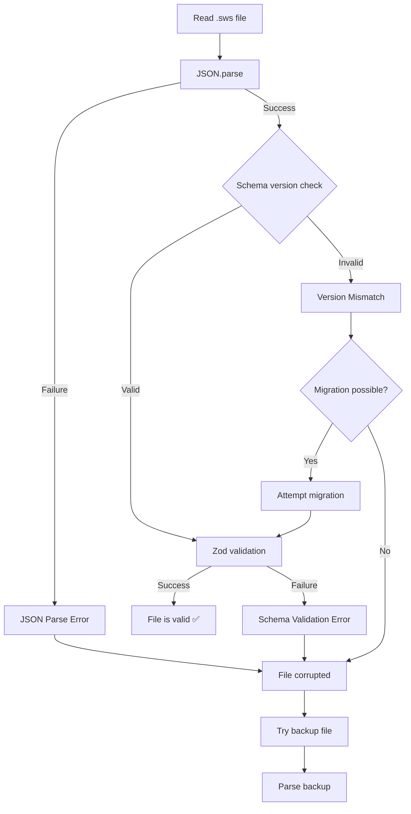
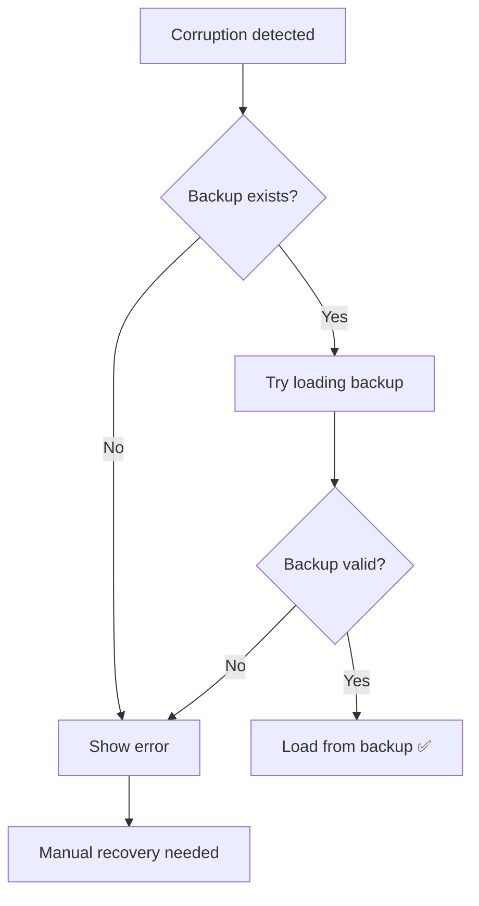

# Offline Storage: Corruption Detection

## 1. Overview

### Purpose
Document the **corruption detection mechanisms** for identifying invalid, corrupted, or malformed project files during load operations.

### Scope
- JSON parse error detection
- Zod schema validation failures
- Incomplete write detection
- Corrupted entity data identification
- Logging and diagnostics

### Implementation Status
- **Status**: ✅ Implemented
- **Code Locations**:
  - `hvac-design-app/src/core/persistence/serialization.ts:deserializeProject()`
  - `hvac-design-app/src/core/schema/project-file.schema.ts`
- **Last Verified**: 2026-01-09

---

## 2. Corruption Detection Layers



---

## 3. Detection Layer 1: JSON Parse Errors

### Invalid JSON

**Detection**: `JSON.parse()` throws `SyntaxError`

**Location**: `serialization.ts:48-74`

```typescript
export function deserializeProject(json: string): DeserializationResult {
  try {
    const parsed = JSON.parse(json);
    // ... continue validation
  } catch (error) {
    if (error instanceof SyntaxError) {
      return { success: false, error: 'Invalid JSON format' };
    }
    return {
      success: false,
      error: error instanceof Error ? error.message : 'Deserialization failed',
    };
  }
}
```

### Common JSON Errors

| Error | Cause | Example |
|-------|-------|---------|
| **Unexpected token** | Missing comma, quote, bracket | `{ "name": "test"` (missing `}`) |
| **Unexpected end** | File truncated | `{ "name": "test", "id":` (incomplete) |
| **Invalid character** | Binary data, encoding issue | `{ "name": "test\x00" }` |

### Example Corrupted JSON

```json
{
  "schemaVersion": "1.0.0",
  "projectId": "123e4567-e89b-12d3-a456-426614174000",
  "projectName": "HVAC Design
```
**Error**: Unexpected end of JSON input

---

## 4. Detection Layer 2: Schema Version Check

### Version Mismatch

**Detection**: Compare `schemaVersion` field with `CURRENT_SCHEMA_VERSION`

**Location**: `serialization.ts:52-59`

```typescript
// Check schema version
if (parsed.schemaVersion !== CURRENT_SCHEMA_VERSION) {
  return {
    success: false,
    requiresMigration: true,
    foundVersion: parsed.schemaVersion,
    error: `Schema version mismatch: found ${parsed.schemaVersion}, expected ${CURRENT_SCHEMA_VERSION}`,
  };
}
```

**Not Corruption**: Version mismatch is not corruption, it's an old file format

**Handling**: Trigger migration (see [OS-MIG-002](../06-migration/OS-MIG-002-MigrationImplementation.md))

---

## 5. Detection Layer 3: Zod Schema Validation

### Validation Failures

**Detection**: `ProjectFileSchema.parse()` throws `ZodError`

**Location**: `serialization.ts:62-63`

```typescript
// Validate against schema
const validated = ProjectFileSchema.parse(parsed);
```

### Common Validation Errors

| Error | Cause | Example |
|-------|-------|---------|
| **Required field missing** | Incomplete data | Missing `projectId` |
| **Invalid type** | Wrong data type | `zoom: "1"` instead of `1` |
| **Invalid format** | Format violation | `projectId: "not-a-uuid"` |
| **Out of range** | Value out of bounds | `zoom: -1` (min is 0.1) |
| **Invalid enum** | Unknown enum value | `unitSystem: "feet"` (should be "imperial") |

### Example Zod Errors

**Missing required field**:
```json
{
  "schemaVersion": "1.0.0",
  // Missing projectId (required)
  "projectName": "Test",
  "entities": { "byId": {}, "allIds": [] }
}
```
**Error**: Required at "projectId"

**Invalid UUID**:
```json
{
  "schemaVersion": "1.0.0",
  "projectId": "not-a-uuid",
  "projectName": "Test"
}
```
**Error**: Invalid uuid at "projectId"

**Invalid zoom range**:
```json
{
  "viewportState": {
    "panX": 0,
    "panY": 0,
    "zoom": 5.0  // Max is 4.0
  }
}
```
**Error**: Number must be less than or equal to 4 at "viewportState.zoom"

---

## 6. Detection Layer 4: Entity Validation

### Invalid Entity Data

**Detection**: Entity discriminated union validation

**Schema**: `project-file.schema.ts:12-19`

```typescript
export const EntitySchema = z.discriminatedUnion('type', [
  RoomSchema,
  DuctSchema,
  EquipmentSchema,
  FittingSchema,
  NoteSchema,
  GroupSchema,
]);
```

### Common Entity Errors

| Error | Cause | Example |
|-------|-------|---------|
| **Unknown entity type** | Invalid type field | `{ "type": "unknown" }` |
| **Missing required property** | Entity missing field | Duct missing `startPoint` |
| **Invalid connection** | Connection references non-existent entity | `{ "connectedTo": "nonexistent-id" }` |
| **Invalid geometry** | Negative dimensions | `{ "width": -10 }` |

---

## 7. Incomplete Write Detection

### Symptoms

- File ends abruptly (no closing `}`)
- JSON parse error: "Unexpected end of input"
- File size smaller than expected

### Causes

1. **Application crash during save**: Write interrupted mid-operation
2. **Disk full**: Write failed partway through
3. **Power loss**: System shut down during write
4. **File system error**: Disk error during write

### Detection

```typescript
try {
  const content = await readTextFile(path);
  const parsed = JSON.parse(content); // Throws if incomplete

  // Additional heuristic: Check file size
  const stats = await getFileStats(path);
  if (stats.size < 100) {
    // File is suspiciously small
    console.warn('File size is unexpectedly small:', stats.size);
  }

  // ... continue validation
} catch (error) {
  if (error instanceof SyntaxError) {
    // Likely incomplete write
    return { success: false, error: 'File appears to be incomplete or corrupted' };
  }
}
```

### Prevention

**Current**: Create backup before overwriting

**Future Enhancement**: Atomic writes (write to temp file, then rename)

---

## 8. Corruption Logging

### Detailed Error Logging

```typescript
export function deserializeProject(json: string): DeserializationResult {
  try {
    const parsed = JSON.parse(json);

    // ... version check

    const validated = ProjectFileSchema.parse(parsed);
    return { success: true, data: validated };
  } catch (error) {
    // Log detailed error for debugging
    console.error('Deserialization failed:', {
      errorType: error.constructor.name,
      errorMessage: error instanceof Error ? error.message : 'Unknown error',
      jsonLength: json.length,
      jsonPreview: json.substring(0, 100),
      stack: error instanceof Error ? error.stack : undefined,
    });

    if (error instanceof SyntaxError) {
      return { success: false, error: 'Invalid JSON format' };
    }

    if (error instanceof ZodError) {
      return {
        success: false,
        error: `Invalid project data: ${error.errors[0].message}`,
      };
    }

    return {
      success: false,
      error: error instanceof Error ? error.message : 'Deserialization failed',
    };
  }
}
```

### Log Output Example

```javascript
{
  errorType: 'ZodError',
  errorMessage: 'Required at "projectId"',
  jsonLength: 1234,
  jsonPreview: '{"schemaVersion":"1.0.0","projectName":"Test",...',
  stack: 'ZodError: Required\n    at deserializeProject...'
}
```

---

## 9. User Feedback

### Error Messages

```typescript
const result = await loadProject(filePath);

if (!result.success) {
  if (result.error?.includes('Invalid JSON')) {
    toast.error('Project file is corrupted. Trying backup...');
  } else if (result.error?.includes('Schema version')) {
    toast.error('Project file version not supported.');
  } else if (result.error?.includes('Invalid project data')) {
    toast.error('Project file contains invalid data.');
  } else {
    toast.error('Failed to load project: ' + result.error);
  }

  // Attempt backup recovery
  const backupResult = await loadBackup(filePath);
  if (backupResult.success) {
    toast.success('Loaded from backup file');
  }
}
```

---

## 10. Diagnostic Tools

### Manual File Inspection

**Validate JSON**:
```bash
# Check if file is valid JSON
cat project.sws | jq . > /dev/null
```

**Check schema version**:
```bash
# Extract schema version
cat project.sws | jq -r '.schemaVersion'
# Output: 1.0.0
```

**Count entities**:
```bash
# Count number of entities
cat project.sws | jq '.entities.allIds | length'
# Output: 42
```

### Admin Panel (Future Enhancement)

```typescript
// Proposed: Admin panel for file diagnostics
function validateFile(filePath: string): DiagnosticReport {
  const report = {
    fileExists: false,
    fileSize: 0,
    isValidJSON: false,
    schemaVersion: null,
    hasValidSchema: false,
    entityCount: 0,
    errors: [],
  };

  try {
    report.fileExists = await exists(filePath);
    report.fileSize = (await getFileStats(filePath)).size;

    const content = await readTextFile(filePath);
    const parsed = JSON.parse(content);
    report.isValidJSON = true;

    report.schemaVersion = parsed.schemaVersion;
    report.entityCount = parsed.entities?.allIds?.length || 0;

    const validated = ProjectFileSchema.safeParse(parsed);
    report.hasValidSchema = validated.success;

    if (!validated.success) {
      report.errors = validated.error.errors;
    }
  } catch (error) {
    report.errors.push(error.message);
  }

  return report;
}
```

---

## 11. Recovery Strategies

### Automatic Recovery



See [OS-ERR-002](./OS-ERR-002-BackupRecovery.md) for backup recovery details.

### Manual Recovery

**If backup also corrupted**:
1. Check localStorage for auto-save: `hvac-project-{projectId}`
2. Look for version backups: `project.sws.v1.0.0.bak`
3. Use file recovery tools (PhotoRec, TestDisk)
4. Contact support with file for analysis

---

## 12. Prevention Strategies

### Current Implementations

1. **Zod validation**: Catch invalid data before save
2. **Backup creation**: Preserve previous version
3. **JSON formatting**: Pretty-print for manual inspection

### Future Enhancements

1. **Atomic writes**: Write to temp file, then rename
2. **Checksums**: Detect bit-level corruption
3. **File locking**: Prevent concurrent writes
4. **Auto-save**: Frequent localStorage saves
5. **Cloud backup**: Remote backup copies

---

## 13. Testing Strategy

### Unit Tests

```typescript
describe('Corruption Detection', () => {
  it('detects invalid JSON', () => {
    const corrupt = '{ "projectId": "123"'; // Missing closing brace
    const result = deserializeProject(corrupt);
    expect(result.success).toBe(false);
    expect(result.error).toContain('Invalid JSON');
  });

  it('detects missing required field', () => {
    const invalid = JSON.stringify({
      schemaVersion: '1.0.0',
      // Missing projectId
      projectName: 'Test',
    });
    const result = deserializeProject(invalid);
    expect(result.success).toBe(false);
  });

  it('detects invalid UUID', () => {
    const invalid = JSON.stringify({
      schemaVersion: '1.0.0',
      projectId: 'not-a-uuid',
      projectName: 'Test',
    });
    const result = deserializeProject(invalid);
    expect(result.success).toBe(false);
  });

  it('detects out-of-range values', () => {
    const invalid = JSON.stringify({
      schemaVersion: '1.0.0',
      projectId: crypto.randomUUID(),
      projectName: 'Test',
      viewportState: { panX: 0, panY: 0, zoom: 10 }, // Max is 4
    });
    const result = deserializeProject(invalid);
    expect(result.success).toBe(false);
  });
});
```

---

## 14. Related Documentation

### Prerequisites
- [.sws File Format](../02-storage-layers/OS-SL-002-SwsFileFormat.md)
- [Import Flow](../05-data-flow/OS-DF-001-ImportFlow.md)

### Related Topics
- [Backup Recovery](./OS-ERR-002-BackupRecovery.md)
- [Known Limitations](./OS-ERR-003-KnownLimitations.md)

---

## 15. Known Limitations

| Limitation | Impact | Workaround | Future Fix |
|------------|--------|------------|------------|
| **No checksum validation** | Can't detect bit-level corruption | None | Add SHA-256 checksums |
| **No partial recovery** | Invalid entity corrupts entire file | Use backup | Skip invalid entities |
| **No file locking** | Concurrent writes can corrupt | Don't open in multiple apps | Implement file locks |
| **No incremental validation** | Must parse entire file | None | Stream validation |

---

## 16. Changelog

| Date | Version | Change | Author |
|------|---------|--------|--------|
| 2026-01-09 | 1.0.0 | Initial corruption detection documentation | System |

---

## 17. Notes

### Design Decisions

1. **Why fail fast on corruption?**
   - Better UX: Show error immediately
   - Backup recovery: Try backup automatically
   - Prevents partial data corruption

2. **Why Zod for validation?**
   - Type-safe schema definition
   - Clear error messages
   - Runtime validation

3. **Why not auto-repair?**
   - Risk of silent data loss
   - User should be aware of corruption
   - Backup provides safe recovery

### Future Enhancements

1. **Checksums**: Add SHA-256 hash to detect bit-level corruption
2. **Partial recovery**: Load valid entities, skip corrupt ones
3. **Atomic writes**: Write to temp file, then rename (prevents incomplete writes)
4. **File locking**: Prevent concurrent writes
5. **Cloud sync**: Automatic cloud backup
