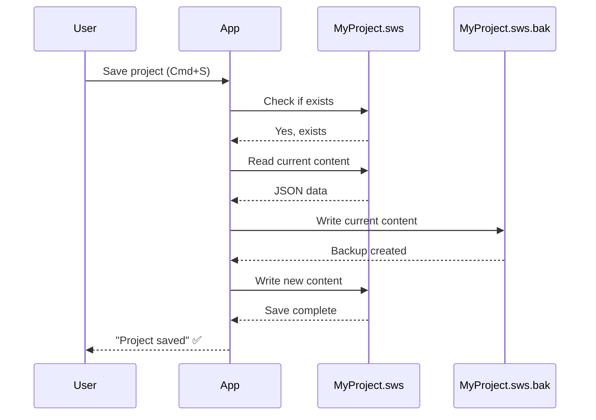
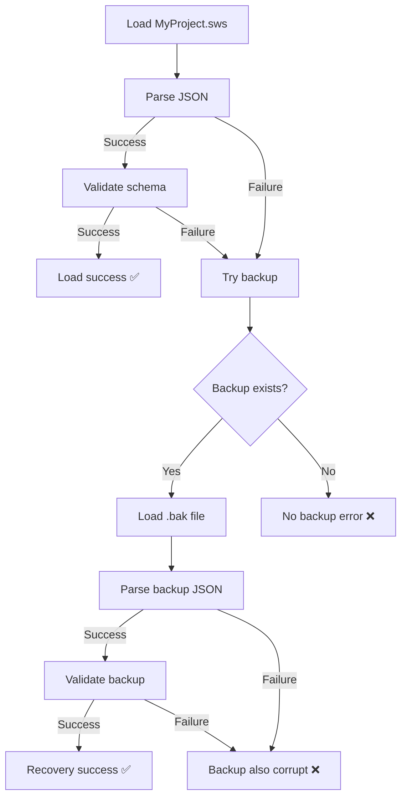

# Offline Storage: Backup Recovery

## 1. Overview

### Purpose
Document the **backup recovery system** that automatically falls back to `.bak` files when the primary project file is corrupted or unreadable.

### Scope
- Automatic backup creation on save
- Backup file format and naming
- Automatic recovery on load failure
- User notification of backup recovery
- Backup retention policy

### Implementation Status
- **Status**: ✅ Implemented
- **Code Location**: `hvac-design-app/src/core/persistence/projectIO.ts:loadBackup()`
- **Backup Format**: `{filename}.sws.bak`
- **Retention**: 1 backup (overwrites previous)
- **Last Verified**: 2026-01-09

---

## 2. Backup Strategy

### When Backups Are Created

**Trigger**: Every manual save (if file already exists)

**Location**: `projectIO.ts:33-37`

```typescript
// Create backup of existing file
if (await exists(path)) {
  const currentContent = await readTextFile(path);
  await writeTextFile(`${path}.bak`, currentContent);
}
```

### Backup Flow



---

## 3. Backup File Format

### Naming Convention

**Pattern**: `{originalFilename}.bak`

**Examples**:
- `MyProject.sws` → `MyProject.sws.bak`
- `HVAC-Design-v2.sws` → `HVAC-Design-v2.sws.bak`

### File Contents

**Format**: Identical to .sws file (JSON)

**Content**: Complete copy of previous version

```json
{
  "schemaVersion": "1.0.0",
  "projectId": "123e4567-e89b-12d3-a456-426614174000",
  "projectName": "HVAC Design",
  "entities": {
    "byId": { /* ... */ },
    "allIds": [ /* ... */ ]
  },
  "viewportState": { /* ... */ },
  "settings": { /* ... */ },
  "createdAt": "2025-12-01T10:00:00Z",
  "modifiedAt": "2026-01-08T14:30:00Z"
}
```

---

## 4. Automatic Recovery

### Recovery Trigger

**When**: Primary file load fails (corrupted, invalid JSON, schema error)

**Location**: `projectIO.ts:78-79`

```typescript
if (!result.success) {
  // Try loading backup if main file is corrupted
  return loadBackup(path);
}
```

### Recovery Flow



### loadBackup Implementation

**Location**: `projectIO.ts:92-118`

```typescript
export async function loadBackup(originalPath: string): Promise<LoadResult> {
  const backupPath = `${originalPath}.bak`;

  try {
    // Check if backup exists
    if (!(await exists(backupPath))) {
      return { success: false, error: 'No backup file available' };
    }

    // Read backup file
    const content = await readTextFile(backupPath);

    // Deserialize and validate
    const result = deserializeProject(content);

    if (!result.success) {
      return { success: false, error: 'Backup file is also corrupted' };
    }

    // Return with special flag
    return {
      success: true,
      project: result.data,
      loadedFromBackup: true, // Notify user
    };
  } catch (error) {
    return {
      success: false,
      error: error instanceof Error ? error.message : 'Backup load failed',
    };
  }
}
```

---

## 5. User Notification

### Recovery Success

```typescript
const result = await loadProject(filePath);

if (result.success && result.loadedFromBackup) {
  toast.warning(
    'Main project file was corrupted. Loaded from backup. ' +
    'You may have lost recent changes.',
    { duration: 10000 } // Show longer
  );
}
```

### Recovery Failure

```typescript
if (!result.success) {
  if (result.error?.includes('No backup')) {
    toast.error('Project file is corrupted and no backup is available.');
  } else if (result.error?.includes('Backup file is also corrupted')) {
    toast.error('Both project file and backup are corrupted. Cannot recover.');
  } else {
    toast.error('Failed to load project: ' + result.error);
  }
}
```

---

## 6. Backup Scenarios

### Scenario 1: Successful Recovery

**Timeline**:
1. **Day 1, 10:00 AM**: User saves project → `MyProject.sws` created
2. **Day 1, 2:00 PM**: User saves again → `MyProject.sws.bak` created (contains 10:00 AM version)
3. **Day 1, 2:05 PM**: Application crashes during save → `MyProject.sws` corrupted
4. **Day 1, 2:10 PM**: User opens project → Main file corrupt, loads from backup (2:00 PM version)

**Data Loss**: 5 minutes of work (2:00 PM → 2:05 PM)

### Scenario 2: Both Files Corrupted

**Timeline**:
1. **Day 1, 10:00 AM**: User saves project → `MyProject.sws` created
2. **Day 1, 2:00 PM**: Disk error corrupts both files
3. **Day 1, 2:10 PM**: User opens project → Both files corrupt, cannot recover

**Recovery**: Check localStorage for auto-save data

### Scenario 3: No Backup Available

**Timeline**:
1. **Day 1, 10:00 AM**: User creates new project
2. **Day 1, 10:05 AM**: Application crashes before first save
3. **Day 1, 10:10 AM**: User opens project → No file exists, no backup

**Recovery**: localStorage auto-save (2-second debounce means data likely saved)

---

## 7. Backup Retention Policy

### Current Policy

**Retention**: 1 backup (most recent previous version)

**Overwrite Strategy**: Each save overwrites the previous backup

**Example Timeline**:
```
10:00 AM: Save → Create MyProject.sws
          (no backup yet)

10:30 AM: Save → Create MyProject.sws.bak (contains 10:00 AM version)
                 Overwrite MyProject.sws (contains 10:30 AM version)

11:00 AM: Save → Overwrite MyProject.sws.bak (contains 10:30 AM version)
                 Overwrite MyProject.sws (contains 11:00 AM version)
          (10:00 AM version is gone forever)
```

### Pros and Cons

| Aspect | Pro | Con |
|--------|-----|-----|
| **Simplicity** | Easy to implement | Can't recover from multiple mistakes |
| **Storage** | Minimal disk usage (2x file size) | Only 1 undo step |
| **Performance** | Fast (single file copy) | No version history |

---

## 8. Future Enhancement: Multiple Backups

### Proposed: Keep 5 Backups

**Naming Convention**:
- `MyProject.sws.bak.1` (most recent)
- `MyProject.sws.bak.2`
- `MyProject.sws.bak.3`
- `MyProject.sws.bak.4`
- `MyProject.sws.bak.5` (oldest)

**Rotation Strategy**:
```typescript
async function createRotatingBackup(path: string) {
  // Rotate existing backups
  for (let i = 5; i > 1; i--) {
    const oldPath = `${path}.bak.${i - 1}`;
    const newPath = `${path}.bak.${i}`;

    if (await exists(oldPath)) {
      await renameFile(oldPath, newPath);
    }
  }

  // Create new backup
  if (await exists(path)) {
    const content = await readTextFile(path);
    await writeTextFile(`${path}.bak.1`, content);
  }
}
```

**Recovery**: Try backups in order (1 → 2 → 3 → 4 → 5)

---

## 9. Backup Creation Performance

### Metrics

| File Size | Read Time | Write Time | Total |
|-----------|-----------|------------|-------|
| 10KB | 5ms | 10ms | ~15ms |
| 100KB | 10ms | 20ms | ~30ms |
| 1MB | 50ms | 100ms | ~150ms |
| 10MB | 200ms | 500ms | ~700ms |

**Impact on Save**: Adds 15-700ms to save time (acceptable for Phase 1)

**Optimization**: Use file system copy operation instead of read+write

```typescript
// Current: Read + write (2 operations)
const content = await readTextFile(path);
await writeTextFile(`${path}.bak`, content);

// Optimized: Single copy operation
await copyFile(path, `${path}.bak`);
```

---

## 10. Testing Strategy

### Unit Tests

```typescript
describe('Backup Recovery', () => {
  it('creates backup on save', async () => {
    const project = createValidProject();

    // First save (no backup created)
    await saveProject(project, '/tmp/test.sws');
    const backup1Exists = await exists('/tmp/test.sws.bak');
    expect(backup1Exists).toBe(false);

    // Second save (backup created)
    await saveProject(project, '/tmp/test.sws');
    const backup2Exists = await exists('/tmp/test.sws.bak');
    expect(backup2Exists).toBe(true);
  });

  it('loads from backup when main file corrupted', async () => {
    // Create valid backup
    const validProject = createValidProject();
    await saveProject(validProject, '/tmp/test.sws');
    await saveProject(validProject, '/tmp/test.sws'); // Creates backup

    // Corrupt main file
    await writeTextFile('/tmp/test.sws', '{ invalid json }');

    // Load should fall back to backup
    const result = await loadProject('/tmp/test.sws');
    expect(result.success).toBe(true);
    expect(result.loadedFromBackup).toBe(true);
  });

  it('returns error when both files corrupted', async () => {
    // Corrupt both files
    await writeTextFile('/tmp/test.sws', '{ invalid }');
    await writeTextFile('/tmp/test.sws.bak', '{ also invalid }');

    const result = await loadProject('/tmp/test.sws');
    expect(result.success).toBe(false);
    expect(result.error).toContain('Backup file is also corrupted');
  });

  it('returns error when no backup exists', async () => {
    // Corrupt main file, no backup
    await writeTextFile('/tmp/test.sws', '{ invalid }');

    const result = await loadProject('/tmp/test.sws');
    expect(result.success).toBe(false);
    expect(result.error).toContain('No backup file available');
  });
});
```

---

## 11. Edge Cases

### Case 1: Backup Created Mid-Corruption

**Scenario**: Application crashes during backup creation

**Handling**:
- Backup write is incomplete (JSON truncated)
- Backup also becomes corrupted
- Recovery fails for both files

**Mitigation**: Atomic writes (write to temp, then rename)

### Case 2: User Manually Deletes Backup

**Scenario**: User deletes `.bak` file manually

**Handling**:
- Next save creates new backup
- No recovery possible if main file corrupts before next save

**Prevention**: Hide `.bak` files in file browser (OS-specific)

### Case 3: Disk Full During Backup

**Scenario**: Not enough space to create backup

**Handling**:
- Backup creation fails silently
- Main file still saves (if space available)
- User has no backup protection

**Future Enhancement**: Check available space before save, warn user

---

## 12. Manual Backup Recommendations

### Best Practices for Users

1. **Regular manual backups**: Save copy with different name weekly
2. **Version naming**: Use dates (e.g., `Project-2026-01-09.sws`)
3. **Cloud backup**: Store copies in cloud storage (Dropbox, Google Drive)
4. **Git version control**: Track .sws files in git repository

### Creating Manual Backup

```typescript
// In UI: "Save a Copy" feature
async function saveACopy() {
  const currentPath = useProjectStore.getState().filePath;
  const timestamp = new Date().toISOString().split('T')[0]; // 2026-01-09

  const copyPath = currentPath.replace('.sws', `-${timestamp}.sws`);

  const project = collectProjectState();
  const result = await saveProject(project, copyPath);

  if (result.success) {
    toast.success(`Backup saved: ${copyPath}`);
  }
}
```

---

## 13. Related Documentation

### Prerequisites
- [Manual Save Flow](../05-data-flow/OS-DF-004-ManualSaveFlow.md)
- [Import Flow](../05-data-flow/OS-DF-001-ImportFlow.md)

### Related Topics
- [Corruption Detection](./OS-ERR-001-CorruptionDetection.md)
- [Known Limitations](./OS-ERR-003-KnownLimitations.md)

---

## 14. Known Limitations

| Limitation | Impact | Workaround | Future Fix |
|------------|--------|------------|------------|
| **Single backup only** | Can't recover from multiple mistakes | Manual backups | Rotating backups (keep 5) |
| **No timestamped backups** | Don't know when backup was created | Check file modified date | Add timestamp to filename |
| **Backup can be corrupted** | Crash during backup creation | None | Atomic writes |
| **No backup verification** | Don't know if backup is valid | None | Validate backup after creation |
| **Silent backup failure** | User not notified if backup fails | None | Show notification on failure |

---

## 15. Changelog

| Date | Version | Change | Author |
|------|---------|--------|--------|
| 2026-01-09 | 1.0.0 | Initial backup recovery documentation | System |

---

## 16. Notes

### Design Decisions

1. **Why single backup?**
   - Simple implementation for Phase 1
   - Covers most corruption scenarios
   - Can add rotation later

2. **Why automatic recovery?**
   - Better UX: Attempt recovery before showing error
   - Most users don't understand backups
   - Transparent to user

3. **Why not verify backup after creation?**
   - Performance: Adds validation overhead
   - Rare: Backup corruption is uncommon
   - Can add later if needed

### Future Enhancements

1. **Rotating backups**: Keep last 5 versions
2. **Timestamped backups**: Add date to filename
3. **Backup verification**: Validate after creation
4. **Backup notifications**: Show when backup created/failed
5. **Cloud sync**: Auto-upload backups to cloud
6. **Atomic writes**: Write to temp file, then rename
