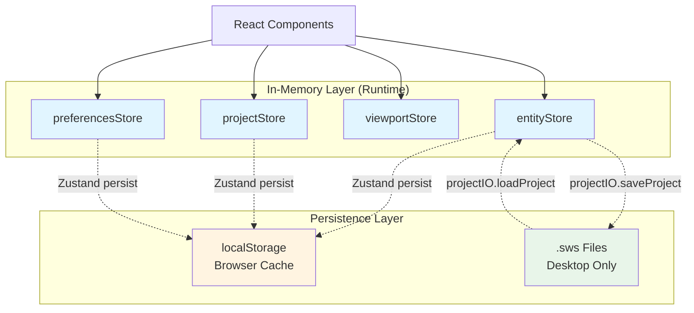

# Offline Storage Architecture

## Overview

The HVAC Canvas App uses a **multi-layer offline-first storage architecture** designed to provide:

- **Desktop permanence**: Full project files stored as `.sws` JSON files via Tauri APIs
- **Web browser caching**: Temporary localStorage persistence for web environments
- **In-memory performance**: Zustand stores for fast UI updates
- **Automatic sync**: Background auto-save every 300 seconds (configurable)
- **Data integrity**: Zod schema validation and backup creation

The system is designed to work seamlessly across both desktop (Tauri) and web browser environments with appropriate fallbacks.

---

## 📋 Documentation Purpose & Usage

> **⚠️ IMPORTANT**: Documents in this folder serve as **SPECIFICATION & REFERENCE** for generating test specs and implementing features, similar to the `docs/user-journeys` documentation.

### Purpose
These documents are designed to:
1. **Serve as reference** for developers creating strict test specifications
2. **Align with user journey documentation** in `docs/user-journeys`
3. **Provide implementation specifications** (both current state and intended behavior)
4. **Enable test-driven development** by documenting expected behavior before implementation

### Document Format
All documents in this folder follow a strict format to facilitate test spec generation:

- **Clear acceptance criteria** with checkboxes
- **Step-by-step flows** with expected outcomes
- **Edge cases and error scenarios** fully documented
- **Code references** to actual implementation (file paths and line numbers)
- **Status indicators** (✅ Implemented, ⚠️ Partial, ❌ Not Implemented)
- **Current vs. Intended behavior** clearly distinguished
- **Cross-references** to related user journeys

### Relationship to User Journeys
Offline storage documentation **must align with** user journey specifications:

| Offline Storage Doc | Related User Journey | Alignment |
|---------------------|---------------------|-----------|
| [OS-INIT-001](./01-initialization/OS-INIT-001-FirstLaunchSetup.md) | [UJ-GS-001](../user-journeys/00-getting-started/tauri-offline/UJ-GS-001-FirstLaunchExperience.md) | First launch experience |
| [OS-DF-003](./05-data-flow/OS-DF-003-AutoSaveFlow.md) | [UJ-FM-002](../user-journeys/08-file-management/tauri-offline/UJ-FM-002-AutoSave.md) | Auto-save behavior |
| [OS-DF-001](./05-data-flow/OS-DF-001-ImportFlow.md) | UJ-FM-001 | Project import flow |
| [OS-ERR-002](./07-error-recovery/OS-ERR-002-BackupRecovery.md) | UJ-FM-009 | Backup recovery |

### For Test Spec Generation
When creating test specifications from these documents:

1. **Use acceptance criteria** as test case templates
2. **Convert step-by-step flows** into test steps
3. **Edge cases become edge case tests**
4. **Error scenarios become negative test cases**
5. **Code references** guide integration test setup
6. **Known issues** become bug regression tests

**Example**: [OS-INIT-001](./01-initialization/OS-INIT-001-FirstLaunchSetup.md) includes:
- ✅ Complete acceptance criteria (ready for test case generation)
- ✅ Step-by-step initialization flow (ready for test steps)
- ✅ Known Issues section (ready for regression tests)
- ✅ Code references for integration tests

### Document Status Indicators
Documents use clear status indicators:
- **📋 SPECIFICATION & REFERENCE** - Document serves as spec (may include intended behavior)
- **✅ Verified against implementation** - Document matches actual code
- **🔄 Specification with gaps** - Some behaviors are intended, not implemented

---

## Storage Layers

### 1. In-Memory State (Zustand Stores)

The **source of truth** during runtime:

- `entityStore` - All canvas entities (ducts, equipment, connections)
- `projectStore` - Current project metadata
- `viewportStore` - Pan/zoom state
- `selectionStore` - Selected entities
- `preferencesStore` - User preferences
- `projectListStore` - Dashboard project list

**Location**: `src/core/store/*`, `src/stores/*`, `src/features/*/store/*`

### 2. Browser Cache (localStorage)

Automatic persistence via Zustand `persist` middleware:

- **Storage keys**:
  - `hvac-project-{projectId}` - Project data (localStorage)
  - `sws.preferences` - User preferences
  - `sws.projectIndex` - Project index metadata

**Size limit**: ~5MB per origin (localStorage)

**Purpose**: `localStorage` for project data and settings; cloud backup is separate and not used for auto-save.

### 3. File System (.sws Files)

Permanent storage on desktop via Tauri APIs:

- **Format**: JSON with `.sws` extension
- **Schema version**: 1.0.0 (Zod-validated)
- **Backup**: `.bak` file created on each save
- **Location**: User-selected directory (OS file picker)

**Desktop only**: Requires Tauri runtime, falls back to localStorage in web environments

---

## Architecture Diagram



---

## Data Flow Summary

### Startup/Load Flow
```
.sws file → JSON parse → Zod validation → Migration (if needed) → Store hydration → UI render
```

### Auto-Save Flow (Desktop)
```
Store change → 300s interval → Serialize entities → Save to .sws → Create .bak backup
```

### Auto-Save Flow (Web)
```
Store change → Zustand persist middleware → Write to localStorage (immediate)
```

### Manual Save Flow
```
User Cmd/Ctrl+S → Save dialog → Serialize → Write .sws → Create .bak → Success notification
```

---

## Quick Links

### Core Documentation
- [Implementation Status](./IMPLEMENTATION_STATUS.md) - What's implemented vs planned
- [Storage Layers Overview](./02-storage-layers/OS-SL-001-ArchitectureOverview.md) - Three-layer architecture
- [IndexedDB Storage](./02-storage-layers/OS-SL-003-IndexedDBStorage.md) - Deprecated reference (localStorage-only policy)

### Initialization
- [First Launch Setup](./01-initialization/OS-INIT-001-FirstLaunchSetup.md)
- [Environment Detection](./01-initialization/OS-INIT-002-EnvironmentDetection.md) - Tauri vs Web
- [Database Integrity Check](./01-initialization/OS-INIT-003-DatabaseIntegrityCheck.md)

### Storage Details
- [.sws File Format](./02-storage-layers/OS-SL-002-SwsFileFormat.md)
- [Zustand Persistence](./02-storage-layers/OS-SL-004-ZustandPersistence.md)
- [Zustand Store Architecture](./03-in-memory-state/OS-MEM-001-ZustandStoreArchitecture.md)
- [State Hydration/Dehydration](./03-in-memory-state/OS-MEM-002-StateHydrationDehydration.md)

### Data Flows
- [Import Flow](./05-data-flow/OS-DF-001-ImportFlow.md)
- [Export Flow](./05-data-flow/OS-DF-002-ExportFlow.md)
- [Auto-Save Flow](./05-data-flow/OS-DF-003-AutoSaveFlow.md)
- [Manual Save Flow](./05-data-flow/OS-DF-004-ManualSaveFlow.md)

### Migration & Recovery
- [Schema Versioning](./06-migration/OS-MIG-001-SchemaVersioning.md)
- [Migration Implementation](./06-migration/OS-MIG-002-MigrationImplementation.md)
- [Corruption Detection](./07-error-recovery/OS-ERR-001-CorruptionDetection.md)
- [Backup Recovery](./07-error-recovery/OS-ERR-002-BackupRecovery.md)
- [Known Limitations](./07-error-recovery/OS-ERR-003-KnownLimitations.md)

### Future Enhancements
- [IndexedDB Storage](./02-storage-layers/OS-SL-003-IndexedDBStorage.md) - Deprecated reference

---

## Related Documentation

### Element Documentation (Detailed API Reference)
- [ProjectIO Element Docs](../elements/10-persistence/ProjectIO.md) - Comprehensive 540-line API reference
- [Serialization Element Docs](../elements/10-persistence/Serialization.md) - Serialize/deserialize logic
- [FileSystem Element Docs](../elements/10-persistence/FileSystem.md) - Tauri abstraction layer

### User Journey Documentation
- [UJ-FM-002: Auto-Save](../user-journeys/08-file-management/tauri-offline/UJ-FM-002-AutoSave.md)
- [UJ-FM-009: Recover Autosave](../user-journeys/08-file-management/tauri-offline/UJ-FM-009-RecoverAutosavedProject.md)
- [UJ-GS-001: First Launch Experience](../user-journeys/00-getting-started/tauri-offline/UJ-GS-001-FirstLaunchExperience.md)

### Technical References
- Zod Schema: `src/core/schema/project-file.schema.ts`
- ProjectIO: `src/core/persistence/projectIO.ts`
- Serialization: `src/core/persistence/serialization.ts`
- Auto-Save Hook: `src/features/canvas/hooks/useAutoSave.ts`

---

## Key Features

### Implemented Features ✅
- .sws file save/load with Zod validation
- Automatic backup (.bak file) creation
- localStorage persistence via Zustand middleware
- Auto-save with 300-second interval
- Tauri/Web environment detection and fallback
- Schema migration framework (v1.0.0)

### Partially Implemented ⚠️
- Schema migration handlers (only v1.0.0 exists)
- Error code system (documented vs actual differs)

### Not Implemented ❌
- Backup rotation (only 1 .bak kept, not 5 versions)
- Retry logic on file lock (no retry mechanism)
- Idle detection (30-minute pause not implemented)
- IndexedDB cache layer (Rejected in favor of localStorage)

See [IMPLEMENTATION_STATUS.md](./IMPLEMENTATION_STATUS.md) for complete details.

---

## Documentation Principles

This documentation follows these principles:

1. **Test-spec ready format** - Structured to enable easy generation of strict test specifications
2. **Alignment with user journeys** - All flows must align with corresponding user journey documentation
3. **Accuracy over comprehensiveness** - Only document what's actually implemented (or clearly mark intended behavior)
4. **Clear status indicators** - Every feature marked as ✅ Implemented, ⚠️ Partial, ❌ Not Implemented, or 📋 Specification
5. **Code-verified content** - All references verified against actual implementation with file paths and line numbers
6. **Current vs. Intended behavior** - Clearly distinguish between actual implementation and specification
7. **Cross-reference existing docs** - Links to element docs and user journeys rather than duplicating
8. **Discrepancy tracking** - Documents where code differs from other documentation (in "Known Issues" sections)

---

## Contributing

When updating offline storage documentation:

### Required Steps
1. **Verify implementation status** in actual code (not assumptions)
2. **Maintain test-spec format**:
   - Include clear acceptance criteria with checkboxes
   - Document step-by-step flows with expected outcomes
   - Add edge cases and error scenarios
   - Include code references (file paths and line numbers)
3. **Align with user journeys**: Ensure flow matches corresponding `docs/user-journeys` documentation
4. **Update IMPLEMENTATION_STATUS.md** if feature status changes
5. **Cross-reference related documentation** (element docs, user journeys, other OS docs)
6. **Mark discrepancies clearly**:
   - Use "Current Implementation" vs "Intended Implementation" sections
   - Add "Known Issues" section for bugs or gaps
   - Use status indicators (📋, ✅, ⚠️, ❌)

### Document Structure Template
Every offline storage document should include:
```markdown
# OS-XXX-YYY: Document Title

**Document Type**: 📋 SPECIFICATION & REFERENCE (or ✅ Verified)
**Last Updated**: YYYY-MM-DD
**Status**: Brief status description

> ⚠️ IMPORTANT: Note about document purpose

## Prerequisites
[Environment requirements]

## Step-by-Step Flow
[Numbered steps with expected outcomes]

## Edge Cases
[Documented edge cases]

## Error Scenarios
[Error handling documentation]

## Implementation Status
✅ Fully Implemented
⚠️ Partially Implemented
❌ Not Implemented

## Known Issues
[Any bugs or gaps]

## Acceptance Criteria
- [ ] Criterion 1
- [ ] Criterion 2

## Related Documentation
- [User Journey Reference]
- [Element Documentation]
```

### Alignment Checklist
Before committing documentation updates:
- [ ] Flows match corresponding user journey documentation
- [ ] Acceptance criteria are testable and clear
- [ ] Code references are verified and current
- [ ] Status indicators accurately reflect implementation
- [ ] Known issues are documented with specifications for fixes
- [ ] Document follows test-spec ready format

---

## Version History

- **2026-01-10**: Documentation purpose and format update
  - Added "Documentation Purpose & Usage" section
  - Clarified documents serve as test spec reference (like user-journeys)
  - Added document structure template
  - Updated documentation principles to emphasize test-spec format
  - Added alignment checklist and user journey mapping table
  - Enhanced contributing guidelines with required steps and structure

- **2026-01**: Initial offline storage documentation created
  - Documented actual three-layer architecture (Zustand + localStorage + .sws files)
  - Clarified Tauri vs Web environment differences
  - Marked IndexedDB as rejected under localStorage-only policy
  - Documented 300-second auto-save interval (spec)
