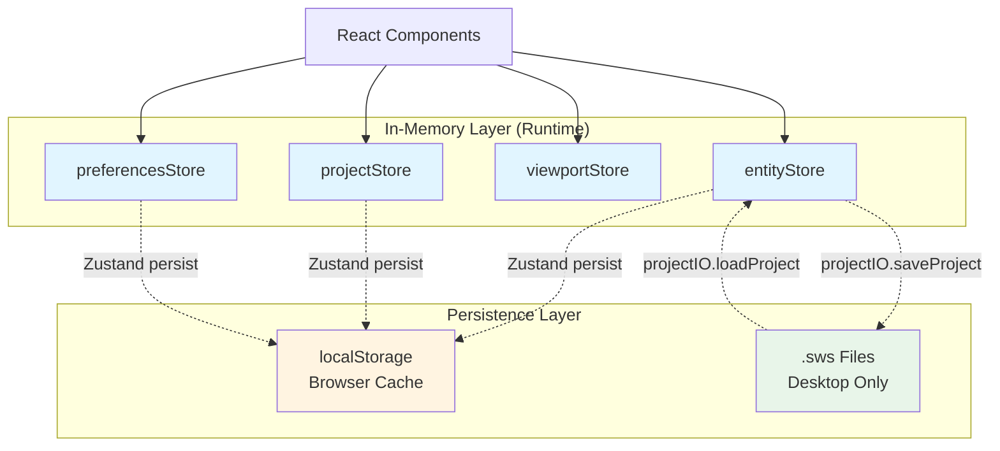

# Offline Storage Architecture

## Overview

The HVAC Canvas App uses a **multi-layer offline-first storage architecture** designed to provide:

- **Desktop permanence**: Full project files stored as `.sws` JSON files via Tauri APIs
- **Web browser caching**: Temporary localStorage persistence for web environments
- **In-memory performance**: Zustand stores for fast UI updates
- **Automatic sync**: Background auto-save with 2-second debounce
- **Data integrity**: Zod schema validation and backup creation

The system is designed to work seamlessly across both desktop (Tauri) and web browser environments with appropriate fallbacks.

---

## Storage Layers

### 1. In-Memory State (Zustand Stores)

The **source of truth** during runtime:

- `entityStore` - All canvas entities (ducts, equipment, connections)
- `projectStore` - Current project metadata
- `viewportStore` - Pan/zoom state
- `selectionStore` - Selected entities
- `preferencesStore` - User preferences
- `projectListStore` - Dashboard project list

**Location**: `src/core/store/*`, `src/stores/*`, `src/features/*/store/*`

### 2. Browser Cache (localStorage)

Automatic persistence via Zustand `persist` middleware:

- **Storage keys**:
  - `hvac-project-{projectId}` - Individual project auto-save data
  - `sws.preferences` - User preferences
  - `sws.projectIndex` - Project list index
  - `project-storage` - Current project state

**Size limit**: ~5MB per origin (browser-dependent)

**Purpose**: Temporary caching to survive page refreshes and provide quick restore

### 3. File System (.sws Files)

Permanent storage on desktop via Tauri APIs:

- **Format**: JSON with `.sws` extension
- **Schema version**: 1.0.0 (Zod-validated)
- **Backup**: `.bak` file created on each save
- **Location**: User-selected directory (OS file picker)

**Desktop only**: Requires Tauri runtime, falls back to localStorage in web environments

---

## Architecture Diagram



---

## Data Flow Summary

### Startup/Load Flow
```
.sws file → JSON parse → Zod validation → Migration (if needed) → Store hydration → UI render
```

### Auto-Save Flow (Desktop)
```
Store change → 2s debounce → Serialize entities → Save to .sws → Create .bak backup
```

### Auto-Save Flow (Web)
```
Store change → Zustand persist middleware → Write to localStorage (immediate)
```

### Manual Save Flow
```
User Cmd/Ctrl+S → Save dialog → Serialize → Write .sws → Create .bak → Success notification
```

---

## Quick Links

### Core Documentation
- [Implementation Status](./IMPLEMENTATION_STATUS.md) - What's implemented vs planned
- [Storage Layers Overview](./02-storage-layers/OS-SL-001-ArchitectureOverview.md) - Three-layer architecture
- [localStorage Cache](./02-storage-layers/OS-SL-003-LocalStorageCache.md) - Browser persistence

### Initialization
- [First Launch Setup](./01-initialization/OS-INIT-001-FirstLaunchSetup.md)
- [Environment Detection](./01-initialization/OS-INIT-002-EnvironmentDetection.md) - Tauri vs Web
- [Database Integrity Check](./01-initialization/OS-INIT-003-DatabaseIntegrityCheck.md)

### Storage Details
- [.sws File Format](./02-storage-layers/OS-SL-002-SwsFileFormat.md)
- [Zustand Persistence](./02-storage-layers/OS-SL-004-ZustandPersistence.md)
- [Zustand Store Architecture](./03-in-memory-state/OS-MEM-001-ZustandStoreArchitecture.md)
- [State Hydration/Dehydration](./03-in-memory-state/OS-MEM-002-StateHydrationDehydration.md)

### Data Flows
- [Import Flow](./05-data-flow/OS-DF-001-ImportFlow.md)
- [Export Flow](./05-data-flow/OS-DF-002-ExportFlow.md)
- [Auto-Save Flow](./05-data-flow/OS-DF-003-AutoSaveFlow.md)
- [Manual Save Flow](./05-data-flow/OS-DF-004-ManualSaveFlow.md)

### Migration & Recovery
- [Schema Versioning](./06-migration/OS-MIG-001-SchemaVersioning.md)
- [Migration Implementation](./06-migration/OS-MIG-002-MigrationImplementation.md)
- [Corruption Detection](./07-error-recovery/OS-ERR-001-CorruptionDetection.md)
- [Backup Recovery](./07-error-recovery/OS-ERR-002-BackupRecovery.md)
- [Known Limitations](./07-error-recovery/OS-ERR-003-KnownLimitations.md)

### Future Enhancements
- [IndexedDB Plan](./04-future-enhancements/OS-FE-001-IndexedDBPlan.md) - Planned but not implemented

---

## Related Documentation

### Element Documentation (Detailed API Reference)
- [ProjectIO Element Docs](../elements/10-persistence/ProjectIO.md) - Comprehensive 540-line API reference
- [Serialization Element Docs](../elements/10-persistence/Serialization.md) - Serialize/deserialize logic
- [FileSystem Element Docs](../elements/10-persistence/FileSystem.md) - Tauri abstraction layer

### User Journey Documentation
- [UJ-FM-002: Auto-Save Project](../../docs/user-journey/UJ-FM-002-AutoSaveProject.md)
- [UJ-FM-009: Create Backup/Duplicate](../../docs/user-journey/UJ-FM-009-CreateBackupDuplicate.md)
- [UJ-GS-001: First Launch Initialization](../../docs/user-journey/UJ-GS-001-FirstLaunchInitialization.md)

### Technical References
- Zod Schema: `src/core/schema/project-file.schema.ts`
- ProjectIO: `src/core/persistence/projectIO.ts`
- Serialization: `src/core/persistence/serialization.ts`
- Auto-Save Hook: `src/features/canvas/hooks/useAutoSave.ts`

---

## Key Features

### Implemented Features ✅
- .sws file save/load with Zod validation
- Automatic backup (.bak file) creation
- localStorage persistence via Zustand middleware
- Auto-save with 2-second debounce
- Tauri/Web environment detection and fallback
- Schema migration framework (v1.0.0)

### Partially Implemented ⚠️
- Schema migration handlers (only v1.0.0 exists)
- Error code system (documented vs actual differs)

### Not Implemented ❌
- IndexedDB cache layer (localStorage used instead)
- Backup rotation (only 1 .bak kept, not 5 versions)
- Retry logic on file lock (no retry mechanism)
- Idle detection (30-minute pause not implemented)

See [IMPLEMENTATION_STATUS.md](./IMPLEMENTATION_STATUS.md) for complete details.

---

## Documentation Principles

This documentation follows these principles:

1. **Accuracy over comprehensiveness** - Only document what's actually implemented
2. **Clear status indicators** - Every feature marked as implemented/partial/planned
3. **Code-verified content** - All references verified against actual implementation
4. **Cross-reference existing docs** - Links to element docs rather than duplicating
5. **Discrepancy tracking** - Documents where code differs from other documentation

---

## Contributing

When updating offline storage documentation:

1. Verify implementation status in code
2. Update `IMPLEMENTATION_STATUS.md` if feature status changes
3. Cross-reference related element documentation
4. Include code file paths and line numbers where applicable
5. Mark any discrepancies between documentation and implementation

---

## Version History

- **2026-01**: Initial offline storage documentation created
  - Documented actual three-layer architecture (Zustand + localStorage + .sws files)
  - Clarified Tauri vs Web environment differences
  - Marked IndexedDB as "planned but not implemented"
  - Documented 2-second auto-save debounce (actual behavior)
