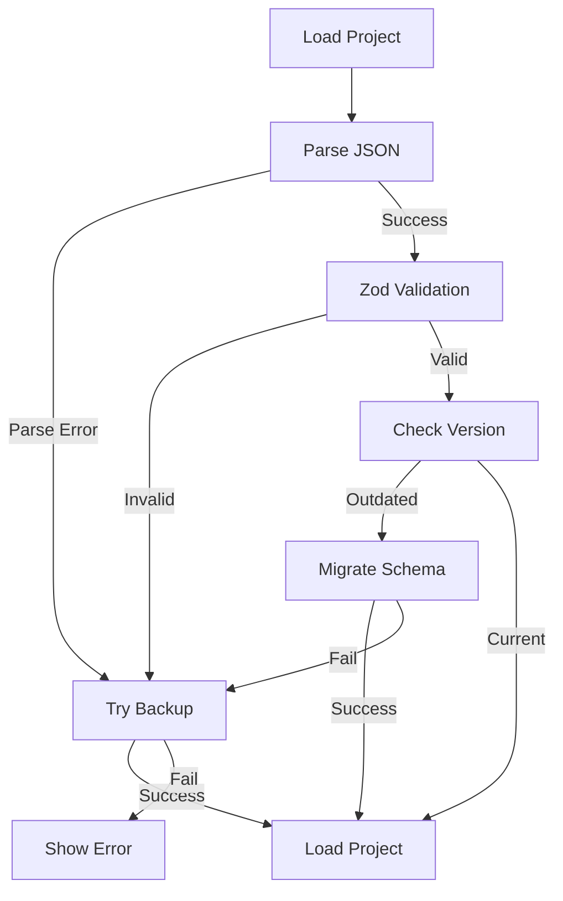

# [UJ-GS-007] Database Integrity Check

## Overview

This user journey covers the data integrity validation that occurs during application startup and project loading, including detection and recovery from corrupted data.

## PRD References

- **FR-INIT-003**: Application shall validate stored data at startup
- **FR-INIT-004**: Application shall recover gracefully from corrupted data
- **AC-INIT-003-001**: Invalid JSON is detected and handled
- **AC-INIT-003-002**: Zod schema validation prevents loading invalid projects
- **AC-INIT-003-003**: Backup recovery is attempted when main file fails

## Prerequisites

- Application is launching or loading a project
- IndexedDB, localStorage, and/or .sws files exist from previous sessions

## Integrity Check Flow

### Phase 1: Persistence Layer Validation (Startup)

**Timing**: Immediately when Zustand stores initialize

**Scope**:
1. **Preferences**: `localStorage` (theme, sidebar state)
2. **Project Data**: `IndexedDB` (database connection, object store existence)

**Expected Behavior**:

| Scenario | Detection | Recovery |
|----------|-----------|----------|
| Valid JSON | Parse success | Hydrate stores |
| Invalid JSON | Parse error | Use default state |
| Missing key | N/A | Use default state |
| Corrupted value | Schema mismatch | Use default state |

**Validation Method**: E2E test
```typescript
test('should recover from corrupted localStorage JSON', async ({ page }) => {
  await setStorageItem(page, 'sws.preferences', '{ invalid json');
  await page.reload();
  await expect(page.getByTestId('app-logo')).toBeVisible();
});
```

---

### Phase 2: Project File Validation (Load)

**Timing**: When user opens project from dashboard or file

**Process Flow**:


---

### Phase 3: Backup Recovery

**Timing**: When main project file fails validation

**Expected Behavior**:
1. Look for `.bak` file in same directory
2. Validate backup file
3. If valid: Load backup, notify user
4. If invalid: Show error, offer new project

**Validation Method**: Unit test
```typescript
it('should load backup when main file corrupted', async () => {
  mockExists.mockResolvedValueOnce(true).mockResolvedValueOnce(true);
  mockDeserialize.mockReturnValueOnce({ success: false })
                 .mockReturnValueOnce({ success: true, data: mockProject });
  
  const result = await loadProject('/path/project.sws');
  expect(result.loadedFromBackup).toBe(true);
});
```

---

## Edge Cases

### 1. Completely Empty localStorage

**Scenario**: Fresh browser with no stored data

**Expected Behavior**:
- All stores initialize with defaults
- First launch experience triggers
- No errors shown

---

### 2. Partially Corrupted Data

**Scenario**: One store corrupted, others valid

**Expected Behavior**:
- Corrupted store recovers to defaults
- Valid stores maintain their data
- App continues functioning

---

### 3. Version Mismatch (Older File)

**Scenario**: File created with older app version

**Expected Behavior**:
- Migration handler attempts upgrade
- If successful: Load migrated project
- If failed: Fall back to backup

---

### 4. Version Mismatch (Newer File)

**Scenario**: File created with newer app version

**Expected Behavior**:
- Show error: "This project requires a newer version"
- Do not attempt to load (may corrupt data)
- Suggest updating application

---

## Error Scenarios

### 1. Both Main and Backup Corrupted

**Expected Handling**:
- Error message: "Project file is corrupted and no backup available"
- Offer to close or start new project
- Log error details for debugging

---

### 2. Storage Quota Exceeded (IndexedDB/LocalStorage)

**Expected Handling**:
- Catch quota error during save
- Notify user immediately
- Suggest exporting projects

---

## User Notifications

| Scenario | Message | Type |
|----------|---------|------|
| Loaded from backup | "Project loaded from backup. Main file was corrupted." | Warning |
| Migrated version | "Project upgraded from v1.0 to v1.1" | Info |
| File not found | "Project file not found" | Error |
| Both corrupted | "Project file corrupted and no backup available" | Error |

---

## Related Elements

- [projectIO.ts](../../hvac-design-app/src/core/persistence/projectIO.ts) - Load/save functions
- [serialization.ts](../../hvac-design-app/src/core/persistence/serialization.ts) - Zod validation
- [OS-INIT-003-DatabaseIntegrityCheck.md](../../offline-storage/01-initialization/OS-INIT-003-DatabaseIntegrityCheck.md) - Technical spec

---

## Test Implementation

### Unit Tests
- `src/core/persistence/__tests__/projectIO.test.ts` (21 tests)
  - Save/load operations
  - Backup creation and recovery
  - Migration handling
  - Error scenarios

### E2E Tests
- `e2e/00-getting-started/uj-gs-007-integrity-check.spec.ts` (9 tests)
  - localStorage validation (4 tests)
  - Project data validation (2 tests)
  - User notifications (1 test)
  - Performance (1 test)
  - State consistency (1 test)

---

## Implementation Status

✅ **Fully Implemented**
- JSON parse error handling
- Zod schema validation
- Backup file fallback
- Version detection and migration

⚠️ **Partially Implemented**
- User notifications (basic toasts only)
- Migration handlers (v1.0.0 only)

❌ **Not Implemented**
- Checksum validation
- Automatic field repair
- Multiple backup versions
