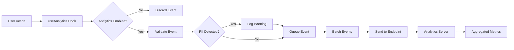

# Analytics Privacy Documentation

This document outlines the privacy compliance measures implemented in the HVAC Design App analytics system.

## Overview

The analytics infrastructure is designed with **privacy-first principles**. We collect only the minimum data necessary to improve the application and never collect any personally identifiable information (PII).

## Data Collection Summary

### ✅ Data We Collect

| Data Type | Purpose | Example |
|-----------|---------|---------|
| **Event Names** | Track feature usage | `dark_mode_enabled`, `export_completed` |
| **Timestamps** | Understand usage patterns | `2024-01-15T10:30:00.000Z` |
| **Session ID** | Group events in a session | Random UUID (not linked to user) |
| **Platform** | Optimize for platforms | `web`, `tauri` |
| **Screen Size** | Responsive design decisions | `{ width: 1920, height: 1080 }` |
| **App Version** | Track adoption of updates | `1.0.0` |
| **Numerical Metrics** | Performance monitoring | Duration in ms, counts |
| **Feature States** | Understand preferences | `true`, `false` (for toggles) |

### ❌ Data We Do NOT Collect

| Data Type | Reason |
|-----------|--------|
| **User Names** | PII - not needed |
| **Email Addresses** | PII - not needed |
| **IP Addresses** | PII - not logged by design |
| **Device Identifiers** | Not needed for analytics |
| **Location Data** | Not relevant to app usage |
| **File Names/Paths** | Could reveal sensitive info |
| **Canvas Content** | User's proprietary data |
| **Project Names** | Could contain sensitive info |
| **Passwords/Credentials** | Never collected |
| **Cookies** | No tracking cookies used |

## Technical Implementation

### No External Tracking SDKs

We deliberately avoid third-party analytics SDKs to maintain full control over data collection:

- ❌ No Google Analytics
- ❌ No Mixpanel
- ❌ No Amplitude
- ❌ No Segment
- ✅ Custom lightweight implementation

### PII Detection

The system includes automatic PII detection that warns developers:

```typescript
// From telemetry.ts
const piiPatterns = [
  /email/i,
  /password/i,
  /phone/i,
  /address/i,
  /ssn/i,
  /credit.?card/i,
];
```

If potential PII is detected in an event payload, a warning is logged (in debug mode) to alert developers.

### Session ID Implementation

Session IDs are:

- **Generated randomly** using `crypto.randomUUID()` or a timestamp-based fallback
- **Stored only in sessionStorage** (cleared when browser closes)
- **Not linked to any user identifier**
- **Used solely for grouping events within a single session**

```typescript
// Session ID generation (from config.ts)
function generateSessionId(): string {
  if (typeof crypto !== 'undefined' && crypto.randomUUID) {
    return crypto.randomUUID();
  }
  return `${Date.now()}-${Math.random().toString(36).substring(2, 15)}`;
}
```

### No Cross-Session Tracking

- Each browser session gets a new random session ID
- No persistent identifiers stored in localStorage
- No fingerprinting of devices
- No cookies used for tracking

## Data Retention

| Data | Retention Period | Notes |
|------|------------------|-------|
| Raw Events | 30 days | Aggregated then deleted |
| Aggregated Metrics | 1 year | Anonymized summaries |
| Debug Logs | 7 days | Development only |

## Compliance Frameworks

### GDPR (EU)

| Requirement | Implementation |
|-------------|----------------|
| Data Minimization | Only essential metrics collected |
| Purpose Limitation | Used only for product improvement |
| Storage Limitation | Defined retention periods |
| No PII | No personal data collected |
| Right to Erasure | No user-specific data to erase |

**GDPR Note:** Because we don't collect PII, many GDPR requirements about personal data don't apply. However, users can disable analytics entirely via environment variable.

### CCPA (California)

| Requirement | Implementation |
|-------------|----------------|
| No Sale of Data | Data is never sold |
| Transparency | This documentation |
| Opt-Out | Can disable analytics |

### COPPA (Children's Privacy)

The app does not target children under 13, but our analytics system would be compliant regardless as we collect no personal information.

## User Consent

### Implied Consent Model

Currently, analytics operates under an implied consent model:

- Users are informed that anonymous usage data is collected
- Users can opt out by disabling analytics
- No PII is collected regardless of consent status

### Opting Out

Users or administrators can disable analytics:

```env
# In .env or environment configuration
NEXT_PUBLIC_ANALYTICS_ENABLED=false
```

When analytics is disabled:

- ✅ No events are queued
- ✅ No network requests are made
- ✅ No data is collected

## Data Flow



## Data Security

### In Transit

- All analytics requests use HTTPS
- No sensitive data in request URLs
- JSON payload only in POST body

### At Rest

- Events processed in-memory before sending
- Session ID in sessionStorage only
- No sensitive data persisted

## Auditing

### Event Validation

Every event is validated before queuing:

1. Required fields present (`category`, `name`)
2. PII pattern matching (warning if detected)
3. Payload structure validation

### Debug Mode

In development, enable debug mode to audit events:

```env
NEXT_PUBLIC_ANALYTICS_DEBUG=true
```

Console output shows:
- Event category and name
- Payload contents
- Batch sending status

## Privacy Contact

For privacy-related inquiries about this analytics system:

1. Review this documentation
2. Check the source code (fully open)
3. Contact the development team

## Changelog

| Date | Change |
|------|--------|
| 2024-01-15 | Initial privacy documentation |
| - | No PII collection policy established |
| - | Session ID implementation documented |

## Summary

| Privacy Measure | Status |
|-----------------|--------|
| No PII collected | ✅ |
| No tracking cookies | ✅ |
| No third-party SDKs | ✅ |
| Opt-out available | ✅ |
| PII detection warnings | ✅ |
| HTTPS only | ✅ |
| Session-only storage | ✅ |
| Documented retention | ✅ |
| GDPR compatible | ✅ |
| CCPA compatible | ✅ |
