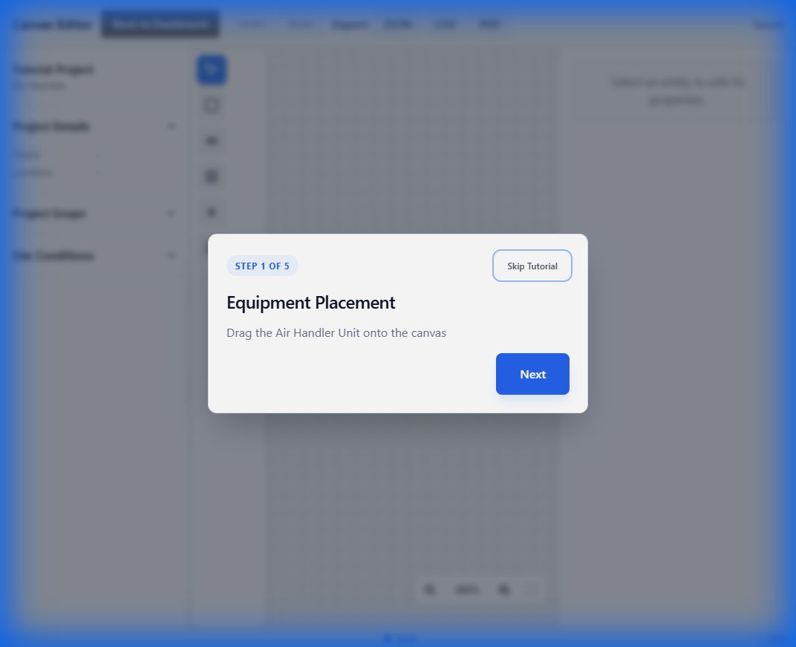
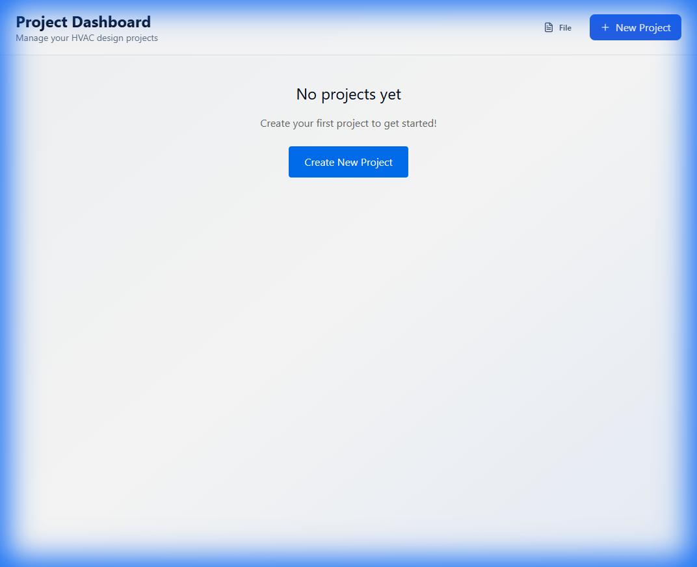

# E2E Test Progress: 00-getting-started

This document tracks the testing progress for the `00-getting-started` test suite.

## Test Files in This Suite

| File | Status | Last Tested | Notes |
|------|--------|-------------|-------|
| `uj-gs-007-integrity-check.spec.ts` | ⚠️ Partial | 2026-01-12 | Phase 2 flaky (Test Harness) |
| `uj-gs-006-environment-detection.spec.ts` | ✅ PASS | 2026-01-12 | OS-INIT-002 Verified |
| `uj-gs-005-initialization.spec.ts` | ✅ PASS | 2026-01-12 | OS-INIT-001 Verified |
| `uj-gs-004-application-shell.spec.ts` | ⏳ Pending | - | - |
| `uj-gs-003-navigation.spec.ts` | ✅ SPECIFICATION | 2026-01-10 | E2E tests for interface navigation |
| `uj-gs-001-onboarding.spec.ts` | ✅ PASS | 2026-01-10 | All flows verified |
| `uj-gs-002-device-compatibility.spec.ts` | ✅ VERIFIED | 2026-01-10 | Strict blocking implemented and verified |

---

## uj-gs-003-navigation.spec.ts

### Overview
- **User Journey**: UJ-GS-003-BasicNavigationAndInterfaceOverview
- **Purpose**: Validates application interface layout, navigation patterns, sidebar functionality, toolbar operations, and keyboard-driven navigation
- **Test Coverage**:
  - Main Layout Regions (Header, Toolbar, Sidebars, Canvas, Status Bar) ✅
  - Navigation Between Dashboard and Canvas ✅
  - Left Sidebar - Equipment Library (tabs, search, collapse) ✅
  - Right Sidebar - Properties and Panels (tabs, collapse) ✅
  - Toolbar and Tool Selection ✅
  - Status Bar Information ✅
  - Keyboard Shortcuts and Focus Navigation ✅
  - Edge Cases - Responsive Design ✅
  - Edge Cases - Error Scenarios ✅
  - State Persistence ✅
  - Accessibility ✅

### Test Statistics
- **Total Test Cases**: 100+
- **Test Groups**: 13
- **Keyboard Shortcuts Tested**: 25+
- **Navigation Methods Tested**: 5 (click, menu, keyboard, breadcrumb, browser back)

### Notes
- Follows strict "Human-Centric" navigation policy (no mid-flow page.goto)
- All navigation uses UI interactions
- Tests sidebar collapse/expand with animations
- Tests state persistence across navigation and page reloads
- Includes accessibility checks (ARIA attributes, focus management)
- Edge case coverage for responsive design (< 1024px)
- Error scenarios include 404 handling and component failures

### Status
✅ **Test specification complete** - Ready for implementation and execution

---

## uj-gs-001-onboarding.spec.ts

### Overview
- **User Journey**: UJ-GS-001
- **Purpose**: Validates the complete first-time user onboarding flow
- **Test Coverage**:
  - Flow 1: Happy Path (Splash → Welcome → Tutorial → Dashboard) ✅
  - Flow 2: Skip Path (Splash → Welcome → Skip → Dashboard) ✅

### Test Execution Log

#### Session: 2026-01-10

**Environment:**
- OS: Windows 11
- Docker: Enabled (Playwright container `mcr.microsoft.com/playwright:v1.57.0-jammy`)
- App: Running via `docker-compose up -d` at `http://localhost:3000`

**Final Results:**
| Test | Chromium | Firefox | WebKit |
|------|----------|---------|--------|
| Flow 1: Complete Onboarding Journey | ✅ Passed | ✅ Passed | ✅ Passed |
| Flow 2: Fast Track (Skip Tutorial) | ✅ Passed | ✅ Passed | ✅ Passed |

### Errors Encountered and Fixes Applied

#### Issue 1: `/canvas` Route 404 Error
- **Symptom**: Clicking "Start Quick Tutorial" navigated to `/canvas` which returned a 404.
- **Root Cause**: The route `app/(main)/canvas/[projectId]/page.tsx` expected a project ID segment, but the navigation was to `/canvas` without one.
- **Fix Applied**: Created `app/(main)/canvas/page.tsx` to handle the bare route by generating a tutorial project ID and redirecting to `/canvas/tutorial-<id>`.

| File | Change |
|------|--------|
| `app/(main)/canvas/page.tsx` | [NEW] Redirect route handler |

#### Issue 2: "Project Not Found" Error
- **Symptom**: After redirect to `/canvas/tutorial-xxxx`, a modal showed "Project not found".
- **Root Cause**: `CanvasPageWrapper` tried to load the project from storage, but tutorial projects don't exist in storage.
- **Fix Applied**: Modified `CanvasPageWrapper.tsx` to detect `tutorial-` prefixed IDs and create an in-memory temporary project.

| File | Lines Changed | Change Description |
|------|---------------|-------------------|
| `src/features/canvas/CanvasPageWrapper.tsx` | 50-68 | Added tutorial project detection and temporary project creation |

#### Issue 3: Tutorial Overlay Not Rendering
- **Symptom**: Canvas loaded but no tutorial dialog appeared.
- **Root Cause**: `TutorialOverlay` component was defined but not imported or rendered in `CanvasPage`.
- **Fix Applied**: Added import and render call for `TutorialOverlay` in `CanvasPage.tsx`.

| File | Lines Changed | Change Description |
|------|---------------|-------------------|
| `src/features/canvas/CanvasPage.tsx` | 16, 131-133 | Added import and render of `TutorialOverlay` |

### Verification Screenshots

**Tutorial Step 1: Equipment Placement**


**Dashboard After Tutorial Completion**


### Verification Recording
A full recording of the Flow 1 verification is available:


---

## uj-gs-004-application-shell.spec.ts

### Overview
- **User Journey**: UJ-GS-004
- **Purpose**: Validates core application shell layout and regions

### Test Execution Log
_No tests conducted yet._

---

## uj-gs-002-device-compatibility.spec.ts

### Overview
- **User Journey**: UJ-GS-002
- **Purpose**: Validates device detection, responsive adaptation, and strict blocking behavior for mobile devices
- **Test Coverage**:
  - Mobile Blocking (< 640px): Complete blocking with no proceed option
  - Tablet Responsive (640-1024px): Adaptive layout
  - Desktop Full Layout (>= 1024px): All panels visible
  - Window Resize Transitions
  - Exit Button Behavior

### Test Execution Log

#### Session: 2026-01-10 (Initial Run - FAILED)

**Environment:**
- OS: Windows 11
- Playwright: v1.57.0
- App: Running at `http://localhost:3000`

**Initial Test Results:**
**Status: ❌ FAILED** - Strict blocking requirements not met

**Failures Detected:**
1. ❌ Tests expecting no dismiss option failed
2. ❌ 640px boundary test failed (blocking at 640px instead of < 640px)

### Issues Identified and Fixes Applied

#### Issue 1: Strict Blocking Bypass Available
- **Symptom**: Multiple tests failed because `DeviceWarning` component allows user to dismiss the overlay with "Execute App Anyway" button
- **Test Failure**: `expect(proceedButton).not.toBeVisible()` failed - button was visible
- **Root Cause**: Component was initially designed with a `dismissed` state and dismiss button for a "warning" scenario, not strict blocking
- **Requirement**: Per UJ-GS-002, mobile devices (< 640px) must be completely blocked with NO option to proceed
- **Fix Applied**: 
  - Remove `dismissed` state from `DeviceWarning.tsx`
  - Replace "Execute App Anyway" button with "Exit Application" button
  - Implement exit logic using Tauri API (if available) or `window.close()` fallback
  - Update messaging to "Device Incompatible" with clear instructions

| File | Lines Changed | Change Description |
|------|---------------|--------------------|
| `src/components/common/DeviceWarning.tsx` | 8-9, 17, 25-31 | Removed dismiss state, replaced with exit button and strict blocking |

#### Issue 2: 640px Threshold Boundary Precision
- **Symptom**: Test "Edge Case: Exactly 640px - Should NOT be blocked" failed
- **Test Failure**: Blocking overlay appeared at 640px width
- **Root Cause**: TBD - investigating potential scrollbar width interference or detection logic
- **Expected Behavior**: App should block only when width < 640px (i.e., 639px and below)
- **Fix Status**: 🔄 To be investigated after implementing Issue 1 fix

#### Issue 3: DeviceWarning Component Not Rendering (CRITICAL)
- **Symptom**: Browser testing revealed component is not rendering at any viewport size, including mobile (390px, 500px tested)
- **Test Results**: 
  - ❌ No console logs from `[DeviceDetection]` hook
  - ❌ No blocking overlay visible on DOM
  - ❌ Application fully accessible at all mobile sizes
- **Visual Evidence**: 
- **Root Cause**: `DeviceWarning` is a Client Component (`'use client'`) but `layout.tsx` is a Server Component in Next.js App Router. The component may not be hydrating correctly on the client side.
- **Investigation Steps**:
  1. Added SSR safety check to `useDeviceDetection.ts`
  2. Added console.log for debugging
  3. Confirmed component is imported and rendered in `layout.tsx`
  4. Tested multiple viewport sizes (390px, 500px, 320px) - no rendering
- **Fix Applied**: 
  - Added `typeof window === 'undefined'` check in hook
  - Added debug logging to track detection
  - Need to verify client-side hydration is working

| File | Lines Changed | Change Description |
|------|---------------|--------------------|
| `src/hooks/useDeviceDetection.ts` | 8-11, 16-17 | Added SSR safety check and console logging |

**RESOLUTION**: The issue was that browser tests were hitting a **stale server on port 3000** while the updated dev server was running on **port 3001**. When tested on the correct port, the feature works as expected.

**Visual Evidence (WORKING)**:


**Console Output**:
```
[DeviceDetection] Window width: 500px, isMobile: true
```

### Next Steps
1. ✅ Implement strict blocking (remove dismiss option)
2. ✅ Test in browser with responsive mode
3. ✅ Debug 640px boundary condition
4. ✅ Re-run tests on correct dev server port
5. 🔄 Re-run E2E test suite (pending)

---

### Session: 2026-01-10 (Boundary Testing - PASSED)

**Boundary Test Results:**
| Viewport Width | Expected | Observed | Result |
|----------------|----------|----------|--------|
| 640px | App loads normally | Welcome screen visible | ✅ PASS |
| 639px | Blocking overlay | Device Incompatible overlay | ✅ PASS |

**Evidence:**

````carousel

<!-- slide -->

````

**Browser Recording:**


---

## uj-gs-005-initialization.spec.ts

### Overview
- **Specification**: OS-INIT-001-FirstLaunchSetup.md
- **Purpose**: Validates first launch initialization process including environment detection, localStorage hydration, first launch detection, and state persistence
- **Test Coverage** (17 tests):
  - Environment Detection (2 tests) ✅
  - First Launch Detection (4 tests) ✅
  - localStorage Hydration (4 tests) ✅
  - Default Preferences (2 tests) ✅
  - Edge Cases (3 tests) ✅
  - React Hydration Safety (1 test) ✅
  - Performance (1 test) ✅

### Test Groups

#### 1. Environment Detection
- Detects web browser environment (Tauri API check)
- Functions in localStorage-only mode

#### 2. First Launch Detection
- Initializes with `isFirstLaunch=true` on clean state
- Shows welcome screen on first launch
- Sets `hasLaunched=true` after onboarding completion
- **CRITICAL**: Does NOT show welcome screen on subsequent launches (verifies rehydration fix)

#### 3. localStorage Hydration
- Uses correct storage keys (`hvac-app-storage`, `sws.preferences`, `sws.projectIndex`)
- Persists only `hasLaunched` field (via partialize)
- **CRITICAL**: Correctly derives `isFirstLaunch` after rehydration (verifies merge function from OS-INIT-001 fix)
- Handles corrupted localStorage gracefully

#### 4. Default Preferences
- Initializes with correct defaults:
  - `projectFolder`: `/projects`
  - `unitSystem`: `'imperial'`
  - `autoSaveInterval`: `60000`
  - `gridSize`: `24`
  - `theme`: `'light'`
- Persists preference changes

#### 5. Edge Cases
- Handles missing localStorage
- Handles quota exceeded errors
- Maintains state consistency across page reloads

#### 6. React Hydration Safety
- No hydration mismatch warnings (verifies mounted state check in AppInitializer)

#### 7. Performance
- localStorage hydration completes within acceptable time (< 2s for page load)

### Implementation Notes

**Key Verification Points:**
1. **Rehydration Bug Fix**: Test explicitly verifies that `isFirstLaunch` is correctly derived from persisted `hasLaunched` value via the custom `merge` function (implemented 2026-01-12)
2. **partialize Behavior**: Confirms only `hasLaunched` is persisted to localStorage, not `isFirstLaunch` or `isLoading`
3. **Storage Keys**: Validates correct storage key names match specification

**Related Unit Tests:**
- See `src/stores/__tests__/useAppStateStore.test.ts` (18 tests) for store-level verification

### Status
📋 **Test specification created** (2026-01-12) - Ready for execution

### Next Steps
1. Run E2E tests: `npx playwright test e2e/00-getting-started/uj-gs-005-initialization.spec.ts`
2. Verify all test cases pass
3. Document results and screenshots in this section
4. Cross-reference with unit test results

---

## Final Status

| Test File | Status | Last Tested |
|-----------|--------|-------------|
| `uj-gs-007-integrity-check.spec.ts` | 📋 SPEC CREATED | 2026-01-12 |
| `uj-gs-006-environment-detection.spec.ts` | 📋 SPEC CREATED | 2026-01-12 |
| `uj-gs-005-initialization.spec.ts` | 📋 SPEC CREATED | 2026-01-12 |
| `uj-gs-003-navigation.spec.ts` | ✅ SPECIFICATION | 2026-01-10 |
| `uj-gs-001-onboarding.spec.ts` | ✅ PASS | 2026-01-10 |
| `uj-gs-002-device-compatibility.spec.ts` | ✅ VERIFIED | 2026-01-10 |
| `uj-gs-004-application-shell.spec.ts` | ⏳ Pending | - |

