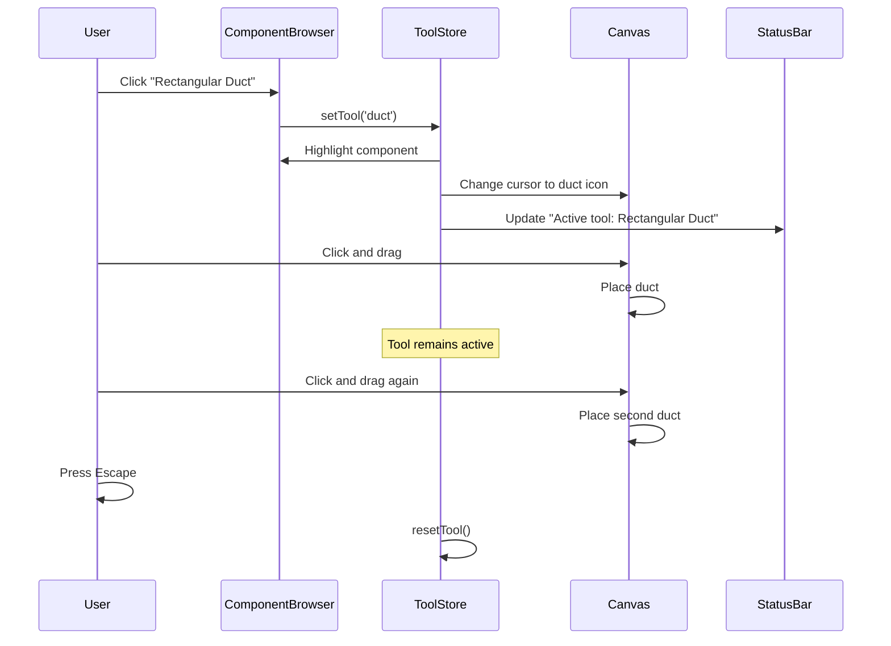

I have created the following plan after thorough exploration and analysis of the codebase. Follow the below plan verbatim. Trust the files and references. Do not re-verify what's written in the plan. Explore only when absolutely necessary. First implement all the proposed file changes and then I'll review all the changes together at the end.

## Observations

The codebase already has foundational infrastructure for the Unified Engineering Core including component library store, canvas tools, BOM generation, engineering calculations, validation services, and export functionality. The spec defines 15 comprehensive user flows that build upon and extend these existing systems. Key existing components include `componentLibraryStore`, `catalogStore`, canvas tools (`DuctTool`, `FittingTool`, `SelectTool`), inspector panels, `bomGenerationService`, `costCalculationService`, `constraintValidator`, and onboarding components. The architecture uses Zustand for state management, Next.js for routing, and Tauri for desktop capabilities.

## Approach

The implementation will enhance and unify existing systems rather than rebuild from scratch. The strategy focuses on consolidating the dual catalog/component-library systems into a unified component browser, enhancing parametric design with real-time constraint validation, implementing automatic fitting insertion logic, creating a comprehensive validation dashboard, and building calculation settings templates. Each flow will be implemented by extending existing stores, services, and components while maintaining backward compatibility. The plan prioritizes core flows (1-8) that form the foundation, followed by advanced features (9-15) that build upon them.

## Implementation Plan

### Phase 1: Unified Component Browser (Flow 1)

**Consolidate Component Selection System**

Merge `file:hvac-design-app/src/core/store/catalogStore.ts` and `file:hvac-design-app/src/core/store/componentLibraryStore.ts` into a unified component browsing experience. Update `file:hvac-design-app/src/features/canvas/components/ProductCatalogPanel.tsx` and `file:hvac-design-app/src/features/canvas/components/LibraryBrowserPanel.tsx` to display a single hierarchical tree structure matching the wireframe in the spec (lines 50-115).

**Enhance Component Activation**

Extend `file:hvac-design-app/src/core/store/canvas.store.ts` to track component activation states (inactive, hover, active, placing, placed) as detailed in spec lines 1671-1681. Update tool activation logic in `file:hvac-design-app/src/features/canvas/tools/BaseTool.ts` to support multi-placement workflow where tools remain active after placing components.

**Implement Keyboard Shortcuts**

Add keyboard shortcut handlers (V for Select, D for Duct, F for Fitting, E for Equipment, Escape for deactivate) as specified in lines 1700-1708. Integrate with existing cursor store `file:hvac-design-app/src/features/canvas/store/cursorStore.ts`.

**Visual Feedback System**

Update `file:hvac-design-app/src/features/canvas/components/LeftSidebar.tsx` to highlight active components in the browser and show cursor changes. Implement status bar to display "Active tool: [Component Name]" as per spec line 1678.

### Phase 2: Parametric Design with Constraint Validation (Flow 2 & 4)

**Real-Time Engineering Calculations**

Enhance `file:hvac-design-app/src/core/services/engineeringCalculations.ts` and `file:hvac-design-app/src/features/canvas/calculators/ductSizing.ts` to recalculate velocity, pressure drop, and friction on every dimension change. Implement debounced updates (500ms) as specified in lines 1780-1805.

**Constraint Violation Handling**

Extend `file:hvac-design-app/src/core/services/validation/constraintValidator.ts` to implement "allow with warning" behavior (spec lines 1505-1524). When constraints are violated, apply changes immediately but display warnings in the Engineering tab of `file:hvac-design-app/src/features/canvas/components/Inspector/DuctInspector.tsx`.

**Suggested Fix System**

Implement auto-suggestion logic that analyzes constraint violations and proposes fixes (e.g., "Increase width to 16" to reduce velocity to 1,800 fpm"). Add UI controls in inspector panels for "Apply Suggestion", "Ignore Warning", and "Custom" options as shown in spec lines 1508-1520.

**Properties Panel Enhancement**

Update `file:hvac-design-app/src/features/canvas/components/Inspector/InspectorPanel.tsx` to display three tabs: Properties, Engineering, and Validation. The Engineering tab should show real-time calculations with visual indicators (green checkmark for satisfied, orange warning for violations).

**Parametric Cascading Updates**

Enhance `file:hvac-design-app/src/core/services/automation/autoSizingService.ts` to automatically resize connected fittings when duct dimensions change. Track cascading changes for proper undo/redo support.

### Phase 3: Real-Time Cost Estimation (Flow 3)

**BOM Auto-Update System**

Enhance `file:hvac-design-app/src/core/services/bom/bomGenerationService.ts` to implement immediate updates (<100ms) for component add/delete and debounced updates (500ms) for dimension/material changes as specified in lines 1774-1805.

**Cost Breakdown Display**

Update `file:hvac-design-app/src/features/canvas/components/BOMPanel.tsx` to match the wireframe in spec lines 164-357. Implement expandable cost breakdown popup showing material cost, labor cost, waste factors, and markup calculations (spec lines 1811-1830).

**Visual Feedback for Updates**

Add yellow flash animation to updated cost values in the BOM panel. Display "Last updated: X seconds ago" timestamp as per spec line 1805.

**Integration with Calculation Settings**

Connect BOM calculations to settings from `file:hvac-design-app/src/core/schema/calculation-settings.schema.ts` including labor rates, markup percentages, waste factors, and regional multipliers.

### Phase 4: Automatic Fitting Insertion (Flow 5)

**Connection Detection Service**

Enhance `file:hvac-design-app/src/core/services/connectionDetection.ts` to detect when ducts connect at junctions and determine appropriate fitting types based on angles, duct sizes, and connection geometry.

**Smart Fitting Selection**

Extend `file:hvac-design-app/src/core/services/automation/fittingInsertionService.ts` to implement smart default behavior for complex junctions (T-junctions, size transitions, misaligned ducts) as detailed in spec lines 1836-1887. Handle scenarios:
- Simple 90° connections → Insert elbow
- Three ducts meeting → Replace elbow with Tee branch
- Size mismatches → Insert transition fitting
- Misaligned ducts → Prompt user with options (Snap to Align, Insert Offset, Manual)

**Visual Feedback**

Implement subtle highlighting for auto-inserted fittings with notification messages like "90° Elbow (18x12) inserted automatically" as shown in spec line 527.

**User Override Options**

Add settings toggle for "Manual fitting placement" to disable auto-insertion. Ensure users can delete auto-inserted fittings and place manually. Support undo for auto-insertion operations.

**Orphaned Fitting Detection**

When ducts are deleted, detect orphaned fittings and prompt "Remove orphaned elbow?" as specified in spec line 531.

### Phase 5: Component Library Management (Flow 6)

**Library Management View**

Create dedicated library management interface with two-panel layout (component tree on left, details on right) matching wireframe in spec lines 588-711. This can be a new route or modal accessed from settings.

**Component CRUD Operations**

Extend `file:hvac-design-app/src/core/store/componentLibraryStore.ts` with full CRUD capabilities for components including:
- Add new custom components with parametric properties
- Edit existing components (name, category, dimensions, materials, pricing, engineering properties)
- Duplicate components as templates
- Delete components with confirmation

**Import/Export Functionality**

Implement CSV/JSON import wizard with column mapping, preview, and validation (spec lines 1898-1931). Support export of component library with options to include/exclude pricing and engineering data.

**Custom Component Creation**

Build component creation form with sections for Basic Info, Dimensions, Materials, Pricing, Engineering Properties, and Constraints as detailed in spec lines 1934-1947.

### Phase 6: Calculation Settings Configuration (Flow 7)

**Settings Modal**

Create calculation settings modal matching wireframe in spec lines 740-855. Implement sections for:
- Template selector (Commercial Standard, Residential Budget, Industrial Heavy, Custom)
- Labor rates (base rate, regional multiplier)
- Markup & overhead (material markup %, labor markup %, overhead %)
- Waste factors (duct waste %, fitting waste %)
- Engineering limits (max velocity, target pressure drop)

**Template System**

Extend `file:hvac-design-app/src/core/schema/calculation-settings.schema.ts` to support named templates. Implement template CRUD operations in `file:hvac-design-app/src/core/store/settingsStore.ts`.

**Real-Time Application**

When settings change, trigger immediate recalculation of all BOM costs and engineering validations. Update `file:hvac-design-app/src/features/canvas/components/BOMPanel.tsx` to reflect new calculations.

**Access Points**

Provide two access paths: BOM tab → Settings button, and Left Sidebar → Project Properties → Calculation Settings section.

### Phase 7: Project Export (Flow 8)

**Export Dialog Enhancement**

Enhance `file:hvac-design-app/src/features/export/ExportReportDialog.tsx` to match spec requirements (lines 870-904) with options for:
- Format selection (CSV, PDF, Excel)
- Content inclusion (material list, labor breakdown, cost summary, engineering notes, project metadata)
- Grouping options (by category, floor/zone, system type, flat list)
- Pricing visibility toggle
- Canvas screenshot embedding for PDF
- Template selection (company letterhead vs plain)

**PDF Generation**

Extend `file:hvac-design-app/src/features/export/pdf.ts` to generate comprehensive bid documents with:
- Project header (name, location, date, client)
- Executive summary (total cost, timeline estimate)
- Material takeoff by category
- Labor hours breakdown
- Cost summary with markup and taxes
- Engineering notes with constraint violations flagged
- Calculation settings used
- Optional canvas screenshots

**Export Validation**

Before export, run validation check using `file:hvac-design-app/src/core/services/validation/constraintValidator.ts`. If violations exist, show warning dialog: "Design has X constraint violations. Include in export notes?"

**Export History**

Track export history in project metadata (who exported, when, what format) for audit trail.

### Phase 8: Project Initialization (Flow 9)

**Project Setup Wizard**

Create multi-step wizard for new project creation with steps:
1. Project Details (name, location, client, type, start date)
2. Scope & Materials (system types, primary materials, default sizing method)
3. Calculation Settings (template selection, labor rate, markup, regional multiplier)
4. Engineering Parameters (max velocity, target pressure drop, friction factors)

**Integration with Existing System**

Extend `file:hvac-design-app/src/core/services/project/projectInitializationService.ts` to accept wizard data and initialize project with pre-configured settings. Update `file:hvac-design-app/src/core/store/project.store.ts` to store wizard selections.

**Default Handling**

Implement "Use Defaults" button to skip optional steps and create project with sensible defaults.

**First-Time User Experience**

Integrate with existing `file:hvac-design-app/src/components/onboarding/WelcomeScreen.tsx` to show tutorial overlay after project creation for first-time users.

### Phase 9: System Template Application (Flow 10)

**System Template Schema**

Extend `file:hvac-design-app/src/core/schema/system-template.schema.ts` to define system types (Supply Air, Return Air, Exhaust, Custom) with properties:
- Default pressure class
- Material preferences
- Color coding (blue for supply, green for return, red for exhaust)
- Calculation parameters (velocity limits, pressure drop targets)
- Labor multipliers

**Template Application Tool**

Create system template tool that allows users to click ducts and apply system type. Update duct visual appearance (outline color) based on system type.

**Bulk Application**

Extend `file:hvac-design-app/src/core/services/operations/bulkOperationsService.ts` to support applying system templates to multiple selected ducts simultaneously.

**BOM Grouping**

Update `file:hvac-design-app/src/features/canvas/components/BOMPanel.tsx` to support grouping by system type.

**Validation**

Add validation rule to warn when mixing incompatible system types (e.g., "Warning: Mixing supply and return in same duct run").

### Phase 10: Bulk Component Operations (Flow 11)

**Bulk Edit Dialog**

Create bulk edit dialog with filter options (show all ducts, all fittings, etc.) and action selection (change material, resize, apply system template, update labor rates, change insulation, delete).

**Preview System**

Before applying bulk changes, show preview with impact summary: "45 ducts will be updated. Cost impact: +$2,340" as per spec lines 1082-1088.

**Bulk Operations Service**

Enhance `file:hvac-design-app/src/core/services/operations/bulkOperationsService.ts` to handle:
- Bulk material change with cost recalculation
- Bulk resize with automatic fitting adjustment
- Bulk delete with orphaned fitting detection
- Bulk system template application

**Selection Management**

Extend `file:hvac-design-app/src/features/canvas/store/selectionStore.ts` to support multi-select via Shift+Click, Ctrl+Click, and drag-select marquee.

**Undo Support**

Ensure bulk operations are tracked as single undo steps with descriptive labels: "Undo: Bulk material change (45 ducts)".

### Phase 11: Design Validation Dashboard (Flow 12)

**Validation Dashboard UI**

Create validation dashboard in right sidebar matching layout in spec lines 1162-1181. Group issues by severity:
- Errors (must fix before export)
- Warnings (should review)
- Info (optional improvements)

**Comprehensive Validation**

Extend `file:hvac-design-app/src/core/services/validation/validationAggregationService.ts` to check:
- Constraint violations (velocity, pressure drop)
- Disconnected components
- Missing fittings
- Incomplete specifications
- Cost estimation issues

**Auto-Fix Capability**

Implement "Fix All Automatically" feature that attempts to resolve common issues:
- Resize ducts to meet velocity constraints
- Delete orphaned fittings
- Auto-calculate missing values

**Interactive Error Resolution**

For each error, provide action buttons (Fix, Ignore, Details). When "Fix" is clicked:
- Highlight component on canvas (zoom to it)
- Open properties panel
- Show engineering tab with violation highlighted
- Display suggested fix with "Apply Suggestion" button

**Validation Rules**

Implement validation rules as specified in lines 1210-1217 for velocity, pressure drop, connections, specifications, materials, and costs.

### Phase 12: Legacy Data Migration (Flow 13)

**Migration Wizard**

Create migration wizard with steps:
1. Select Source (browse for old project file or folder for batch migration)
2. Preview Migration (show compatibility report)
3. Map Incompatible Items (manual mapping for unmapped components)
4. Migrate Settings (map old calculation settings to new templates)
5. Confirm Migration (summary with backup option)

**Component Mapping Service**

Extend `file:hvac-design-app/src/core/persistence/migrationHelper.ts` to map old catalog items to new component library format. Handle:
- Automatic mapping for standard components
- Manual mapping UI for custom/unmapped components
- Option to create new custom components for unmapped items

**Batch Migration**

Support selecting multiple projects from a folder and migrating them in batch with summary report.

**Validation After Migration**

Automatically run validation after migration completes. Display migration report showing migrated components, manually mapped items, warnings, and backup location.

**Backup System**

Create backup of original project before migration with naming convention: `[ProjectName]_backup_[Date].hvac`.

### Phase 13: Advanced BOM Operations (Flow 14)

**Search and Filter**

Enhance `file:hvac-design-app/src/features/canvas/components/BOMPanel.tsx` with advanced filtering:
- Search box with real-time filtering
- Advanced filter panel (material, size range, cost range, system type, location)
- Saved filter presets

**Custom Grouping**

Implement "Group By" dropdown with options:
- Category (Ducts, Fittings, Equipment)
- System Type (Supply, Return, Exhaust)
- Material (Galvanized, Stainless, etc.)
- Floor/Zone
- Cost Range

**Cost Analysis Charts**

Add analysis panel with visualizations:
- Pie chart: Cost breakdown by category
- Bar chart: Material vs Labor costs
- Line chart: Cost by floor/zone
- Interactive: clicking chart segments filters BOM

**Comparison Mode**

Implement "Compare" feature for what-if analysis showing side-by-side comparison of original vs modified design with cost differences.

**Export Subsets**

Support exporting filtered BOM items for specific use cases (ordering materials, subcontractor quotes, phase-based procurement).

**Advanced Features**

Add support for:
- Saved views (filter/group combinations)
- Custom tags on BOM items
- Notes on specific items
- Multi-level sorting
- Highlighting items over budget or with long lead times

### Phase 14: Onboarding Experience (Flow 15)

**Interactive Tutorial**

Enhance existing `file:hvac-design-app/src/components/onboarding/TutorialOverlay.tsx` with interactive steps:
1. Component Browser introduction
2. Place component on canvas
3. Properties panel editing
4. Engineering validation
5. Automatic fitting insertion
6. Cost estimation in BOM tab

**Tutorial Features**

Implement:
- Spotlight highlighting of specific UI elements
- Task-based progression (user must complete action to proceed)
- Progress indicator ("Step 3 of 7")
- Skip option for any step or entire tutorial
- Replay capability from Help menu

**Sample Project**

Load pre-configured sample project for tutorial with simple design for practice.

**Welcome Screen**

Update `file:hvac-design-app/src/components/onboarding/WelcomeScreen.tsx` with options:
- Start Tutorial
- Skip to App
- Integration with first-time user detection

**Help Resources**

Implement help system with:
- Embedded video tutorials for complex features
- Searchable help documentation
- Hover tooltips on all buttons
- Keyboard shortcuts cheat sheet (Ctrl+?)

### Phase 15: Error Handling and Edge Cases

**Undo/Redo with Parametric Changes**

Enhance undo system to track parametric operations as single steps with scope description: "Resize Duct A (affected 3 components)". Ensure cascading changes are reverted atomically.

**Performance Optimization**

Implement performance mode for large projects (1000+ components) with:
- Simplified canvas rendering
- Deferred BOM calculations
- Reduced real-time updates
- Manual "Recalculate All" button with progress indicator

**Auto-Save and Recovery**

Enhance `file:hvac-design-app/src/features/canvas/hooks/useAutoSave.ts` to:
- Auto-save every 60 seconds (configurable)
- Store auto-save separately from manual saves
- Keep up to 5 auto-save versions
- Show recovery dialog on crash with options to recover auto-save or open last manual save

**Data Integrity**

Extend `file:hvac-design-app/src/core/services/validation/detectCorruption.ts` to handle:
- Corrupted project files with restore from backup option
- Automatic backups on each save (last 10 versions)
- Backup location in user documents folder

**Constraint Conflict Resolution**

Implement comprehensive constraint conflict handling for multiple simultaneous violations with recommended fixes that address all violations at once.

### Cross-Cutting Concerns

**State Management**

All features use Zustand stores following existing patterns in `file:hvac-design-app/src/core/store/`. New stores should use immer middleware for immutable updates.

**Schema Updates**

Update schemas in `file:hvac-design-app/src/core/schema/` to support new features. Ensure backward compatibility with existing project files.

**Testing**

Add E2E tests in `file:hvac-design-app/e2e/` for each user flow. Update existing tests in `file:hvac-design-app/src/__tests__/user-journeys/` to cover new functionality.

**Documentation**

Update `file:docs/user-journeys/` with detailed documentation for each flow. Update `file:docs/PRD.md` and `file:docs/STATUS.md` to reflect new features.

**Accessibility**

Ensure all new UI components follow accessibility best practices with proper ARIA labels, keyboard navigation, and screen reader support.