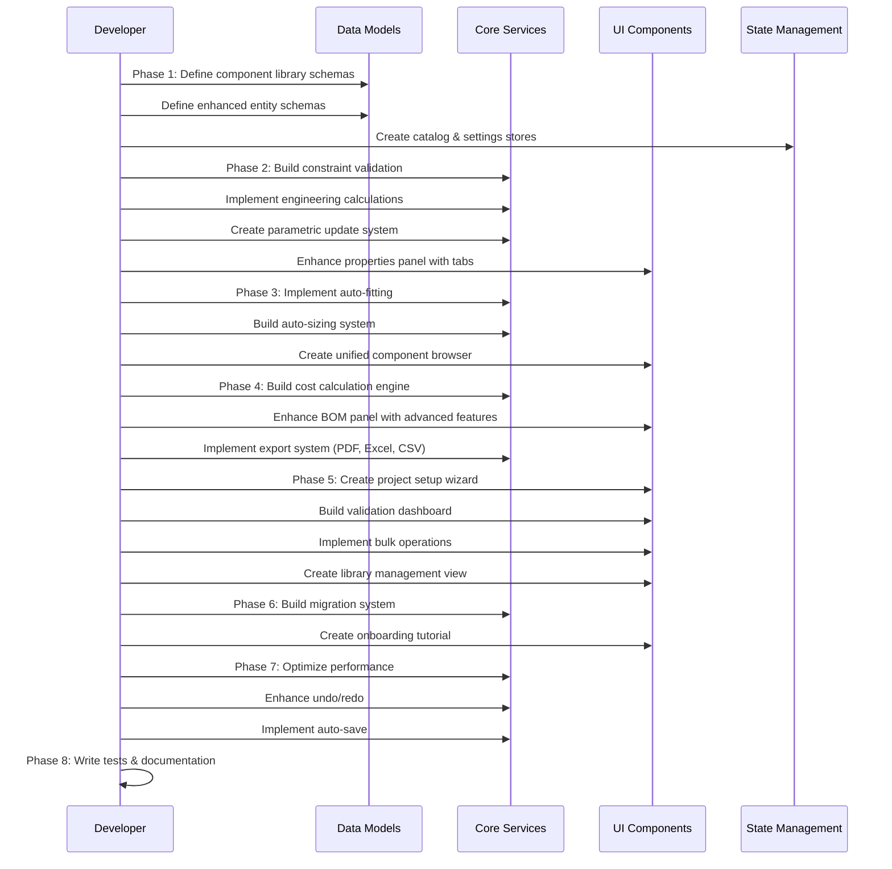

I have created the following plan after thorough exploration and analysis of the codebase. Follow the below plan verbatim. Trust the files and references. Do not re-verify what's written in the plan. Explore only when absolutely necessary. First implement all the proposed file changes and then I'll review all the changes together at the end.

## Observations

The HVAC Canvas App currently has a foundational architecture with entity management (ducts, equipment, fittings), basic BOM functionality, and canvas-based design tools. The codebase uses Zustand for state management, Radix UI for components, and follows a feature-based structure. However, the spec reveals a need for a comprehensive "Unified Engineering Core" that requires significant architectural enhancements including parametric design, real-time validation, automatic fitting insertion, advanced cost estimation, and a unified component library system. The current BOM is basic (CSV export only), and there's no evidence of constraint validation, auto-sizing, or system templates.

## Approach

The implementation will follow a phased approach, building foundational systems first before layering advanced features. Phase 1 establishes the unified component library and core data models. Phase 2 implements parametric design and constraint validation. Phase 3 adds intelligent automation (auto-fitting, auto-sizing). Phase 4 builds advanced BOM and cost estimation. Phase 5 implements project management features. This sequence ensures each phase builds on stable foundations, allowing for iterative testing and validation. The approach prioritizes core engineering functionality over UI polish, ensuring the system's calculation and validation logic is robust before adding advanced user experience features.

## Implementation Plan

### Phase 1: Foundation - Unified Component Library & Core Architecture

#### 1.1 Component Library Data Model

Create a new unified component library system to replace the fragmented catalog:

- Define `file:hvac-design-app/src/core/schema/component-library.schema.ts` with schemas for:
  - `ComponentDefinition`: Base component with metadata, category, properties
  - `ComponentCategory`: Hierarchical categorization (Ducts → Rectangular, Round, etc.)
  - `MaterialSpec`: Material options with grades, costs, properties
  - `EngineeringProperties`: Friction factors, velocity limits, pressure coefficients
  - `PricingData`: Material costs, labor units, waste factors
  - `ComponentTemplate`: Reusable component configurations

- Create `file:hvac-design-app/src/core/store/catalogStore.ts` (enhance existing) to manage:
  - Component library state (all available components)
  - Category tree structure
  - Search and filtering logic
  - Import/export functionality
  - Custom component creation

#### 1.2 Enhanced Entity Schemas

Extend existing entity schemas to support parametric design:

- Update `file:hvac-design-app/src/core/schema/duct.schema.ts`:
  - Add `systemType` field (Supply, Return, Exhaust)
  - Add `materialSpec` with detailed material properties
  - Add `engineeringData` (airflow, velocity, pressure drop, friction)
  - Add `constraintStatus` (validation results)
  - Add `autoSized` flag to track auto-sizing

- Update `file:hvac-design-app/src/core/schema/fitting.schema.ts`:
  - Add `autoInserted` flag
  - Add `connectionPoints` array for multi-duct junctions
  - Add `transitionData` for size transitions

- Update `file:hvac-design-app/src/core/schema/equipment.schema.ts`:
  - Add `capacity` and `airflow` specifications
  - Add `engineeringData` for validation

#### 1.3 Calculation Settings System

Create project-level calculation settings:

- Define `file:hvac-design-app/src/core/schema/calculation-settings.schema.ts`:
  - `LaborRates`: Base rate, regional multiplier, overtime
  - `MarkupSettings`: Material markup, labor markup, overhead
  - `WasteFactors`: By component category
  - `EngineeringLimits`: Velocity limits, pressure drop targets
  - `CalculationTemplate`: Named template configurations

- Create `file:hvac-design-app/src/core/store/settingsStore.ts` (enhance existing):
  - Manage calculation settings state
  - Template CRUD operations
  - Apply settings to calculations

#### 1.4 System Template Data Model

Define system templates for ductwork organization:

- Create `file:hvac-design-app/src/core/schema/system-template.schema.ts`:
  - `SystemTemplate`: Supply, Return, Exhaust configurations
  - `SystemProperties`: Pressure class, insulation, sealing requirements
  - `VisualStyle`: Color coding for different systems

### Phase 2: Parametric Design & Engineering Validation

#### 2.1 Constraint Validation Engine

Build real-time constraint validation:

- Create `file:hvac-design-app/src/core/services/constraintValidation.ts` (enhance existing):
  - `validateVelocity()`: Check against max velocity limits
  - `validatePressureDrop()`: Check against target pressure drop
  - `validateConnections()`: Ensure proper fitting connections
  - `validateMaterialCompatibility()`: Check material transitions
  - `validateSizing()`: Ensure components meet engineering requirements
  - Return `ValidationResult` with severity (Error, Warning, Info)

- Create `file:hvac-design-app/src/core/store/validationStore.ts` (enhance existing):
  - Track all validation results by entity ID
  - Group by severity
  - Provide auto-fix suggestions
  - Track ignored warnings

#### 2.2 Engineering Calculations

Implement real-time engineering calculations:

- Create `file:hvac-design-app/src/core/services/engineeringCalculations.ts`:
  - `calculateVelocity(airflow, width, height)`: Compute air velocity
  - `calculatePressureDrop(length, velocity, friction)`: Compute pressure loss
  - `calculateEquivalentDiameter(width, height)`: For rectangular ducts
  - `calculateFrictionFactor(material, velocity)`: Material-specific friction
  - `suggestDuctSize(airflow, maxVelocity)`: Auto-sizing logic

#### 2.3 Parametric Update System

Create cascading update system for parametric changes:

- Create `file:hvac-design-app/src/core/services/parametricUpdates.ts`:
  - `updateDuctDimensions(ductId, dimensions)`: Update duct and trigger cascades
  - `propagateChanges(entityId, changes)`: Update connected components
  - `resizeConnectedFittings(ductId)`: Auto-resize fittings when duct changes
  - `recalculateEngineering(entityId)`: Recompute engineering values
  - Track change history for undo/redo

#### 2.4 Properties Panel Enhancement

Enhance the properties panel with tabbed interface:

- Update `file:hvac-design-app/src/features/canvas/components/Inspector/DuctInspector.tsx`:
  - Add tabs: Dimensions, Engineering, Costing
  - **Dimensions tab**: Editable width, height, length, material, gauge
  - **Engineering tab**: Display calculated velocity, pressure drop, friction, constraint status with visual indicators (✓/⚠)
  - **Costing tab**: Material cost breakdown, labor hours, total cost
  - Real-time updates on dimension changes
  - Constraint violation warnings with suggested fixes

- Create `file:hvac-design-app/src/features/canvas/components/Inspector/EngineeringTab.tsx`:
  - Display engineering calculations
  - Show constraint status with color coding
  - Provide "Apply Suggestion" buttons for violations
  - Show impact analysis for changes

### Phase 3: Intelligent Automation

#### 3.1 Automatic Fitting Insertion

Implement smart fitting insertion:

- Create `file:hvac-design-app/src/core/services/fittingGeneration.ts` (enhance existing):
  - `detectJunction(ductA, ductB)`: Analyze connection geometry
  - `selectFitting(junctionType, ductSizes, angle)`: Choose appropriate fitting
  - `insertFitting(fitting, position)`: Place fitting and adjust duct endpoints
  - `handleComplexJunction(ducts[])`: Handle T-junctions, Y-junctions
  - `insertTransition(ductA, ductB)`: Auto-insert size transitions
  - `detectOrphanedFittings()`: Find disconnected fittings

- Update `file:hvac-design-app/src/features/canvas/tools/DuctTool.ts`:
  - Integrate fitting detection during duct drawing
  - Show visual feedback for auto-inserted fittings
  - Provide undo for auto-insertions

#### 3.2 Auto-Sizing System

Implement constraint-based auto-sizing:

- Create `file:hvac-design-app/src/core/services/autoSizing.ts`:
  - `autoSizeDuct(airflow, constraints)`: Calculate optimal duct size
  - `optimizeForVelocity(airflow, maxVelocity)`: Size based on velocity limit
  - `optimizeForPressure(airflow, targetPressure)`: Size based on pressure drop
  - `suggestAlternatives(currentSize, constraints)`: Provide sizing options
  - Support multiple sizing methods (velocity-based, friction-based, manual)

#### 3.3 Component Browser Enhancement

Create unified component browser:

- Create `file:hvac-design-app/src/features/canvas/components/ProductCatalogPanel.tsx` (enhance existing):
  - Hierarchical tree view of component categories
  - Search and filter functionality
  - Component activation (click-to-activate pattern)
  - Show component details on hover
  - System templates section
  - Recently used components
  - Keyboard shortcuts (D for ducts, F for fittings, E for equipment)

### Phase 4: Advanced BOM & Cost Estimation

#### 4.1 Enhanced BOM System

Upgrade BOM with advanced features:

- Create `file:hvac-design-app/src/features/canvas/hooks/useBOM.ts` (enhance existing):
  - Real-time cost calculations
  - Grouping by category, system type, floor, material
  - Search and filtering
  - Custom sorting
  - Cost breakdown by component
  - Labor hours calculation
  - Waste factor application
  - Markup and overhead calculation

- Create `file:hvac-design-app/src/features/canvas/components/BOMPanel.tsx` (enhance existing):
  - Advanced filtering UI
  - Grouping controls
  - Cost analysis charts (pie, bar charts)
  - Export options (CSV, PDF, Excel)
  - Bulk edit functionality
  - Comparison mode (what-if analysis)
  - Saved views

#### 4.2 Cost Calculation Engine

Build comprehensive cost calculation:

- Create `file:hvac-design-app/src/core/services/costCalculation.ts`:
  - `calculateMaterialCost(component, quantity, wasteFactor)`: Material costs
  - `calculateLaborCost(component, quantity, laborRate)`: Labor costs
  - `applyMarkup(subtotal, markupPercent)`: Apply markup
  - `calculateProjectTotal(entities, settings)`: Total project cost
  - `generateCostBreakdown(entity)`: Detailed cost breakdown
  - Support for regional multipliers and custom rates

#### 4.3 Export System

Implement comprehensive export functionality:

- Create `file:hvac-design-app/src/features/export/pdf.ts` (enhance existing):
  - Generate formatted PDF with project header
  - Include BOM tables grouped by category
  - Add cost summary with markup breakdown
  - Include engineering notes and constraint violations
  - Support company letterhead templates
  - Embed canvas screenshots

- Create `file:hvac-design-app/src/features/export/excel.ts`:
  - Multi-sheet workbook (Summary, Ducts, Fittings, Equipment, Labor)
  - Formulas for cost calculations
  - Conditional formatting for warnings

- Update `file:hvac-design-app/src/features/export/csv.ts` (enhance existing):
  - Support filtered exports
  - Include/exclude pricing option
  - Custom column selection

### Phase 5: Project Management & Workflows

#### 5.1 Project Initialization Wizard

Create project setup wizard:

- Create `file:hvac-design-app/src/components/onboarding/ProjectSetupWizard.tsx`:
  - Multi-step form (Project Details, Scope, Calculation Settings, Engineering Parameters)
  - Template selection
  - Default settings configuration
  - Validation and error handling
  - Integration with project creation flow

#### 5.2 Validation Dashboard

Build comprehensive validation UI:

- Create `file:hvac-design-app/src/features/canvas/components/ValidationDashboard.tsx` (enhance existing):
  - Group issues by severity (Errors, Warnings, Info)
  - Click to navigate to problematic component
  - Auto-fix functionality
  - Ignore warnings option
  - Validation report export
  - Progress tracking for fixes

#### 5.3 Bulk Operations

Implement bulk editing:

- Create `file:hvac-design-app/src/features/canvas/components/BulkEditDialog.tsx`:
  - Multi-select support on canvas
  - Bulk property changes (material, dimensions, system type)
  - Preview impact (cost changes, constraint violations)
  - Confirmation with undo support
  - Bulk delete with orphan detection

#### 5.4 Component Library Management

Create library management interface:

- Create `file:hvac-design-app/src/features/library/LibraryManagementView.tsx`:
  - Split view (component tree + details panel)
  - Component CRUD operations
  - Import/export CSV/JSON
  - Custom component creation
  - Component templates
  - Pricing and engineering data editing

#### 5.5 System Template Application

Implement system template workflow:

- Create `file:hvac-design-app/src/features/canvas/tools/SystemTemplateTool.ts`:
  - Template activation (similar to component tools)
  - Apply to selected ducts
  - Bulk application support
  - Visual feedback (color coding)
  - System-specific property updates

### Phase 6: Data Migration & Onboarding

#### 6.1 Legacy Data Migration

Build migration system:

- Create `file:hvac-design-app/src/features/migration/MigrationWizard.tsx`:
  - File selection and preview
  - Component mapping interface
  - Settings migration
  - Validation and error handling
  - Batch migration support
  - Backup creation

- Create `file:hvac-design-app/src/core/services/dataMigration.ts`:
  - Parse legacy file formats
  - Map old components to new library
  - Migrate calculation settings
  - Validate migrated data
  - Generate migration report

#### 6.2 Onboarding Tutorial

Create interactive tutorial:

- Create `file:hvac-design-app/src/components/onboarding/InteractiveTutorial.tsx`:
  - Step-by-step guided tour
  - Spotlight UI elements
  - Interactive tasks with validation
  - Progress tracking
  - Skip and replay options
  - Sample project for practice

- Create `file:hvac-design-app/src/stores/useTutorialStore.ts` (enhance existing):
  - Track tutorial progress
  - Manage tutorial state
  - Store user preferences (skip tutorial, completed steps)

### Phase 7: Advanced Features & Polish

#### 7.1 Undo/Redo Enhancement

Enhance undo system for parametric changes:

- Update `file:hvac-design-app/src/core/store/historyStore.ts` (enhance existing):
  - Track parametric operations as single undo steps
  - Include affected components in undo description
  - Support undo across save/load
  - Configurable undo limit
  - Persist undo stack

#### 7.2 Performance Optimization

Optimize for large projects:

- Create `file:hvac-design-app/src/core/services/performanceOptimization.ts`:
  - Detect large projects (1000+ components)
  - Enable performance mode (simplified rendering, debounced updates)
  - Deferred BOM calculations
  - On-demand validation
  - Progress indicators for long operations

#### 7.3 Auto-save & Recovery

Implement data integrity features:

- Update `file:hvac-design-app/src/core/persistence/autoSave.ts`:
  - Auto-save every 60 seconds (configurable)
  - Maintain separate auto-save versions
  - Recovery dialog on crash
  - Automatic backups on save
  - Corruption detection and recovery

### Phase 8: Testing & Documentation

#### 8.1 Unit Tests

Create comprehensive test coverage:

- Test files for each service:
  - `file:hvac-design-app/src/core/services/__tests__/constraintValidation.test.ts`
  - `file:hvac-design-app/src/core/services/__tests__/engineeringCalculations.test.ts`
  - `file:hvac-design-app/src/core/services/__tests__/fittingGeneration.test.ts`
  - `file:hvac-design-app/src/core/services/__tests__/autoSizing.test.ts`
  - `file:hvac-design-app/src/core/services/__tests__/costCalculation.test.ts`

#### 8.2 Integration Tests

Test complete workflows:

- Create E2E tests in `file:hvac-design-app/e2e/`:
  - Component selection and placement flow
  - Parametric design with auto-sizing
  - Automatic fitting insertion
  - BOM generation and export
  - Validation and error resolution
  - Project initialization and migration

#### 8.3 Documentation

Update documentation:

- Update `file:docs/PRD.md` with new features
- Create user guides for each flow
- Document API for services and stores
- Update `file:CODEBASE.md` with new dependencies

## Implementation Sequence Diagram

## Key Architectural Decisions

### State Management Strategy

- Use Zustand stores for each domain (catalog, validation, settings)
- Implement selectors for efficient re-renders
- Use `immer` for immutable updates
- Separate read and write operations

### Calculation Performance

- Debounce dimension changes (500ms) before recalculating
- Use web workers for large project calculations
- Cache calculation results with invalidation
- Implement progressive calculation for BOM

### Data Persistence

- Store component library in IndexedDB via `file:hvac-design-app/src/core/persistence/`
- Maintain calculation templates in user preferences
- Auto-save project state every 60 seconds
- Create backups on manual save

### Validation Strategy

- Real-time validation for single component changes
- On-demand validation for bulk operations
- Allow violations with warnings (don't block user)
- Provide auto-fix suggestions with preview

### UI/UX Patterns

- Click-to-activate for component tools
- Tabbed properties panel (Dimensions, Engineering, Costing)
- Collapsible sections for BOM grouping
- Modal dialogs for complex workflows (wizard, bulk edit)
- Toast notifications for feedback
- Keyboard shortcuts for power users

## Dependencies & Integration Points

### New Dependencies

No new external dependencies required. The implementation uses existing libraries:
- Zustand for state management
- Zod for schema validation
- jsPDF for PDF export
- Radix UI for components
- Tailwind CSS for styling

### Integration Points

- `file:hvac-design-app/src/core/store/entityStore.ts`: Enhance with validation hooks
- `file:hvac-design-app/src/features/canvas/CanvasPage.tsx`: Integrate component browser and validation dashboard
- `file:hvac-design-app/src/features/canvas/tools/`: Add new tools (SystemTemplateTool)
- `file:hvac-design-app/src/core/persistence/`: Extend for component library storage
- `file:hvac-design-app/app/(main)/canvas/[projectId]/page.tsx`: No changes needed (uses CanvasPageWrapper)

## Risk Mitigation

### Performance Risks

- Large projects (1000+ components) may cause lag
- Mitigation: Implement performance mode, debouncing, web workers

### Data Migration Risks

- Legacy data may not map cleanly to new schema
- Mitigation: Comprehensive mapping UI, manual override options, validation reports

### Complexity Risks

- Parametric updates may cause cascading changes
- Mitigation: Clear undo descriptions, change preview, transaction-based updates

### User Adoption Risks

- Users may resist new unified component library
- Mitigation: Interactive tutorial, migration wizard, preserve familiar workflows